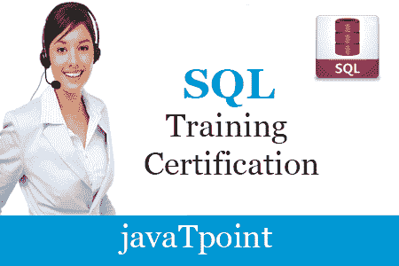
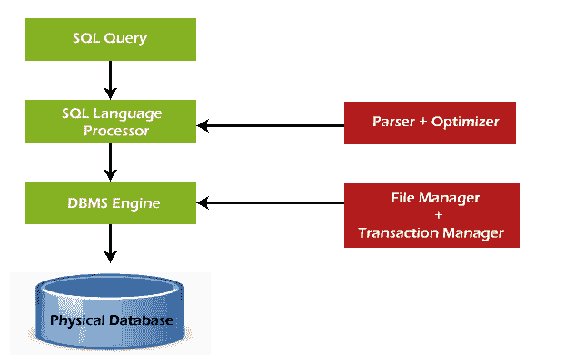
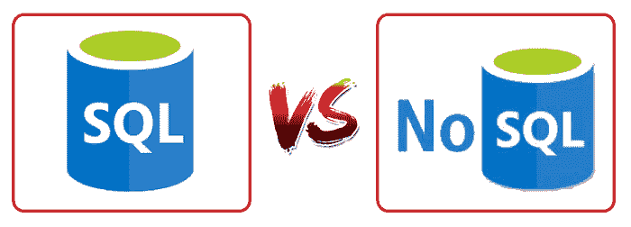

# SQL 教程

> 原文：<https://www.javatpoint.com/sql-tutorial>

SQL 教程提供了 SQL 的基本和高级概念。我们的 SQL 教程是为初学者和专业人士设计的。

SQL(结构化查询语言)用于对存储在数据库中的记录执行操作，如更新记录、插入记录、删除记录、创建和修改数据库表、视图等。

SQL 不是数据库系统，但它是一种查询语言。

假设您想对数据库中存储的数据执行 SQL 语言的查询。您需要在系统中安装任何数据库管理系统，例如 [Oracle](https://www.javatpoint.com/oracle-tutorial) 、 [MySQL](https://www.javatpoint.com/mysql-tutorial) 、 [MongoDB](https://www.javatpoint.com/mongodb-tutorial) 、 [PostgreSQL](https://www.javatpoint.com/postgresql-tutorial) 、 [SQL Server](https://www.javatpoint.com/sql-server-tutorial) 、 [DB2](https://www.javatpoint.com/db2-tutorial) 等。

## 什么是 SQL？

SQL 是结构化查询语言的简称，发音为 S-Q-L，有时也称为 See-Quell。

这种数据库语言主要用于维护关系数据库管理系统中的数据。它是数据专业人员用来处理结构化数据(以表格形式存储的数据)的特殊工具。它也是为 RDSMS 中的流处理而设计的。

您可以轻松地创建和操作数据库，访问和修改表的行和列等。这种查询语言在 1986 年成为 ANSI 的标准，1987 年成为 ISO 的标准。

如果你想在数据科学领域找到工作，那么学习查询语言是最重要的。像脸书、Instagram 和 LinkedIn 这样的大企业使用 SQL 将数据存储在后端。

## 为什么是 SQL？

如今，SQL 被广泛应用于数据科学和分析。以下是它被广泛使用的原因:

*   对于数据专业人员和 SQL 用户来说，SQL 的基本用途是插入、更新和删除关系数据库中的数据。
*   SQL 允许数据专家和用户从关系数据库管理系统中检索数据。
*   这也有助于他们描述结构化数据。
*   它允许 SQL 用户创建、删除和操作数据库及其表。
*   它还有助于在关系数据库中创建视图、存储过程和函数。
*   它允许您定义数据并修改关系数据库中存储的数据。
*   它还允许 SQL 用户设置表列、视图和存储过程的权限或约束。

## SQL 的历史

“大型共享数据库的数据关系模型”是伟大的计算机科学家“E.F. Codd”在 1970 年发表的一篇论文。

IBM 的研究人员雷蒙德·博伊斯和唐纳德·钱伯林在学习了 E.F. Codd 的论文后，最初开发了 SEQUEL(结构化英语查询语言)。1970 年，他们都在 IBM 公司的圣何塞研究实验室开发了 SQL。

在 20 世纪 70 年代末，关系软件公司使用 E.F. Codd、Raymond Boyce 和 Donald Chamberlin 的概念开发了自己的第一个 SQL。这个 SQL 完全基于关系数据库管理系统。关系软件公司，现在被称为 Oracle 公司，在 1979 年 6 月引入了 Oracle V2，这是 SQL 语言的第一个实现。这个 Oracle V2 版本在 VAX 计算机上运行。

## SQL 的过程

当我们在任何关系数据库管理系统上执行 SQL 命令时，系统会自动找到执行我们请求的最佳例程，并且 SQL 引擎会确定如何解释该特定命令。

结构化查询语言在其过程中包含以下四个组件:

*   查询调度程序
*   优化引擎
*   经典查询引擎
*   SQL 查询引擎等。

一个经典的查询引擎允许数据专业人员和用户维护非 SQL 查询。下图显示了 SQL 的体系结构:

## 一些 SQL 命令

SQL 命令有助于创建和管理数据库。下面提到了最常用的 SQL 命令:

1.  CREATE 命令
2.  更新命令
3.  删除命令
4.  选择命令
5.  DROP 命令
6.  插入命令

### 创建命令

此命令有助于创建新数据库、新表、表视图和数据库的其他对象。

### 更新命令

此命令有助于更新或更改数据库中存储的数据。

### 删除命令

此命令有助于从数据库表中删除或清除保存的记录。它从数据库的表中删除一个或多个元组。

### 选择命令

此命令有助于从数据库的一个或多个表中访问单行或多行。我们也可以在 WHERE 子句中使用这个命令。

### 删除命令

此命令有助于从数据库中删除整个表、表视图和其他对象。

### 插入命令

该命令有助于将数据或记录插入数据库表。我们可以很容易地在表的单行和多行中插入记录。

## SQL vs 无 SQL

下表描述了 SQL 和 NoSQL 之间的[差异，这是理解的必要条件:](https://www.javatpoint.com/sql-vs-nosql)

| 结构化查询语言 | 非 SQL |
| 1.SQL 是一个关系数据库管理系统。 | 1.而无 SQL 是一种非关系型或分布式数据库管理系统。 |
| 2.该数据库系统中使用的查询语言是结构化查询语言。 | 2.非 SQL 数据库系统中使用的查询语言是非声明性查询语言。 |
| 3.SQL 数据库的模式是预定义的、固定的和静态的。 | 3.无 SQL 数据库的模式是非结构化数据的动态模式。 |
| 4.这些数据库可纵向扩展。 | 4.这些数据库可以横向扩展。 |
| 5.SQL 的数据库类型是表的形式，即行和列的形式。 | 5.无 SQL 的数据库类型是文档、键值和图形的形式。 |
| 6.它遵循 ACID 模型。 | 6.它遵循 BASE 模型。 |
| 7.复杂的查询很容易在 SQL 数据库中管理。 | 7.NoSQL 数据库无法处理复杂的查询。 |
| 8.该数据库不是存储分层数据的最佳选择。 | 8.虽然无 SQL 数据库是存储分层数据的完美选择。 |
| 9.所有的 SQL 数据库都需要对象关系映射。 | 9.许多非 SQL 数据库不需要对象关系映射。 |
| 10.仪表、圆形仪表、环形仪表等。，是使用这种查询语言的顶级企业。 | 10.Airbnb、优步和 Kickstarter 是使用这种查询语言的顶级企业。 |
| 11.SQLite、Ms-SQL、Oracle、PostgreSQL 和 MySQL 都是 SQL 数据库系统的例子。 | 11.Redis、MongoDB、Hbase、BigTable、CouchDB 和 Cassandra 都是 NoSQL 数据库系统的例子。 |

## SQL 的优点

SQL 提供了各种优势，使其在数据科学领域更受欢迎。它是一种完美的查询语言，允许数据专业人员和用户与数据库进行通信。以下是结构化查询语言的最佳优势或好处:

**1。不需要编程**

SQL 不需要大量的代码行来管理数据库系统。通过使用简单的 SQL 语法规则，我们可以轻松地访问和维护数据库。这些简单的规则使 SQL 用户友好。

**2。高速查询处理**

通过使用 SQL 查询，可以快速有效地从数据库中访问大量数据。对数据的插入、删除和更新操作也在更短的时间内完成。

**3。标准化语言**

SQL 遵循长期确立的 ISO 和 ANSI 标准，这些标准为其所有用户提供了全球统一的平台。

**4。便携性**

结构化查询语言可以很容易地用于台式计算机、笔记本电脑、平板电脑，甚至智能手机。也可以根据用户的要求与其他应用程序配合使用。

**5。互动语言**

我们可以很容易地学习和理解 SQL 语言。我们也可以使用这种语言与数据库通信，因为它是一种简单的查询语言。这种语言也用于在几秒钟内接收复杂查询的答案。

**6。多个数据视图**

SQL 语言还有助于为不同的数据库用户创建数据库结构的多个视图。

## SQL 的缺点

虽然有 SQL 的优点，但也有一些缺点，具体如下:

**1。成本**

一些 SQL 版本的运行成本很高。这就是为什么一些程序员不能使用结构化查询语言。

**2。界面复杂**

另一个很大的缺点是结构化查询语言的接口比较难，使得 SQL 用户很难使用和管理。

**3。部分数据库控制**

商业规则是隐藏的。因此，使用这种查询语言的数据专业人员和用户不能完全控制数据库。

* * *