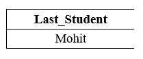

# 最后选择

> 原文：<https://www.javatpoint.com/sql-select-last>

结构化查询语言中的 **LAST()** 函数显示表中指定列的最后一个值。

#### 注意:此 SQL 函数仅在 Microsoft Access 数据库中受支持。Oracle 支持 ORDER BY 和 ROWNUM 关键字，MySQL 支持 LIMIT 关键字用于选择最后一条记录。

### LAST()函数的语法

```

SELECT LAST (Field_Name) FROM Table_Name ;

```

在上面的语法中，LAST 关键字表示输出中表中要显示的最后一行， **Field_Name** 表示我们要显示其值的列。

### SQL 中最后一个函数的示例

**例 1:**

首先，我们必须创建一个表，并用 SQL 将数据插入表中。

以下 SQL 语句创建了以**学生标识**为主键的**学生详细信息**表:

```

CREATE TABLE Student_Details
(
Student_ID INT NOT NULL, 
Student_Name varchar(100),
Student_Course varchar(50),
Student_Age INT, 
Student_Marks INT
); 

```

以下 SQL 查询使用 INSERT INTO 语句将学生的记录插入到上表中:

```

INSERT INTO Student_Details VALUES (101, Anuj, B.tech, 20, 88);
INSERT INTO Student_Details VALUES (102, Raman, MCA, 24, 98);
INSERT INTO Student_Details VALUES (104, Shyam, BBA, 19, 92);
INSERT INTO Student_Details VALUES (107, Vikash, B.tech, 20, 78);
INSERT INTO Student_Details VALUES (111, Monu, MBA, 21, 65);
INSERT INTO Student_Details VALUES (114, Jones, B.tech, 18, 93);
INSERT INTO Student_Details VALUES (121, Parul, BCA, 20, 97);
INSERT INTO Student_Details VALUES (123, Divya, B.tech, 21, 89);
INSERT INTO Student_Details VALUES (128, Hemant, MBA, 23, 90);
INSERT INTO Student_Details VALUES (130, Nidhi, BBA, 20, 88);
INSERT INTO Student_Details VALUES (132, Priya, MBA, 22, 99);
INSERT INTO Student_Details VALUES (138, Mohit, MCA, 21, 92);

```

让我们使用下面的 SELECT 语句来查看上表的记录:

```

SELECT * FROM Student_Details;

```

| 学生标识 | 学生名 | 学生 _ 课程 | 学生 _ 年龄 | 学生分数 |
| One hundred and one | 阿努伊 | B.tech | Twenty | Eighty-eight |
| One hundred and two | 拉曼 | 微通道结构(MicroChannel Architecture) | Twenty-four | Ninety-eight |
| One hundred and four | 嘘！嘘 | BBA | Nineteen | Ninety-two |
| One hundred and seven | 维卡什 | B.tech | Twenty | seventy-eight |
| One hundred and eleven | 联安观察团 | 工商管理硕士 | Twenty-one | Sixty-five |
| One hundred and fourteen | 琼斯 | B.tech | Eighteen | Ninety-three |
| One hundred and twenty-one | 毛 | 喹啉甲酸 | Twenty | Ninety-seven |
| One hundred and twenty-three | 迪维亚 | B.tech | Twenty-one | eighty-nine |
| One hundred and twenty-eight | 赫曼特 | 工商管理硕士 | Twenty-three | Ninety |
| One hundred and thirty | 尼迪 | BBA | Twenty | Eighty-eight |
| One hundred and thirty-two | 普利娅 | 工商管理硕士 | Twenty-two | Ninety-nine |
| One hundred and thirty-eight | 莫伊特 | 微通道结构(MicroChannel Architecture) | Twenty-one | Ninety-two |

以下查询显示了输出中上表中的最后一个学生名:

```

SELECT LAST (Student_Name) AS Last_Student FROM Student_Details;

```

**输出:**



### MySQL 中 LIMIT 子句的语法

```

SELECT column_Name FROM Table_Name ORDER BY Column_Name DESC LIMIT 1;

```

在这个 MySQL 语法中，我们必须在 LIMIT 关键字后面指定值 1 来指示单行/记录。

### MySQL 中的 LIMIT 子句示例

让我们利用下面的雇员表来解释如何使用 MySQL 中的 LIMIT 子句来访问最后一条记录:

| 员工标识 | Emp_Name | Emp_City | Emp _ 工资 | 电磁脉冲奖金 |
| One hundred and one | 阿努伊 | 加济阿巴德 | Thirty-five thousand | Two thousand |
| One hundred and two | 塔斯哈尔 | 勒克瑙 | Twenty-nine thousand | Three thousand |
| One hundred and three | 味味克 | 加尔各答 | Thirty-five thousand | Two thousand five hundred |
| One hundred and four | 希瓦姆 | 果阿 | Twenty-two thousand | Three thousand |

下面的 MySQL 查询显示了上面雇员表中 **Emp_City** 列的最后一个值:

```

SELECT Emp_City FROM Employee ORDER BY Emp_City DESC LIMIT 1;

```

**输出:**

```
Goa

```

## Oracle 中的 ROWNUM 关键字

从 Oracle 数据库访问最后一条记录的语法如下:

```

SELECT Column_Name FROM Table_Name ORDER BY Column_Name DESC WHERE ROWNUM <=1;

```

在这个 Oracle 语法中，我们必须指定小于等于 1 的 ROWNUM 关键字。在 Oracle 中，在 WHERE 子句中使用 ROWNUM 关键字从表中检索最后一条记录。

### Oracle 中的 ROWNUM 子句示例

让我们利用下面的 Cars 表来解释如何在 MySQL 中使用 ROWNUM 关键字:

| 卡号 | 大屠杀 | 汽车 _ 金额 | 反复无常 |
| Two thousand five hundred and seventy-eight | 白垩 | three | Nine hundred thousand |
| Nine thousand two hundred and fifty-eight | 奥迪 | Two | One million one hundred thousand |
| Eight thousand two hundred and thirty-three | 犯罪地点 | six | Nine hundred thousand |
| Six thousand two hundred and fourteen | 连锁反应 | seven | One million |

以下 MySQL 查询显示了汽车表的**汽车 _ 名称**列中汽车的姓氏:

```

SELECT Car_Name FROM Cars ORDER BY Car_Name DESC WHERE ROWNUM <=1;

```

**输出:**

```
Nexon

```

* * *