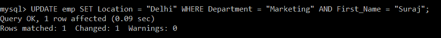
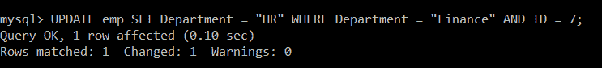
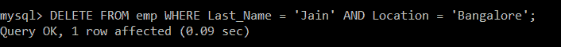
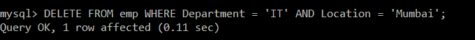

# SQL AND

> 原文：<https://www.javatpoint.com/sql-and>

*   在 SQL 查询中使用 SQL **和**条件来创建两个或多个要满足的条件。
*   用于 SQL **选择、插入、更新**和**删除**
*   让我们看看 SQL AND 的语法:
*   从条件 1 和条件 2 所在的表中选择列；
*   “与”条件要求同时满足这两个条件。
*   “与”条件也可用于连接一条 SQL 语句中的多个表。
*   为了实际理解这个概念，让我们看一些例子。

假设我们在数据库中创建了一个包含以下数据的雇员表:

| 身份 | 名字 | 姓氏 | 部门 | 位置 |
| one | 哈沙德 | 误码率 | 营销 | 浦那 |
| Two | 阿努格 | 拉其普特人 | 信息技术 | 孟买 |
| three | 主席 | 把他们赶走 | 信息技术 | 金奈 |
| four | 普兰哈尔 | 帕蒂尔 | 信息技术 | 金奈 |
| five | 苏拉杰 | 帕蒂 | 营销 | 浦那 |
| six | 罗什尼 | 贾达夫 | 金融 | 班加罗尔 |
| seven | 桑迪亚 | 耆那教教徒 | 金融 | 班加罗尔 |

### 带有“选择”语句的 SQL“与”示例

这就是如何在 SQL **SELECT** 语句中使用一个 SQL“**和**”条件。

**例 1:**

编写一个查询，从 emp 表中获取员工所在部门是 IT 部门、地点是 Chennai 的记录。

**查询:**

```

mysql> SELECT *FROM emp WHERE Department = "IT" AND Location = "Chennai";

```

| 身份 | 名字 | 姓氏 | 部门 | 位置 |
| three | 主席 | 把他们赶走 | 信息技术 | 金奈 |
| four | 普兰哈尔 | 帕蒂尔 | 信息技术 | 金奈 |

在 emp 表中，有三名员工的部门是 IT。但是我们指定了“与”条件，根据该条件，员工的位置不应在钦奈以外。所以，只有两个员工的部门是 IT，地点是钦奈。

**例 2:**

编写一个查询，从 emp 表中获取员工所在部门是 IT，地点是孟买的记录。

**查询:**

```

mysql> SELECT *FROM emp WHERE Department = "IT" AND Location = "Mumbai";

```

| 身份 | 名字 | 姓氏 | 部门 | 位置 |
| Two | 阿努格 | 拉其普特人 | 信息技术 | 孟买 |

在 emp 表中，有三名员工的部门是 IT。这三名员工中，只有一名员工的所在地是孟买。由于查询中使用的 AND 运算符的存在，记录必须同时满足这两个条件。

**带有“更新”语句的 SQL“与”示例**

这就是如何在 SQL UPDATE 语句中使用“与”条件。

**例 1:**

编写一个查询来更新 emp 表中的记录，在 EMP 表中，员工的部门是 Marketing，名字是 Suraj。对于该特定员工，将地点的更新值设置为德里。

**查询:**

```

mysql> UPDATE emp SET Location = "Delhi" WHERE Department = "Marketing" AND First_Name = "Suraj";

```



我们将使用 SELECT 查询来验证更新的记录。

```

mysql> SELECT *FROM emp;

```

| 身份 | 名字 | 姓氏 | 部门 | 位置 |
| one | 哈沙德 | 误码率 | 营销 | 浦那 |
| Two | 阿努格 | 拉其普特人 | 信息技术 | 孟买 |
| three | 主席 | 把他们赶走 | 信息技术 | 金奈 |
| four | 普兰哈尔 | 帕蒂尔 | 信息技术 | 金奈 |
| five | 苏拉杰 | 帕蒂 | 营销 | 德里 |
| six | 罗什尼 | 贾达夫 | 金融 | 班加罗尔 |
| seven | 桑迪亚 | 耆那教教徒 | 金融 | 班加罗尔 |

在 emp 表中，有三名员工的部门是 IT。这三名员工中，只有一名员工的所在地是孟买。由于查询中使用的 AND 运算符的存在，记录必须同时满足这两个条件。

**例 2:**

编写一个查询来更新 emp 表中的记录，其中员工的部门是财务部，ID 是 7。对于该特定员工，将部门的更新值设置为“人力资源”

**查询:**

```

mysql> UPDATE emp SET Department = "HR" WHERE Department = "Finance" AND ID = 7;

```



我们将使用 SELECT 查询来验证更新的记录。

```

mysql> SELECT *FROM emp;

```

| 身份 | 名字 | 姓氏 | 部门 | 位置 |
| one | 哈沙德 | 误码率 | 营销 | 浦那 |
| Two | 阿努格 | 拉其普特人 | 信息技术 | 孟买 |
| three | 主席 | 把他们赶走 | 信息技术 | 金奈 |
| four | 普兰哈尔 | 帕蒂尔 | 信息技术 | 金奈 |
| five | 苏拉杰 | 帕蒂 | 营销 | 德里 |
| six | 罗什尼 | 贾达夫 | 金融 | 班加罗尔 |
| seven | 桑迪亚 | 耆那教教徒 | 小时 | 班加罗尔 |

在 emp 表中，有两名员工的部门是财务部。这两个员工中，只有一个员工的 ID 是 7。由于查询中使用了“与”运算符，记录的部门必须为“财务”，标识必须为 7。

### 带有“删除”语句的 SQL“与”示例

这就是如何在 SQL DELETE 语句中使用“与”条件。

**例 1:**

编写一个查询来删除 emp 表中的记录，其中员工的姓氏是 Jain，地点是班加罗尔。

**查询:**

```

mysql> DELETE FROM emp WHERE Last_Name = 'Jain' AND Location = 'Bangalore';

```



我们将使用 SELECT 查询来验证删除的记录。

```

mysql> SELECT *FROM emp;

```

| 身份 | 名字 | 姓氏 | 部门 | 位置 |
| one | 哈沙德 | 误码率 | 营销 | 浦那 |
| Two | 阿努格 | 拉其普特人 | 信息技术 | 孟买 |
| three | 主席 | 把他们赶走 | 信息技术 | 金奈 |
| four | 普兰哈尔 | 帕蒂尔 | 信息技术 | 金奈 |
| five | 苏拉杰 | 帕蒂 | 营销 | 德里 |
| six | 罗什尼 | 贾达夫 | 金融 | 班加罗尔 |

emp 表中只有一条记录的姓氏是 Jain。但是，由于“与”运算符的存在，第二个条件也将根据哪个员工的位置应该是班加罗尔来检查。因此，只有那个特定的记录被删除。

**例 2:**

编写一个查询，从 emp 表中删除员工所在部门是 IT 部门、地点是孟买的记录。

**查询:**

```

mysql> DELETE FROM emp WHERE Department = 'IT' AND Location = 'Mumbai';

```



我们将使用 SELECT 查询来验证删除的记录。

```

mysql> SELECT *FROM emp;

```

| 身份 | 名字 | 姓氏 | 部门 | 位置 |
| one | 哈沙德 | 误码率 | 营销 | 浦那 |
| three | 主席 | 把他们赶走 | 信息技术 | 金奈 |
| four | 普兰哈尔 | 帕蒂尔 | 信息技术 | 金奈 |
| five | 苏拉杰 | 帕蒂 | 营销 | 德里 |
| six | 罗什尼 | 贾达夫 | 金融 | 班加罗尔 |

emp 表中有三条记录，其部门是 IT。但是只有一条记录从 emp 表中删除，该表总共包含 6 条记录。发生这种情况是因为“与”运算符，根据该运算符，员工的位置必须是孟买。因此，只有一条记录满足这两个条件。因此，它被删除。

* * *