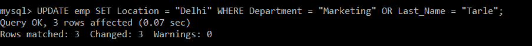
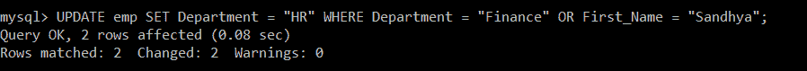
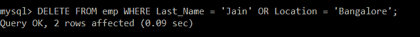
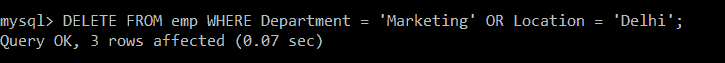

# SQL 或

> 原文：<https://www.javatpoint.com/sql-or>

在 SQL 查询中使用 SQL **或**条件来创建一个 SQL 语句，当任何一个条件满足时，该语句将返回记录。可用于**选择**语句、**插入**语句、**更新**语句或**删除**语句。

**让我们看看 or 条件的语法:**

```

SELECT columns FROM tables WHERE condition 1 OR condition 2;  

```

| 身份 | 名字 | 姓氏 | 部门 | 位置 |
| one | 哈沙德 | 误码率 | 营销 | 浦那 |
| Two | 阿努格 | 拉其普特人 | 信息技术 | 孟买 |
| three | 主席 | 把他们赶走 | 信息技术 | 金奈 |
| four | 普兰哈尔 | 帕蒂尔 | 信息技术 | 金奈 |
| five | 苏拉杰 | 帕蒂 | 营销 | 浦那 |
| six | 罗什尼 | 贾达夫 | 金融 | 班加罗尔 |
| seven | 桑迪亚 | 耆那教教徒 | 金融 | 班加罗尔 |

*   **SQL“或”示例，带 SQL SELECT**

这就是如何在 SQL SELECT 语句中使用“或”条件。

**例 1:**

编写一个查询，从 emp 表中获取员工的哪个部门是 IT 或地点是 Chennai 的记录。

**查询:**

```

mysql> SELECT *FROM emp WHERE Department = "IT" OR Location = "Chennai";

```

| 身份 | 名字 | 姓氏 | 部门 | 位置 |
| Two | 阿努格 | 拉其普特人 | 信息技术 | 孟买 |
| three | 主席 | 把他们赶走 | 信息技术 | 金奈 |
| four | 普兰哈尔 | 帕蒂尔 | 信息技术 | 金奈 |

在 emp 表中，有三名员工的部门是 IT。但是只有两个记录的位置是钦奈。尽管如此，这三条记录都会显示出来。发生这种情况是因为我们在查询中指定了 OR 运算符，根据该运算符，即使满足任何一个条件，结果集中也会考虑该记录。

**例 2:**

编写一个查询，从 emp 表中获取员工是市场部还是 Noida 的记录。

**查询:**

```

mysql> SELECT *FROM emp WHERE Department = "Marketing" OR Location = "Noida";

```

| 身份 | 名字 | 姓氏 | 部门 | 位置 |
| one | 哈沙德 | 误码率 | 营销 | 浦那 |
| five | 苏拉杰 | 帕蒂 | 营销 | 浦那 |
| seven | 桑迪亚 | 耆那教教徒 | 金融 | 班加罗尔 |

在 emp 表中，有两个员工的部门是“市场营销”，但是仍然显示了三条记录。这是因为在查询中使用了或运算符。在上面显示的三条记录中，前两条记录满足条件 1；第二条记录同时满足条件，第三条记录仅满足条件 1。由于 OR 运算符，即使满足任何条件，结果集中也会考虑该记录。

*   **带有 SQL 更新的 SQL“或”示例**

这就是如何在 SQL UPDATE 语句中使用“或”条件。

**例 1:**

编写一个查询来更新 emp 表中的记录，在 EMP 表中，员工的部门是 Marketing，或者姓 Tarle。对于该特定员工，将地点的更新值设置为德里。

**查询:**

```

mysql> UPDATE emp SET Location = "Delhi" WHERE Department = "Marketing" OR Last_Name = "Tarle";

```



我们将使用 SELECT 查询来验证更新的记录。

```

mysql> SELECT *FROM emp;

```

| 身份 | 名字 | 姓氏 | 部门 | 位置 |
| one | 哈沙德 | 误码率 | 营销 | 浦那 |
| Two | 阿努格 | 拉其普特人 | 信息技术 | 孟买 |
| three | 主席 | 把他们赶走 | 信息技术 | 金奈 |
| four | 普兰哈尔 | 帕蒂尔 | 信息技术 | 金奈 |
| five | 苏拉杰 | 帕蒂 | 营销 | 浦那 |
| six | 罗什尼 | 贾达夫 | 金融 | 班加罗尔 |
| seven | 桑迪亚 | 耆那教教徒 | 金融 | 班加罗尔 |

在 emp 表中，有两个员工的部门是“市场营销”，一个记录的姓氏是“Tarle”。尽管仍然只满足一个条件，但由于 OR 运算符，该记录会在表中被考虑和更新。

**例 2:**

编写一个查询来更新 emp 表中的记录，其中员工的部门是财务部，或者名字是 Sandhya。对于该特定员工，将部门的更新值设置为“人力资源”

**查询:**

```

mysql> UPDATE emp SET Department = "HR" WHERE Department = "Finance" OR First_Name = "Sandhya";

```



我们将使用 SELECT 查询来验证更新的记录。

```

mysql> SELECT *FROM emp;

```

| 身份 | 名字 | 姓氏 | 部门 | 位置 |
| one | 哈沙德 | 误码率 | 营销 | 德里 |
| Two | 阿努格 | 拉其普特人 | 信息技术 | 孟买 |
| three | 主席 | 把他们赶走 | 信息技术 | 德里 |
| four | 普兰哈尔 | 帕蒂尔 | 信息技术 | 金奈 |
| five | 苏拉杰 | 帕蒂 | 营销 | 德里 |
| six | 罗什尼 | 贾达夫 | 小时 | 班加罗尔 |
| seven | 桑迪亚 | 耆那教教徒 | 小时 | 无聊死了 |

有两个员工的部门是“财务”，在这两个记录中，有一个记录满足 emp 表中的两个条件。但是，由于“或”运算符，这两个记录都在表中被考虑和更新。

*   **SQL“或”示例，带 SQL DELETE**

这就是如何在 SQL DELETE 语句中使用“或”条件。

**例 1:**

编写一个查询，从 emp 表中删除员工姓为 Jain 或地点为班加罗尔的记录。

**查询:**

```

mysql> DELETE FROM emp WHERE Last_Name = 'Jain' OR Location = 'Bangalore';

```



我们将使用 SELECT 查询来验证删除的记录。

```

mysql> SELECT *FROM emp;

```

| 身份 | 名字 | 姓氏 | 部门 | 位置 |
| one | 哈沙德 | 误码率 | 营销 | 浦那 |
| Two | 阿努格 | 拉其普特人 | 信息技术 | 孟买 |
| three | 主席 | 把他们赶走 | 信息技术 | 金奈 |
| four | 普兰哈尔 | 帕蒂尔 | 信息技术 | 金奈 |
| five | 苏拉杰 | 帕蒂 | 营销 | 浦那 |

emp 表中只有一条记录姓 Jain，一条记录的位置是班加罗尔。但是，由于“或”运算符的存在，即使满足任何条件，该特定记录也会被删除。

**例 2:**

编写一个查询，从 emp 表中删除员工所在部门是市场营销部门、地点是德里的记录。

**查询:**

```

mysql> DELETE FROM emp WHERE Department = 'Marketing' OR Location = 'Delhi';

```



我们将使用 SELECT 查询来验证删除的记录。

```

mysql> SELECT *FROM emp;

```

| 身份 | 名字 | 姓氏 | 部门 | 位置 |
| Two | 阿努格 | 拉其普特人 | 信息技术 | 孟买 |
| four | 普兰哈尔 | 帕蒂尔 | 信息技术 | 金奈 |

emp 表中只有一条记录的部门是市场部，一条记录的地点是德里。但是，由于“或”运算符的存在，即使满足任何条件，该特定记录也会被删除。

* * *