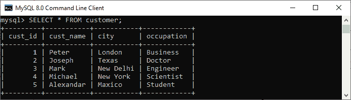
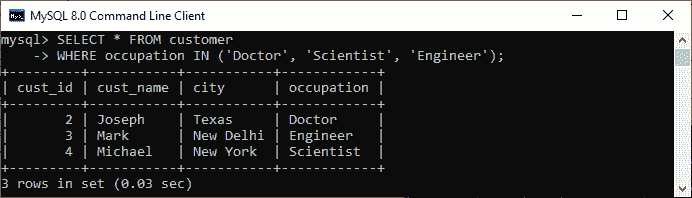
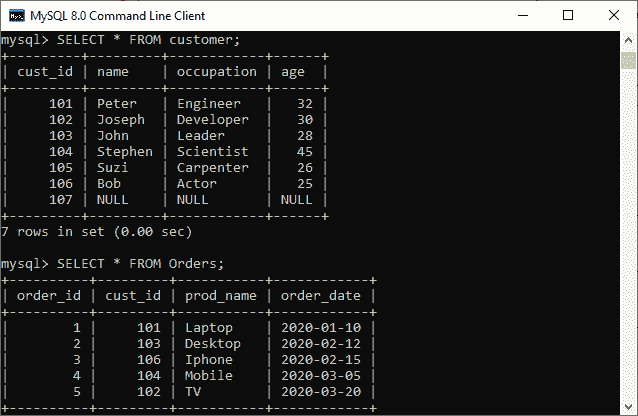
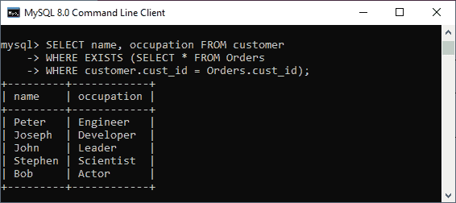

# IN 与 EXISTS

> 原文：<https://www.javatpoint.com/in-vs-exists>

本文解释了 IN 和 EXISTS 子句的完整概述。这是编写 SQL 查询以筛选特定值的开发人员最常问的问题之一。**两者的主要区别在于 in 选择匹配值列表，而 EXISTS 返回布尔值 TRUE 或 FALSE** 。在进行比较之前，我们先了解一下这些 [SQL](https://www.javatpoint.com/sql-tutorial) 子句。


## **输入操作符**

当指定值与一组值中的任何值匹配或由子查询返回时，输入运算符用于**检索结果。该运算符允许我们使用 [WHERE 子句](https://www.javatpoint.com/sql-where)指定多个值。减少了[选择](https://www.javatpoint.com/sql-select)、[插入](https://www.javatpoint.com/sql-insert)、[更新](https://www.javatpoint.com/sql-update)、[删除](https://www.javatpoint.com/sql-delete)查询中**多个或条件**的使用；这就是为什么它也被称为多重或条件的简写。**

在这个运算符中，首先执行内部查询，外部查询使用获得的结果来显示输出。应该记住，内部查询只执行一次。**输入运算符**具有以下语法:

```

SELECT column_name(s) 
FROM table_name 
WHERE column_name IN (value1, value2, - - - - );

```

让我们举个例子来理解这个运算符。假设我们有一个名为**客户**的表，其中包含以下数据:



如果我们希望**获得所有职业为医生、工程师或科学家的客户详细信息**，那么我们可以使用如下语句:

```

mysql> SELECT * FROM customer  
WHERE occupation IN ('Doctor', 'Scientist', 'Engineer');  

```

以下是输出:



## 存在运算符

EXISTS 是一个布尔运算符**，它检查子查询结果并返回一个真或假的值**。它与子查询结合使用，并检查是否通过该子查询返回了一行。如果子查询返回单个或多个记录，该运算符返回**真**。否则，当没有记录被返回时，它给出一个**假**结果。

当 EXISTS 运算符检测到第一个真实事件时，它会自动终止以进行进一步处理。这个特性提高了查询的效率。我们可以在 SELECT、UPDATE、DELETE 和 INSERT 语句中使用 EXISTS 运算符。以下是 EXISTS 运算符的**语法:**

```

SELECT col_names  
FROM tab_name  
WHERE [NOT] EXISTS (  
    SELECT col_names   
    FROM tab_name   
    WHERE condition  
);  

```

让我们举个例子来理解这个运算符。假设我们有一个名为**客户**和**订单**的表格，其中包含以下数据:



如果我们希望**获得至少下过一次订单**的所有客户姓名和职业，那么我们可以使用如下语句:

```

mysql> SELECT name, occupation FROM customer  
WHERE EXISTS (SELECT * FROM Orders   
WHERE customer.cust_id = Orders.cust_id);

```

以下是输出:



## 输入运算符和存在运算符之间的主要区别

以下几点解释了 in 子句和 EXISTS 子句之间的主要区别:

*   IN 子句扫描从给定子查询列中提取的所有记录，而 EXISTS 子句的计算结果为真或假，一旦找到匹配项，SQL 引擎就退出扫描过程。
*   当子查询结果很大时，EXISTS 运算符提供了更好的性能。相比之下，当子查询结果很小时，In 运算符比 EXISTS 更快。
*   IN 运算符总是选择匹配的值列表，而 EXISTS 返回布尔值 TRUE 或 FALSE。
*   EXISTS 运算符只能与子查询一起使用，而我们可以对子查询和值都使用 IN 运算符。
*   EXISTS 子句可以将所有内容与空值进行比较，而 IN 子句不能将任何内容与空值进行比较。
*   IN 运算符在 IN 关键字之前指定的列与子查询结果之间执行直接匹配。相反，EXISTS 运算符不检查匹配，因为它只验证子查询中的数据是否存在。

## 输入与存在比较图

下面的对比图快速解释了它们的主要区别:

| 塞内加尔 | 输入运算符 | 存在运算符 |
| 1. | 它用于最小化多个或条件。 | 它用于检查子查询中是否存在数据。换句话说，它决定了值是否被返回。 |
| 2. | 它比较子查询(子查询)和父查询之间的值。 | 它不比较子查询和父查询之间的值。 |
| 3. | 它扫描输入块中的所有值。 | 一旦满足单个正条件，它就停止执行。 |
| 4. | 它可以返回真、假或空。因此，我们可以用它来比较空值。 | 它返回真或假。因此，我们不能用它来比较空值。 |
| 5. | 我们可以将它用于子查询以及值。 | 我们只能在子查询中使用它。 |
| 6. | 当子查询结果较少时，它执行得更快。 | 当子查询结果较大时，它执行得更快。它比 IN 更高效，因为它处理的是布尔值，而不是值本身。 |
| 7. | 

```
Syntax to use IN clause:
SELECT col_names 
FROM tab_name 
WHERE col_name IN (subquery);

```

 | 

```
Syntax to use EXISTS clause:
SELECT col_names
FROM tab_name
WHERE [NOT] EXISTS (subquery);
```

 |

## 结论

在本文中，我们对 In 和 EXISTS 运算符进行了比较。在这里，我们得出结论，两个子句的作用是相同的，但是它们的内部作用是不同的。换句话说，它们的逻辑工作方式不同。我们可以根据自己的要求选择其中的任何一个，但是如果我们有一个包含几条记录(大数据)的表，最好使用 EXISTS 而不是 IN 运算符。

* * *