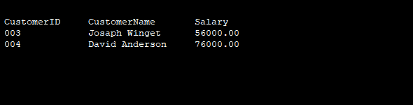
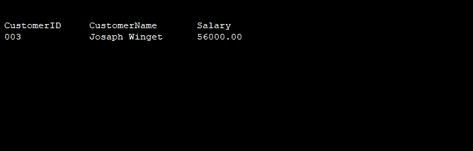

# SQL 中的 Where 条件

> 原文：<https://www.javatpoint.com/where-condition-in-sql>

MySQL WHERE 语句用于定义从单独的列表中收集数据或连接到几个表中的情况。如果满足指定的情况，则只返回表的唯一值。要提取信息并只检索正确的记录，可以使用 WHERE 语句。

不仅在 select 语句中使用了 [WHERE](https://www.javatpoint.com/mysql-where) 条件，在 [UPDATE](https://www.javatpoint.com/sql-update) 断言、 [DELETE](https://www.javatpoint.com/sql-delete) 断言等中也使用了该条件。

### 句法

现在，我们已经讨论了与 [WHERE](https://www.javatpoint.com/sql-where) 条件相关联的 [SELECT 语句](https://www.javatpoint.com/sql-select)的语法。如下所示-

```

SELECT column1, column2, ..... columnN
FROM table_name
WHERE {condition}

```

#### 注意:WHERE 条件不仅用于选择断言，还用于更新断言、删除断言等。！

您可以使用对比或逻辑运算符，如>、

**例如-**

这里，我们考虑具有下面给定记录的客户表。

| 客户号 | 用户姓名 | 地址 | 年龄 | 薪水 |
| 001 | 哈迪·汤普森 | 迈克西姆 | Twenty-five | Ten thousand |
| 002 | 斯特特布罗德洛杉矶 | Twenty-eight | Twenty-five thousand |
| 003 | 约瑟夫 widget | 加利福尼亚 | Thirty | Fifty-six thousand |
| 004 | 大卫·安德森 | 挪威 | Twenty-four | Seventy-six thousand |
| 005 | 阿莱夏 | 丹麦 | Thirty-five | Twenty-three thousand |

现在，我们将在 [SQL](https://www.javatpoint.com/sql-tutorial) 上运行下面给出的查询，从上面的表 CUSTOMERS 中获取 CustomerID、CustomerName 和 salary，其中 Salary 大于 25000。

```

 Select CustomerID, CustomerName, Salary 
from CUSTOMERS
Where Salary > 25000;

```

**输出**

成功执行上述 SQL 查询后，我们得到了以下输出。



这里，我们有另一个实例，其中我们将从名为**约瑟夫·温格特的特定客户的名为 CUSTOMERS 的数据库表中获取 CustomerID、CustomerName 和 Salary。**

```

Select CustomerID, CustomerName, Salary 
from CUSTOMERS
Where CustomerName = 'Joseph Winget';

```

**输出**

在成功执行了上面的 SQL 查询之后，我们得到了上面给出的结果。



#### 注意-这里，应该注意所有的字符串都应该用单引号(')来指定。因此，正如前面讨论的例子，应该提供没有任何报价的数字数据。

* * *