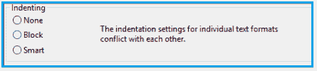
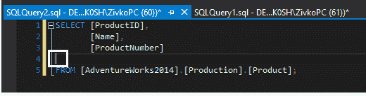
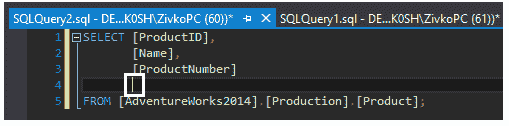
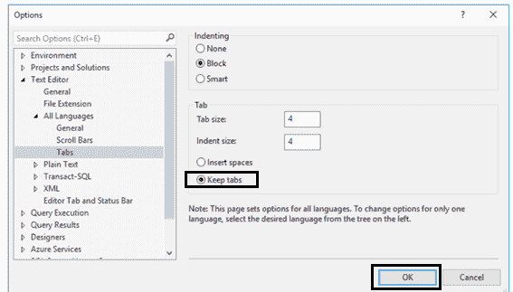

# SQL 格式化程序

> 原文：<https://www.javatpoint.com/sql-formatter>

冗长的代码变得难以解释。读取 SQL 脚本时有大量未格式化的 SQL 代码，难以还原和理解。SQL 中的格式化选项使我们的工作更容易。

## SQL 格式化程序

SQL 格式化是一个缓慢的过程。许多格式化工具被用来加速格式化过程。

下面列出了 SQL 格式化程序的功能:

1.  由第三方用户格式化的代码很容易理解。
2.  在 SQL 中，代码故障排除和审查过程更加方便和高效。
3.  共同努力在项目开发中是建设性的，并且用于处理从一个团队到另一个团队的项目。

现在考虑使用下面给出的 [SQL](https://www.javatpoint.com/sql-tutorial) 格式化程序对代码进行缩进。

### 使用 SQL 格式化程序缩进代码

在这段代码中， [SQL server](https://www.javatpoint.com/sql-server-tutorial) 中使用了三种缩进类型。第一个是**无**，第二个是**街区**，第三个是**智能**。单个文本格式的缩进设置存在争议。




**1。无:**当我们按下**回车**键时，光标移动到下一行的开始，此时从缩进中选择了“**无**”选项。



**2。阻止:**选择阻止选项后，按回车键。下一行中的光标会附加到它的第一列。



**3。SMART:** SMART 是 SQL 中默认的缩进选项，自动决定缩进样式。接下来，我们可以定义制表符空间来创建缩进。

下面是一个示例屏幕截图，用于使用 SQL Server 确定选项卡在 SQL Server 中的位置。



## 格式化程序的特性

它用于修饰 SQL 语句。格式化程序自然地格式化代码，函数基于简单的算法。格式和装饰代码基于基本规则，这有助于编写 SQL 代码。

每当代码复杂且嵌套较深时，建议使用 SQL Formatter 来很好地管理代码。它逐渐添加新的链接，将功能顺序分解成视觉块。因此，SQL 格式化程序通过对块进行分组来修改语句的功能深度。

*   它增强了语句，并且在语句的操作中使用了格式良好的 SQL 语句，这很容易理解。
*   SQL 格式化程序的设计是为了快速执行严格的编程语法。
*   SQL 格式化程序用于以一种可能的方式理解水平空间。
*   格式化程序帮助我们在不使用任何宽度的空格的情况下保持视觉对齐。

我们需要理解格式化程序的核心概念。

示例如下:

查询**选择一个从 t** 。有许多可能的方式来读取或编辑查询。

```

•   SELECT a FROM t

```

```

•   SELECT a
    FROM t

```

```

•   SELECT
    A
    FROM
    t

```

我们有**三种**可能性来呈现相同的查询。所以，这是第一种更容易理解并且占用空间更少的方法。以上说法有四个字。第一个选项中的单词很容易阅读。

**如果我们放大查询的复杂度，会发生什么？**

例如，一些筛选器、列、子查询和不同的深度对可以添加到同一个查询中。随着查询变得越来越复杂，它需要更多的空间。在这里，我们必须添加更多的空间行，暴露子字段，并缩进其他块。将缩进宽度设置为 **50** ，并考虑以下示例中查询的工作情况。

### 我们在下面比较蒙戈数据库和迪纳摩数据库:

```

SELECT
	count(*) AS count,
	winner,
	counter * 50 * 6 AS counter
FROM
	(
		SELECT
			winner,
			round(length / (50 * 6)) AS counter
		FROM
			players
		WHERE
			build = $3
			AND (hero = $4 OR region = $5)
	)
GROUP BY
	winner, counter

```

在上面的示例中，我们有三个预期良好的结果集。查询保持了对可用空间的良好平衡的良好理解。我们必须使用一个简单的查询来关注随着复杂性而变化的输出。

当我们使用格式化工具时，一个框用于**复制**和**粘贴**SQL 代码。SQL 语句使用分号，分号支持多个可以轻松分隔的语句。滑块控制最大行宽，这是框底部使用的字符所需要的。**侧控制**标签有很多选项，如**缩进、空格、标签、对齐方式、**等。

SQL 格式化程序中的关键字“**简化**”删除了不需要的括号或具有相同含义的单词。

下面给出了四种对齐方式。

1.  **1 .满**
2.  **2 .局部**
3.  **3 .否**
4.  **4 .其他**

## SQL 格式化程序的实现

SQL 格式化程序的工作是基于一种算法，以多种格式显示文档。SQL 格式化程序最具挑战性的部分是将文本解析和转换成内存数据结构。解析的数据定义了最终的输出，可以很容易地进行调整。通常，格式化程序会根据新行的可能位置快速计算结果。

它有**文字**和**缩进**，或者是**两者的组合**。这些运算符以正确的顺序使用，以实现正确的功能。我们必须使用一些新的操作符来执行一些额外的功能。

* * *