# 如何在 SQL 中创建函数？

> 原文：<https://www.javatpoint.com/how-to-create-functions-in-sql>

**SQL** 有很多**内置函数**来执行数据的计算。 **SQL** 提供**内置**功能来执行**操作**。SQL 的一些有用功能是执行**数学计算、字符串连接**和**子字符串**等。

SQL 函数**分为**两部分:

1.  聚合函数
2.  标量函数

## SQL 聚合函数

SQL **聚合**函数返回一个值，该值是根据这些值计算的。

*   **AVG():** 返回该列的平均值。
*   **COUNT():** 返回表中的行数。
*   **FIRST():** 返回列的第一个值。
*   **LAST():** 返回最后一个值
*   **MAX():** 返回列的最大值。
*   **MIN():** 返回列的最小值。
*   **SUM():** 返回表的行数之和。

## SQL 标量函数

SQL 标量函数根据输入值返回单个值。

### 标量函数:

*   **UCASE():** 它将数据库字段转换为大写。
*   **LCASE():** 它将一个字段转换为小写。
*   **MID():** 从文本字段中提取字符。
*   **LEN():** 返回文本字段的长度。
*   **ROUND():** 它将一个数值字段舍入到小数位数。
*   **NOW():** 返回当前日期和时间。
*   **FORMAT():** 它格式化字段的显示方式。

### 聚合函数

在对这组值进行计算后，聚合函数返回一个**单值**。下面解释一些**聚合函数**。

### AVG 函数

**AVG ()** 计算**数值**列的数值后，返回数据库的平均值。

**语法:**

```

SELECT AVG(column_name) FROM table_name

```

***使用 AVG()功能***

考虑以下 **Emp** 表:

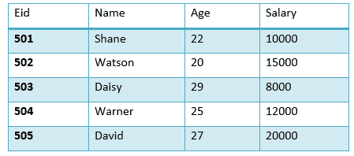

下面 [SQL](https://www.javatpoint.com/sql-tutorial) 计算员工的平均工资。

```

SELECT avg(salary) from Emp;

```

**结果:**

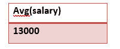

## 计数()函数

Count 返回数据库中存在的行数，可以基于条件，也可以不基于条件。

它的基本**语法**是，

```

SELECT COUNT(column_name) FROM table-name

```

***使用 COUNT()功能***

考虑以下 **Emp** 表:

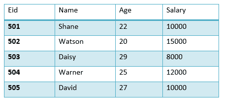

计算满足条件的行数的 SQL 查询。

```

SELECT COUNT(name) FROM Emp WHERE salary = 10000;

```

**输出:**

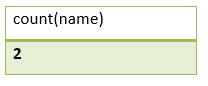

**COUNT(distinct)**示例

考虑以下 **Emp** 表:

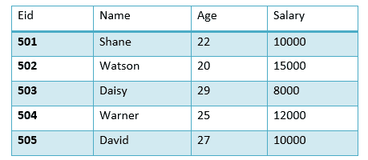

该 SQL 查询是:

```

SELECT COUNT(DISTINCT salary) FROM emp;

```

**输出:**

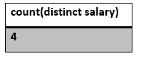

### 第一个()函数

函数返回指定列的第一个值。

**语法:**

```

SELECT FIRST(column_name) FROM table-name;

```

**使用 FIRST()功能**

考虑以下 **Emp** 表:

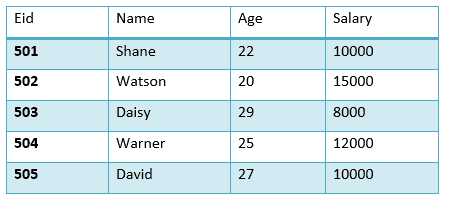

该 SQL 查询将是:

```

SELECT FIRST(salary) FROM EMP;

```

**输出:**


### 最后()函数

函数的作用是:返回所选列的最后一个值。

LAST 函数的语法是:

```

SELECT LAST(column_name) FROM table-name;

```

**使用 LAST()功能**

考虑以下 **Emp** 表:

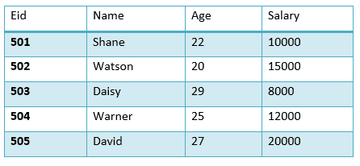

SQL 查询是:

```

SELECT LAST(salary) FROM emp;

```

**输出:**

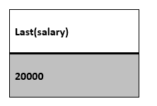

### 最大()函数

函数的作用是:返回表中所选列的最大值。

**语法:**

```

SELECT MAX(column_name) from table-name;

```

考虑以下 **Emp** 表:

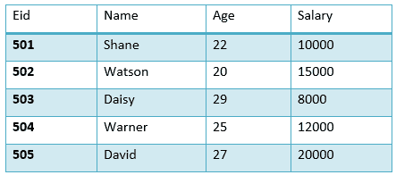

下面的 SQL 查询获取最大工资。

```

SELECT MAX(salary) FROM emp;

```

**输出:**

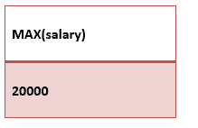

## 最小()函数

函数的作用是:返回所选列的最小值。

**MIN 函数的语法**:

```

SELECT MIN(column_name) from table-name;

```

**使用 MIN()功能**

考虑下面的 **Emp** 表:

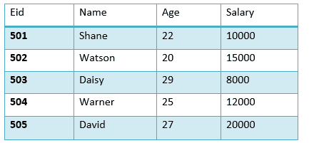

查找最低工资的 SQL 查询:

```

SELECT MIN(salary) FROM emp;

```

**输出:**


## SUM()函数

**SUM ()** 函数返回指定列的总数。

**SUM 的语法:**

```

SELECT SUM (column_name) from table-name;

```

见下表 **Emp**

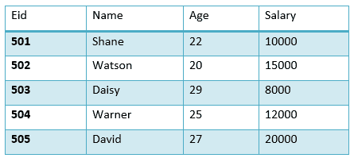

工资总额为:

```

SELECT SUM(salary) FROM emp;

```

**输出:**


## 标量函数

标量函数从输入值返回单个值。下面给出了一些标量函数:

### UCASE()函数

**UCASE ()** 将字符串列的值转换为**大写(大写)**字符。

**语法**

```

SELECT UCASE(column_name) from table-name;

```

**使用 UCASE()功能**

考虑下面的 **Emp** 表:

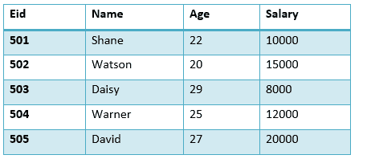

UCASE 的 SQL 查询:

```

SELECT UCASE(name) FROM emp;

```

结果:

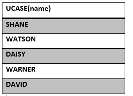

## LCASE()函数

LCASE()函数用于将字符串列的值转换为小写。

**用于 **LCASE 的语法【T1:****

```

SELECT LCASE(column_name) FROM table-name;

```

### 使用 LCASE()函数

考虑以下 **Emp** 表

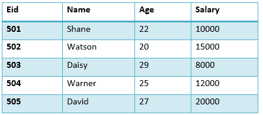

将字符串值转换为**小写的 SQL 查询:**

```

SELECT LCASE(name) FROM emp;

```

**输出:**

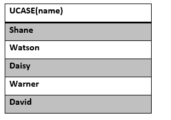

## MID()函数

MID()函数用于从表中的列值中提取子字符串。

MID 函数的语法是:

```

SELECT MID(column_name, start, length) from table-name;

```

**使用 MID()功能**

考虑以下 **Emp** 表:

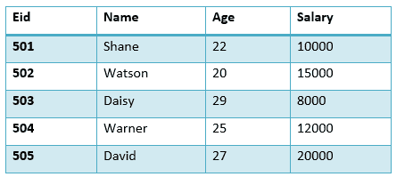

下面的 SQL 查询返回从第二个字符开始的子字符串。

```

SELECT MID(name,2,2) FROM emp;

```

**输出:**

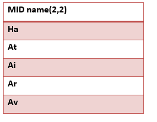

## ROUND()函数

ROUND()函数用于将数值字段舍入到最接近的整数。它用于小数点。

**语法:**

```

SELECT ROUND(column_name, decimals) from table-name;

```

**使用 ROUND()功能**

考虑以下 **Emp** 表:

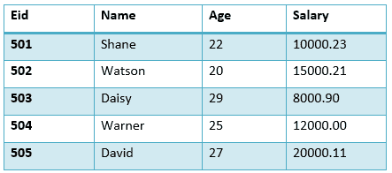

下面的 SQL 查询对薪资列的金额进行舍入。

```

SELECT ROUND(salary) from emp;

```

**输出:**

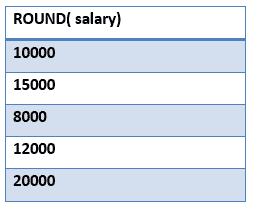

* * *