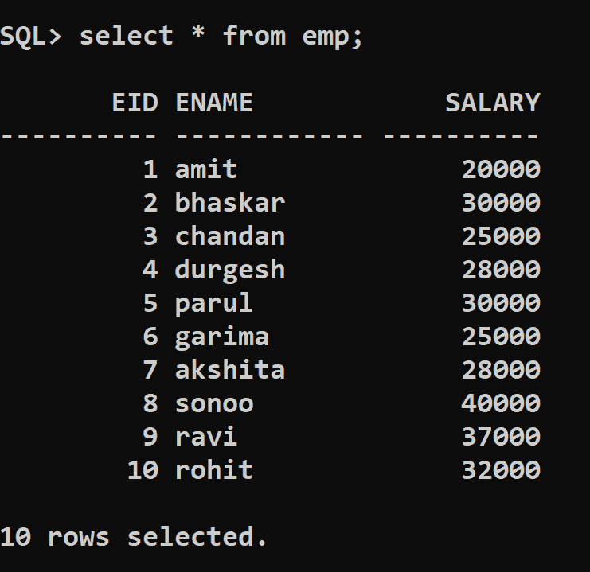
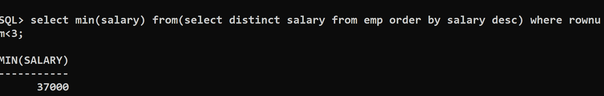
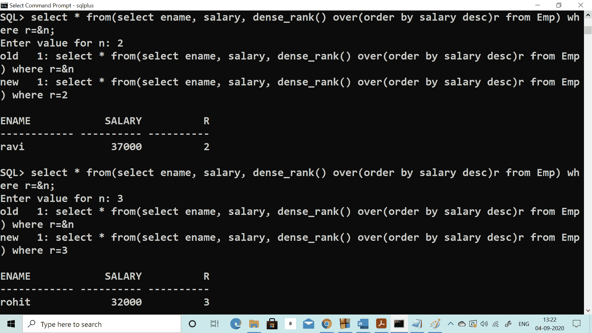

# 第 n 个最高工资

> 原文：<https://www.javatpoint.com/sql-nth-highest-salary>

在一张表中找到第 n 个最高工资(第 2 个<sup>第</sup>，第 3 个<sup>第</sup>，或者第 n 个<sup>第</sup>最高)是各种面试中最重要也是最常见的问题。

在这里，我们将向您展示编写 [SQL](https://www.javatpoint.com/sql-tutorial) 查询以在表中查找第 n 个最高工资的最佳且最简单的方法。

为了说明这一点，我们使用了表 **Emp** ，其中包含员工详细信息，如 EID、ENAME 和 SALARY。Emp 表中的数据如下所示:

**表名:Emp**

| 开斋节 | 易名中国 | 薪水 |
| one | 阿密特 | Twenty thousand |
| Two | 巴斯卡尔 | thirty thousand |
| three | 沉香木 | Twenty-five thousand |
| four | Durgesh | Twenty-eight thousand |
| five | 毛 | thirty thousand |
| six | 格里玛 | Twenty-five thousand |
| seven | 明日 | Twenty-eight thousand |
| eight | 索尼公司 | forty thousand |
| nine | 拉维河 | Thirty-seven thousand |
| Ten | 英国 | Three hundred and twenty thousand |

### 用于计算数据库表名中第二高工资的 SQL 查询为 Emp

**查询:1**

```

SQL> select min(salary) from 
(select distinct salary from emp order by salary desc) 
where rownum < 3;

In order to calculate the second highest salary use rownum < 3
In order to calculate the third highest salary use rownum < 4

```

**输出:**

```
MIN(SALARY)
-----------
      37000

```

### Emp 表中的结构和数据



### 输出屏幕



### 让我们了解这个查询是如何工作的:

```

As this query is nested query lets understand each part step by step:
Step 1: First this part of the query will get executed then the outer part of the query will act on the result produced by this query:            select distinct salary from emp order by salary desc
As you can see that few employees are getting the same salary (for example Bhaskar, Parul, and Chandan, Garima are getting the same salary, therefore we have used distinct keyword, order by salary desc will arrange salary in descending order.
The output of select distinct salary from emp order by salary desc
    SALARY
----------
     40000
     37000
     32000
     30000
     28000
     25000
     20000

Step 2: SQL> select min(salary) from 
(select distinct salary from emp order by salary desc) 
where rownum < 3;
In step two we are applying the outer part of the nested query into the results we obtained from the internal query.

Select min(salary) from: will select min salary as 20000 which is not the second-highest salary, because of which we have used rownum < 3, the rownum < 3 will only give the number of rows from the top which is less than 3 i.e. 2.
The output of rownum< 3 will be:
     SALARY
----------
     40000
     37000
Step 3: Now select min(salary).
The output will be:
SALARY
----------
     37000
37000 is the second-highest salary.

Simillarly to find:
To find 3rd highest salary set rownum < 4
To find 4th highest salary set rownum < 5
And so on...

```

### 用于计算数据库表名中第二高工资的 SQL 查询为 Emp

**查询:2**

```

select * from(
select ename, salary, dense_rank() 
over(order by salary desc)rank from Emp) 
where rank = & num;

In order to calculate the second highest salary use num = 2
In order to calculate the third highest salary use num = 3 
and so on...

```

**输出:**

```
ENAME            SALARY          Rank
------------          ----------       ----------
ravi                   37000            2

```



### 让我们了解这个查询是如何工作的:

```

As this query is nested query lets understand each part step by step:
Step 1: First this part of the query will get executed then the outer part of the query will act on the result produced by this query :
select ename, salary, dense_rank() over(order by salary desc)rank from Emp 
dense_rank() calculates the rank of each row in an ordered group of rows and returns the rank as a number. The ranks start from integer 1 and so on in a consecutive manner. 

If we talk about the above SQL query, based on the salary of the emp table the rank is returned. In case two or more than two rows have an equal salary, it assigns an equal rank to all the rows.

As you can see that few employees are getting the same salary(for example Bhaskar, Parul, and Chandan, Garima are getting the same salary, therefore we have used dense_rank(), order by salary desc will arrange salary in descending order.

Output of : select ename, salary, dense_rank() over(order by salary desc)rank from Emp 
ENAME            SALARY       RANK
------------ ---------- ----------
sonoo             40000          1
ravi              37000          2
rohit             32000          3
bhaskar           30000          4
parul             30000          4
akshita           28000          5
durgesh           28000          5
garima            25000          6
chandan           25000          6
amit              20000          7     

you can see from the output that Bhaskar, Parul are getting rank 4 as they both are getting equal salary) and Akshita, Durgesh are getting rank 4(as they both are getting equal salary)  similarly Garima and Chandan.

Step 2: SQL> select * from(
select ename, salary, dense_rank() 
over(order by salary desc)rank from Emp) 
where r = &n;
In step 2 we are applying the outer part of the nested query into the result we obtained from the internal query.

Select * from: will select all the rows which are not the second-highest salary, because of which we have used r = &n, the r = &n will only give the matching rows according to the values entered by the user for n. if n = 2 resultant will be
Output for n = 2 will be:
Enter the value for n: 2
old   1: select * from(select ename, salary, dense_rank() over(order by salary desc)r from Emp) where r=&n
new   1: select * from(select ename, salary, dense_rank() over(order by salary desc)r from Emp) where r=2

ENAME            SALARY          R
------------ ---------- ----------
ravi              37000          2

To Find fourth highest salary:    
Enter value for n: 4
old   1: select * from(select ename, salary, dense_rank() over(order by salary desc)r from Emp) where r=&n
new   1: select * from(select ename, salary, dense_rank() over(order by salary desc)r from Emp) where r=4

ENAME            SALARY          R
------------ ---------- ----------
bhaskar           30000          4
parul             30000          4

Similarly, to find:
To find 5th highest salary set n = 5
To find 6th highest salary set n = 6
And so on...

```

## 用于计算数据库表名中第二高工资的 SQL 查询为 Emp

假设工作是从上表计算员工的第 n 个最高工资。程序如下:

1.  第一项任务是确定薪水最高的员工。
2.  计算由上述查询得到的所有工资中的最低工资，这样我们得到第 n 个最高工资。
3.  从上述查询结果中，确定薪资为最低薪资的员工的详细信息。

**查询号:3**

```

select * from emp where salary = ( select min( salary ) from emp 
            where  salary IN (select distinct TOP N                                  
                                salary from emp order by salary desc )                              
                                 )

```

上面的 SQL 查询将找出第 n 个工资最高的 emp 的详细信息。

让我们详细看看上面的 SQL 查询的工作原理:

*   考虑 n = 5。

服务器完成的处理是，它从最内部的查询开始，查询:“ ***从 emp 订单中选择不同的 TOP 5 薪资按薪资 desc*** ”将生成以下结果:

```

•    40000
•    37000
•    32000
•    30000
•    28000

```

*   下一个外部查询是:“从 emp 中选择 min(薪资)，其中薪资为 in(前一个 SQL 查询的结果)”。这将产生以下结果:

```

•    28000

```

从以上结果可以验证，要求的**第五**最高工资为 28000。

*   最后，最外层的查询是:“从 emp 中选择*其中薪资=以前的 SQL 查询结果”。该查询的结果将是拥有**第五名**最高工资的员工的详细信息。

```

•	________________________
•	ename             salary
•	________________________
•	 akshita   |     28000
•	           |

```

## 查询工作

由于这些查询是嵌套查询，因此该查询涉及内部查询的使用。内部查询有两个版本。**相关**和**不相关**查询。不相关查询是内部查询可以独立于外部查询运行的查询，相关查询是内部查询与外部查询一起运行的查询。我们用来计算第 n 个最高工资的查询就是一个相关查询的例子。

## SQL 查询的性能分析

从上面我们了解到，每次执行内部查询时，都会处理外部查询的单行，这最终会带来很大的性能开销，尤其是行数非常大的时候。

为了避免这种情况，建议使用数据库特定的关键字来更快地获得结果。

* * *