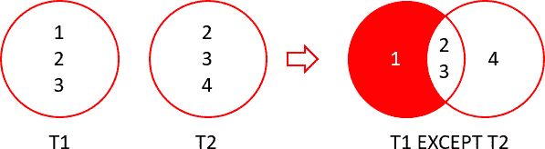
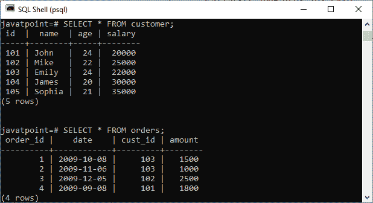
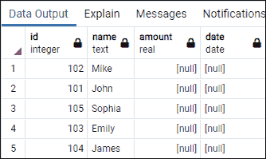
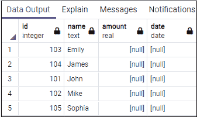

# SQL EXCEPT

> 原文：<https://www.javatpoint.com/sql-except>

通常，我们使用 JOIN 子句从多个表中获取组合结果。有时，我们需要一个结果集，它包含一个表中的记录，但在另一个表中不可用。在这种情况下，SQL 提供了一个 EXCEPT 子句/运算符。

[SQL](https://www.javatpoint.com/sql-tutorial) 中的 EXCEPT 子句广泛用于从多个表中筛选记录。该语句首先组合两个 [SELECT 语句](https://www.javatpoint.com/sql-select)，并返回第一个 SELECT 查询中的记录，这些记录没有出现在第二个 SELECT 查询的结果中。换句话说，它从第一个 SELECT 查询中检索所有行，同时从第二个查询中删除冗余行。

这个语句的行为与数学中的减运算符相同。本文将借助基本示例来说明如何使用 SQL EXCEPT 子句。

### 除了

在 SQL 中使用 EXCEPT 语句之前，我们应该考虑以下规则:

*   在所有 SELECT 语句中，表中的列数和顺序必须相同。
*   相应列的数据类型应该相同或兼容。
*   两个 SELECT 语句各自列中的字段不能相同。

### 除语法外的 SQL

以下语法说明了 EXCEPT 子句的用法:

```

SELECT column_lists from table_name1
EXCEPT
SELECT column_lists from table_name2;

```

#### 注意:需要注意的是，MySQL 不支持 EXCEPT 子句。因此，这里我们将使用 PostgreSQL 数据库来解释 SQL EXCEPT 示例。

下图解释了两个表 T1 和 T2 中“除外”操作的工作原理:



插图:

*   表 T1 包括数据 1、2 和 3。
*   表 T2 包括数据 2、3 和 4。

当我们对这些表执行 EXCEPT 查询时，我们将得到 1，这是来自 t 1 的唯一数据，在 T2 找不到。

### SQL 例外示例

让我们首先使用以下脚本创建两个表:

**表:客户**

```

CREATE TABLE public.customer
(
    id integer NOT NULL,
    name text COLLATE pg_catalog."default" NOT NULL,
    age integer NOT NULL,
    salary real NOT NULL
)

```

**表:订单**

```

CREATE TABLE public."orders"
(
    order_id integer NOT NULL,
    date date NOT NULL,
    cust_id integer NOT NULL,
    amount real NOT NULL,
    CONSTRAINT "order_pkey" PRIMARY KEY ("order_id")
)

```

接下来，我们将在这两个表中插入一些记录，如下所示:

**表:客户**

```

INSERT INTO public.customer(
	id, name, age, salary)
	VALUES (101, 'John', 24, 20000)
	(102, 'Mike', 22, 25000),
	(103, 'Emily', 24, 22000),
	(104, 'James', 20, 30000),
	(105, 'Sophia', 21, 35000);

```

**表:订单**

```

INSERT INTO public.orders(
	order_id, date, cust_id, amount)
	VALUES (1, '2009-10-08', 103, 1500),
	(2, '2009-11-06', 103, 1000),
	(3, '2009-12-05', 102, 2500),
	(4, '2009-09-08', 101, 1800);

```

接下来，我们将使用 SELECT 语句来验证记录。请参见下图:



让我们来看一个使用这些表的例子。假设我们希望在 SELECT 语句中连接这些表，如下所示:

```

SELECT  id, name, amount, date
   FROM customer
   LEFT JOIN orders
   ON customer.id = orders. order_id
EXCEPT
   SELECT  id, name, amount, date
   FROM customer
   RIGHT JOIN orders
   ON customer.id = orders. order_id;

```

它将产生以下输出:



### 订单子句除外

如果要对 EXCEPT 运算符得到的结果集进行排序，需要在查询中添加 [ORDER BY 子句](https://www.javatpoint.com/sql-order-by)。例如，以下示例联接两个表，并按名称升序对结果集进行排序:

```

SELECT  id, name, amount, date
   FROM customer
   LEFT JOIN orders
   ON customer.id = orders. order_id
EXCEPT
   SELECT  id, name, amount, date
   FROM customer
   RIGHT JOIN orders
   ON customer.id = orders. order_id
   ORDER BY name;

```

它将产生以下输出:



### 单个表中的 EXCEPT 语句

通常，我们在两个表中使用 EXCEPT 语句，但是我们也可以使用它们来过滤单个表中的记录。例如，以下 EXCEPT 语句将返回客户表中年龄大于 21 岁的所有记录:

```

SELECT id, name, age, salary FROM customer
EXCEPT
SELECT id, name, age, salary FROM customer WHERE age > 21;

```

在这个脚本中，第一个 SELECT 查询返回客户表中的所有记录，第二个查询返回年龄大于 21 岁的所有记录。接下来，EXCEPT 语句使用 SELECT 语句过滤记录，并且只返回那些年龄大于 21 岁的行。

### 除外子句与不在子句有何不同？

“例外”在以下方面不同于“不在”子句:

*   EXCEPT 子句删除结果中的所有重复项，自动设置，而 NOT IN 不会删除重复记录。
*   EXCEPT 子句可以在单列或多列中执行比较。而 NOT IN 子句只能在一列中执行比较。

* * *