# SQL JOIN 的类型

> 原文：<https://www.javatpoint.com/types-of-sql-join>

## SQL JOIN

一个 [SQL 连接](https://www.javatpoint.com/sql-join)用于根据定义的条件从两个或多个表中获取或组合数据(行或列)。

**表 1:订单**

| OrderID(订单 ID) | 客户号 | 订单名称 | 产品名称 |
| Twelve thousand and twenty-five | One hundred and one | 耗尽 | 字母表 |
| Twelve thousand and thirty | One hundred and five | 罗伯特 | XYX |
| Twelve thousand and thirty-two | One hundred and ten | 詹姆斯 | 坐标 |
| Twelve thousand and thirty-four | One hundred and fifteen | 安德鲁 | 焊接工艺评定报告 |
| Twelve thousand and thirty-five | One hundred and twenty | 马太福音 | 美国汽车协会 |

**表 2:客户**

| 客户号 | 用户姓名 | 国家 |
| One hundred | 麻烦的 | 迈克西姆 |
| One hundred and one | 王子 | 台湾 |
| One hundred and three | 玛丽亚·费尔南德斯 | 火鸡 |
| One hundred and five | 茉莉 | 巴黎 |
| One hundred and ten | 法夫·威塞尔 | 印度尼西亚 |
| One hundred and twenty | 罗马火箭 | 俄罗斯 |

现在，我们有两张桌子**订单**和**客户**。两个表中都有一个**客户标识**列。因此，编写 SQL 查询来定义一般关系，以便从两个表中选择匹配的记录。

```sql

Select Order.OrderID, Customer.CustomerName, Customer.Country, Order.ProductName from Order INNER JOIN Customer ON Order.CustomerID = Customer.CustomerID;

```

执行上述 [SQL](https://www.javatpoint.com/sql-tutorial) 查询后，会产生以下输出:

| OrderID(订单 ID) | 用户姓名 | 国家 | 产品名称 |
| Twelve thousand and twenty-five | 王子 | 台湾 | 字母表 |
| Twelve thousand and thirty | 茉莉 | 巴黎 | XYX |
| Twelve thousand and thirty-two | 法夫·威塞尔 | 印度尼西亚 | 坐标 |
| Twelve thousand and thirty-five | 罗马火箭 | 俄罗斯 | 美国汽车协会 |

## SQL 连接的类型

SQL 中使用了不同类型的连接:

1.  [内部连接/简单连接](#Inner)
2.  [左外连接/左连接](#Left)
3.  [右外连接/右连接](#Right)
4.  [完全外部连接](#Full)
5.  [交叉连接](#Cross)
6.  [自加入](#Self)

### 内部连接

内部联接用于选择两个表中所有匹配的行或列，或者只要定义的条件在 SQL 中有效。

**语法:**

```sql

Select column_1, column_2, column_3 FROM table_1 INNER JOIN table_2 ON table_1.column = table_2.column;

```

我们可以通过文氏图来表示内部连接，如下所示:

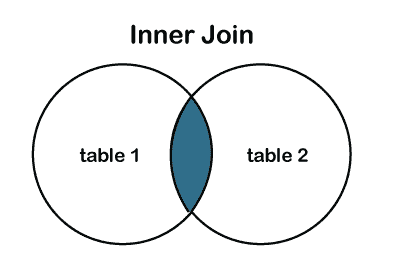

**表 1:学生**

| 学生标识 | 学生姓名 | 科目 | 教师 |
| One hundred and one | 亚历山德拉(女子名ˌ义为男人的保护者) | 计算机科学 | T201 |
| One hundred and two | 查理 | 经济学 | T202 |
| One hundred and three | 汤姆·克鲁斯 | 计算机科学 | T201 |
| One hundred and four | 亚伦·芬奇 | 电子学 | T203 |
| One hundred and five | 西门巴约夫 | 网页设计 | T204 |
| One hundred and six | 克里斯托弗 | 英国文学 | T205 |
| One hundred and seven | 斜纹粗棉布 | 时装设计师 | T206 |

**表 2:教师**

| 教师 | 教师姓名 | 教师邮件 |
| T201 | 戴维斯先生 | [【邮件保护】](/cdn-cgi/l/email-protection) |
| T202 | 乔纳斯夫人 | [【邮件保护】](/cdn-cgi/l/email-protection) |
| T201 | 戴维斯先生 | [【邮件保护】](/cdn-cgi/l/email-protection) |
| T204 | 洛佩兹夫人 | [【邮件保护】](/cdn-cgi/l/email-protection) |
| T205 | 威利夫人 | [【邮件保护】](/cdn-cgi/l/email-protection) |
| T206 | 憨豆先生 | [【邮件保护】](/cdn-cgi/l/email-protection) |

我们有两张桌子:**学生**和**教师**桌子。让我们使用**内部连接**编写连接表的 SQL 查询，如下所示:

```sql

Select Student_ID, StudentName, TeacherName, TeacherEmail FROM Students INNER JOIN Teachers ON Students.TeacherID = Teachers.TeacherID; 

```

执行查询后，它会生成下表。

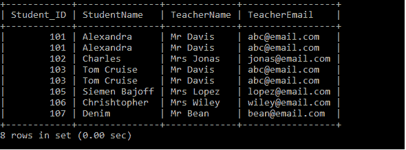

### 自然连接

它是一种内部类型，基于相同的列名连接两个或多个表，并且在两个表上具有相同的数据类型。

**语法:**

```sql

Select * from tablename1 Natural JOIN tablename_2;

```

我们有两张桌子:**学生**和**教师**桌子。让我们使用**自然连接**编写连接表的 SQL 查询，如下所示:

```sql

Select * from Students Natural JOIN Teachers;

```

执行上述查询后，它会生成下表。

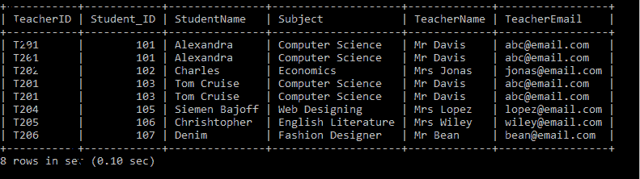

### 左连接

[**【左连接】**](https://www.javatpoint.com/sql-left-join) 用于从左表(表 1)中检索所有记录，并从右表(表 2)中检索匹配的行或列。如果两个表都不包含任何匹配的行或列，它将返回空值。

**语法:**

```sql

Select column_1, column_2, column(s) FROM table_1 LEFT JOIN table_2 ON table_1.column_name = table_2.column_name;

```

我们也可以通过文氏图表示左连接，如下所示:

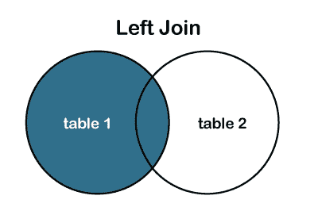

#### 注意:在一些数据库中，左连接也称为左外连接。

**表 1:产品 _ 详情**

| 产品 id | 产品名称 | 数量 |
| Pro101 | 笔记本电脑 | Fifty-six thousand |
| Pro102 | 移动的 | Thirty-eight thousand |
| Pro103 | 耳机 | Five thousand |
| Pro104 | 电视机 | Twenty-five thousand |
| Pro105 | 苹果平板电脑 | Sixty thousand |

**表 2:客户 _ 详情**

| 用户姓名 | 客户地址 | customer rage | 产品 id |
| 马丁·古普泰尔 | 美国旧金山 | Twenty-six | Pro101 |
| 詹姆斯 | 澳大利亚 | Twenty-nine | Pro103 |
| 安巴蒂·威廉姆森 | 新西兰 | Twenty-seven | Pro102 |
| 乔弗拉弓箭手 | 南非 | Twenty-four | Pro105 |
| 凯特·威利 | 澳大利亚 | Twenty | Pro103 |

我们有两张表:**产品详细信息**和**客户详细信息**表。让我们使用**左连接**来编写连接表的 SQL 查询，如下所示:

```sql

Select ID, ProductName, CustomerName, CustomerAddress, Amount FROM Product_Details LEFT JOIN Customer_Details ON Product_Details.ID = Customer_Details.ProductID;

```

执行查询后，它会生成下表。

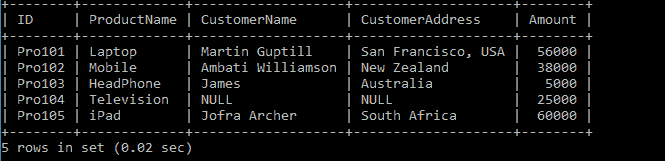

### 右连接或右外部连接:

[**【右连接】**](https://www.javatpoint.com/sql-right-join) 用于从右表(表 2)中检索所有记录，并从左表(表 1)中检索匹配的行或列。如果两个表都不包含任何匹配的行或列，它将返回空值。

**语法:**

```sql

Select column_1, column_2, column(s) FROM table_1 RIGHT JOIN table_2 ON table_1.column_name = table_2.column_name;

```

我们也可以通过维恩图表示正确的连接，如下所示:

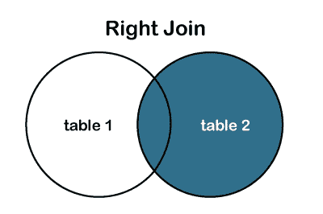

#### 注意:在一些数据库中，右连接也被称为右外部连接。

**表 1:产品 _ 详情**

| 身份 | 产品名称 | 数量 |
| Pro101 | 笔记本电脑 | Fifty-six thousand |
| Pro102 | 移动的 | Thirty-eight thousand |
| Pro103 | 耳机 | Five thousand |
| Pro104 | 电视机 | Twenty-five thousand |
| Pro105 | 苹果平板电脑 | Sixty thousand |

**表 2:客户 _ 详情**

| 用户姓名 | 客户地址 | customer rage | 产品 id |
| 马丁·古普泰尔 | 美国旧金山 | Twenty-six | Pro101 |
| 詹姆斯 | 澳大利亚 | Twenty-nine | Pro103 |
| 安巴蒂·威廉姆森 | 新西兰 | Twenty-seven | Pro102 |
| 乔弗拉弓箭手 | 南非 | Twenty-four | Pro105 |
| 预示 | 英格兰 | Twenty-nine | Pro107 |
| 摩根 | 英格兰 | Twenty | Pro108 |

我们有两张表:**产品详细信息**和**客户详细信息**表。让我们使用**右连接**编写连接表的 SQL 查询，如下所示:

```sql

Select ID, ProductName, CustomerName, CustomerAddress, Amount FROM Product_Details LEFT JOIN Customer_Details ON Product_Details.ID = Customer_Details.ProductID;

```

执行查询后，它会生成下表。

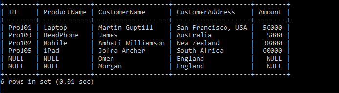

### 完全连接或完全外部连接:

它是**左连接**和**右连接**的组合结果集。连接的表返回这两个表中的所有记录，如果在表中找不到匹配项，它将为空。它也被称为[T5【全外连接】T6](https://www.javatpoint.com/sql-full-join)。

**语法:**

```sql

Select column_1, column_2, column(s) FROM table_1 FULL JOIN table_2 ON table_1.column_name = table_2.column_name;

```

或者，**完全外部连接**

```sql

Select column_1, column_2, column(s) FROM table_1 FULL OUTER JOIN table_2 ON table_1.column_name = table_2.column_name;

```

我们也可以通过文氏图表示完整的外部连接，如下所示:

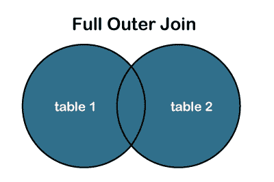

**表 1:产品 _ 详情**

| 身份 | 产品名称 | 数量 |
| Pro101 | 笔记本电脑 | Fifty-six thousand |
| Pro102 | 移动的 | Thirty-eight thousand |
| Pro103 | 耳机 | Five thousand |
| Pro104 | 电视机 | Twenty-five thousand |
| Pro105 | 苹果平板电脑 | Sixty thousand |

**表 2:客户 _ 详情**

| 用户姓名 | 客户地址 | customer rage | 产品 id |
| 马丁·古普泰尔 | 美国旧金山 | Twenty-six | Pro101 |
| 詹姆斯 | 澳大利亚 | Twenty-nine | Pro103 |
| 安巴蒂·威廉姆森 | 新西兰 | Twenty-seven | Pro102 |
| 乔弗拉弓箭手 | 南非 | Twenty-four | Pro105 |
| 预示 | 英格兰 | Twenty-nine | Pro107 |
| 摩根 | 英格兰 | Twenty | Pro108 |

我们有两张表:**产品详细信息**和**客户详细信息**表。让我们编写 SQL 查询，使用 **FULL** JOIN 连接表，如下所示:

```sql

Select ID, ProductName, CustomerName, CustomerAddress, Amount FROM Product_Details FULL JOIN Customer_Details ON Product_Details.ID = Customer_Details.ProductID;

```

执行查询后，它会生成下表。

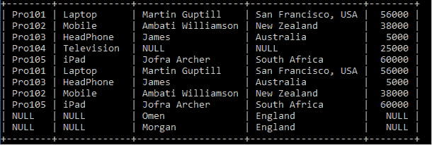

#### 注意:MySQL 不支持 FULL JOIN 概念，所以我们可以使用 UNION ALL 子句来组合这两个表。

下面是 **UNION ALL** 子句组合表的语法。

```sql

Select ID, ProductName, CustomerName, CustomerAddress, Amount FROM Product_Details LEFT JOIN Customer_Details ON Product_Details.ID = Customer_Details.ProductID
UNION ALL
Select ID, ProductName, CustomerName, CustomerAddress, Amount FROM Product_Details RIGHT JOIN Customer_Details ON Product_Details.ID = Customer_Details.ProductID

```


### 交叉连接

它也被称为**笛卡尔连接**，返回两个或多个连接表的笛卡尔乘积。 [**交叉连接**](https://www.javatpoint.com/sql-cross-join) 生成一个表，将第一个表的每一行与第二个表的每一行合并。交叉连接中不需要包含任何条件。

**语法:**

```sql

Select * from table_1 cross join table_2;

```

或者，

```sql

Select column1, column2, column3 FROM table_1, table_2;

```

**表 1:产品 _ 详情**

| 身份 | 产品名称 | 数量 |
| Pro101 | 笔记本电脑 | Fifty-six thousand |
| Pro102 | 移动的 | Thirty-eight thousand |
| Pro103 | 耳机 | Five thousand |
| Pro104 | 电视机 | Twenty-five thousand |
| Pro105 | 苹果平板电脑 | Sixty thousand |

**表 2:客户 _ 详情**

| 用户姓名 | 客户地址 | customer rage | 产品 id |
| 马丁·古普泰尔 | 美国旧金山 | Twenty-six | Pro101 |
| 詹姆斯 | 澳大利亚 | Twenty-nine | Pro103 |
| 安巴蒂·威廉姆森 | 新西兰 | Twenty-seven | Pro102 |
| 乔弗拉弓箭手 | 南非 | Twenty-four | Pro105 |
| 预示 | 英格兰 | Twenty-nine | Pro107 |
| 摩根 | 英格兰 | Twenty | Pro108 |

我们有两张表:**产品详细信息**和**客户详细信息**表。让我们编写 SQL 查询，使用 **FULL** JOIN 连接表，如下所示:

```sql

Select ID, ProductName, CustomerName, CustomerAddress, Amount FROM Product_Details, Customer_Details;

```

执行查询后，它会生成下表。

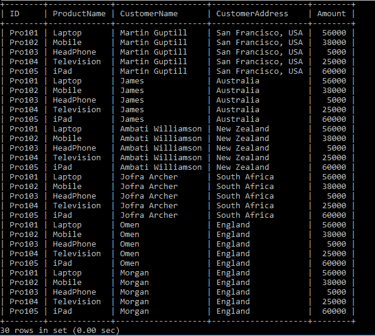

### 自连接

它是一个 SELF JOIN，用于通过连接自身来创建一个表，因为有两个表。它对 SQL 语句中的至少一个表进行临时命名。

**语法:**

```sql

Select column1, column2, column(s) FROM table_1 Tbl1, table_2 Tbl2 WHERE condition;

```

**Tbl1** 和 **Tbl2** 是同一个表的两个不同的表别名。

**表 1:产品 _ 详情**

| 身份 | 产品名称 | 数量 |
| Pro101 | 笔记本电脑 | Fifty-six thousand |
| Pro102 | 移动的 | Thirty-eight thousand |
| Pro103 | 耳机 | Five thousand |
| Pro104 | 电视机 | Twenty-five thousand |
| Pro105 | 苹果平板电脑 | Sixty thousand |

让我们使用 **SELF JOIN** 编写连接表的 SQL 查询，如下所示:

```sql

Select TB.ID, TB.ProductName FROM Product_Details TB, Product_Details TB2
WHERE TB.AMOUNT < TB2.AMOUNT;

```

执行查询后，它会生成下表。

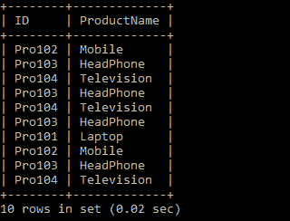

* * *