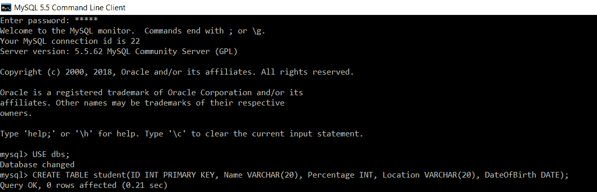

# SQL 从日期中获取月份

> 原文：<https://www.javatpoint.com/sql-get-month-from-the-date>

*   为了记住重要的日期，我们可以将它们存储在 SQL 的数据库表中。
*   可能会出现这样一种情况，即不是从 SQL 表的列中检索整个日期，而是只希望从表的列中提取日期的月份。
*   SQL 中有不同的日期函数，使用这些函数，我们可以根据需要从列中获取不同部分的日期。
*   SQL 中的 **MONTH ()** 函数用于从存储在表列中的整个日期中获取月份。
*   除了以存储日期的默认格式检索日期之外，在 SQL 中还有一个 DATE_FORMAT()函数，使用该函数可以以更易读的格式检索日期值。

让我们看几个实际的例子来更清楚地理解这个概念。我们将使用 MySQL 数据库来编写所有的查询。

```

mysql> USE dbs;

```

然后，我们将编写以下查询，在“dbs”数据库中创建一个表:

```

mysql> CREATE TABLE student(ID INT PRIMARY KEY, Name VARCHAR(20), Percentage INT, Location VARCHAR(20), DateOfBirth DATE);

```



在上面的查询中，名为“DateOfBirth”的列将存储日期，因为该列的数据类型被设置为“date”。

现在，我们将编写一个查询，在学生表中插入记录。

```

mysql> INSERT INTO student(ID, Name, Percentage, Location, DateOfBirth) VALUES (1, "Manthan Koli", 79, "Delhi", "2003-08-20"), (2, "Dev Dixit", 75, "Pune", "1999-06-17"), (3, "Aakash Deshmukh", 87, "Mumbai", "1997-09-12"), (4, "Aaryan Jaiswal", 90, "Chennai", "2005-10-02"), (5, "Rahul Khanna", 92, "Ambala", "1996-03-04");

```


我们将执行 SELECT 查询，以验证所有记录都已成功插入学生表中。

```

mysql> SELECT *FROM student;

```

您将获得下表作为输出:

| 身份 | 名字 | 百分率 | 位置 | 出生日期 |
| one | 曼坦科利 | Seventy-nine | 德里 | 2003-08-20 |
| Two | Dev Dixit | Seventy-five | 浦那 | 1999-06-17 |
| three | Aakash Deshmukh | Eighty-seven | 孟买 | 1997-09-12 |
| four | 阿尔扬·杰史瓦尔 | Ninety | 金奈 | 2005-10-02 |
| five | 拉胡尔·康纳 | Ninety-two | 安芭拉 | 1996-03-04 |

上面的查询结果显示，存储在“DateOfBirth”列中的日期是以默认的存储格式检索的，即“YYYY-MM-DD”。

**例 1:**

编写一个查询，只检索日期的特定部分，即“日期列表”列中的一个月。

**查询:**

```

mysql> SELECT ID, Name, Percentage, Location, MONTH (DateOfBirth) AS MonthOfBirth FROM student;

```

Month()函数在 SELECT 查询中使用，并应用于 DateOfBirth 列，以便从整个日期中仅检索月份。“月出生”是使用 as 关键字给出的别名，用于存储从日期开始的月份。

您将获得下表作为输出:

| 身份 | 名字 | 百分率 | 位置 | 出生月份 |
| one | 曼坦科利 | Seventy-nine | 德里 | eight |
| Two | Dev Dixit | Seventy-five | 浦那 | six |
| three | Aakash Deshmukh | Eighty-seven | 孟买 | nine |
| four | 阿尔扬·杰史瓦尔 | Ninety | 金奈 | Ten |
| five | 拉胡尔·康纳 | Ninety-two | 安芭拉 | three |

结果显示，所有学生的出生月份都被成功地检索到“出生月份”列中。

**例 2:**

**编写一个查询，从‘date of birth’列中以更易读的格式只检索日期的特定部分，即月份。**

**查询:**

```

mysql> SELECT ID, Name, Percentage, Location, DATE_FORMAT (DateTimeOfBirth, '%M') AS MonthOfBirth FROM student;

```

您将获得下表作为输出:

| 身份 | 名字 | 百分率 | 位置 | 出生月份 |
| one | 曼坦科利 | Seventy-nine | 德里 | 八月 |
| Two | Dev Dixit | Seventy-five | 浦那 | 六月 |
| three | Aakash Deshmukh | Eighty-seven | 孟买 | 九月 |
| four | 阿尔扬·杰史瓦尔 | Ninety | 金奈 | 十月 |
| five | 拉胡尔·康纳 | Ninety-two | 安芭拉 | 三月 |

函数在 SELECT 查询中使用，并应用于 DateOfBirth 列，以从整个日期中以更易读的格式仅检索月份。“月出生”是使用 as 关键字给出的别名，用于存储从日期开始的月份。

* * *