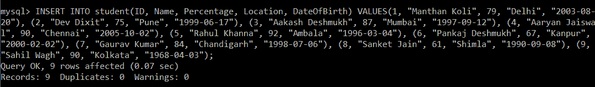
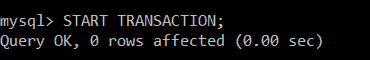
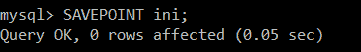
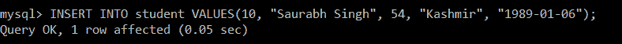
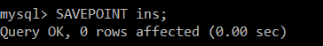
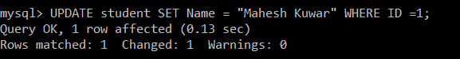
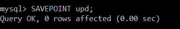
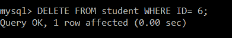
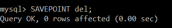
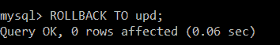

# SQL 中的保存点

> 原文：<https://www.javatpoint.com/savepoint-in-sql>

*   保存点是 SQL 中的一个命令，与回滚命令一起使用。
*   它是事务控制语言中的一个命令，用于在表中标记事务。
*   假设你正在做一张很长的桌子，你只想回到桌子的某个位置；这可以使用保存点来实现。
*   如果您在表中进行了一个事务，您可以将该事务标记为某个名称，稍后，如果您想回滚到该点，您可以通过使用该事务的名称轻松完成。
*   当我们只想回滚表的一小部分而不是整个表时，保存点很有帮助。简单来说，我们可以说保存点是 SQL 中的一个书签。

让我们看看实际的例子来更清楚地理解这个概念。我们将使用 MySQL 数据库来编写所有的查询。

要在数据库中创建表，首先，我们需要选择要在其中创建表的数据库。

```sql

mysql> USE dbs;

```

然后，我们将编写一个查询，在选定的数据库“dbs”中创建一个名为 student 的表。

```sql

mysql> CREATE TABLE student(ID INT, Name VARCHAR(20), Percentage INT, Location VARCHAR(20), DateOfBirth DATE);

```

现在，我们将编写一个查询，在学生表中插入多条记录:

```sql

mysql> INSERT INTO student(ID, Name, Percentage, Location, DateOfBirth) VALUES(1, "Manthan Koli", 79, "Delhi", "2003-08-20"), (2, "Dev Dixit", 75, "Pune", "1999-06-17"), (3, "Aakash Deshmukh", 87, "Mumbai", "1997-09-12"), (4, "Aaryan Jaiswal", 90, "Chennai", "2005-10-02"), (5, "Rahul Khanna", 92, "Ambala", "1996-03-04"), (6, "Pankaj Deshmukh", 67, "Kanpur", "2000-02-02"), (7, "Gaurav Kumar", 84, "Chandigarh", "1998-07-06"), (8, "Sanket Jain", 61, "Shimla", "1990-09-08"), (9, "Sahil Wagh", 90, "Kolkata", "1968-04-03"); 

```



为了验证学生表中是否插入了多条记录，我们将执行 SELECT 查询。

```sql

mysql> SELECT *FROM student;

```

| 身份 | 名字 | 百分率 | 位置 | 出生日期 |
| one | 曼坦科利 | Seventy-nine | 德里 | 2003-08-20 |
| Two | Dev Dixit | Seventy-five | 浦那 | 1999-06-17 |
| three | Aakash Deshmukh | Eighty-seven | 孟买 | 1997-09-12 |
| four | 阿尔扬·杰史瓦尔 | Ninety | 金奈 | 2005-10-02 |
| five | 拉胡尔·康纳 | Ninety-two | 安芭拉 | 1996-03-04 |
| six | 潘卡·迪苏赫赫 | Sixty-seven | 坎普尔。原称 CAWNPORE | 2000-02-02 |
| seven | 高拉夫·库马尔 | Eighty-four | 昌迪加尔 | 1998-07-06 |
| eight | 圣耆那教 | Sixty-one | 西姆拉 | 1990-09-08 |
| nine | Sahil Wagh | Ninety | 加尔各答 | 1968-04-03 |

结果显示，所有十条记录都成功插入。

为了在 SQL 中使用 TCL 命令，我们首先需要通过使用 BEGIN / START TRANSACTION 命令来启动事务。

```sql

mysql> START TRANSACTION;

```



我们将使用保存点命令以及该保存点的一些特定名称来保存启动的事务。

```sql

mysql> SAVEPOINT ini;

```

这里，我们已经保存了名为“ini”的已启动事务。



然后，我们决定在现有的学生表中插入一个 ID 为 10 的新记录。

```sql

mysql> INSERT INTO student VALUES (10, "Saurabh Singh", 54, "Kashmir", "1989-01-06");

```



我们将执行 SELECT 查询来验证 ID 为 10 的新记录是否插入成功。

```sql

mysql> SELECT *FROM student;

```

| 身份 | 名字 | 百分率 | 位置 | 出生日期 |
| one | 曼坦科利 | Seventy-nine | 德里 | 2003-08-20 |
| Two | Dev Dixit | Seventy-five | 浦那 | 1999-06-17 |
| three | Aakash Deshmukh | Eighty-seven | 孟买 | 1997-09-12 |
| four | 阿尔扬·杰史瓦尔 | Ninety | 金奈 | 2005-10-02 |
| five | 拉胡尔·康纳 | Ninety-two | 安芭拉 | 1996-03-04 |
| six | 潘卡·迪苏赫赫 | Sixty-seven | 坎普尔。原称 CAWNPORE | 2000-02-02 |
| seven | 高拉夫·库马尔 | Eighty-four | 昌迪加尔 | 1998-07-06 |
| eight | 圣耆那教 | Sixty-one | 西姆拉 | 1990-09-08 |
| nine | Sahil Wagh | Ninety | 加尔各答 | 1968-04-03 |
| Ten | 索拉博·辛格 | Fifty-four | 克什米尔 | 1989-01-06 |

为了用这个新插入的记录保存事务，我们将创建一个新的保存点。

```sql

mysql> SAVEPOINT ins;

```



这里，新插入的记录表与名为“ins”的保存点一起保存。

要更新学生表中的记录，并将 ID 为 1 的记录的更新名称设置为“Mahesh Kuwar”，我们将执行以下查询:

```sql

mysql> UPDATE student SET Name = "Mahesh Kuwar" WHERE ID =1;

```



为了验证 ID 为 1 的记录名称字段是否成功更新，我们将再次执行 SELECT 查询。

```sql

mysql> SELECT *FROM student;

```

| 身份 | 名字 | 百分率 | 位置 | 出生日期 |
| one | 马什库马尔 | Seventy-nine | 德里 | 2003-08-20 |
| Two | Dev Dixit | Seventy-five | 浦那 | 1999-06-17 |
| three | Aakash Deshmukh | Eighty-seven | 孟买 | 1997-09-12 |
| four | 阿尔扬·杰史瓦尔 | Ninety | 金奈 | 2005-10-02 |
| five | 拉胡尔·康纳 | Ninety-two | 安芭拉 | 1996-03-04 |
| six | 潘卡·迪苏赫赫 | Sixty-seven | 坎普尔。原称 CAWNPORE | 2000-02-02 |
| seven | 高拉夫·库马尔 | Eighty-four | 昌迪加尔 | 1998-07-06 |
| eight | 圣耆那教 | Sixty-one | 西姆拉 | 1990-09-08 |
| nine | Sahil Wagh | Ninety | 加尔各答 | 1968-04-03 |
| Ten | 索拉博·辛格 | Fifty-four | 克什米尔 | 1989-01-06 |

为了用这个更新的记录保存事务，我们将创建一个新的保存点。

```sql

mysql> SAVEPOINT upd;

```



在这里，具有更新记录的表与名为“upd”的保存点一起保存。

要从 ID 为 6 的学生表中删除记录，我们将执行以下查询:

```sql

mysql> DELETE FROM student WHERE ID= 6;

```



我们将再次执行 SELECT 查询来验证 ID 为 6 的记录是否被成功删除。

```sql

mysql> SELECT *FROM student;

```

| 身份 | 名字 | 百分率 | 位置 | 出生日期 |
| one | 马什库马尔 | Seventy-nine | 德里 | 2003-08-20 |
| Two | Dev Dixit | Seventy-five | 浦那 | 1999-06-17 |
| three | Aakash Deshmukh | Eighty-seven | 孟买 | 1997-09-12 |
| four | 阿尔扬·杰史瓦尔 | Ninety | 金奈 | 2005-10-02 |
| five | 拉胡尔·康纳 | Ninety-two | 安芭拉 | 1996-03-04 |
| seven | 高拉夫·库马尔 | Eighty-four | 昌迪加尔 | 1998-07-06 |
| eight | 圣耆那教 | Sixty-one | 西姆拉 | 1990-09-08 |
| nine | Sahil Wagh | Ninety | 加尔各答 | 1968-04-03 |
| Ten | 索拉博·辛格 | Fifty-four | 克什米尔 | 1989-01-06 |

为了保存已删除记录的事务，我们将创建一个新的保存点。

```sql

mysql> SAVEPOINT del;

```



在这里，带有已删除记录的表与名为“del”的保存点一起保存。

后来，我们决定需要学生表中的记录，我们在上一步中已经删除了该记录。

因为在每个操作中，我们都创建了一个保存点。使用该保存点，我们可以跳转到事务的任何点。为此，我们将执行 ROLLBACK 命令以及要跳转到的保存点的名称。

```sql

mysql> ROLLBACK TO upd;

```



因为我们不希望从学生表中删除 ID 为 6 的记录，所以我们回滚到名为 upd 的保存点。

为了验证我们已经获得了在前面步骤中更新学生表后的准确表，我们将再次执行 SELECT 查询。

```sql

mysql> SELECT *FROM student;

```

| 身份 | 名字 | 百分率 | 位置 | 出生日期 |
| one | 马什库马尔 | Seventy-nine | 德里 | 2003-08-20 |
| Two | Dev Dixit | Seventy-five | 浦那 | 1999-06-17 |
| three | Aakash Deshmukh | Eighty-seven | 孟买 | 1997-09-12 |
| four | 阿尔扬·杰史瓦尔 | Ninety | 金奈 | 2005-10-02 |
| five | 拉胡尔·康纳 | Ninety-two | 安芭拉 | 1996-03-04 |
| six | 潘卡·迪苏赫赫 | Sixty-seven | 坎普尔。原称 CAWNPORE | 2000-02-02 |
| seven | 高拉夫·库马尔 | Eighty-four | 昌迪加尔 | 1998-07-06 |
| eight | 圣耆那教 | Sixty-one | 西姆拉 | 1990-09-08 |
| nine | Sahil Wagh | Ninety | 加尔各答 | 1968-04-03 |
| Ten | 索拉博·辛格 | Fifty-four | 克什米尔 | 1989-01-06 |

上面的结果显示我们已经成功回滚到名为“upd”的保存点。

* * *