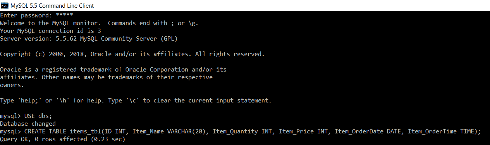
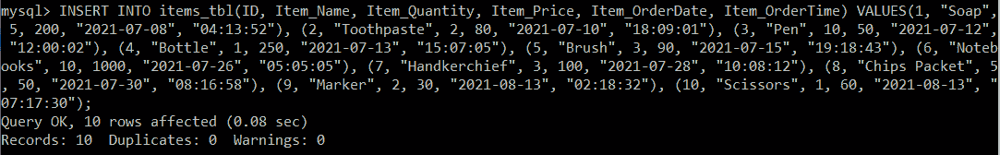

# SQL 中的时间数据类型

> 原文：<https://www.javatpoint.com/time-datatype-in-sql>

*   当您需要将时间存储在数据库的 SQL 表中时，SQL 中有许多场景。
*   要在 SQL 表中存储时间，第一步应该是在表中创建一个能够存储时间的列。
*   如果希望时间存储在表的列中，则需要创建一个时间数据类型的列。
*   默认情况下，时间数据类型以“时:分:秒”格式存储时间。
*   使用 SQL 中的 SELECT 语句，可以从 SQL 表的列中检索时间。
*   除了以存储时间的默认格式检索时间之外，在 SQL 中还有一个 TIME_FORMAT()函数，使用该函数可以以更易读的格式检索时间。
*   您可以按照存储在表中的默认格式检索时间，即“HH:MM:SS”，或者您也可以选择检索时间的特定部分，如小时、分钟和秒，方法是根据我们的要求选择适当的参数并将其传递给 TIME_FORMAT()函数。时间也可以以 12 小时和 24 小时的格式检索。
*   我们也可以打印上午/下午的时间。

让我们看几个实际的例子来更清楚地理解这个概念。我们将使用 MySQL 数据库来编写所有的查询。

要在数据库中创建一个表，我们将首先选择一个要在其中创建表的数据库。

```sql

mysql> USE dbs;

```

然后，我们将编写以下查询来创建一个表:

```sql

mysql> CREATE TABLE items_tbl(ID INT, Item_Name VARCHAR(20), Item_Quantity INT, Item_Price INT, Item_OrderDate DATE, Item_OrderTime TIME);

```



在上面的查询中，名为 ItemOrderTime 的列将存储时间，因为该列的数据类型被设置为“时间”。

现在，我们将编写一个查询，在 items_tbl 表中插入记录。

```sql

mysql> INSERT INTO items_tbl(ID, Item_Name, Item_Quantity, Item_Price, Item_OrderDate, Item_OrderTime) VALUES(1, "Soap", 5, 200, "2021-07-08", "04:13:52"), (2, "Toothpaste", 2, 80, "2021-07-10", "18:09:01"), (3, "Pen", 10, 50, "2021-07-12", "12:00:02"), (4, "Bottle", 1, 250, "2021-07-13", "15:07:05"), (5, "Brush", 3, 90, "2021-07-15", "19:18:43"), (6, "Notebooks", 10, 1000, "2021-07-26", "05:05:05"), (7, "Handkerchief", 3, 100, "2021-07-28", "10:08:12"), (8, "Chips Packet", 5, 50, "2021-07-30", "08:16:58"), (9, "Marker", 2, 30, "2021-08-13", "02:18:32"), (10, "Scissors", 1, 60, "2021-08-13", "07:17:30");

```



我们将执行 SELECT 查询，以验证所有记录都已成功插入 items_tbl 表中。

```sql

mysql> SELECT *FROM items_tbl;

```

| 身份 | 项目名称 | 项目 _ 数量 | 项目 _ 价格 | item _ orderdate | 项目 _ 订单时间 |
| **1** | 肥皂 | five | Two hundred | 2021-07-08 | 04:13:52 |
| **2** | 牙膏 | Two | Eighty | 2021-07-10 | 18:09:01 |
| **3** | 笔 | Ten | Fifty | 2021-07-12 | 12:00:02 |
| **4** | 瓶子 | one | Two hundred and fifty | 2021-07-13 | 15:07:05 |
| **5** | 刷 | three | Ninety | 2021-07-15 | 19:18:43 |
| **6** | 笔记本电脑 | Ten | One thousand | 2021-07-26 | 05:05:05 |
| **7** | 围巾 | three | One hundred | 2021-07-28 | 10:08:12 |
| **8** | 芯片包 | five | Fifty | 2021-07-30 | 08:16:58 |
| **9** | 标记 | Two | Thirty | 2021-08-13 | 02:18:32 |
| **10** | 剪刀 | one | Sixty | 2021-08-13 | 07:17:30 |

上述查询结果显示，时间是以存储时间的默认格式检索的，即“HH:MM:SS”。

**例 1:**

编写一个查询来检索 item_tbl 中的所有值，并以 12 小时的格式检索项目的订单时间，同时使用 AM/ PM 以更易读的格式检索时间值。

**查询:**

```sql

mysql> SELECT ID, Item_Name, Item_Quantity, Item_Price, Item_OrderDate, TIME_FORMAT (Item_OrderTime, "%r") AS Formatted_Time FROM items_tbl;

```

这里，时间格式()函数应用于带有参数“%r”的项目订单时间，以 12 小时格式打印时间，后跟上午/下午。

您将获得下表作为输出:

| 身份 | 项目名称 | 项目 _ 数量 | 项目 _ 价格 | item _ orderdate | 项目 _ 订单时间 |
| **1** | 肥皂 | five | Two hundred | 2021-07-08 | 凌晨 04:13:52 |
| **2** | 牙膏 | Two | Eighty | 2021-07-10 | 下午 06:09:01 |
| **3** | 笔 | Ten | Fifty | 2021-07-12 | 中午 12:00:02 |
| **4** | 瓶子 | one | Two hundred and fifty | 2021-07-13 | 下午 03:07:05 |
| **5** | 刷 | three | Ninety | 2021-07-15 | 下午 07:18:43 |
| **6** | 笔记本电脑 | Ten | One thousand | 2021-07-26 | 凌晨 05:05:05 |
| **7** | 围巾 | three | One hundred | 2021-07-28 | 上午 10:08:12 |
| **8** | 芯片包 | five | Fifty | 2021-07-30 | 上午 08:16:58 |
| **9** | 标记 | Two | Thirty | 2021-08-13 | 凌晨 02:18:32 |
| **10** | 剪刀 | one | Sixty | 2021-08-13 | 上午 07:17:30 |

**例 2:**

编写一个查询来检索 item_tbl 中的所有值，并以 12 小时的格式检索项目的订单时间，同时使用 AM/ PM 以更易读的格式检索时间值。

**查询:**

```sql

mysql> SELECT ID, Item_Name, Item_Quantity, Item_Price, Item_OrderDate, TIME_FORMAT (Item_OrderTime, "%T %p") AS Formatted_Time FROM items_tbl;

```

这里，时间格式()函数应用于参数为“%T %p”的项目订单时间。“%T”将以 24 小时格式打印时间，而“%p”会将上午/下午添加到 24 小时格式的时间中。

您将获得下表作为输出:

| 身份 | 项目名称 | 项目 _ 数量 | 项目 _ 价格 | item _ orderdate | 项目 _ 订单时间 |
| **1** | 肥皂 | five | Two hundred | 2021-07-08 | 凌晨 04:13:52 |
| **2** | 牙膏 | Two | Eighty | 2021-07-10 | 下午 18:09:01 |
| **3** | 笔 | Ten | Fifty | 2021-07-12 | 中午 12:00:02 |
| **4** | 瓶子 | one | Two hundred and fifty | 2021-07-13 | 下午 15:07:05 |
| **5** | 刷 | three | Ninety | 2021-07-15 | 晚上 19:18:43 |
| **6** | 笔记本电脑 | Ten | One thousand | 2021-07-26 | 凌晨 05:05:05 |
| **7** | 围巾 | three | One hundred | 2021-07-28 | 上午 10:08:12 |
| **8** | 芯片包 | five | Fifty | 2021-07-30 | 上午 08:16:58 |
| **9** | 标记 | Two | Thirty | 2021-08-13 | 凌晨 02:18:32 |
| **10** | 剪刀 | one | Sixty | 2021-08-13 | 上午 07:17:30 |

**例 3:**

编写一个查询，以 24 小时格式从 item_tbl 中检索所有值，并仅从整个订单时间中检索项目的订单小时数。

**查询:**

```sql

mysql> SELECT ID, Item_Name, Item_Quantity, Item_Price, Item_OrderDate, TIME_FORMAT (Item_OrderTime, "%H") AS Item_OrderHour FROM items_tbl;

```

在这里，时间 _ 格式()函数应用于带有参数“%H”的项目 _ 订单时间，以专门打印订购项目的时间。大写字母 H 表示小时将以 24 小时格式打印。

您将获得下表作为输出:

| 身份 | 项目名称 | 项目 _ 数量 | 项目 _ 价格 | item _ orderdate | Item_OrderHour(料号 _ 订单时数) |
| **1** | 肥皂 | five | Two hundred | 2021-07-08 | 04 |
| **2** | 牙膏 | Two | Eighty | 2021-07-10 | Eighteen |
| **3** | 笔 | Ten | Fifty | 2021-07-12 | Twelve |
| **4** | 瓶子 | one | Two hundred and fifty | 2021-07-13 | Fifteen |
| **5** | 刷 | three | Ninety | 2021-07-15 | Nineteen |
| **6** | 笔记本电脑 | Ten | One thousand | 2021-07-26 | 05 |
| **7** | 围巾 | three | One hundred | 2021-07-28 | Ten |
| **8** | 芯片包 | five | Fifty | 2021-07-30 | 08 |
| **9** | 标记 | Two | Thirty | 2021-08-13 | 02 |
| **10** | 剪刀 | one | Sixty | 2021-08-13 | 07 |

**例 4:**

编写一个查询，以 12 小时格式从 item_tbl 中检索所有值，并仅从整个订单时间中检索项目的订单小时数。

**查询:**

```sql

mysql> SELECT ID, Item_Name, Item_Quantity, Item_Price, Item_OrderDate, TIME_FORMAT (Item_OrderTime, "%h") AS Item_OrderHour FROM items_tbl;

```

这里，时间格式()函数应用于带有参数“%h”的物料订购时间，以专门打印物料订购的时间。小“h”表示小时将以 12 小时格式打印。

您将获得下表作为输出:

| 身份 | 项目名称 | 项目 _ 数量 | 项目 _ 价格 | item _ orderdate | Item_OrderHour(料号 _ 订单时数) |
| one | 肥皂 | five | Two hundred | 2021-07-08 | 04 |
| Two | 牙膏 | Two | Eighty | 2021-07-10 | six |
| three | 笔 | Ten | Fifty | 2021-07-12 | Twelve |
| four | 瓶子 | one | Two hundred and fifty | 2021-07-13 | 03 |
| five | 刷 | three | Ninety | 2021-07-15 | 07 |
| six | 笔记本电脑 | Ten | One thousand | 2021-07-26 | 05 |
| seven | 围巾 | three | One hundred | 2021-07-28 | Ten |
| eight | 芯片包 | five | Fifty | 2021-07-30 | 08 |
| nine | 标记 | Two | Thirty | 2021-08-13 | 02 |
| Ten | 剪刀 | one | Sixty | 2021-08-13 | 07 |

**例 5:**

编写一个查询来检索 item_tbl 中的所有值，并且只检索整个订单时间中订购某个项目的分钟数。

**查询:**

```sql

mysql> SELECT ID, Item_Name, Item_Quantity, Item_Price, Item_OrderDate, TIME_FORMAT (Item_OrderTime, "%i") AS Item_OrderMinute FROM items_tbl;

```

在这里，TIME_FORMAT()函数应用于 Item_OrderTime，参数为“%i”，专门打印订购项目的分钟数。小“I”表示将打印整个“项目订单时间”的分钟数。

您将获得下表作为输出:

| 身份 | 项目名称 | 项目 _ 数量 | 项目 _ 价格 | item _ orderdate | 项目 _ 订单分钟 |
| one | 肥皂 | five | Two hundred | 2021-07-08 | Thirteen |
| Two | 牙膏 | Two | Eighty | 2021-07-10 | 09 |
| three | 笔 | Ten | Fifty | 2021-07-12 | 00 |
| four | 瓶子 | one | Two hundred and fifty | 2021-07-13 | 07 |
| five | 刷 | three | Ninety | 2021-07-15 | Eighteen |
| six | 笔记本电脑 | Ten | One thousand | 2021-07-26 | 05 |
| seven | 围巾 | three | One hundred | 2021-07-28 | 08 |
| eight | 芯片包 | five | Fifty | 2021-07-30 | Sixteen |
| nine | 标记 | Two | Thirty | 2021-08-13 | Eighteen |
| Ten | 剪刀 | one | Sixty | 2021-08-13 | Seventeen |

**例 6:**

编写一个查询来检索 item_tbl 中的所有值，并只检索整个订单时间中某个项目被订购的秒数。

```sql

mysql> SELECT ID, Item_Name, Item_Quantity, Item_Price, Item_OrderDate, TIME_FORMAT (Item_OrderTime, "%S") AS Item_OrderSeconds FROM items_tbl;

```

在这里，时间格式()函数应用于带有参数“%S”的项目订购时间，以专门打印订购项目的秒数。大写字母“S”表示将打印整个“项目订单时间”的分钟数。

您将获得下表作为输出:

| 身份 | 项目名称 | 项目 _ 数量 | 项目 _ 价格 | item _ orderdate | 项目 _ 订单 _ 秒 |
| one | 肥皂 | five | Two hundred | 2021-07-08 | fifty-two |
| Two | 牙膏 | Two | Eighty | 2021-07-10 | 01 |
| three | 笔 | Ten | Fifty | 2021-07-12 | 02 |
| four | 瓶子 | one | Two hundred and fifty | 2021-07-13 | 05 |
| five | 刷 | three | Ninety | 2021-07-15 | Forty-three |
| six | 笔记本电脑 | Ten | One thousand | 2021-07-26 | 05 |
| seven | 围巾 | three | One hundred | 2021-07-28 | Twelve |
| eight | 芯片包 | five | Fifty | 2021-07-30 | Fifty-eight |
| nine | 标记 | Two | Thirty | 2021-08-13 | Thirty-two |
| Ten | 剪刀 | one | Sixty | 2021-08-13 | Twenty |

#### 注意:在上面的查询中使用 Small 也将给出相同的输出。

* * *