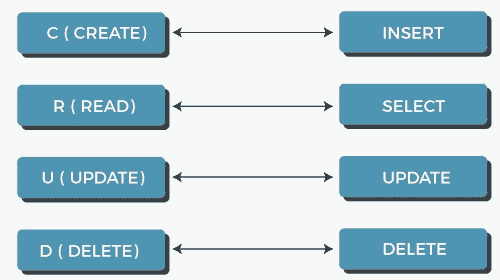
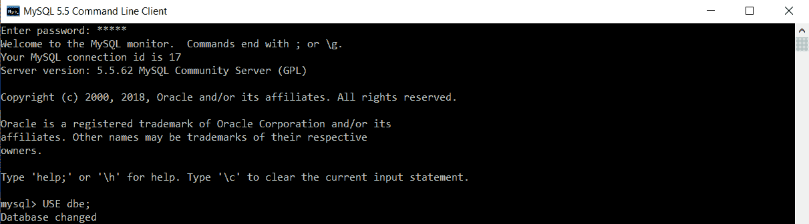
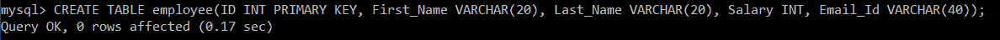
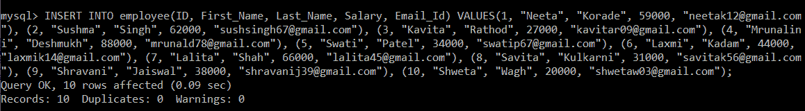
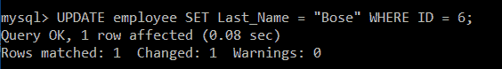
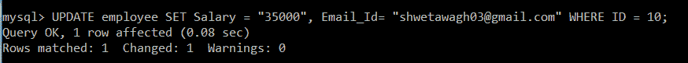
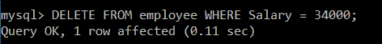
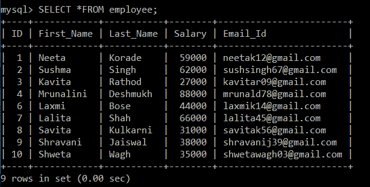
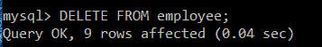
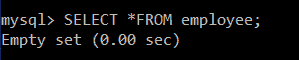

# SQL 中的 CRUD 操作

> 原文：<https://www.javatpoint.com/crud-operations-in-sql>

众所周知，CRUD 操作是任何计算机编程语言或技术的基础。因此，在深入研究任何编程语言或技术之前，必须精通其 CRUD 操作。同样的规则也适用于数据库。

让我们从借助示例理解 SQL 中的 CRUD 操作开始。我们将使用 MySQL 数据库编写支持示例中的所有查询。



## 1.创建:

在 CRUD 操作中，“C”是 **create、**的首字母缩略词，*的意思是向 SQL 表中添加或插入数据。*因此，首先我们将使用 create 命令创建一个表，然后我们将使用 INSERT INTO 命令在创建的表中插入行。

**创建表的语法:**

```

CREATE TABLE Table_Name (ColumnName1 Datatype, ColumnName2 Datatype,..., ColumnNameN Datatype);

```

哪里，

*   表名是我们要分配给表的名称。
*   列名是我们想要存储表数据的属性。
*   数据类型被分配给每一列。数据类型决定将存储在相应列中的数据类型。

**在表中插入数据的语法:**

```

INSERT INTO Table_Name (ColumnName1,...., ColumnNameN) VALUES (Value 1,....,Value N),....., (Value 1,....,Value N);

```

在用 SQL 创建表之前，我们需要创建一个数据库或选择一个现有的数据库。由于我们已经有了一个数据库，我们将使用 USE 命令选择该数据库。

```

mysql> USE dbe;

```



现在，我们将编写一个查询，在名为 **dbe 的数据库中创建一个名为 **employee** 的表。**

```

mysql> CREATE TABLE employee(ID INT PRIMARY KEY, First_Name VARCHAR(20), Last_Name VARCHAR(20), Salary INT, Email_Id VARCHAR(40));

```



为了确保按照我们在表创建期间分配的列名、数据类型和大小创建表，我们将执行以下查询:

```

mysql> DESC employee;

```

您将获得以下输出:

| 田 | 类型 | 空 | 钥匙 | 默认 | 额外的 |
| 身份 | int(11) | 不 | 优先（priority 的缩写） | 空 |  |
| 名字 | varchar(20) | 是 |  | 空 |  |
| 姓氏 | varchar(20) | 是 |  | 空 |  |
| 薪水 | int(11) | 是 |  | 空 |  |
| 电子邮件 _Id | varchar(40) | 是 |  | 空 |  |

以上结果验证了该表是按照要求成功创建的。

我们将执行以下查询，在 employee 表中插入多条记录:

```

INSERT INTO employee(ID, First_Name, Last_Name, Salary, Email_Id) VALUES(1, "Neeta", "Korade", 59000, "neetak12@gmail.com"), (2, "Sushma", "Singh", 62000, "sushsingh67@gmail.com"), (3, "Kavita", "Rathod", 27000, "kavitar09@gmail.com"), (4, "Mrunalini", "Deshmukh", 88000, "mrunald78@gmail.com"), (5, "Swati", "Patel", 34000, "swatip67@gmail.com"), (6, "Laxmi", "Kadam", 44000, "laxmik14@gmail.com"), (7, "Lalita", "Shah", 66000, "lalita45@gmail.com"), (8, "Savita", "Kulkarni", 31000, "savitak56@gmail.com"), (9, "Shravani", "Jaiswal", 38000, "shravanij39@gmail.com"), (10, "Shweta", "Wagh", 20000, "shwetaw03@gmail.com");

```



## 2.阅读:

在 CRUD 操作中，“R”是 **read、**的首字母缩写，意思是 ***从 SQL 表中检索或获取数据。*** 所以，我们将使用 SELECT 命令从 SQL 表中获取插入的记录。我们可以在 SELECT 查询中使用星号(*)从表中检索所有记录。还有一个选项是通过在 SELECT 查询中使用 WHERE 子句只检索那些满足特定条件的记录。

**获取所有记录的语法:**

```

SELECT *FROM TableName;

```

**根据条件获取记录的语法:**

```

SELECT *FROM TableName WHERE CONDITION;

```

**例 1:**

编写一个查询来获取雇员表中存储的所有记录。

**查询:**

```

mysql> SELECT *FROM employee;

```

这里，星号用在 SELECT 查询中。这意味着将检索每条记录的所有列值。

执行上述查询后，您将获得以下输出:

| 身份 | 名字 | 姓氏 | 薪水 | 电子邮件 _Id |
| one | 尼塔 | 珂赛特 | Fifty-nine thousand | [【邮件保护】](/cdn-cgi/l/email-protection) |
| Two | 苏希玛 | 辛格 | Sixty-two thousand | [【邮件保护】](/cdn-cgi/l/email-protection) |
| three | 卡维亚 | 拉舍得 | Twenty-seven thousand | [【邮件保护】](/cdn-cgi/l/email-protection) |
| four | Mrunalini | 德斯蒙 | Eighty-eight thousand | [【邮件保护】](/cdn-cgi/l/email-protection) |
| five | 斯瓦蒂语 | 巴特尔 | Thirty-four thousand | [【邮件保护】](/cdn-cgi/l/email-protection) |
| six | 吉祥天女 | 卡达姆 | Forty-four thousand | [【邮件保护】](/cdn-cgi/l/email-protection) |
| seven | 洛丽塔 | 沙 | Sixty-six thousand | [【邮件保护】](/cdn-cgi/l/email-protection) |
| eight | 抽烟吗 | 库尔卡尼 | Thirty-one thousand | [【邮件保护】](/cdn-cgi/l/email-protection) |
| nine | Shravani | 杰史瓦 | Thirty-eight thousand | [【邮件保护】](/cdn-cgi/l/email-protection) |
| Ten | 嘘嘘嘘嘘嘘嘘嘘嘘嘘嘘嘘嘘嘘嘘嘘嘘嘘嘘嘘嘘嘘 | 哇哦 | Twenty thousand | [【邮件保护】](/cdn-cgi/l/email-protection) |

从员工表中成功检索到所有记录。

**例 2:**

编写一个查询，只从工资高于 35000 的员工表中获取那些记录。

**查询:**

```

mysql> SELECT *FROM employee WHERE Salary > 35000;

```

这里，星号用在 SELECT 查询中。这意味着将检索每条记录的所有列值。我们对薪资应用了 WHERE 子句，这意味着记录将根据薪资进行筛选。

您将获得如下输出:

| 身份 | 名字 | 姓氏 | 薪水 | 电子邮件 _Id |
| one | 尼塔 | 珂赛特 | Fifty-nine thousand | [【邮件保护】](/cdn-cgi/l/email-protection) |
| Two | 苏希玛 | 拉舍得 | Sixty-two thousand | [【邮件保护】](/cdn-cgi/l/email-protection) |
| four | Mrunalini | 德斯蒙 | Eighty-eight thousand | [【邮件保护】](/cdn-cgi/l/email-protection) |
| six | 吉祥天女 | 卡达姆 | Forty-four thousand | [【邮件保护】](/cdn-cgi/l/email-protection) |
| seven | 洛丽塔 | 沙 | Sixty-six thousand | [【邮件保护】](/cdn-cgi/l/email-protection) |
| nine | Shravani | 杰史瓦 | Thirty-eight thousand | [【邮件保护】](/cdn-cgi/l/email-protection) |

员工表中有 6 条记录工资在 35000 以上。

## 3.更新:

在 CRUD 操作中，“U”是**更新的首字母缩略词，*****表示对 SQL 表中的记录进行更新。*** 因此，我们将使用 UPDATE 命令对表中的数据进行更改。

**语法:**

```

UPDATE Table_Name SET ColumnName = Value WHERE CONDITION; 

```

**例 1:**

编写一个查询，将员工的姓氏更新为“Bose”，其员工 id 为 6。

**查询:**

```

mysql> UPDATE employee SET Last_Name = "Bose" WHERE ID = 6;

```



在 SELECT 查询中，我们使用 SET 关键字将员工的姓氏更新为“Bose”。我们只想为 id 为 6 的员工更新员工的姓氏，所以我们使用 WHERE 子句指定了这个条件。

为了确保成功更新员工 id 为 6 的员工姓氏，我们将执行 SELECT 查询。

```

mysql> SELECT *FROM employee;

```

| 身份 | 名字 | 姓氏 | 薪水 | 电子邮件 _Id |
| one | 尼塔 | 珂赛特 | Fifty-nine thousand | [【邮件保护】](/cdn-cgi/l/email-protection) |
| Two | 苏希玛 | 辛格 | Sixty-two thousand | [【邮件保护】](/cdn-cgi/l/email-protection) |
| three | 卡维亚 | 拉舍得 | Twenty-seven thousand | [【邮件保护】](/cdn-cgi/l/email-protection) |
| four | Mrunalini | 德斯蒙 | Eighty-eight thousand | [【邮件保护】](/cdn-cgi/l/email-protection) |
| five | 斯瓦蒂语 | 巴特尔 | Thirty-four thousand | [【邮件保护】](/cdn-cgi/l/email-protection) |
| six | 吉祥天女 | 玻色 | Forty-four thousand | [【邮件保护】](/cdn-cgi/l/email-protection) |
| seven | 洛丽塔 | 沙 | Sixty-six thousand | [【邮件保护】](/cdn-cgi/l/email-protection) |
| eight | 抽烟吗 | 库尔卡尼 | Thirty-one thousand | [【邮件保护】](/cdn-cgi/l/email-protection) |
| nine | Shravani | 杰史瓦 | Thirty-eight thousand | [【邮件保护】](/cdn-cgi/l/email-protection) |
| Ten | 嘘嘘嘘嘘嘘嘘嘘嘘嘘嘘嘘嘘嘘嘘嘘嘘嘘嘘嘘嘘嘘 | 哇哦 | Twenty thousand | [【邮件保护】](/cdn-cgi/l/email-protection) |

以上结果验证了员工 id 为 6 的姓氏现在已更改为“Bose”。

**例 2:**

写一个查询，将员工的工资和邮箱 id 分别更新为‘35000’和‘T0’【邮箱保护】’，员工 id 为 10。

**查询:**

```

mysql> UPDATE employee SET Salary = "35000", Email_Id= "shwetawagh03@gmail.com" WHERE ID = 10;

```



在 UPDATE 查询中，我们使用了 SET 关键字将员工的工资更新为“35000”，并将电子邮件 id 更新为“[【电子邮件保护】](/cdn-cgi/l/email-protection)”。我们只想为 id 为 10 的员工更新员工的工资和电子邮件 id，所以我们使用 WHERE 子句指定了这个条件。

为了确保成功更新员工 id 为 10 的员工的工资和电子邮件 id，我们将执行 SELECT 查询。

```

mysql> SELECT *FROM employee;

```

| 身份 | 名字 | 姓氏 | 薪水 | 电子邮件 _Id |
| one | 尼塔 | 珂赛特 | Fifty-nine thousand | [【邮件保护】](/cdn-cgi/l/email-protection) |
| Two | 苏希玛 | 辛格 | Sixty-two thousand | [【邮件保护】](/cdn-cgi/l/email-protection) |
| three | 卡维亚 | 拉舍得 | Twenty-seven thousand | [【邮件保护】](/cdn-cgi/l/email-protection) |
| four | Mrunalini | 德斯蒙 | Eighty-eight thousand | [【邮件保护】](/cdn-cgi/l/email-protection) |
| five | 斯瓦蒂语 | 巴特尔 | Thirty-four thousand | [【邮件保护】](/cdn-cgi/l/email-protection) |
| six | 吉祥天女 | 玻色 | Forty-four thousand | [【邮件保护】](/cdn-cgi/l/email-protection) |
| seven | 洛丽塔 | 沙 | Sixty-six thousand | [【邮件保护】](/cdn-cgi/l/email-protection) |
| eight | 抽烟吗 | 库尔卡尼 | Thirty-one thousand | [【邮件保护】](/cdn-cgi/l/email-protection) |
| nine | Shravani | 杰史瓦 | Thirty-eight thousand | [【邮件保护】](/cdn-cgi/l/email-protection) |
| Ten | 嘘嘘嘘嘘嘘嘘嘘嘘嘘嘘嘘嘘嘘嘘嘘嘘嘘嘘嘘嘘嘘 | 哇哦 | Thirty-five thousand | [【邮件保护】](/cdn-cgi/l/email-protection) |

上述结果验证了员工 id 为 10 的员工的工资和电子邮件 id 现在分别更改为“35000”和“[【电子邮件保护】](/cdn-cgi/l/email-protection)”。

## 4.删除:

在 CRUD 操作中，“D”是 **delete，**的首字母缩写，意思是 ***从 SQL 表中删除记录。*** 我们可以使用 delete 查询从 SQL 表中删除所有的行。还有一个选项是通过在 DELETE 查询中使用 WHERE 子句只删除满足特定条件的特定记录。

**删除所有记录的语法:**

```

DELETE FROM TableName;

```

**根据条件删除记录的语法:**

```

DELETE FROM TableName WHERE CONDITION;

```

**例 1:**

编写一个查询，从工资高于 34000 的员工表中删除员工记录。

**查询:**

```

mysql> DELETE FROM employee WHERE Salary = 34000;

```



在这里，我们对雇员表应用了 DELETE 查询。我们只想删除工资为 34000 的员工记录，所以我们使用 WHERE 子句指定了这个条件。

我们将执行 SELECT 查询，以确保薪资为 34000 的员工记录被成功删除。

```

mysql> SELECT *FROM employee;

```

| 身份 | 名字 | 姓氏 | 薪水 | 电子邮件 _Id |
| one | 尼塔 | 珂赛特 | Fifty-nine thousand | [【邮件保护】](/cdn-cgi/l/email-protection) |
| Two | 苏希玛 | 辛格 | Sixty-two thousand | [【邮件保护】](/cdn-cgi/l/email-protection) |
| three | 卡维亚 | 拉舍得 | Twenty-seven thousand | [【邮件保护】](/cdn-cgi/l/email-protection) |
| four | Mrunalini | 德斯蒙 | Eighty-eight thousand | [【邮件保护】](/cdn-cgi/l/email-protection) |
| six | 吉祥天女 | 玻色 | Forty-four thousand | [【邮件保护】](/cdn-cgi/l/email-protection) |
| seven | 洛丽塔 | 沙 | Sixty-six thousand | [【邮件保护】](/cdn-cgi/l/email-protection) |
| eight | 抽烟吗 | 库尔卡尼 | Thirty-one thousand | [【邮件保护】](/cdn-cgi/l/email-protection) |
| nine | Shravani | 杰史瓦 | Thirty-eight thousand | [【邮件保护】](/cdn-cgi/l/email-protection) |
| Ten | 嘘嘘嘘嘘嘘嘘嘘嘘嘘嘘嘘嘘嘘嘘嘘嘘嘘嘘嘘嘘嘘 | 哇哦 | Thirty-five thousand | [【邮件保护】](/cdn-cgi/l/email-protection) |

上述结果验证了工资为 34000 的员工不再存在于员工表中。

**例 2:**

编写一个查询来删除雇员表中的所有记录。

首先，让我们看看员工表，它是目前可用的。

```

mysql> SELECT *FROM employee;

```



为了从雇员表中删除所有记录，我们将对雇员表执行 DELETE 查询。

```

mysql> DELETE FROM employee;

```



我们将执行 SELECT 查询，以确保从员工表中成功删除所有记录。

```

mysql> SELECT *FROM employee;

```



上面的结果验证了雇员表现在不包含任何记录。

* * *