# SQL 命令的类型

> 原文：<https://www.javatpoint.com/types-of-sql-commands>

SQL 是一种结构化查询语言，用于处理结构化数据。结构化数据是通常以关系或表的形式存储的数据。

每当我们将数据存储在表或关系中时，我们都需要 SQL 命令。此外，还需要这些命令来检索存储在表中的数据。

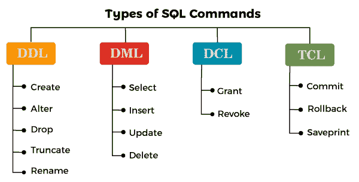

让我们借助实际例子来更深入地探讨 SQL 命令的分类。我们将使用 MySQL 数据库来编写所有的查询。

## (A) DDL

*   DDL 代表**数据定义语言**。DDL 命令处理模式，即存储数据的表。
*   表的创建、删除和修改等所有结构性的改变都可以通过 SQL 中的 DDL 命令来实现。
*   DDL 涵盖的命令有:
    1.  **创建**
    2.  年龄
    3.  **下降**
    4.  **截断**
    5.  **重命名**

让我们更详细地看看 DDL 类别中的每个命令。

### 1.创建:

在 SQL 中，每当我们希望*在数据库*中创建新的数据库或表时，我们使用 **CREATE** 命令。

**创建新数据库的语法:**

```
CREATE DATABASE DatabaseName;
```

**创建表格的语法:**

```
CREATE TABLE TableName (ColumnName1 datatype, ColumnName2 datatype,….., ColumnName3 datatype);
```

**例 1:**

编写一个查询来创建一个数据库，并给出数据库的名称作为学校。

**查询:**

```
mysql> CREATE DATABASE SCHOOL;
```

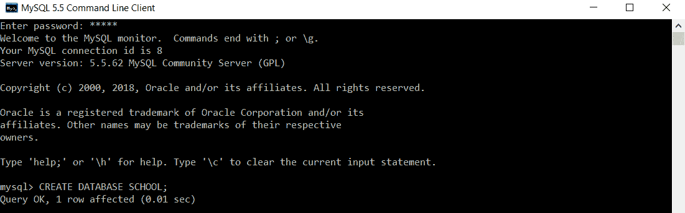

在这里，我们执行了一个 CREATE DATABASE 查询，后面跟着数据库名称“SCHOOL”。

我们将执行以下命令来验证数据库“SCHOOL”是否已创建:

```
mysql> SHOW DATABASES;
```

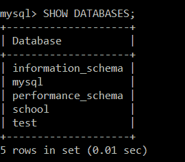

上述命令的结果验证了“学校”数据库已成功创建。

**例 2:**

编写一个查询，在数据库“SCHOOL”中创建一个表，并将该表的名称命名为 t_school。

要在“学校”数据库中创建表“t_school”，我们必须选择“学校”数据库。

为了选择 MySQL 中的数据库，我们将执行以下查询:

```
mysql> USE SCHOOL;
```

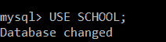

我们已经执行了“ **USE** 命令”，后跟数据库名称，即“SCHOOL”。

现在，在执行完这个查询之后，我们将执行以下查询:

```
mysql> CREATE TABLE t_school(ID INT PRIMARY KEY, School_Name VARCHAR(40), Number_Of_Students INT, Number_Of_Teachers INT, Number_Of_Classrooms INT, EmailID VARCHAR(40));
```

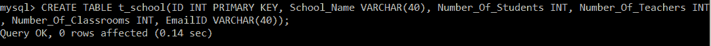

在这里，我们执行了一个 CREATE TABLE 查询，后跟表名“t_school”。

我们将执行以下命令来验证表“t_school”是否已创建:

```
mysql> SHOW TABLES;
```

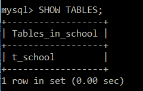

上述命令结果验证了在“学校”数据库中成功创建了“t_school”表。

### 2.改变

在 SQL 中，每当我们希望改变表结构时，我们都会使用 alter 命令。使用 *alter 命令，我们可以对表进行结构性的更改，例如**添加一个新列，从表中移除或删除一个现有列，更改一个现有列的数据类型，以及重命名一个现有列*** 。

在使用 ALTER 命令编写查询之前，让我们先看看语法。

**添加新列的 ALTER 命令语法:**

```
ALTER TABLE table_name ADD column_name datatype(size);
```

**删除现有列的 ALTER 命令语法:**

```
ALTER TABLE table_name DROP COLUMN column_name;
```

**重命名现有表的列的 ALTER 命令的语法:**

```
ALTER TABLE table_name RENAME COLUMN old_column_name TO new_column_name;
```

**更改现有列的数据类型的 ALTER 命令的语法:**

```
ALTER TABLE table_name MODIFY column_name datatype(size);
```

**例 1:**

编写一个查询，在数据类型 VARCHAR 的 t_school 表中添加一个新列 Board_of_Education。

在执行向“t_school”表添加新列的查询之前，我们将执行以下查询来查看表结构:

```
mysql> DESC t_school;
```

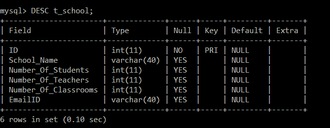

```
mysql> ALTER TABLE t_school ADD Board_of_Education VARCHAR(20);
```

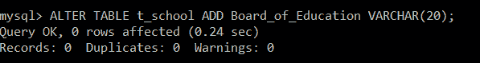

在这里，我们已经在表 t_school 上执行了“ALTER 命令”，后跟带有列“Board_of_Education”的 ADD 关键字，数据类型为 VARCHAR，大小为 20。这只是意味着一个名为“教育委员会”的新列将被添加到现有的“学校”表中，该列的数据类型为 VARCHAR，大小为 20。

现在，我们将再次在 t_school 表上应用 DESC 命令。

```
mysql> DESC t_school;
```


这将验证新列“教育委员会”是否已成功添加到 t_school 表中。

**例 2:**

编写一个查询，从 t_school 表中删除列 Board_of_Education。

在执行从“t_school”表中删除列的查询之前，我们将执行以下查询来查看表结构:

```
mysql> DESC t_school;
```

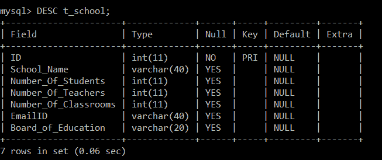

```
mysql> ALTER TABLE t_school DROP COLUMN Board_of_Education;
```

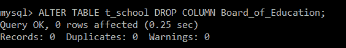

我们已经在 t_school 表中执行了“ALTER 命令”，在 DROP COLUMN 关键字之后是“教育委员会”列。这仅仅意味着名为“教育委员会”的现有列将从“学校”表中删除。

现在，我们将再次在 t_school 表上应用 DESC 命令。

```
mysql> DESC t_school;
```


这将验证“教育委员会”列是否已成功从 t_school 表中删除。

**例 3:**

使用 t_school 表中的 alter 命令编写一个查询，将列 Number_of_Students 重命名为‘Count _ Students’。

在执行从“t_school”表中重命名列的查询之前，我们将执行以下查询来查看表结构:

```
mysql> DESC t_school;
```


```
mysql> ALTER TABLE t_school RENAME COLUMN Number_of_Students TO Count_Students;
```

我们已经对表 t_school 执行了“ALTER 命令”，后跟 RENAME COLUMN 关键字。这里，Number_of_Students 是旧的列名，TO 关键字后指定的列名，即 Count_Students 是新的列名。这仅仅意味着名为“学生人数”的现有列将被“t_school”表中的“学生人数”替换。

现在，我们将再次在 t_school 表上应用 DESC 命令。

```
mysql> DESC t_school;
```

这将验证在 t_school 表中“学生人数”列是否已成功重命名为“学生人数”。

**例 4:**

编写一个查询来更改“学生人数”的数据类型，并将 t_school 表中的新数据类型设置为大小为“20”的“VARCHAR”。

在执行查询以修改“t_school”表中的列数据类型和大小之前，我们将执行以下查询来查看表结构:

```
mysql> DESC t_school;
```

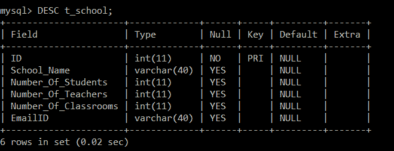

```
mysql> ALTER TABLE t_school MODIFY ID VARCHAR(20);
```

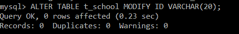

我们已经在 t_school 表上执行了“ALTER 命令”，后面跟了 MODIFY 关键字。这里，ID 是列名，VARCHAR 是 ID 列的新数据类型，后跟大小，即 20。

现在，我们将再次在 t_school 表上应用 DESC 命令。

```
mysql> DESC t_school;
```

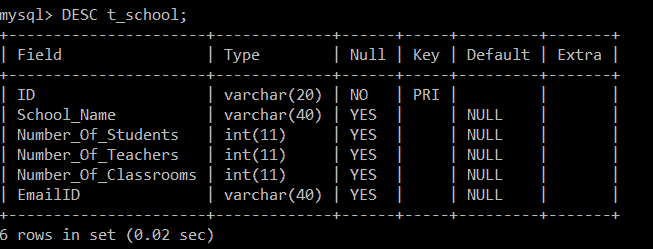

### 3.滴

DROP 命令是**用来从数据库中删除表的记录和表的结构。**

**语法:**

```
DROP TABLE table_name;
```

**示例:**

编写一个查询，从学校数据库中删除 t_school 表。

**查询:**

```
mysql> DROP TABLE t_school;
```


在这里，我们对表“t_school”执行了一个 DROP TABLE 命令。

我们将执行以下命令来验证表“t_school”是否存在。

```
mysql> SHOW TABLES;
```

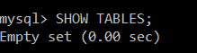

上述命令结果验证了“t_school”表已成功从“school”数据库中删除。

### 4.缩短

TRUNCATE 命令用于删除表的记录，*但表的结构在数据库中不受影响。*

**语法:**

```
TRUNCATE TABLE table_name;
```

**示例:**

编写一个查询，从“t_school”表中删除所有记录。

在执行从“t_school”表中删除记录的查询之前，我们将执行 SELECT 查询来查看表中存在的记录:

```
mysql> SELECT *FROM t_school;
```

| 身份 | 学校名称 | 学生人数 | 教师人数 | 教室数量 | 电子邮件编号 |
| one | 男孩镇公立学校 | One thousand | Eighty | Twelve | [【邮件保护】](/cdn-cgi/l/email-protection) |
| Two | 古鲁·戈文德·辛格公立学校 | eight hundred | Thirty-five | Fifteen | [【邮件保护】](/cdn-cgi/l/email-protection) |
| three | 德里公立学校 | One thousand two hundred | Thirty | Ten | [【邮件保护】](/cdn-cgi/l/email-protection) |
| four | 阿育王环球学校 | One thousand one hundred and ten | Forty | Forty | [【邮件保护】](/cdn-cgi/l/email-protection) |
| five | 卡利弗斯英语中等学校 | Nine thousand | Thirty-one | Fifty | [【邮件保护】](/cdn-cgi/l/email-protection) |
| six | 营地委员会高中 | Seven thousand and fifty | Forty-one | Sixty | [【邮件保护】](/cdn-cgi/l/email-protection) |
| seven | 波达尔国际学校 | Twelve thousand | One hundred and twenty | One hundred and twenty | [【邮件保护】](/cdn-cgi/l/email-protection) |
| eight | 巴恩斯学校 | Eighteen thousand | One hundred | One hundred | [【邮件保护】](/cdn-cgi/l/email-protection) |
| nine | D.科塔里·坎亚学校 | ten thousand | One hundred and twenty | One hundred and twenty-five | [【邮件保护】](/cdn-cgi/l/email-protection) |
| Ten | 兰花国际学校 | Twenty thousand | Two hundred | one hundred and eighty  | [【邮件保护】](/cdn-cgi/l/email-protection) |

```
mysql> TRUNCATE TABLE t_school;
```


在这里，我们已经对表 t_school 执行了“TRUNCATE”命令。这仅仅意味着“t_school”表中的所有记录都将被删除，保持数据库中的表结构不变。

现在，我们将再次对 t_school 表应用 SELECT 查询。

```
mysql> SELECT *FROM t_school;
```

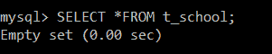

上面的结果显示“t_school”表中的所有记录都已成功删除。

### 5.重新命名

Rename COMMAND 用于为现有表赋予新名称。

**重命名表的语法:**

```
RENAME TABLE old_table_name TO new_table_name;
```

**示例:**

编写一个查询，将 t_school 表重命名为 tbl_school。

在执行重命名“t_school”表的查询之前，我们将执行 SHOW TABLES 命令。

```
mysql>SHOW TABLES;
```

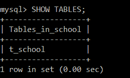

```
mysql> RENAME TABLE t_school TO tbl_school;
```

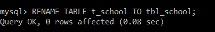

我们已经在表 t_school 上执行了“RENAME”命令，后跟带有新表名的“TO”关键字。这仅仅意味着“t_school”表现在将被重命名为 tbl_school。

现在，我们将再次执行 SHOW TABLES 命令。

```
mysql>SHOW TABLES;
```

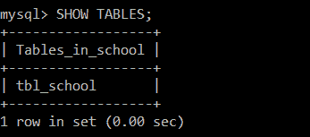

上面的结果显示表 t_school 不在列表中。相反，tbl_school 出现在列表中，这意味着该表现在已成功重命名为 tbl_school。

## (B) DML

*   DML 代表*数据操作语言*。使用 SQL 中的 DML 命令，我们可以对表中的数据进行更改。
*   每当我们希望操作数据或获取存在于 SQL 表中的数据时，我们都可以在 SQL 中使用 DML 命令。
*   SQL 中的 DML 命令会改变数据，如**插入新记录，从 SQL 表**中删除或更新现有记录。我们还可以根据自己的需求从 SQL 表中检索所有的数据。
*   DDL 涵盖的命令有:
    1.  **插入**
    2.  **选择**
    3.  **更新**
    4.  **删除**

让我们更详细地看看 DML 类别中的每个命令。

### 1.插入

INSERT 命令是 ***用来在表*** 中插入记录。我们可以同时为单个表插入一条以及多条记录。

**语法:**

```
INSERT INTO table_name VALUES (Column1_Value, Column2_Value, …., ColumnN_Value);
```

**示例:**

编写一个查询，在 t_school 表中插入 10 条记录。

**查询:**

```
mysql> INSERT INTO t_school(ID, School_Name, Number_of_Students, Number_of_Teachers, Number_of_Classrooms, EmailID) VALUES(1, "Boys Town Public School", 1000, 80, 12, "btps15@gmail.com"), (2, "Guru Govind Singh Public School", 800, 35, 15, "ggps25@gmail.com"), (3, "Delhi Public School", 1200, 30, 10, "dps101@gmail.com"), (4, "Ashoka Universal School", 1110, 40, 40, "aus17@gmail.com"), (5, "Calibers English Medium School", 9000, 31, 50, "cems@gmail.com"), (6, "Cantonment Board High School", 7050, 41, 60, "cbhs@gmail.com"), (7, "Podar International School", 12000, 120, 120, "podaris89@gmail.com"), (8, "Barnes School", 18000, 100, 100, "barnes99@gmail.com"), (9, "D.S Kothari Kanya School", 10000, 120, 125, "ksmh@gmail.com"), (10, "Orchid International School", 20000, 200, 180, "ois@gmail.com");
```

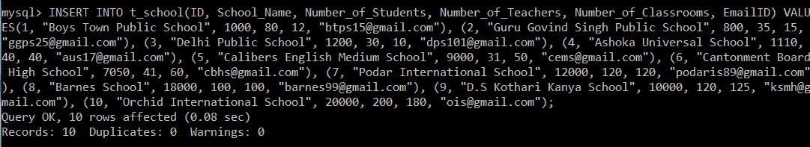

因为我们想在一个表中插入十条记录，所以我们编写了一个 insert 命令来一次插入多条记录，而不是写十次 INSERT 命令。

### 2.挑选

一个 ***选择命令用于从表*** 中检索记录。根据我们的要求，我们可以从表中检索所有的记录或一些特定的记录。每当我们想要从表中检索一些特定的记录时，我们必须在 SELECT 查询中指定 WHERE 子句。WHERE 子句将包含一个条件，任何与该条件匹配的记录都将被视为输出的一部分。

**检索所有记录的语法:**

```
SELECT *FROM table_name;
```

**检索某些特定记录的语法:**

```
SELECT *FROM table_name WHERE condition;
```

**例 1:**

编写一个查询，从 t_school 表的所有记录中检索所有列值。

**查询:**

```
mysql> SELECT *FROM t_school;
```

这里，我们在 t_school 表中执行了一个带有星号(*)的 SELECT 查询。这将从 t_school 表中检索所有记录的所有列值。

**输出:**

| 身份 | 学校名称 | 学生人数 | 教师人数 | 教室数量 | 电子邮件编号 |
| one | 男孩镇公立学校 | One thousand | Eighty | Twelve | [【邮件保护】](/cdn-cgi/l/email-protection) |
| Two | 古鲁·戈文德·辛格公立学校 | eight hundred | Thirty-five | Fifteen | [【邮件保护】](/cdn-cgi/l/email-protection) |
| three | 德里公立学校 | One thousand two hundred | Thirty | Ten | [【邮件保护】](/cdn-cgi/l/email-protection) |
| four | 阿育王环球学校 | One thousand one hundred and ten | Forty | Forty | [【邮件保护】](/cdn-cgi/l/email-protection) |
| five | 卡利弗斯英语中等学校 | Nine thousand | Thirty-one | Fifty | [【邮件保护】](/cdn-cgi/l/email-protection) |
| six | 营地委员会高中 | Seven thousand and fifty | Forty-one | Sixty | [【邮件保护】](/cdn-cgi/l/email-protection) |
| seven | 波达尔国际学校 | Twelve thousand | One hundred and twenty | One hundred and twenty | [【邮件保护】](/cdn-cgi/l/email-protection) |
| eight | 巴恩斯学校 | Eighteen thousand | One hundred | One hundred | [【邮件保护】](/cdn-cgi/l/email-protection) |
| nine | D.科塔里·坎亚学校 | ten thousand | One hundred and twenty | One hundred and twenty-five | [【邮件保护】](/cdn-cgi/l/email-protection) |
| Ten | 兰花国际学校 | Twenty thousand | Two hundred | one hundred and eighty  | [【邮件保护】](/cdn-cgi/l/email-protection) |

从 t_school 表中成功检索到所有记录。

**例 2:**

编写一个查询来检索只有超过 11 个教室的学校的所有列值。

**查询:**

```
mysql> SELECT *FROM t_school WHERE Number_Of_Classrooms > 11;
```

我们在 t_school 表中执行了一个带有星号(*)的 SELECT 查询，后跟一个 WHERE 子句条件。由于 WHERE 子句的条件，仅检索“教室数量”列中值大于 11 的记录。

**输出:**

| 身份 | 学校名称 | 学生人数 | 教师人数 | 教室数量 | 电子邮件编号 |
| one | 男孩镇公立学校 | One thousand | Eighty | Twelve | [【邮件保护】](/cdn-cgi/l/email-protection) |
| Two | 古鲁·戈文德·辛格公立学校 | eight hundred | Thirty-five | Fifteen | [【邮件保护】](/cdn-cgi/l/email-protection) |
| four | 阿育王环球学校 | One thousand one hundred and ten | Forty | Forty | [【邮件保护】](/cdn-cgi/l/email-protection) |
| five | 卡利弗斯英语中等学校 | Nine thousand | Thirty-one | Fifty | [【邮件保护】](/cdn-cgi/l/email-protection) |
| six | 营地委员会高中 | Seven thousand and fifty | Forty-one | Sixty | [【邮件保护】](/cdn-cgi/l/email-protection) |
| seven | 波达尔国际学校 | Twelve thousand | One hundred and twenty | One hundred and twenty | [【邮件保护】](/cdn-cgi/l/email-protection) |
| eight | 巴恩斯学校 | Eighteen thousand | One hundred | One hundred | [【邮件保护】](/cdn-cgi/l/email-protection) |
| nine | D.科塔里·坎亚学校 | ten thousand | One hundred and twenty | One hundred and twenty-five | [【邮件保护】](/cdn-cgi/l/email-protection) |
| Ten | 兰花国际学校 | Twenty thousand | Two hundred | one hundred and eighty  | [【邮件保护】](/cdn-cgi/l/email-protection) |

t_school 表中有九所学校，有超过 11 间教室。

### 3.更新

UPDATE 命令适用于表中的值。每当我们希望更新表中任何记录的值时，我们将使用 SQL 中的 update 命令。

**语法:**

```
UPDATE table_name SET column_name = value WHERE condition;
```

**示例:**

编写一个查询来更新 ID 为 9 的记录，并将教师数量和教室数量的更新值分别设置为 125 和 9。

**查询:**

```
mysql> UPDATE t_school SET Number_Of_Teachers = 125, Number_Of_Classrooms = 120 WHERE ID=9;
```

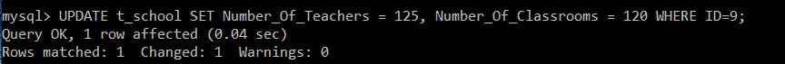

我们将执行 SELECT 查询，以验证 ID 为 9 的记录是否更新了教师和教室的数量。

```
mysql> SELECT *FROM t_school WHERE ID=9;
```

| 身份 | 学校名称 | 学生人数 | 教师人数 | 教室数量 | 电子邮件编号 |
| nine | D.科塔里·坎亚学校 | ten thousand | One hundred and twenty-five | One hundred and twenty | [【邮件保护】](/cdn-cgi/l/email-protection) |

### 4.删除

DELETE 命令用于从表中删除记录。

**语法:**

```
DELETE FROM table_name;
```

**示例:**

编写一个查询来删除 t_school 表中 ID 为 6 的记录。

**查询:**

```
mysql> DELETE FROM t_school WHERE ID = 6;
```

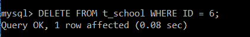

我们将执行 SELECT 查询来验证 ID 为 6 的记录是否被删除。

```
mysql> SELECT * FROM t_school;
```

| 身份 | 学校名称 | 学生人数 | 教师人数 | 教室数量 | 电子邮件编号 |
| one | 男孩镇公立学校 | One thousand | Eighty | Twelve | [【邮件保护】](/cdn-cgi/l/email-protection) |
| Two | 古鲁·戈文德·辛格公立学校 | eight hundred | Thirty-five | Fifteen | [【邮件保护】](/cdn-cgi/l/email-protection) |
| three | 德里公立学校 | One thousand two hundred | Thirty | Ten | [【邮件保护】](/cdn-cgi/l/email-protection) |
| four | 阿育王环球学校 | One thousand one hundred and ten | Forty | Forty | [【邮件保护】](/cdn-cgi/l/email-protection) |
| five | 卡利弗斯英语中等学校 | Nine thousand | Thirty-one | Fifty | [【邮件保护】](/cdn-cgi/l/email-protection) |
| seven | 波达尔国际学校 | Twelve thousand | One hundred and twenty | One hundred and twenty | [【邮件保护】](/cdn-cgi/l/email-protection) |
| eight | 巴恩斯学校 | Eighteen thousand | One hundred | One hundred | [【邮件保护】](/cdn-cgi/l/email-protection) |
| nine | D.科塔里·坎亚学校 | ten thousand | One hundred and twenty | One hundred and twenty-five | [【邮件保护】](/cdn-cgi/l/email-protection) |
| Ten | 兰花国际学校 | Twenty thousand | Two hundred | one hundred and eighty  | [【邮件保护】](/cdn-cgi/l/email-protection) |

结果显示，ID 为 6 的记录已从 t_school 表中成功删除。

## (三)信用证

*   DCL 代表**数据控制语言。**
*   每当我们想要控制对存在于 SQL 表中的数据的访问时，我们将在 SQL 中使用 DCL 命令。只有授权用户才能访问存储在表中的数据。
*   每个用户都有一些预定义的权限；因此，该特定用户可以访问数据。使用 SQL 中的 DCL 命令，我们可以授予用户对 SQL 数据库和表的权限，也可以撤销用户的权限。
*   DCL 涵盖的命令有:

**1。格兰特**

可以使用 GRANT 命令为用户分配数据库和表的访问权限。

**2。撤销**

可以使用 REVOKE 命令撤销已经分配给用户的所有访问权限。

## (四)TCL:

*   TCL 代表**交易控制语言**。TCL 命令通常用于事务中。
*   使用 SQL 中的 TCL 命令，我们可以将事务保存到数据库中，并将它们回滚到事务中的特定点。我们还可以使用 SAVEPOINT 命令保存事务的特定部分。
*   TCL 中涵盖的命令有:

**1。提交:**

为了保存在特定事务中执行的所有操作，我们需要在事务完成后立即执行提交命令。

**2。回滚**

使用 SQL 中的回滚命令，您可以回滚到事务的最后保存状态。

**3 .保存点**

使用保存点命令，您可以为事务的特定部分分配一个名称。

**示例:**

```
mysql> START TRANSACTION;
```

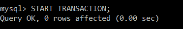

```
mysql>INSERT INTO t_school(ID, School_Name, Number_of_Students, Number_of_Teachers, Number_of_Classrooms, EmailID) VALUES(1, "Boys Town Public School", 1000, 80, 12, "btps15@gmail.com"), (2, "Guru Govind Singh Public School", 800, 35, 15, "ggps25@gmail.com"), (3, "Delhi Public School", 1200, 30, 10, "dps101@gmail.com"), (4, "Ashoka Universal School", 1110, 40, 40, "aus17@gmail.com"), (5, "Calibers English Medium School", 9000, 31, 50, "cems@gmail.com");
```

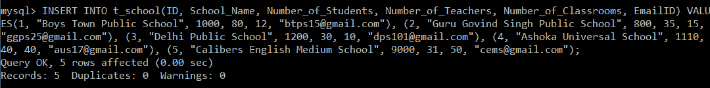

```
mysql> COMMIT;
```

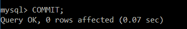

```
mysql> SET autocommit = 0;
```

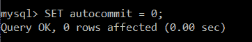

```
mysql> SAVEPOINT ins;
```

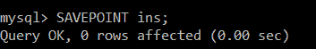

到目前为止，我们已经启动了一个事务，向其中插入了记录，提交了事务，并在插入之后创建了一个保存点 ins。

```
mysql> DELETE FROM t_school WHERE ID = 3;
```

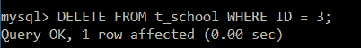

```
mysql> SAVEPOINT del;
```

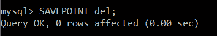

我们已经删除了一条记录，并在删除后创建了一个保存点 del，但是后来我们认为我们需要最近删除的记录。因此，我们将回滚到保存点 ins。

```
mysql> ROLLBACK TO ins;
```

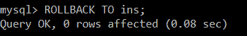

```
mysql> SELECT *FROM t_school;
```

| 身份 | 学校名称 | 学生人数 | 教师人数 | 教室数量 | 电子邮件编号 |
| one | 男孩镇公立学校 | One thousand | Eighty | Twelve | [【邮件保护】](/cdn-cgi/l/email-protection) |
| Two | 古鲁·戈文德·辛格公立学校 | eight hundred | Thirty-five | Fifteen | [【邮件保护】](/cdn-cgi/l/email-protection) |
| three | 德里公立学校 | One thousand two hundred | Thirty | Ten | [【邮件保护】](/cdn-cgi/l/email-protection) |
| four | 阿育王环球学校 | One thousand one hundred and ten | Forty | Forty | [【邮件保护】](/cdn-cgi/l/email-protection) |
| five | 卡利弗斯英语中等学校 | Nine thousand | Thirty-one | Fifty | [【邮件保护】](/cdn-cgi/l/email-protection) |

回滚到 ins 后，我们可以看到所有的记录都被检索到了(包括被删除的记录)。

* * *