# SQL 中的约束

> 原文：<https://www.javatpoint.com/constraints-in-sql>

SQL 中的约束意味着我们正在对数据库应用某些条件或限制。这进一步意味着，在将数据插入数据库之前，我们要检查一些条件。如果我们应用于数据库的条件对于要插入的数据成立，那么只有数据会被插入到数据库表中。

### SQL 中的约束可以分为两种类型:

1.  **列级约束:**
    列级约束用于对单个列应用约束。
2.  **表级约束:**
    表级约束用于对多列应用约束。

### 约束的一些现实例子如下:

1.  每个人都有唯一的电子邮件 id。这是因为在为任何用户创建电子邮件帐户时，提供服务的电子邮件(如 Gmail、Yahoo 或任何其他电子邮件提供服务)将始终检查用户自己想要的电子邮件 id 的可用性。如果其他用户已经获取了该用户想要的电子邮件 id，则该 id 不能分配给其他用户。这仅仅意味着没有两个用户可以在提供服务的同一封电子邮件上拥有相同的电子邮件 id。因此，这里的电子邮件 id 是对电子邮件提供服务的数据库的约束。
2.  每当我们为任何系统设置密码时，都有一些必须遵守的约束。这些限制可能包括以下内容:
    *   密码中必须有一个大写字符。
    *   密码长度必须至少为八个字符。
    *   密码必须包含至少一个特殊符号。

### SQL 中可用的约束有:

1.  不为空
2.  独一无二的
3.  主关键字
4.  外键
5.  支票
6.  系统默认值
7.  创建索引

现在，让我们借助示例来更详细地了解 SQL 中可用的不同约束。我们将使用 MySQL 数据库来编写所有的查询。

### 1.不为空

*   空表示空，即该值不可用。
*   每当表的列被声明为非空时，该列的值对于表的任何记录都不能为空。
*   应用了非空约束的列中必须存在一个值。

#### 注意:空不代表零。空意味着空列，甚至不是零。

**在表创建期间应用非空约束的语法:**

```sql

CREATE TABLE TableName (ColumnName1 datatype NOT NULL, ColumnName2 datatype,…., ColumnNameN datatype);

```

**示例:**

创建学生表，并在创建表时对表的一列应用非空约束。

```sql

CREATE TABLE student(StudentID INT NOT NULL, Student_FirstName VARCHAR(20), Student_LastName VARCHAR(20), Student_PhoneNumber VARCHAR(20), Student_Email_ID VARCHAR(40));

```

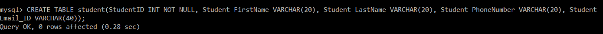

为了验证 not null 约束是否应用于表的列，以及学生表是否成功创建，我们将执行以下查询:

```sql

mysql> DESC student;

```

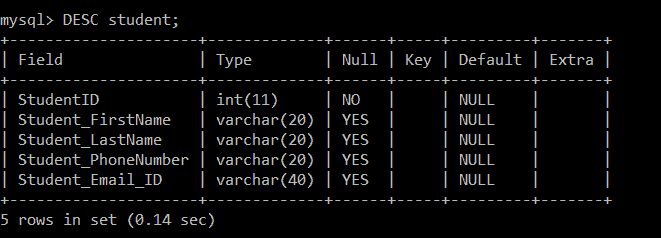

**对现有表的列应用非空约束的语法:**

```sql

ALTER TABLE TableName CHANGE Old_ColumnName New_ColumnName Datatype NOT NULL;

```

**示例:**

假设我们有一个现有的学生表，没有任何约束。后来，我们决定对表的一列应用一个非空约束。然后我们将执行以下查询:

```sql

mysql> ALTER TABLE student CHANGE StudentID StudentID INT NOT NULL;

```

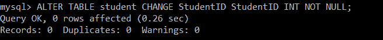

为了验证 not null 约束是否应用于学生表的列，我们将执行以下查询:

```sql

mysql> DESC student;

```

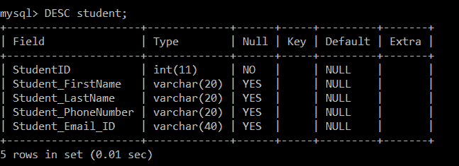

### 2.独一无二的

*   在应用了 UNIQUE 约束的列中不允许有重复值。
*   具有唯一约束的列将始终包含唯一值。
*   此约束可以应用于表中的一列或多列，这意味着一个表上可以存在多个唯一约束。
*   使用 UNIQUE 约束，您还可以修改已经创建的表。

**对单个列应用唯一约束的语法:**

```sql

CREATE TABLE TableName (ColumnName1 datatype UNIQUE, ColumnName2 datatype,…., ColumnNameN datatype);

```

**示例:**

创建学生表，并在创建表时对表的一列应用 UNIQUE 约束。

```sql

mysql> CREATE TABLE student(StudentID INT UNIQUE, Student_FirstName VARCHAR(20), Student_LastName VARCHAR(20), Student_PhoneNumber VARCHAR(20), Student_Email_ID VARCHAR(40));

```

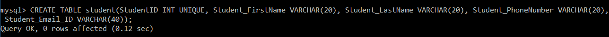

要验证唯一约束是否应用于表的列，以及学生表是否已成功创建，我们将执行以下查询:

```sql

mysql> DESC student;

```

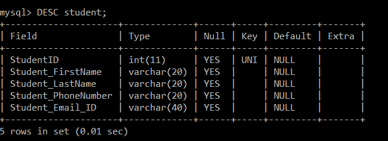

**对多列应用唯一约束的语法:**

```sql

CREATE TABLE TableName (ColumnName1 datatype, ColumnName2 datatype,…., ColumnNameN datatype, UNIQUE (ColumnName1, ColumnName 2));

```

**示例:**

创建学生表，并在创建表时对多个表的列应用 UNIQUE 约束。

```sql

mysql> CREATE TABLE student(StudentID INT, Student_FirstName VARCHAR(20), Student_LastName VARCHAR(20), Student_PhoneNumber VARCHAR(20), Student_Email_ID VARCHAR(40), UNIQUE(StudentID, Student_PhoneNumber));

```

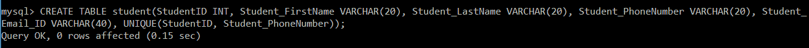

要验证唯一约束是否应用于多个表的列，以及学生表是否已成功创建，我们将执行以下查询:

```sql

mysql> DESC student;

```

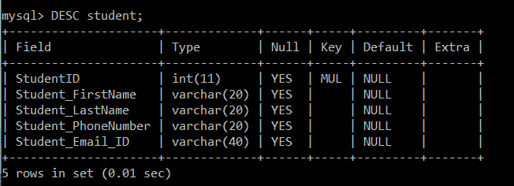

**对现有表的列应用唯一约束的语法:**

```sql

ALTER TABLE TableName ADD UNIQUE (ColumnName);

```

**示例:**

假设我们有一个现有的学生表，没有任何约束。后来，我们决定对表的一列应用 UNIQUE 约束。然后我们将执行以下查询:

```sql

mysql> ALTER TABLE student ADD UNIQUE (StudentID);

```

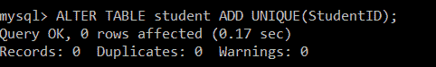

要验证唯一约束是否应用于表的列，以及学生表是否已成功创建，我们将执行以下查询:

```sql

mysql> DESC student;

```

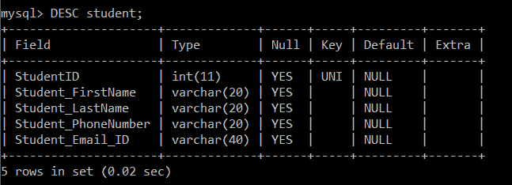

### 3.主关键字

*   主键约束是非空约束和唯一约束的组合。
*   非空约束和唯一约束一起形成主约束。
*   我们应用了主约束的列将始终包含唯一的值，并且不允许空值。

**创建表时主键约束的语法:**

```sql

CREATE TABLE TableName (ColumnName1 datatype PRIMARY KEY, ColumnName2 datatype,…., ColumnNameN datatype);

```

**示例:**

创建学生表，并在创建表时应用主键约束。

```sql

mysql> CREATE TABLE student(StudentID INT PRIMARY KEY, Student_FirstName VARCHAR(20), Student_LastName VARCHAR(20), Student_PhoneNumber VARCHAR(20), Student_Email_ID VARCHAR(40));

```

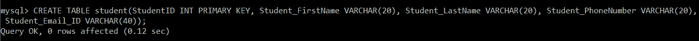

为了验证主键约束是否应用于表的列，以及学生表是否成功创建，我们将执行以下查询:

```sql

mysql> DESC student;

```

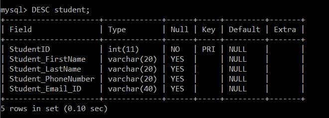

**对现有表的列应用主键约束的语法:**

```sql

ALTER TABLE TableName ADD PRIMARY KEY (ColumnName);

```

**示例:**

假设我们有一个现有的学生表，没有任何约束。后来，我们决定对表的列应用主键约束。然后我们将执行以下查询:

```sql

mysql> ALTER TABLE student ADD PRIMARY KEY (StudentID);

```

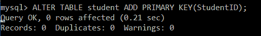

为了验证主键约束是否应用于学生表的列，我们将执行以下查询:

```sql

mysql> DESC student;

```

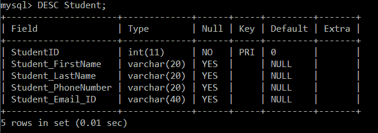

### 4.外键

*   外键用于参照完整性。
*   当我们有两个表，并且一个表从另一个表中获取引用时，也就是说，两个表中都存在相同的列，并且该列在一个表中充当主键。该特定列将作为另一个表中的外键。

**在表创建期间应用外键约束的语法:**

```sql

CREATE TABLE tablename(ColumnName1 Datatype(SIZE) PRIMARY KEY, ColumnNameN Datatype(SIZE), FOREIGN KEY( ColumnName ) REFERENCES PARENT_TABLE_NAME(Primary_Key_ColumnName));

```

**示例:**

创建员工表，并在创建表时应用外键约束。

要在任何表上创建外键，首先，我们需要在表上创建主键。

```sql

mysql> CREATE TABLE employee (Emp_ID INT NOT NULL PRIMARY KEY, Emp_Name VARCHAR (40), Emp_Salary VARCHAR (40));

```

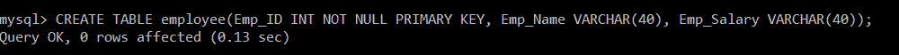

为了验证主键约束是否应用于 employee 表的列，我们将执行以下查询:

```sql

mysql> DESC employee;

```

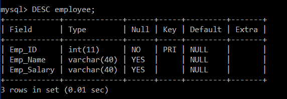

现在，我们将编写一个查询，在部门表上应用一个外键，引用雇员表的主键，即 Emp_ID。

```sql

mysql> CREATE TABLE department(Dept_ID INT NOT NULL PRIMARY KEY, Dept_Name VARCHAR(40), Emp_ID INT NOT NULL, FOREIGN KEY(Emp_ID) REFERENCES employee(Emp_ID));

```

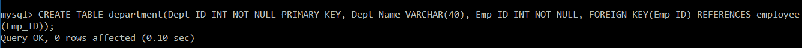

为了验证外键约束是否应用于 department 表的列，我们将执行以下查询:

```sql

mysql> DESC department;

```

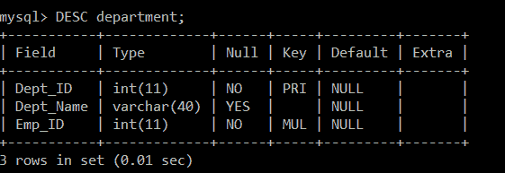

**应用外键约束的语法，约束名:**

```sql

CREATE TABLE tablename(ColumnName1 Datatype PRIMARY KEY, ColumnNameN Datatype(SIZE), CONSTRAINT ConstraintName FOREIGN KEY( ColumnName ) REFERENCES PARENT_TABLE_NAME(Primary_Key_ColumnName));

```

**示例:**

创建员工表，并在创建表时应用带有约束名称的外键约束。

要在任何表上创建外键，首先，我们需要在表上创建主键。

```sql

mysql> CREATE TABLE employee (Emp_ID INT NOT NULL PRIMARY KEY, Emp_Name VARCHAR (40), Emp_Salary VARCHAR (40));

```

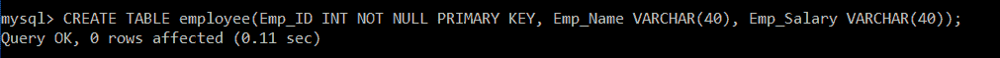

为了验证主键约束是否应用于学生表的列，我们将执行以下查询:

```sql

mysql> DESC employee;

```

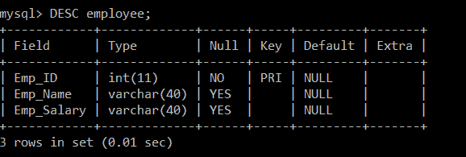

现在，我们将编写一个查询，在部门表中应用一个带有约束名称的外键，引用雇员表的主键，即 Emp_ID。

```sql

mysql> CREATE TABLE department(Dept_ID INT NOT NULL PRIMARY KEY, Dept_Name VARCHAR(40), Emp_ID INT NOT NULL, CONSTRAINT emp_id_fk FOREIGN KEY(Emp_ID) REFERENCES employee(Emp_ID));

```

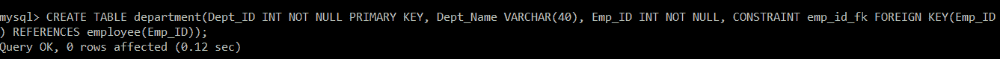

为了验证外键约束是否应用于 department 表的列，我们将执行以下查询:

```sql

mysql> DESC department;

```

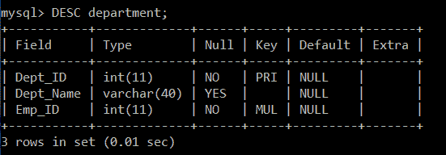

**对现有表的列应用外键约束的语法:**

```sql

ALTER TABLE Parent_TableName ADD FOREIGN KEY (ColumnName) REFERENCES Child_TableName (ColumnName);

```

**示例:**

假设我们有一个现有的表员工和部门。后来，我们决定对部门表的列应用外键约束。然后我们将执行以下查询:

```sql

mysql> DESC employee;

```

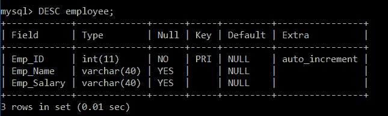

```sql

mysql> ALTER TABLE department ADD FOREIGN KEY (Emp_ID) REFERENCES employee (Emp_ID);

```

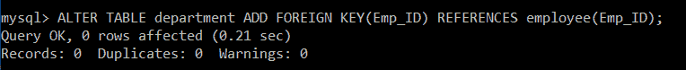

为了验证外键约束是否应用于 department 表的列，我们将执行以下查询:

```sql

mysql> DESC department;

```

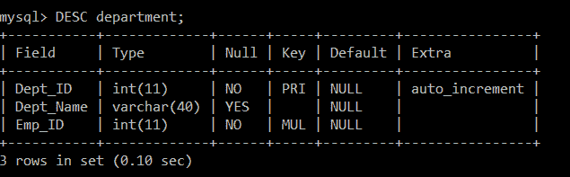

### 5.支票

*   每当对表的列应用检查约束，并且用户想要在其中插入值时，在将值插入该列之前，将首先检查该值的某些条件。
*   **例如:**如果我们在表中有一个年龄列，那么用户将插入他选择的任何值。用户甚至还会输入负值或任何其他无效值。但是，如果用户对年龄列应用了检查约束，并且条件年龄大于 18 岁。那么在这种情况下，即使用户试图插入无效值，例如零或任何其他小于 18 的值，年龄列也不会接受该值，并且由于对年龄列应用了检查约束，因此不允许用户插入该值。

**对单个列应用检查约束的语法:**

```sql

CREATE TABLE TableName (ColumnName1 datatype CHECK (ColumnName1 Condition), ColumnName2 datatype,…., ColumnNameN datatype);

```

**示例:**

创建学生表，并在创建表时应用 CHECK 约束来检查年龄是否小于或等于 15 岁。

```sql

mysql> CREATE TABLE student(StudentID INT, Student_FirstName VARCHAR(20), Student_LastName VARCHAR(20), Student_PhoneNumber VARCHAR(20), Student_Email_ID VARCHAR(40), Age INT CHECK( Age <= 15));

```

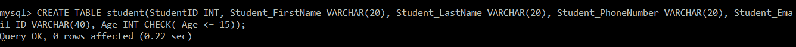

为了验证检查约束是否应用于学生表的列，我们将执行以下查询:

```sql

mysql> DESC student;

```

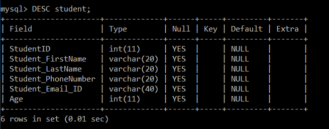

**对多列应用检查约束的语法:**

```sql

CREATE TABLE TableName (ColumnName1 datatype, ColumnName2 datatype CHECK (ColumnName1 Condition AND ColumnName2 Condition),…., ColumnNameN datatype);

```

**示例:**

创建学生表，并在创建表时应用 CHECK 约束来检查年龄是否小于或等于 15 岁以及百分比是否大于 85。

```sql

mysql> CREATE TABLE student(StudentID INT, Student_FirstName VARCHAR(20), Student_LastName VARCHAR(20), Student_PhoneNumber VARCHAR(20), Student_Email_ID VARCHAR(40), Age INT, Percentage INT, CHECK( Age <= 15 AND Percentage > 85));

```

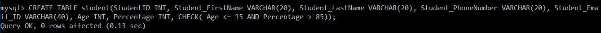

为了验证检查约束是否应用于年龄和百分比列，我们将执行以下查询:

```sql

mysql> DESC student;

```

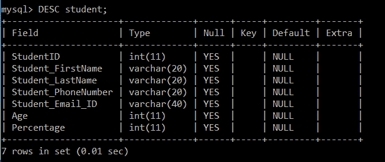

**对现有表的列应用检查约束的语法:**

```sql

ALTER TABLE TableName ADD CHECK (ColumnName Condition);

```

**示例:**

假设我们有一个现有的学生。后来，我们决定对学生表的列应用 CHECK 约束。然后我们将执行以下查询:

```sql

mysql> ALTER TABLE student ADD CHECK ( Age <=15 );

```

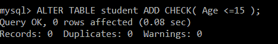

为了验证检查约束是否应用于学生表的列，我们将执行以下查询:

```sql

mysql> DESC student;

```

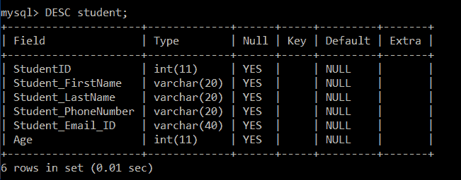

### 6.系统默认值

每当默认约束应用于表的列，并且用户没有指定要插入其中的值时，应用默认约束时指定的默认值将被插入到该特定列中。

**表创建期间应用默认约束的语法:**

```sql

CREATE TABLE TableName (ColumnName1 datatype DEFAULT Value, ColumnName2 datatype,…., ColumnNameN datatype);

```

**示例:**

创建学生表，并在创建表时应用默认约束。

```sql

mysql> CREATE TABLE student(StudentID INT, Student_FirstName VARCHAR(20), Student_LastName VARCHAR(20), Student_PhoneNumber VARCHAR(20), Student_Email_ID VARCHAR(40) DEFAULT "anuja.k8@gmail.com");

```

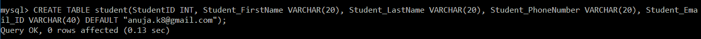

为了验证默认约束是否应用于学生表的列，我们将执行以下查询:

```sql

mysql> DESC student;

```

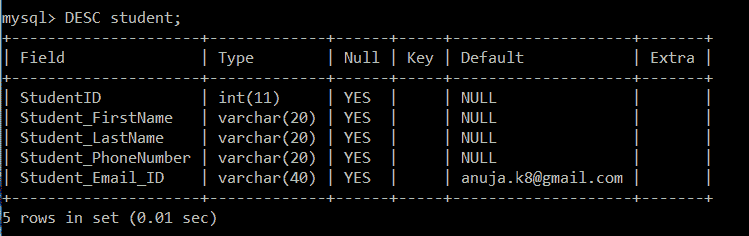

**对现有表的列应用默认约束的语法:**

```sql

ALTER TABLE TableName ALTER ColumnName SET DEFAULT Value;

```

**示例:**

假设我们有一个现有的学生。后来，我们决定对学生表的列应用 DEFAULT 约束。然后我们将执行以下查询:

```sql

mysql> ALTER TABLE student ALTER Student_Email_ID SET DEFAULT "anuja.k8@gmail.com";

```

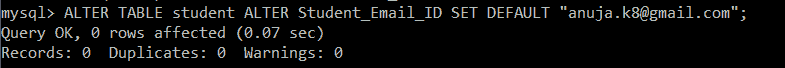

为了验证默认约束是否应用于学生表的列，我们将执行以下查询:

```sql

mysql> DESC student;

```

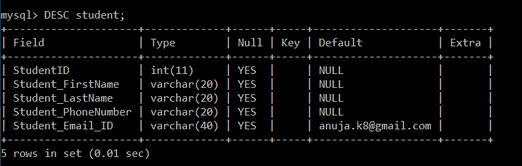

### 7.创建索引

CREATE INDEX 约束用于在表上创建索引。用户看不到索引，但索引有助于用户加快搜索速度或从数据库中检索数据。

**在单列上创建索引的语法:**

```sql

CREATE INDEX IndexName ON TableName (ColumnName 1);

```

**示例:**

在学生表中创建索引，并在创建表时应用默认约束。

```sql

mysql> CREATE INDEX idx_StudentID ON student (StudentID);

```

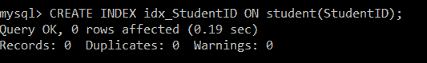

为了验证创建索引约束是否应用于学生表的列，我们将执行以下查询:

```sql

mysql> DESC student;

```

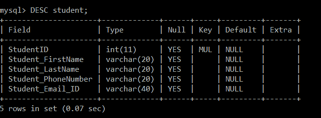

**在多列上创建索引的语法:**

```sql

CREATE INDEX IndexName ON TableName (ColumnName 1, ColumnName 2, ColumnName N);

```

**示例:**

```sql

mysql> CREATE INDEX idx_Student ON student (StudentID, Student_PhoneNumber);

```

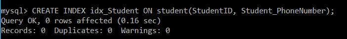

为了验证创建索引约束是否应用于学生表的列，我们将执行以下查询:

```sql

mysql> DESC student;

```

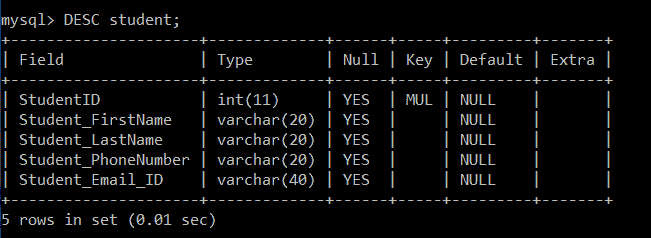

**在现有表上创建索引的语法:**

```sql

ALTER TABLE TableName ADD INDEX (ColumnName);

```

假设我们有一个现有的学生。后来，我们决定对学生表的列应用 DEFAULT 约束。然后我们将执行以下查询:

```sql

mysql> ALTER TABLE student ADD INDEX (StudentID);

```

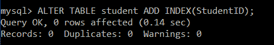

为了验证创建索引约束是否应用于学生表的列，我们将执行以下查询:

```sql

mysql> DESC student;

```

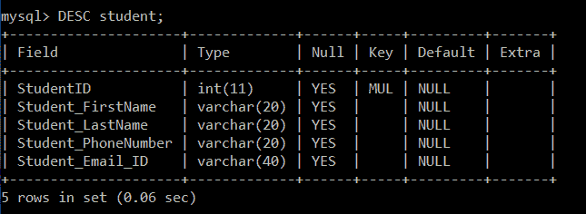

* * *