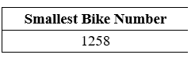
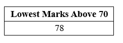

# SQL 选择最小值

> 原文：<https://www.javatpoint.com/sql-select-min>

最小值是 SQL 中的一个聚合函数，它从表中该列的多个值中返回最小值。

### SQL 最小()函数的语法

```

SELECT MIN(Column_Name) FROM Table_Name WHERE [Condition];

```

在这个语法中，我们还可以使用带有 WHERE 子句的 MIN 函数从过滤的记录中选择最小值。

### 最小函数的两个例子

**例 1:这个例子描述了如何在 SQL 中使用 MIN 函数。**

让我们创建一个简单的表，在上面运行 MIN 函数。

下面的 CREATE TABLE 语句用五个字段创建自行车详细信息表:

```

CREATE TABLE Bikes_Details
(
Bike_Number INT PRIMARY KEY,
Bike_Model INT,
Bike_Name VARCHAR (50),
Number_of_Bikes INT NOT NULL
Bike_Price INT NOT NULL
) ;

```

以下插入查询将汽车记录插入自行车详细信息表:

```

INSERT INTO Bikes_Details (Bike_Number, Bike_Model, Bike_Name, Number_of_Bikes, Bike_Price) 
VALUES (2578, 2018, KTM, 3, 1500000),
(9258, 2019, Apache, 2, 3000000), 
(8233, 2018, Pulsar, 6, 900000),
(8990, 2018, RX100, 7, 700000),
(9578, 2020, Splender+, 6, 8000000),
(1258, 2021, Bullet, 2, 1500000),
(2564, 2019, Passion, 4, 6000000),
(2155, 2020, Livo, 8, 1800000);

```

以下选择查询显示了**自行车 _ 详情**表的数据:

```

SELECT * FROM Bikes_Details;

```

| 自行车 _ 号码 | 自行车 _ 模型 | 自行车 _ 名称 | 自行车数量 | 自行车 _ 价格 |
| Two thousand five hundred and seventy-eight | Two thousand and eighteen | KTM | three | Nine hundred thousand |
| Nine thousand two hundred and fifty-eight | Two thousand and nineteen | 街头流氓 | Two | One million one hundred thousand |
| Eight thousand two hundred and thirty-three | Two thousand and eighteen | 脉冲星 | six | Nine hundred thousand |
| Eight thousand nine hundred and ninety | Two thousand and eighteen | RX100 | seven | Seven hundred thousand |
| Nine thousand five hundred and seventy-eight | Two thousand and twenty | Splender+ | six | Eight million |
| One thousand two hundred and fifty-eight | Two thousand and twenty-one | 吵死了 | Two | One million five hundred thousand |
| Two thousand five hundred and sixty-four | Two thousand and nineteen | 热情 | four | Six million |
| Two thousand one hundred and fifty-five | Two thousand and twenty | 利沃 | eight | One million eight hundred thousand |

以下查询显示了上述自行车详细信息表的自行车编号列中的最小值:

```

SELECT MIN(Bike_Number) As "Smallest Bike Number " FROM Bikes_Details;

```

**输出:**



**例 2:这个例子描述了如何在 WHERE 子句中使用 MIN 函数。**

以下查询使用 CREATE TABLE 语句创建了 **College_Student_Details** 表:

```

CREATE TABLE College_Student_Details
(
Student_ID INT NOT NULL, 
Student_Name varchar(100),
Student_Course varchar(50),
Student_Age INT, 
Student_Marks INT
); 

```

以下 SQL 查询使用 INSERT INTO 语句将学生的记录插入到上表中:

```

INSERT INTO College_Student_Details VALUES (101, Anuj, B.tech, 20, 88);
INSERT INTO College_Student_Details VALUES (102, Raman, MCA, 24, 98);
INSERT INTO College_Student_Details VALUES (104, Shyam, BBA, 19, 92);
INSERT INTO College_Student_Details VALUES (107, Vikash, B.tech, 20, 78);
INSERT INTO College_Student_Details VALUES (111, Monu, MBA, 21, 65);
INSERT INTO College_Student_Details VALUES (114, Jones, B.tech, 18, 93);
INSERT INTO College_Student_Details VALUES (121, Parul, BCA, 20, 97);
INSERT INTO College_Student_Details VALUES (123, Divya, B.tech, 21, 89);
INSERT INTO College_Student_Details VALUES (128, Hemant, MBA, 23, 90);
INSERT INTO College_Student_Details VALUES (130, Nidhi, BBA, 20, 88);
INSERT INTO College_Student_Details VALUES (132, Priya, MBA, 22, 99);
INSERT INTO College_Student_Details VALUES (138, Mohit, MCA, 21, 92);

```

让我们使用下面的 SELECT 语句来查看上表的记录:

```

SELECT * FROM College_Student_Details;

```

| 学生标识 | 学生名 | 学生 _ 课程 | 学生 _ 年龄 | 学生分数 |
| One hundred and one | 阿努伊 | B.tech | Twenty | Eighty-eight |
| One hundred and two | 拉曼 | 微通道结构(MicroChannel Architecture) | Twenty-four | Ninety-eight |
| One hundred and four | 嘘！嘘 | BBA | Nineteen | Ninety-two |
| One hundred and seven | 维卡什 | B.tech | Twenty | seventy-eight |
| One hundred and eleven | 联安观察团 | 工商管理硕士 | Twenty-one | Sixty-five |
| One hundred and fourteen | 琼斯 | B.tech | Eighteen | Ninety-three |
| One hundred and twenty-one | 毛 | 喹啉甲酸 | Twenty | Ninety-seven |
| One hundred and twenty-three | 迪维亚 | B.tech | Twenty-one | eighty-nine |
| One hundred and twenty-eight | 赫曼特 | 工商管理硕士 | Twenty-three | Ninety |
| One hundred and thirty | 尼迪 | BBA | Twenty | Eighty-eight |
| One hundred and thirty-two | 普利娅 | 工商管理硕士 | Twenty-two | Ninety-nine |
| One hundred and thirty-eight | 莫伊特 | 微通道结构(MicroChannel Architecture) | Twenty-one | Ninety-two |

以下最小查询显示学院学生详细信息表的学生分数列中 70 分以上的最低分数:

```

SELECT MIN(Student_Marks) As "Lowest Marks Above 70" FROM College_Student_Details WHERE Student_Marks > 70;

```

**输出:**



### 带 SQL 分组依据子句的最小函数

带有分组依据子句的最小函数显示了表中每个分组的最小值。

在最小函数中使用分组依据子句的语法如下:

```

SELECT Column_Name_1, MIN(Column_Name) FROM Table_Name GROUP BY Column_Name_1;

```

**带分组依据条款的最小函数示例**

让我们利用上面的大学生详细信息表来理解带有 GROUP BY 子句的 MIN 函数的概念。

以下查询显示了上述学院 _ 学生 _ 详细信息表中每个课程的学生最低分数:

```

SELECT Student_Course, MIN (Student_Marks) FROM College_Student_Details GROUP BY Student_Course;

```

**输出:**

| 学生 _ 课程 | 最低(学生分数) |
| B.tech | seventy-eight |
| 微通道结构(MicroChannel Architecture) | Ninety-two |
| BBA | Eighty-eight |
| 工商管理硕士 | Sixty-five |
| 喹啉甲酸 | Ninety-seven |

* * *