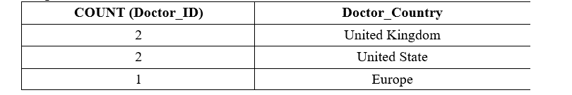
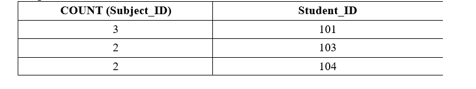

# 如何在 SQL 中使用分组依据

> 原文：<https://www.javatpoint.com/how-to-use-group-by-in-sql>

在这个 SQL 部分，您将学习什么是 GROUP BY 关键字，以及如何在结构化查询语言中实现它。我们还将讨论如何在 WHERE 子句中使用 GROUP BY 子句。

## 什么是分组依据？

GROUP BY 是 SELECT 查询中使用的一个 SQL 关键字，用于通过使用 SQL 函数来排列组中某列的相同值。

### GROUP BY 子句的语法

```sql

SELECT Column_Name_1, Column_Name_2, ........, Column_Name_N FROM Table_Name GROUP BY Column_Name_1, Column_Name_2, ........, Column_Name_N;

```

在 GROUP BY 子句中，我们可以使用表中的多个字段。我们必须用逗号分隔多个列的名称。

按照下面给出的步骤学习如何在 SQL 表中使用 GROUP BY 子句:

1.  创建一个简单的数据库和表。
2.  将数据插入表格
3.  查看没有分组依据子句的插入数据。
4.  使用 GROUP BY 子句。

### 步骤 1:创建一个简单的数据库和表

首先，您必须在 SQL 中创建新的数据库。

以下查询创建了医院数据库:

```sql

CREATE Database Hospital;

```

现在，您必须使用以下 CREATE TABLE 语法创建新表:

```sql

CREATE TABLE table_name  
(
column_Name_1 data type (size of the column_1),  
column_Name_2 data type (size of the column_2),  
column_Name_3 data type (size of the column_3),  
...  
column_Name_N data type (size of the column_1)
);  

```

以下查询在医院数据库中创建医生信息表:

```sql

CREATE TABLE Doctor_Info
(
Doctor_ID Int PRIMARY KEY,  
Doctor_Name VARCHAR (100),  
Doctor_Specialist VARCHAR (80),  
Doctor_GenderVarchar (20),
Doctor_Country Varchar (80) 
) ;

```

### 步骤 2:将数据插入表格

现在，您必须使用以下语法在表中插入数据:

```sql

INSERT INTO <Table_Name> (Column_Name_1, Column_Name_2, Column_Name_3, ......., Column_Name_N) VALUES (value_1 of Column_1, value_2, value_3, ...., value_N);  

```

以下查询插入了在医院工作的医生的记录:

```sql

INSERT INTO Doctor_Info (Doctor_ID, Doctor_Name, Doctor_Specialist, Doctor_Gender, Doctor_Country) VALUES ( 1035, Jones, Malaria_Specialist, Male, United Kingdom),
(1015, Marry, Diabties_Specialist, Female, United States),
(1003, Harry, Fever_Specialist, Male, United Kingdom),
(1044, Ella, Cancer_Specialist, Female, United States),
(1025, Moria, Corona_Specialist, Female, Europe);

```

### 第三步:查看无分组依据表的插入数据

以下查询以未排序的方式显示了医生的记录:

```sql

SELECT * FROM Doctor_Info;

```

上述选择查询的输出如下所示:

| 医生 _ 身份证 | 医生 _ 姓名 | 医生 _ 疾病 | 医生 _ 性别 | 医生 _ 国家 |
| One thousand and thirty-five | 琼斯 | 疟疾专家 | 男性的 | 联合王国 |
| One thousand and fifteen | 结婚 | 糖尿病专家 | 女性的 | 美国 |
| One thousand and three | 哈里 | 发烧专家 | 男性的 | 联合王国 |
| One thousand and forty-four | 欧洲远程通讯局(European Long Lines Agency) | 癌症专家 | 女性的 | 美国 |
| One thousand and twenty-five | 玛丽亚 | 科罗纳专家 | 女性的 | 欧洲 |

### 第四步:使用分组依据子句

以下 SQL 查询使用 GROUP BY 关键字列出每个国家的医生数量:

```sql

SELECT COUNT (Doctor_ID), Doctor_Country GROUP BY Doctor_Country;

```

下面的医生表中显示了上述选择和排序依据查询的输出:

**输出:**



## 用 SQL ORDER BY 子句分组

我们还可以在 SQL SELECT 语句中使用 ORDER BY 关键字和 GROUP BY 子句。

**带 ORDER BY 子句的 GROUP BY 子句的语法**

```sql

SELECT Function_Name (Column_Name) FROM Table_Name GROUP BY Column_Name ORDER BY Function_Name (Column_Name);

```

**分组依据子句和订单依据子句的示例**

以下查询在学校数据库中创建新的“主题”表:

```sql

CREATE TABLE Subject
(
Subject_ID INT PRIMARY KEY,  
Subject_Name VARCHAR (50),  
Subject_Teacher VARCHAR (70),
Student_ID INT
) ;

```

以下 INSERT INTO 查询将记录插入主题表:

```sql

INSERT INTO Subject(Subject_ID, Subject_Name, Subject_Teacher, Student_ID) VALUES (2211, Maths, Ramesh, 101),
(2252, English, Somya, 103),
(2201, Chemistry, Suresh, 101),
(2224, Physics, Aman, 103),
(2248, Computer, Bhanu, 101),
(2208, Hindi, Sonu, 104),
(2221, Biology, Punit, 104)); 

```

以下查询使用带有分组依据的 SQL ORDER BY 子句:

```sql

SELECT Count(Subject_ID), Student_ID FROM Subject GROUP BY Student_ID ORDER BY COUNT(Subject_ID) DESC; 

```

**输出:**



## 带最小函数的分组依据子句

我们也可以在结构化查询语言中使用带有 GROUP BY 子句的 MIN 聚合函数。

**带 MIN 函数的 Group BY 子句的语法:**

```sql

SELECT Column_Name_1, MIN(Column_Name) FROM Table_Name GROUP BY Column_Name_1;

```

**带分组依据子句的最小聚合函数示例**

本示例使用下面的 School_Stu_Details 表来理解带有最小聚合函数的 GROUP BY 子句的概念:

```sql

CREATE TABLE School_Stu_Details
(
Stu_ID INT NOT NULL, 
Stu_Name varchar(100),
Stu_Subject varchar(50),
Stu_Age INT, 
Stu_Marks INT
); 

```

以下插入语句插入学校学生的记录:

```sql

INSERT INTO School_Stu_Details VALUES (101, Anuj, English, 20, 88);
INSERT INTO School_Stu_Details VALUES (102, Raman, Maths, 24, 98);
INSERT INTO School_Stu_Details VALUES (104, Shyam, Hindi, 19, 92);
INSERT INTO School_Stu_Details VALUES (107, Vikash, Computer, 20, 78);
INSERT INTO School_Stu_Details VALUES (111, Monu, English, 21, 65);
INSERT INTO School_Stu_Details VALUES (114, Jones, Hindi, 18, 93);
INSERT INTO School_Stu_Details VALUES (121, Parul, Maths, 20, 97);
INSERT INTO School_Stu_Details VALUES (123, Divya, English, 21, 89);
INSERT INTO School_Stu_Details VALUES (128, Hemant, Computer, 23, 90);
INSERT INTO School_Stu_Details VALUES (130, Nidhi, Hindi, 20, 88);
INSERT INTO School_Stu_Details VALUES (132, Priya, English, 22, 99);
INSERT INTO School_Stu_Details VALUES (138, Mohit, Maths, 21, 92);

```

以下查询只是以表格形式显示学生的记录:

```sql

SELECT * FROM School_Stu_Details;

```

| Stu_ID | 姓 | 学生 _ 主题 | 学生年龄 | 斯图马克 |
| One hundred and one | 阿努伊 | 英语 | Twenty | Eighty-eight |
| One hundred and two | 拉曼 | 数学 | Twenty-four | Ninety-eight |
| One hundred and four | 嘘！嘘 | 印地语 | Nineteen | Ninety-two |
| One hundred and seven | 维卡什 | 计算机 | Twenty | seventy-eight |
| One hundred and eleven | 联安观察团 | 英语 | Twenty-one | Sixty-five |
| One hundred and fourteen | 琼斯 | 印地语 | Eighteen | Ninety-three |
| One hundred and twenty-one | 毛 | 数学 | Twenty | Ninety-seven |
| One hundred and twenty-three | 迪维亚 | 英语 | Twenty-one | eighty-nine |
| One hundred and twenty-eight | 赫曼特 | 计算机 | Twenty-three | Ninety |
| One hundred and thirty | 尼迪 | 印地语 | Twenty | Eighty-eight |
| One hundred and thirty-two | 普利娅 | 英语 | Twenty-two | Ninety-nine |
| One hundred and thirty-eight | 莫伊特 | 数学 | Twenty-one | Ninety-two |

以下查询显示了上述学校 _ 学生 _ 详细信息表中每个科目的最低分数:

```sql

SELECT Stu_Subject, MIN (Stu_Marks) FROM School_Stu_Details GROUP BY Stu_Subject;

```

**输出:**

| 学生 _ 主题 | 最低(学生分数) |
| 英语 | Sixty-five |
| 数学 | Ninety-two |
| 印地语 | Eighty-eight |
| 计算机 | seventy-eight |

## 带最大函数的分组依据子句

我们也可以在结构化查询语言中使用带有 GROUP BY 子句的 MAX 聚合函数。

**带 MAX 聚合函数的 Group BY 子句语法:**

```sql

SELECT Column_Name_1, MAX(Column_Name) FROM Table_Name GROUP BY Column_Name_1;

```

**带分组依据子句的最大聚合函数示例**

本示例使用下面的 School_Stu_Details 表来理解带有 SQL MAX 聚合函数的 GROUP BY 子句的概念:

```sql

CREATE TABLE School_Stu_Details
(
Stu_ID INT NOT NULL, 
Stu_Name varchar(100),
Stu_Subject varchar(50),
Stu_Age INT, 
Stu_Marks INT
); 

```

以下插入语句插入学校学生的记录:

```sql

INSERT INTO School_Stu_Details VALUES (101, Anuj, English, 20, 88);
INSERT INTO School_Stu_Details VALUES (102, Raman, Maths, 24, 98);
INSERT INTO School_Stu_Details VALUES (104, Shyam, Hindi, 19, 92);
INSERT INTO School_Stu_Details VALUES (107, Vikash, Computer, 20, 78);
INSERT INTO School_Stu_Details VALUES (111, Monu, English, 21, 65);
INSERT INTO School_Stu_Details VALUES (114, Jones, Hindi, 18, 93);
INSERT INTO School_Stu_Details VALUES (121, Parul, Maths, 20, 97);
INSERT INTO School_Stu_Details VALUES (123, Divya, English, 21, 89);
INSERT INTO School_Stu_Details VALUES (128, Hemant, Computer, 23, 90);
INSERT INTO School_Stu_Details VALUES (130, Nidhi, Hindi, 20, 88);
INSERT INTO School_Stu_Details VALUES (132, Priya, English, 22, 99);
INSERT INTO School_Stu_Details VALUES (138, Mohit, Maths, 21, 92);

```

以下查询只是以表格形式显示学生的记录:

```sql

SELECT * FROM School_Stu_Details;

```

| Stu_ID | 姓 | 学生 _ 主题 | 学生年龄 | 斯图马克 |
| One hundred and one | 阿努伊 | 英语 | Twenty | Eighty-eight |
| One hundred and two | 拉曼 | 数学 | Twenty-four | Ninety-eight |
| One hundred and four | 嘘！嘘 | 印地语 | Nineteen | Ninety-two |
| One hundred and seven | 维卡什 | 计算机 | Twenty | seventy-eight |
| One hundred and eleven | 联安观察团 | 英语 | Twenty-one | Sixty-five |
| One hundred and fourteen | 琼斯 | 印地语 | Eighteen | Ninety-three |
| One hundred and twenty-one | 毛 | 数学 | Twenty | Ninety-seven |
| One hundred and twenty-three | 迪维亚 | 英语 | Twenty-one | eighty-nine |
| One hundred and twenty-eight | 赫曼特 | 计算机 | Twenty-three | Ninety |
| One hundred and thirty | 尼迪 | 印地语 | Twenty | Eighty-eight |
| One hundred and thirty-two | 普利娅 | 英语 | Twenty-two | Ninety-nine |
| One hundred and thirty-eight | 莫伊特 | 数学 | Twenty-one | Ninety-two |

以下查询显示了上述学校 _ 学生 _ 详细信息表中每个科目的学生最高分:

```sql

SELECT Stu_Subject, MAX (Stu_Marks) FROM School_Stu_Details GROUP BY Stu_Subject;

```

**输出:**

| 学生 _ 主题 | 马克斯(斯图·马克斯) |
| 英语 | Ninety-nine |
| 数学 | Ninety-eight |
| 印地语 | Ninety-three |
| 计算机 | Ninety |

* * *