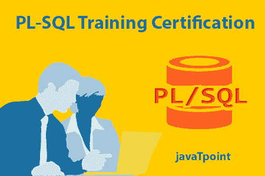

# PL/SQL 教程

> 原文：<https://www.javatpoint.com/pl-sql-tutorial>

PL/SQL 教程提供了 SQL 的基本概念和高级概念。我们的 PL/SQL 教程是为初学者和专业人士设计的。

PL/SQL 是一种可以包含多个块的块结构语言。

我们的 PL/SQL 教程包括 PL/SQL 语言的所有主题，如条件语句、循环、数组、字符串、异常、集合、记录、触发器、函数、过程、游标等。还有 PL/SQL 面试问题和小测验，帮助你更好地理解 PL/SQL 语言。

SQL 代表结构化查询语言，即用于对存储在数据库中的记录执行操作，如插入记录、更新记录、删除记录、创建、修改和删除表、视图等。

## 什么是 PL/SQL

PL/SQL 是一种块结构语言。PL/SQL 的程序是逻辑块，可以包含任意数量的嵌套子块。Pl/SQL 代表 Oracle 中使用的“SQL 的过程语言扩展”。PL/SQL 与 Oracle 数据库集成(从版本 7 开始)。PL/SQL 的功能通常会在 Oracle 数据库的每个版本发布后进行扩展。尽管 PL/SQL 与 SQL 语言紧密结合，但它增加了一些 SQL 中没有的编程约束。

## PL/SQL 功能

PL/SQL 包括条件和循环等过程语言元素。它允许声明常量和变量，过程和函数，类型和变量的类型和触发器。它可以支持数组并处理异常(运行时错误)。在 Oracle 数据库第 8 版实施后，包含了与面向对象相关的特性。您可以创建像过程、函数、包、类型和触发器等 PL/SQL 单元。这些数据存储在数据库中，供应用程序重用。

使用 PL/SQL，您可以使用 SQL 语句来操作 Oracle 数据和控制语句流来处理数据。

PL/SQL 以其结合了 SQL 的数据操作能力和过程语言的数据处理能力而闻名。它继承了 Oracle 数据库的健壮性、安全性和可移植性。

PL/SQL 不区分大小写，因此除了字符串和字符文字之外，您可以自由使用小写字母或大写字母。一行 PL/SQL 文本包含称为词汇单位的字符组。它可以分类如下:

*   流量计
*   标识符
*   文字
*   评论

* * *

## PL/SQL 索引

* * *

**PL/SQL 教程**

*   [PL/SQL 教程](pl-sql-tutorial)
*   [PL/SQL 变量](pl-sql-variables)
*   [PL/SQL 常量](pl-sql-constant)

**控制报表**

*   [PL/SQL IF](pl-sql-if)
*   [PL/SQL 案例](pl-sql-case)
*   [PL/SQL 循环](pl-sql-loop)
*   [PL/SQL 退出循环](pl-sql-exit-loop)
*   [PL/SQL While 循环](pl-sql-while-loop)
*   [PL/SQL For 循环](pl-sql-for-loop)
*   [PL/SQL 继续](pl-sql-continue)
*   pl/SQL goto

**PL/SQL 程序**

*   [PL/SQL 程序](pl-sql-procedure)

**PL/SQL 函数**

*   [PL/SQL 函数](pl-sql-function)

**PL/SQL 游标**

*   [PL/SQL 游标](pl-sql-cursor)

pl/SQL 异常

*   pl/SQL 异常

**PL/SQL 触发器**

*   [PL/SQL 触发器](pl-sql-trigger)

**面试问题**

*   [PL/SQL 面试问题](pl-sql-interview-questions)
*   [SQL 面试问题](sql-interview-questions)

**测验**

*   SQL 测验

* * *

## 先决条件

在学习 PL/SQL 之前，你必须具备 SQL 和 c 这样的编程语言的基础知识。

## 观众

我们的 PL/SQL 教程旨在帮助初学者和专业人士。

## 问题

我们保证您在本 PL/SQL 教程中不会发现任何问题。但是如果有任何错误，请在联系表格中发布问题。