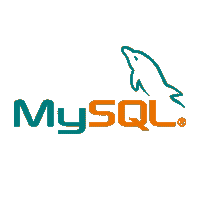
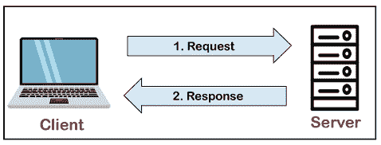

# MySQL 教程

> 原文：<https://www.javatpoint.com/mysql-tutorial>

MySQL 教程提供了 MySQL 的基本概念和高级概念。我们的 MySQL 教程是为初学者和专业人士设计的。

MySQL 是基于结构化查询语言的关系数据库管理系统，结构化查询语言是访问和管理数据库中记录的流行语言。MySQL 是 GNU 许可下的开源自由软件。得到**甲骨文公司**的支持。

我们的 MySQL 教程包括 MySQL 数据库的所有主题，这些主题提供了如何在各种 SQL 查询的帮助下管理数据库和操作数据。这些查询包括:插入记录、更新记录、删除记录、选择记录、创建表格、删除表格等。还有给 MySQL 的面试问题，帮助你更好的了解 MySQL 数据库。

## 什么是数据库？

在学习 MySQL 之前，了解数据库是非常重要的。数据库是存储有组织的记录集合的应用程序。用户可以非常容易地访问和管理它。它允许我们将数据组织成表、行、列和索引，以便快速找到相关信息。每个数据库都包含不同的[应用编程接口](https://www.javatpoint.com/api-full-form)，用于执行数据库操作，如创建、管理、访问和搜索它存储的数据。如今，许多数据库可用，如 MySQL、Sybase、[甲骨文](https://www.javatpoint.com/what-is-oracle)、 [MongoDB](https://www.javatpoint.com/mongodb-tutorial) 、 [PostgreSQL](https://www.javatpoint.com/postgresql-tutorial) 、 [SQL Server](https://www.javatpoint.com/sql-server-tutorial) 等。在这一部分，我们将主要关注 MySQL。

## 什么是 MySQL？

MySQL 是目前最流行的用于管理关系数据库的数据库管理系统软件。它是开源数据库软件，由甲骨文公司支持。与微软的 SQL Server 和 Oracle 数据库相比，它是一个快速、可扩展、易于使用的数据库管理系统。它通常与 [PHP](https://www.javatpoint.com/php-tutorial) 脚本结合使用，用于创建强大且动态的服务器端或基于 web 的企业应用程序。

它由瑞典公司的 **MySQL AB 开发、营销和支持，用 [C 编程语言](https://www.javatpoint.com/c-programming-language-tutorial)和 [C++编程语言](https://www.javatpoint.com/cpp-tutorial)编写。MySQL 的官方发音不是《我的续集》；这是*T7】我的爱。但是，你可以用你的方式发音。*很多大小公司都用 MySQL。MySQL 支持 [Windows](https://www.javatpoint.com/windows) 、 [Linux](https://www.javatpoint.com/linux-tutorial) 、MacOS 等多种操作系统。用 C、C++、 [Java 语言](https://www.javatpoint.com/java-tutorial)。**

MySQL 是一款[关系数据库管理系统](https://www.javatpoint.com/what-is-rdbms) (RDBMS)软件，提供了很多东西，具体如下:

*   它允许我们在表、行、列和索引上实现数据库操作。
*   它以表(行和列的集合)的形式定义数据库关系，也称为关系。
*   它提供了各种表的行或列之间的引用完整性。
*   它允许我们自动更新表索引。
*   它使用许多 SQL 查询，并为最终用户组合来自多个表的有用信息。

## MySQL 是如何工作的？

MySQL 遵循客户机-服务器架构的工作方式。这种模型是为称为客户端的最终用户设计的，他们使用网络服务从称为服务器的中央计算机访问资源。这里，客户端通过图形用户界面(GUI)发出请求，一旦指令匹配，服务器就会给出所需的输出。MySQL 环境的流程与客户端-服务器模型相同。

MySQL 数据库的核心是 MySQL 服务器。该服务器作为一个单独的程序提供，负责处理所有数据库指令、语句或命令。MySQL 数据库与 MySQL 服务器的工作原理如下:

1.  MySQL 创建了一个数据库，允许您构建许多表来存储和操作数据，并定义每个表之间的关系。
2.  客户端通过图形用户界面屏幕或命令提示符，使用 MySQL 上的特定 SQL 表达式发出请求。
3.  最后，服务器应用程序将使用请求的表达式进行响应，并在客户端产生所需的结果。

客户端可以使用任何 MySQL [图形用户界面](https://www.javatpoint.com/gui-full-form)。但是，它确保您的图形用户界面应该更轻，用户友好，使您的数据管理活动更快，更容易。一些最广泛使用的 MySQL 图形用户界面是 MySQL 工作台、SequelPro、数据库可视化工具和 Navicat 数据库管理工具。有些图形用户界面是商业的，而有些是免费的，功能有限，有些只与苹果操作系统兼容。因此，您可以根据需要选择图形用户界面。

## 受欢迎的原因

MySQL 变得如此受欢迎是因为以下原因:

*   MySQL 是一个开源数据库，所以你不用花一分钱就能使用它。
*   MySQL 是一个非常强大的程序，可以处理大量最昂贵和最强大的数据库包的功能。
*   MySQL 是可定制的，因为它是开源数据库，开源的 GPL 许可证方便程序员根据自己的具体环境修改 SQL 软件。
*   MySQL 比其他数据库更快，因此即使在大数据集下也能很好地工作。
*   MySQL 支持很多操作系统，有很多语言，像 PHP、PERL、C、C++、JAVA 等。
*   MySQL 使用标准形式的著名的 SQL 数据语言。
*   MySQL 对 PHP 非常友好，PHP 是最流行的网络开发语言。
*   MySQL 支持大型数据库，一个表中最多有 5000 万行或更多。表的默认文件大小限制是 4GB，但是您可以将这一限制(如果您的操作系统可以处理)提高到 800 万太字节(TB)的理论限制。

## MySQL 的历史

MySQL 的项目始于 1979 年，当时 MySQL 的发明者 **Michael Widenius** 开发了一个名为 **UNIREG** 的内部数据库工具，用于管理数据库。之后，UNIREG 被改写成几种不同的语言，并扩展到处理大型数据库。过了一段时间，Michael Widenius 联系了 mSQL 的作者 **David Hughes** ，看看 Hughes 是否有兴趣将 mSQL 连接到 UNIREG 的 B+ ISAM 处理程序，为 mSQL 提供索引。MySQL 就是这样诞生的。

> MySQL 是以联合创始人迈克尔·威得纽斯的女儿命名的，她的名字叫“我的”。

### 按年份划分的历史:

| 年 | 事件 |
| One thousand nine hundred and ninety-five | MySQL AB，由迈克尔·威得纽斯(蒙蒂)、大卫·阿克马克和艾伦·拉尔森在瑞典创立。 |
| Two thousand | MySQL 是开源的，并根据 GPL 的条款发布软件。收入因此下降了 80%，花了一年时间才弥补。 |
| Two thousand and one | 38 岁时，马丁·米克尔斯当选首席执行官。在加入 MySQL 之前，Marten 曾是几家北欧公司的 CEO，拥有销售和营销背景。200 万次主动安装。来自斯堪的纳维亚风险投资家的未披露金额的募集系列。据估计约为 100 万至 200 万美元。 |
| Two thousand and two | 除了瑞典总部，MySQL 还推出了自己的总部。当时有 300 万活跃用户。MySQL 今年以 650 万美元的收入结束，拥有 1000 名付费客户。 |
| Two thousand and three | 今年从基准资本和指数风险投资公司筹集了 1950 万澳元。目前，每天有 400 万次活动安装和超过 3 万次下载。它以 1200 万美元的收入结束了这一年。 |
| Two thousand and four | 由于主要收入来自原始设备制造商双重许可模式，MySQL 决定更多地进入企业市场，并更多地关注最终用户的经常性收入，而不是原始设备制造商合作伙伴的一次性许可费。它以 2000 万美元的收入结束了这一年。 |
| Two thousand and five | MySQL 在红帽网络之后推出了 MySQL 网络模型。MySQL 网络是一项面向最终用户的订阅服务，提供更新、警报、通知和产品级支持，旨在让公司更轻松地管理数百台 MySQL 服务器。MySQL 5 附带并包含了许多针对企业用户的新功能(例如，存储过程、触发器、视图、游标、分布式事务、联合存储引擎等)。)甲骨文收购了 4 人团队 innobase，这是 MySQL InnoDB 存储后端背后的一家芬兰公司，以 3400 名客户为基础，该公司在年底获得了 3400 万美元的收入。 |
| Two thousand and six | Marten Mickos 证实甲骨文试图收购 MySQL。甲骨文首席执行官拉里·埃里森评论说:“我们已经和他们谈过了，事实上，我们几乎和每个人都谈过了。我们感兴趣吗？这是一家小公司。我认为 MySQL 的收入在 3000 万到 4000 万美元之间。甲骨文明年的营收为 150 亿美元。”甲骨文收购了 sleepycat，这是一家为 MySQL 提供伯克利数据库事务存储引擎的公司。Marten Mickos 宣布，他们正在为 2008 年的首次公开募股做准备，预计收入为 1 亿美元。800 万次主动安装。MySQL 在 25 个国家拥有 320 名员工，其中 70%在家工作，根据传闻估值北 3 亿美元，筹集了 1800 万美元的 c 系列。据估计，以安装基数衡量，MySQL 的市场份额为 33%，以营收衡量，其市场份额为 0.2%(2006 年，数据库市场是一个 150 亿美元的市场)。它以 5000 万美元的收入结束了这一年。 |
| Two thousand and seven | 它以 7500 万美元的收入结束了这一年。 |
| Two thousand and eight | 太阳微系统公司以大约 10 亿美元收购了 MySQL AB。MySQL AB 的两位联合创始人 Michael Widenius(蒙蒂)和 David Axmark 开始公开批评 Sun，并在不久后离开 Sun。 |
| Two thousand and nine | 马腾·米克尔斯离开孙，成为基准资本的常驻企业家。孙现在已经失去了让 MySQL 成功的商业和精神领袖。
太阳微系统公司和甲骨文公司宣布，双方已达成最终协议，甲骨文公司将以每股 9.50 美元的现金价格收购太阳普通股。这笔交易价值约 74 亿美元。 |

* * *

## MySQL 索引

* * *

**MySQL 教程**

*   [MySQL 教程](mysql-tutorial)
*   [MySQL 历史记录](mysql-history)
*   [MySQL 功能](mysql-features)
*   [MySQL 数据类型](mysql-data-types)
*   [安装 MySQL](how-to-install-mysql)

**MySQL 数据库**

*   [创建数据库](mysql-create-database)
*   [选择数据库](mysql-select-database)
*   [删除数据库](mysql-drop-database)

**表&视图**

*   [创建表格](mysql-create-table)
*   [更改表格](mysql-alter-table)
*   [截断表](mysql-truncate-table)
*   [下降表](mysql-drop-table)
*   [MySQL 视图](mysql-view)

**MySQL 查询**

*   [MySQL 查询](mysql-queries)
*   [插入记录](mysql-insert)
*   [更新记录](mysql-update)
*   [删除记录](mysql-delete)
*   [选择记录](mysql-select)

**MySQL 条款**

*   [MySQL WHERE](mysql-where)
*   [MySQL DISTINCT](mysql-distinct)
*   [MySQL FROM](mysql-from)
*   [MySQL 订单人](mysql-order-by)
*   [MySQL 集团 BY](mysql-group-by)
*   [MySQL HAVING](mysql-having)

**MySQL 条件**

*   [MySQL 和](mysql-and)
*   [MySQL OR](mysql-or)
*   [MySQL AND OR](mysql-and-or)
*   [MySQL LIKE](mysql-like)
*   [MySQL IN](mysql-in)
*   [MySQL 不](mysql-not)
*   [MySQL 为空](mysql-is-null)
*   [MySQL 不为空](mysql-is-not-null)
*   [MySQL 之间](mysql-between)

**MySQL 加入**

*   [MySQL JOIN](mysql-join)

**聚合函数**

*   [MySQL count()](mysql-count)
*   [MySQL sum()](mysql-sum)
*   MySQL avg()
*   [MySQL min()](mysql-min)
*   [MySQL max()](mysql-max)
*   [MySQL first()](mysql-first)
*   [MySQL last()](mysql-last)

**差异**

*   [MariaDB 诉 MySQL](mariadb-vs-mysql)
*   [PostgreSQL vs MySQL](postgresql-vs-mysql)

**面试问题**

*   [MySQL 面试](mysql-interview-questions)
*   [SQL 面试](sql-interview-questions)
*   [PL/SQL 面试](pl-sql-interview-questions)

**MySQL 日期/时间功能**

*   [MySQL 日期/时间](mysql-date-time)
*   [DATE()功能](mysql-date-function)
*   [ADDDATE()功能](mysql-adddate-function)
*   [凝结()功能](mysql-curdate-function)
*   [CURRENT_DATE()功能](mysql-current_date-function)
*   [DATE_ADD()功能](mysql-date_add-function)
*   [DATE_FORMAT()功能](mysql-date_format-function)
*   [DATEDIFF()功能](mysql-datediff-function)
*   [DAY()功能](mysql-day-function)
*   [DAYNAME()功能](mysql-dayname-function)
*   [DAYOFMONTH()功能](mysql-dayofmonth-function)
*   [DAYOFWEEK()功能](mysql-dayofweek-function)
*   [DAYOFYEAR()功能](mysql-dayofyear-function)
*   [From_days()功能](mysql-from_days-function)
*   [小时()功能](mysql-hour-function)
*   [ADDTIME()功能](mysql-addtime-function)
*   [CURRENT_TIME()功能](mysql-current_time-function)
*   [CURRENT_TIMESTAMP()功能](mysql-current_timestamp-function)
*   [CURTIME()功能](mysql-curtime-function)
*   [last_day()功能](mysql-last_day-function)
*   [localtime()功能](mysql-localtime-function)
*   [localtimestamp()函数](mysql-localtimestamp-function)
*   [makedate()功能](mysql-makedate-function)
*   [maketime()功能](mysql-maketime-function)
*   [微秒()功能](mysql-microsecond-function)
*   [分钟()功能](mysql-minute-function)
*   [月()功能](mysql-month-function)
*   [monthname()功能](mysql-monthname-function)
*   [现在()功能](mysql-now-function)
*   [period_add()功能](mysql-period_add-function)
*   [period_diff()功能](mysql-period_diff-function)
*   [四分之一()功能](mysql-quarter-function)
*   [秒至时间()功能](mysql-sec_to_time-function)
*   [秒()功能](mysql-second-function)
*   [str_to_date()功能](mysql-str_to_date-function)
*   [子状态()功能](mysql-subdate-function)
*   [枯草杆菌素()功能](mysql-subtime-function)
*   [Sysdate()功能](mysql-sysdate-function)
*   [时间()功能](mysql-time-function)
*   [time_format()功能](mysql-time_format-function)
*   [time_to_sec()功能](mysql-time_to_sec-function)
*   [timediff()功能](mysql-timediff-function)
*   [时间戳()功能](mysql-timestamp-function)
*   [至 _ 日()功能](mysql-to_day-function)
*   [工作日()功能](mysql-weekday-function)
*   [周()功能](mysql-week-function)
*   [一年中的第几周()功能](mysql-weekofyear-function)

**MySQL 数学函数**

*   MySQL 数学
*   [数学 ABS()功能](mysql-math-abs-function)
*   [数学 ACOS()函数](mysql-math-acos-function)
*   [数学符号()功能](mysql-math-sign-function)
*   [数学 SIN()函数](mysql-math-sin-function)
*   [数学 SQRT()函数](mysql-math-sqrt-function)
*   [数学求和()函数](mysql-math-sum-function)
*   [数学 TAN()函数](mysql-math-tan-function)
*   [数学 TRUNCATE()函数](mysql-math-truncate-function)
*   [数学 ASIN()函数](mysql-math-asin-function)
*   [数学 ATAN2()函数](mysql-math-atan2-function)
*   [数学 ATAN()函数](mysql-math-atan-function)
*   [数学 AVG()函数](mysql-math-avg-function)
*   [数学 CEIL()函数](mysql-math-ceil-function)
*   [数学天花板()函数](mysql-math-ceiling-function)
*   [数学 COS()函数](mysql-math-cos-function)
*   [数学 COT()函数](mysql-math-cot-function)
*   [数学计数()功能](mysql-math-count-function)
*   [数学学位()功能](mysql-math-degrees-function)
*   [数学 DIV()函数](mysql-math-div-function)
*   [数学 EXP()函数](mysql-math-exp-function)
*   [数学地板()功能](mysql-math-floor-function)
*   [数学最大()函数](mysql-math-greatest-function)
*   [数学最小()函数](mysql-math-least-function)
*   [数学 LN()函数](mysql-math-ln-function)
*   [数学 LOG10()函数](mysql-math-log10-function)
*   [数学日志()功能](mysql-math-log-function)
*   [数学 LOG2()函数](mysql-math-log2-function)
*   [数学 MAX()函数](mysql-math-max-function)
*   [数学最小()函数](mysql-math-min-function)
*   [数学 MOD()函数](mysql-math-mod-function)
*   [数学 PI()函数](mysql-math-pi-function)
*   [数学幂()函数](mysql-math-power-function)
*   [数学 POW()函数](mysql-math-pow-function)
*   [数学弧度()函数](mysql-math-radians-function)
*   [Math RAND()函数](mysql-math-rand-function)
*   [Math ROUND()函数](mysql-math-round-function)

**MSQL 字符串函数**

*   MySQL 字符串
*   [String CONCAT_WS()函数](mysql-string-concat_ws-function)
*   [String CONCAT()函数](mysql-string-concat-function)
*   [String CHARACTER_LENGTH()函数](mysql-string-character_length-function)
*   [字符串 ELT()功能](mysql-string-elt-function)
*   [字符串 EXPORT_SET()功能](mysql-string-export_set-function)
*   [字符串字段()功能](mysql-string-field-function)
*   [字符串 FIND_IN_SET()功能](mysql-string-find_in_set-function)
*   [字符串格式()功能](mysql-string-format-function)
*   [字符串 FROM_BASE64()函数](mysql-string-from_base64-function)
*   [String HEX()函数](mysql-string-hex-function)
*   [字符串插入()功能](mysql-string-insert-function)
*   [String INSTR()功能](mysql-string-instr-function)
*   [字符串 LCASE()功能](mysql-string-lcase-function)
*   [左弦()功能](mysql-string-left-function)
*   [字符串长度()函数](mysql-string-length-function)
*   [弦状()功能](mysql-string-like-function)
*   [字符串 LOAD_FILE()函数](mysql-string-load_file-function)
*   [字符串定位()功能](mysql-string-locate-function)
*   [字符串 low()功能](mysql-string-lower-function)
*   [弦 LPAD()功能](mysql-string-lpad-function)
*   [字符串 LTRIM()功能](mysql-string-ltrim-function)
*   [字符串 MAKE_SET()功能](mysql-string-make_set-function)
*   [字符串 MID()功能](mysql-string-mid-function)
*   [String OCTET_LENGTH()函数](mysql-string-octet_length-function)
*   [字符串 OCT()功能](mysql-string-oct-function)
*   [字符串 order()函数](mysql-string-ord-function)
*   [字符串位置()功能](mysql-string-position-function)
*   [String QUOTE()函数](mysql-string-quote-function)
*   [字符串重复()功能](mysql-string-repeat-function)
*   [字符串替换()功能](mysql-string-replace-function)
*   [字符串反转()功能](mysql-string-reverse-function)
*   [String RIGHT()功能](mysql-string-right-function)
*   [弦 RPAD()功能](mysql-string-rpad-function)
*   [字符串 RTRIM()功能](mysql-string-rtrim-function)
*   [String SOUNDEX()功能](mysql-string-soundex-function)
*   [String SPACE()函数](mysql-string-space-function)
*   [字符串 STRCMP()功能](mysql-string-strcmp-function)
*   [字符串 SUBSTR()函数](mysql-string-substr-function)
*   [String SUBSTRING_INDEX()函数](mysql-string-substring_index-function)
*   [String SUBSTRING()函数](mysql-string-substring-function)
*   [弦线修剪()功能](mysql-string-trim-function)
*   [字符串 UCASE()功能](mysql-string-ucase-function)
*   [String unhx()功能](mysql-string-unhex-function)
*   [字符串 UPPER()功能](mysql-string-upper-function)

* * *

## 先决条件

在学习 MySQL 之前，你必须具备计算机基础的基础知识。

## 观众

我们的 MySQL 教程旨在帮助初学者和专业人士。

## 问题

我们保证您在这个 MySQL 教程中不会发现任何问题。但是如果有任何错误，请在联系表格中发布问题。

* * *