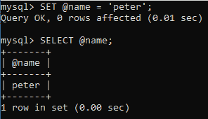
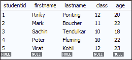
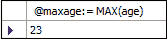
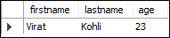
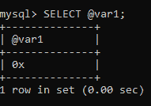
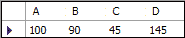
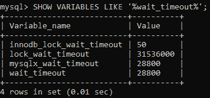
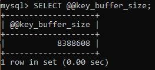

# MySQL 变量

> 原文：<https://www.javatpoint.com/mysql-variables>

变量用于在程序执行过程中存储数据或信息。这是一种用适当的名称标记数据的方式，有助于读者更清楚地理解程序。变量的主要目的是将数据存储在内存中，并且可以在整个程序中使用。

MySQL 可以用**三种**不同的方式使用变量，具体如下:

1.  用户定义变量
2.  局部变量
3.  系统变量

## 用户定义变量

有时，我们希望将值从一个语句传递到另一个语句。用户定义的变量使我们能够在一条语句中存储一个值，然后可以将其引用到另一条语句中。 [MySQL](https://www.javatpoint.com/mysql-tutorial) 提供 **SET** 和 **SELECT** 语句来声明和初始化变量。自定义变量名以 **@符号**开头。

用户定义的变量不区分大小写，例如@name 和@ NAME；两者是一样的。一个人声明的用户定义变量对另一个人不可见。我们可以将用户定义的变量赋给有限的数据类型，如整数、浮点、十进制、字符串或空值。用户自定义变量最大长度为 **64 个字符**。

### 句法

以下语法用于声明用户定义的变量。

1.通过使用**设置**语句

```

SET @var_name = value;

```

#### 注意:我们可以在 SET 语句中使用“=”或“:=”赋值运算符。

2.通过使用**选择**语句

```

SELECT @var_name := value;

```

### 示例 1

这里，我们将使用 SET 语句为变量赋值。

```

mysql> SET @name='peter';

```

然后，我们可以使用 SELECT 语句显示上面的值。

```

mysql> SELECT @name;

```

**输出**



### 例 2

让我们在 MySQL 数据库中创建表**学生**，如下所示:



运行以下语句获取“学生”表中学生的最大年龄，并将年龄分配给用户定义的变量 **@maxage** 。

```

mysql> SELECT @maxage:= MAX(age) FROM students;

```

它将给出以下输出。



现在，运行 SELECT 语句，该语句使用@maxage 变量返回学生的最大年龄。

```

mysql> SELECT firstname, lastname, age FROM students WHERE age = @maxage;

```

成功执行上述语句后，我们将获得以下结果:



### 示例 3

如果我们访问**未声明的**变量，它将给出**空**输出。

```

Mysql> SELECT @var1;

```

**输出**



## 局部变量

它是一种不以 **@符号**为前缀的变量。局部变量是强类型变量。局部变量的作用域在声明它的存储程序块中。MySQL 使用 **DECLARE** 关键字来指定局部变量。DECLARE 语句还结合了一个 **DEFAULT** 子句来为变量提供默认值。如果您不提供 DEFAULT 子句，它将给出初始值**空值**。它主要用于存储过程程序。

### 句法

我们可以使用具有以下语法的 DECLARE 语句:

```

DECLARE variable_name datatype(size) [DEFAULT default_value];

```

让我们看看下面使用局部变量的例子。

### 例子

```

mysql> DECLARE total_price Oct(8,2) DEFAULT 0.0;

```

我们还可以通过使用单个 DECLARE 语句来定义两个或多个具有相同数据类型的变量。

```

mysql> DECLARE a,b,c INT DEFAULT 0;

```

下面的例子解释了我们如何在存储过程中使用 DECLARE 语句。

```

DELIMITER //
Create Procedure Test()
    BEGIN
        DECLARE A INT DEFAULT 100;
        DECLARE B INT;
        DECLARE C INT;
        DECLARE D INT;
        SET B = 90;
        SET C = 45;
        SET D = A + B - C;
        SELECT A, B, C, D;
    END //
DELIMITER ;

```

成功执行上述函数后，按如下方式调用存储过程函数:

```

mysql> CALL Test();

```

它将给出以下输出:



## 系统变量

系统变量是所有程序单元的一个特殊类，包含**预定义的**变量。MySQL 包含配置其操作的各种系统变量，每个系统变量都包含一个默认值。我们可以在运行时使用 **SET** 语句动态改变一些系统变量。它使我们能够修改服务器操作，而无需停止和重新启动它。系统变量也可以用在表达式中。

MySQL Server 给出了一堆系统变量，如 GLOBAL、SESSION 或 MIX 类型。我们可以在服务器的整个生命周期中看到全局变量，而会话变量只在特定的会话中保持活动状态。

我们可以通过以下方式查看系统变量的名称和值:

1.要查看正在运行的服务器使用的当前值，请执行以下命令。

```

mysql> SHOW VARIABLES;

OR,

Mysql> SELECT @@var_name;

```

2.当我们想要查看基于其编译后的默认值的值时，请使用以下命令。

```

mysql> mysqld --verbose --help

```

### 示例 1

```

mysql> SHOW VARIABLES LIKE '%wait_timeout%';

```

**输出**



### 例 2

```

mysql> SELECT @@key_buffer_size;

```

**输出**



* * *