# MySQL 工作台(下载和安装)

> 原文：<https://www.javatpoint.com/mysql-workbench>

MySQL 工作台是一个统一的可视化数据库设计或图形用户界面工具，用于与数据库架构师、开发人员和数据库管理员一起工作。它由 Oracle 开发和维护。它提供了 SQL 开发、数据建模、数据迁移以及用于服务器配置、用户管理、备份等的全面管理工具。我们可以使用这个服务器管理来创建新的物理数据模型、E-R 图，以及进行 SQL 开发(运行查询等)。).它适用于所有主要的操作系统，如苹果操作系统、视窗和 Linux。MySQL 工作台完全支持 MySQL Server 版及更高版本。

MySQL 工作台涵盖了**五大主要功能**，具体如下:

**SQL 开发:**该功能提供了一种能力，使您能够在内置的 SQL 编辑器的帮助下执行 SQL 查询，创建和管理与数据库服务器的连接。

**数据建模(设计):**该功能使您能够以图形方式创建数据库模式的模型，在模式和实时数据库之间执行反向和正向工程，并使用全面的表格编辑器编辑数据库的所有方面。表编辑器提供了编辑表、列、索引、视图、触发器、分区等的工具。

**服务器管理:**此功能使您能够通过管理用户、检查审核数据、查看数据库运行状况、执行备份和恢复以及监控 MySQL Server 的性能来管理 MySQL Server 实例。

**数据迁移:**此功能允许您从 Microsoft SQL Server、SQLite、Microsoft Access、PostgreSQL、Sybase ASE、SQL Anywhere 以及其他 RDBMS 表、对象和数据迁移到 MySQL。它还支持从以前版本的 MySQL 迁移到最新版本。

**MySQL 企业支持:**该功能为 MySQL 防火墙、MySQL 企业备份、MySQL 审计等企业产品提供支持。

## MySQL 工作台版本

MySQL 工作台主要有三个版本，如下所示:

1.  社区版(开源，GPL)
2.  标准版(商用)
3.  企业版(商业版)

### 社区版

社区版是最流行的数据库系统的开源和可免费下载的版本。它获得了 GPL 许可，并得到了大量开发人员的支持。

### 标准版

它是商业版，提供了交付高性能和可扩展的在线事务处理(OLTP)应用程序的能力。它使 MySQL 以工业实力、性能和可靠性而闻名。

### 企业版

它是商业版，包括一套高级功能、管理工具和技术支持，以实现最高的可扩展性、安全性、可靠性和正常运行时间。此版本还降低了开发、部署和管理 MySQL 应用程序的风险、成本和复杂性。

让我们用下面的对比图来理解。

| 功能 | 社区版 | 标准版 | 企业版 |
| 可视化 SQL 开发 | 是 | 是 | 是 |
| 可视化数据库管理 | 是 | 是 | 是 |
| 性能调整 | 是 | 是 | 是 |
| 用户和会话管理 | 是 | 是 | 是 |
| 连接管理 | 是 | 是 | 是 |
| 对象管理 | 是 | 是 | 是 |
| 数据管理 | 是 | 是 | 是 |
| 可视化数据建模 | 是 | 是 | 是 |
| 逆向工程 | 是 | 是 | 是 |
| 前沿工程 | 是 | 是 | 是 |
| 模式同步 | 是 | 是 | 是 |
| 模式和模型验证 | 不 | 是 | 是 |
| DBDoc | 不 | 是 | 是 |
| MySQL 企业备份的图形用户界面 | 不 | 不 | 是 |
| 企业审计图形用户界面 | 不 | 不 | 是 |
| MySQL 企业防火墙的图形用户界面 | 不 | 是 | 是 |
| 脚本和插件 | 是 | 是 | 是 |
| 数据库迁移 | 是 | 是 | 是 |

## MySQL 工作台环境设置

在这里，我们将学习如何下载和安装 MySQL 工作台。

### 先决条件

要使用 MySQL 工作台，您的系统中应该有以下要求:

*   **MySQL Server:**可以从[这里](https://dev.mysql.com/downloads/mysql/)下载。
*   **MySQL 工作台:**可以从[这里](https://dev.mysql.com/downloads/workbench/)下载。
*   微软。NET 框架 4.5.2
*   适用于 Visual Studio 2019 的 Microsoft Visual C++可再发行版
*   内存 4 GB(推荐 6 GB)

### 装置

**步骤 1:** 安装 MySQL 社区服务器。要安装 MySQL Server，双击 MySQL **安装程序。exe 文件**。单击。exe 文件，可以看到如下屏幕:

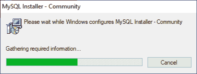

**第二步:**选择**设置类型**，点击**下一步**按钮。有几种类型可供选择，您需要选择合适的选项来安装 MySQL 产品和功能。这里，我们将选择一个自定义选项，因为只需要 MySQL Server 和工作台。如果您需要更多功能，可以选择“完整”选项。

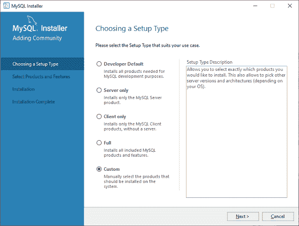

**第三步:**点击下一步按钮，会出现如下画面。

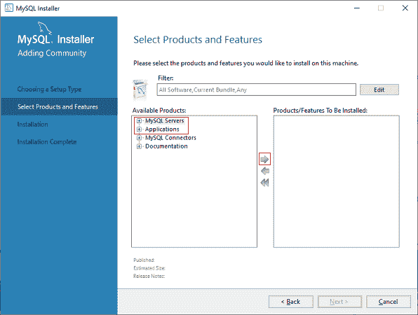

在此屏幕中，转到 **MySQL Server**部分，单击加号(+)图标。在这里，您需要选择 MySQL Server，并通过单击右箭头符号将其添加到右侧框中。

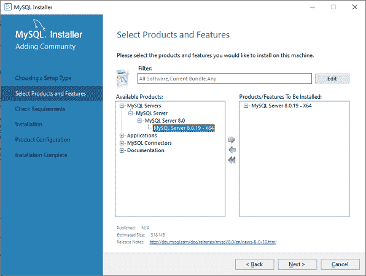

现在，在**应用程序部分**中，您需要执行与在 MySQL Server 上执行的相同的操作，然后单击下一步按钮。下面的屏幕解释得更清楚了。

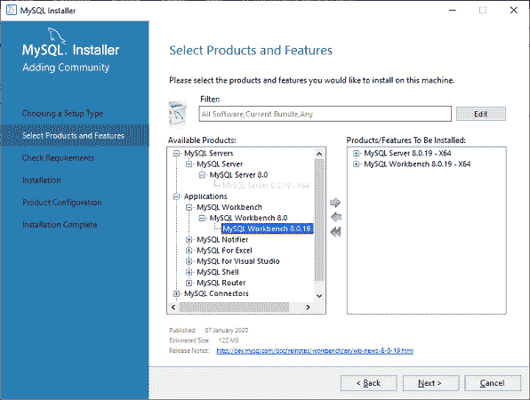

**第四步:**点击下一步，会出现如下画面。此屏幕检查安装 MySQL Server 和工作台的所有要求。只要点击**执行**按钮，就会自动安装所有需求。现在，点击下一步按钮。

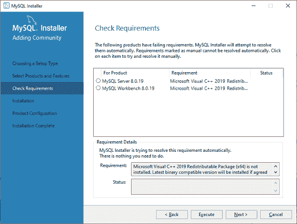

**第五步:**在该屏幕中，点击执行按钮，下载并安装 MySQL Server 和工作台。

下载和安装完成后，单击下一步按钮。

**第六步:**在下一个画面中，我们需要配置 MySQL Server，点击下一步按钮。

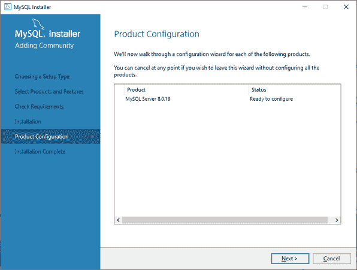

**第七步:**一点击下一步按钮，就可以看到下面的画面。在这里，我们必须配置 MySQL Server。现在，选择独立的 MySQL Server/经典的 MySQL 复制选项，然后单击下一步。

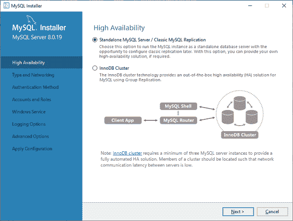

**第 8 步:**在下一个屏幕中，系统会要求您选择配置类型和其他连接选项。在这里，我们将选择配置类型为“**开发机器**”和连接性为 **TCP/IP，**、**端口号为**3306，然后点击下一步。

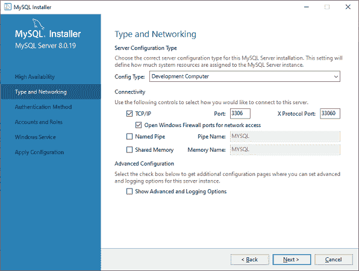

**步骤 9:** 现在，选择身份验证方法并单击下一步。

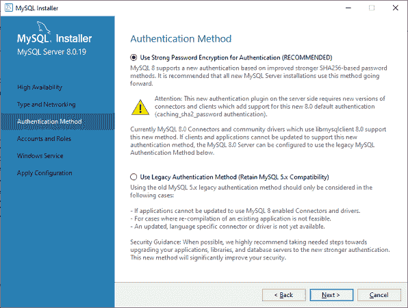

**步骤 10:** 下一个屏幕将要求您选择帐户、用户名和密码。填写完所有细节后，点击下一步按钮。

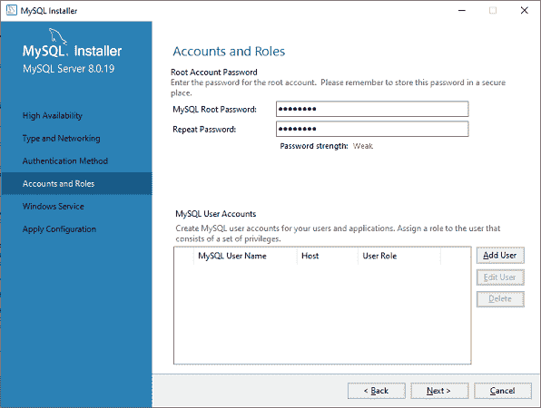

**步骤 11:** 下一个屏幕将要求您配置 Windows 服务。保留默认设置，然后单击下一步。

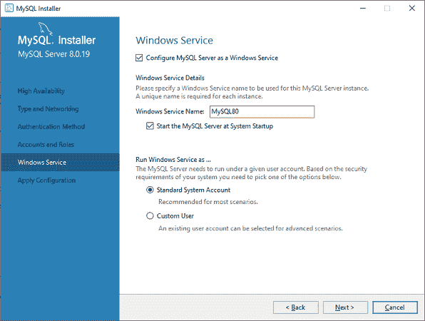

**步骤 12:** 在下一个屏幕中，系统将要求您应用服务器配置。对于此配置，单击执行按钮。

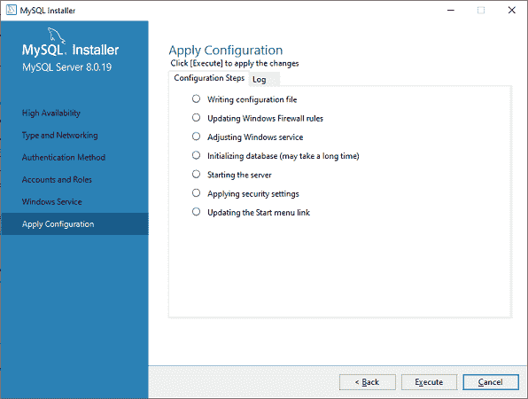

**第 13 步:**配置完成后，会出现下面的画面。现在，点击**完成**按钮继续。

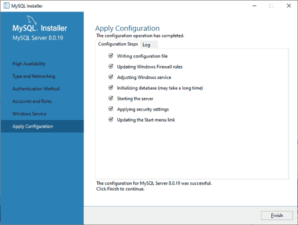

**第 14 步:**在下一屏，可以看到产品配置完成。保留默认设置，点击下一步- >完成按钮，完成 MySQL 包安装。

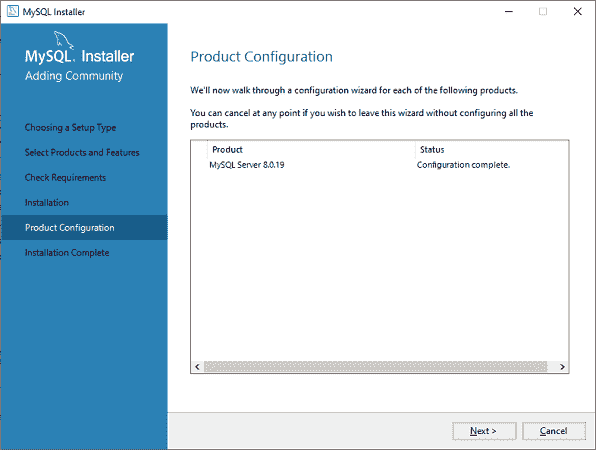

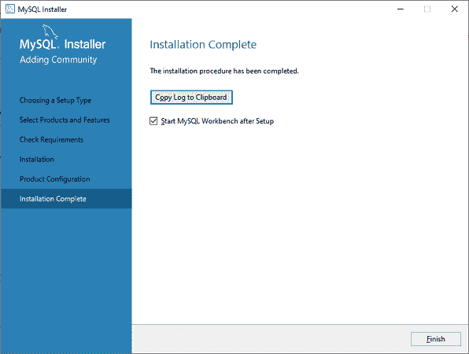

**第 15 步:**一旦点击完成按钮，MySQL Workbench 应该会在你的系统上打开，如下图所示。

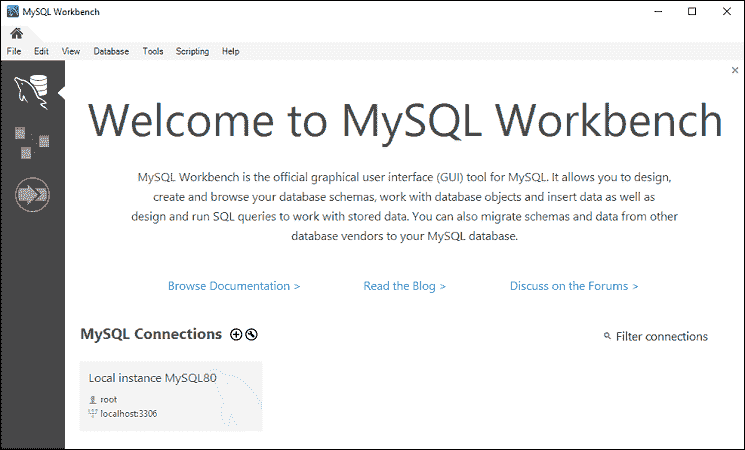

**步骤 16:** 在上面的画面中，需要进行连接。为此，双击由**红色箭头**指定的框。在这里，您将看到一个弹出屏幕，要求您输入安装过程中先前创建的密码。输入密码后，您可以连接到服务器。

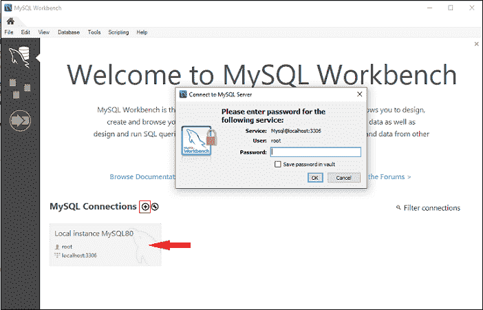

**步骤 17:** 如果没有连接，可以新建连接。要建立连接，请单击加号(+)图标或转到菜单栏- >数据库- >连接到数据库，出现以下屏幕。现在，你需要填写所有的细节。在这里，您必须确保输入的密码应该与您之前创建的密码相同。

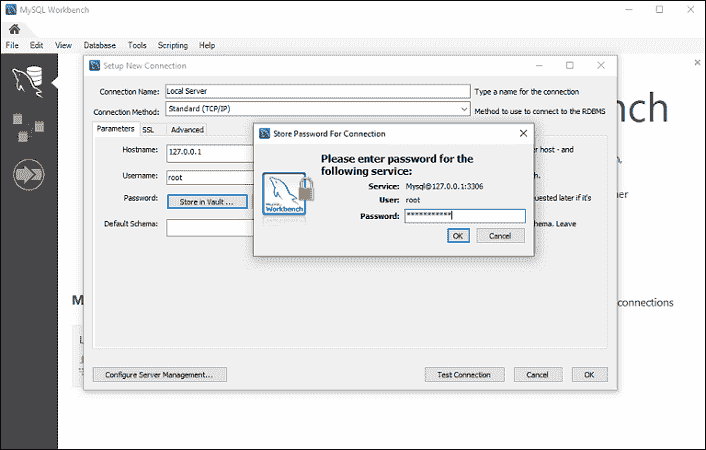

**第 18 步:**输入所有细节后，点击**测试连接**测试数据库连接。如果连接成功，您将看到以下屏幕。现在，点击确定- >确定按钮完成设置。

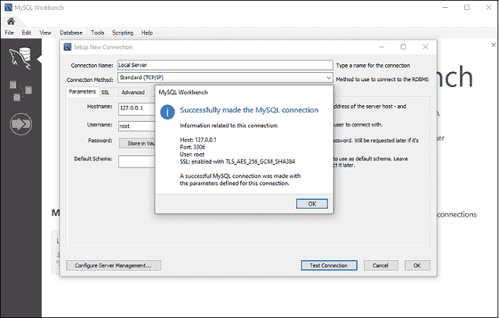

**步骤 19:** 完成所有设置后，会打开 MySQL Workbench 屏幕。现在，双击新创建的连接，您将看到下面的屏幕，在那里可以执行 SQL 命令。

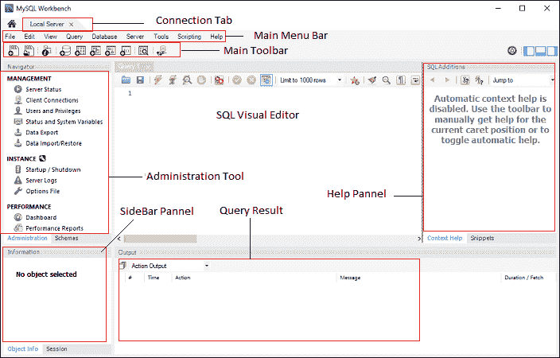

## MySQL 工作台管理工具

管理工具在保护公司数据方面发挥着重要作用。在这里，我们将讨论用户管理、服务器配置、数据库备份和恢复、服务器日志等等。

### 用户管理员

这是一个可视化工具，允许管理与活动的 MySQL Server 实例相关的用户。在这里，您可以添加和管理用户帐户，授予和删除权限，查看用户配置文件，以及使密码过期。

### 服务器配置

它允许服务器的高级配置。它提供了有关服务器和状态变量、线程数量、缓冲区分配大小、优化性能的微调等详细信息。

### 数据库备份和恢复

它是一个可视化工具，用于导入/导出 MySQL 转储文件。转储文件包含用于创建数据库、表、视图和存储过程的 SQL 脚本。

### 服务器日志

它通过每个连接选项卡显示 MySQL Server 的日志信息。对于每个连接选项卡，它都包括一个附加选项卡，用于显示常规错误日志。

### 性能仪表板

此选项卡提供服务器性能的统计视图。您可以通过导航到导航选项卡打开它，并在性能部分下选择仪表板。

## 创建、更改、删除数据库

在本节中，我们将看到如何使用 MySQL 工作台创建、修改和删除数据库。让我们一个一个详细看看。

### 创建数据库

要创建数据库，请执行以下步骤:

1.打开 MySQL 工作台，使用用户名和密码登录。然后，进入导航标签，点击**模式菜单**。在这里，您可以看到所有以前创建的数据库。

2.如果要新建数据库，右键单击模式菜单下的**创建模式**或点击数据库图标(红色矩形)，如下图所示。

3.新模式窗口屏幕打开。输入新的数据库名称(例如 mytestdb)，并使用默认的**排序规则**。排序规则用于存储特定的数据字符，主要用于存储外语。现在，点击应用按钮，如下图所示:

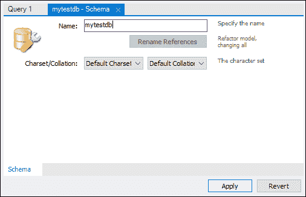

4.出现一个新的弹出窗口，单击应用->完成按钮创建一个新的数据库。

5.成功创建数据库后，您可以在“模式”菜单中看到这个新数据库。如果没有看到，请单击“模式”菜单中的刷新图标。

6.如果您想查看有关数据库的更多信息，请选择 mytestdb 数据库，然后单击“I”图标。信息窗口显示几个选项，如表、列、函数、用户等。

7.MySQL Workbench 不提供重命名数据库名称的选项，但是我们可以创建、更新和删除数据库中的表和数据行。

### 删除数据库

1.要删除数据库，需要选择数据库，右键点击，选择**删除模式**选项。出现以下屏幕:

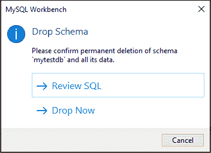

2.在弹出窗口中选择**立即删除**选项，数据库包括表格，数据行将从数据库服务器中删除。

## 创建、修改、删除表

在本节中，我们将看到如何使用 MySQL 工作台创建、修改和删除表。让我们一个一个详细看看。

### 创建表格

要创建表格，请执行以下步骤:

1.打开 MySQL 工作台，使用用户名和密码登录。然后，转到导航选项卡，并单击模式菜单。在这里，您可以看到所有以前创建的数据库。您也可以创建新的数据库。

2.选择新创建的数据库，双击它，您将获得数据库下的子菜单。数据库下的子菜单是表、视图、函数和存储过程，如下图所示。

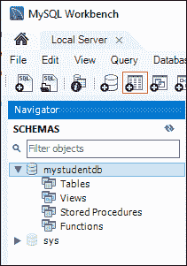

3.选择表格子菜单，右键点击选择**创建表格**选项。您也可以单击创建新表格图标(显示为红色矩形)来创建表格。

4.在新建表格屏幕上，您需要填写所有细节来创建表格。在这里，我们将输入表名(例如，student)并使用默认排序规则和引擎。

5.在中间窗口内单击并填写列详细信息。这里，列名包含主键(PK)、非空(NN)、唯一索引(UI)、二进制(B)、无符号数据类型(UN)、自动增量(AI)等多种属性。下面的屏幕解释得更清楚了。填写完所有细节后，点击**应用**按钮。

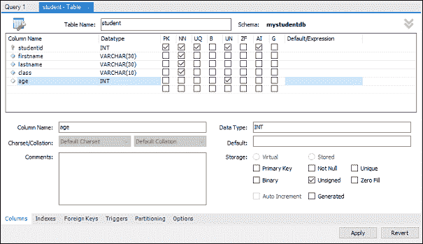

6.一旦您单击应用按钮，它将打开 SQL 语句窗口。再次单击应用按钮执行语句，单击完成按钮保存更改。

7.现在，转到模式菜单，选择包含新创建的表的数据库，如下图所示。

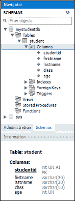

### 更改表格

要更改表，请执行以下步骤:

1.选择您想要修改的表格，点击“I”图标，您将看到以下屏幕。

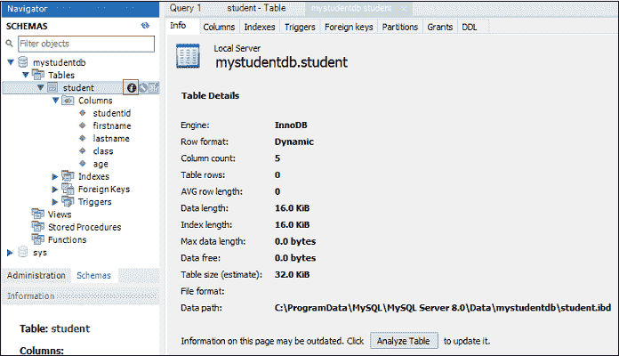

2.在上面的屏幕中，您可以修改列名、数据类型和其他表设置。

### 翻桌

1.要删除一个表，您需要选择该表，右键单击它，然后选择删除表选项。出现以下屏幕:

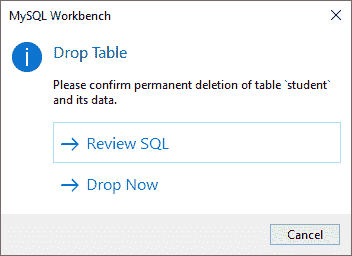

2.在弹出窗口中选择**立即删除**选项，立即从数据库中删除该表。

## MySQL 工作台插入、读取、更新、删除数据行

在本节中，我们将了解如何使用 MySQL 工作台插入、读取、更新和删除数据行。让我们一个一个详细看看。

1.打开 MySQL 工作台，使用用户名和密码登录。然后，转到导航选项卡，并单击模式菜单。在这里，我们已经使用 MySQL 工作台成功地创建了一个数据库(mystudentdb)和学生表。

2.选择表格，当我们将鼠标指针放在学生表格上时，您可以看到表格图标出现在这里。单击该表，将打开一个新窗口，其中上半部分显示 MySQL 语句，下半部分显示数据行。

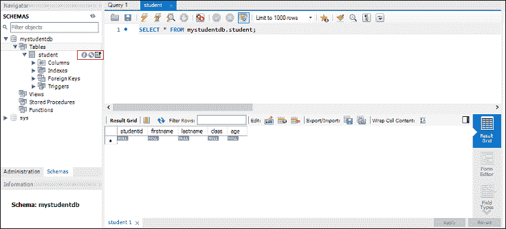

3.要输入数据行，请选择相应的列，然后插入数据值。在行中插入数据值类似于 Microsoft Excel 工作表。

4.输入数据行后，单击应用->应用>完成按钮保存数据行。

5.同样，我们可以编辑或修改以前保存的数据行。修改后，保存新值，点击应用按钮保存修改。它将生成一条 SQL update 语句，将更改保存到数据库中。

### 删除行

1.要从表中删除单个行，您需要选择一个数据行，右键单击该行前面的右侧图标，然后选择删除行选项。

2.现在，单击应用->应用->完成按钮将更改保存到数据库。

## MySQL 工作台导出和导入数据库(表)

在本节中，我们将学习如何使用 MySQL 工作台导出和导入数据库或表。

### 导出数据库(表)

1.要导出数据库或表，请转到菜单栏，单击服务器，然后选择数据导出选项，如下屏幕所示。将打开**数据导出**设置和选项的新窗口。

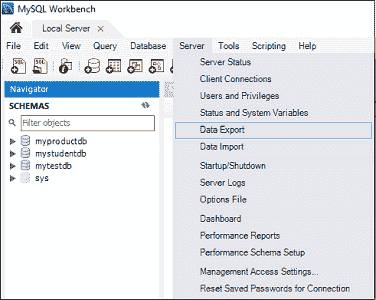

2.选择任何数据库，它将显示所选数据库下的所有对应表。在这里，我们还可以选择一个或多个数据库复选框，将数据库包含在导出文件中。同样，我们可以从窗口的左侧部分选择一个或多个表。

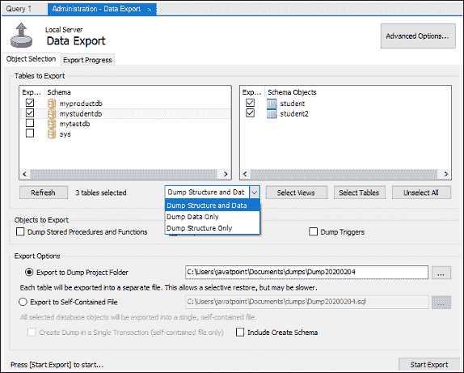

3.让我们选择两个数据库，即(myproductdb 和 mystudentdb)，包括该数据库下的所有表。现在，转到下拉设置，我们可以选择“转储结构和数据”、“仅转储数据”和“仅转储结构”选项。

*   **转储数据和结构:**将保存表结构和数据行。
*   **仅转储数据:**它将仅保存表中插入的行。
*   **只转储结构:**只保存表结构，表结构是我们定义的数据库列和数据类型。

4.在“导出”选项中，您可以选择您选择的导出路径。在这里，我将保持默认设置。此外，下面解释了两个单选按钮。

*   **导出到转储项目文件夹:**它会将所有表保存为一个文件夹下的单独的 SQL 文件。当您逐个表地导入或恢复导出文件时，这将非常有用。
*   **导出到自包含文件:**它将所有数据库和表存储在一个 SQL 文件中。当您想要使用单个 SQL 文件导入所有数据库、表和数据行时，这是一个很好的选择。

5.单击开始导出按钮，显示进度条和日志。现在，打开系统中的“文档”文件夹，找到导出文件。

### 导入数据库(表)

1.要导入数据库或表格，进入菜单栏，点击服务器，选择**数据导入**选项。它将打开一个数据导入设置和选项的新窗口。

2.在这里，您可以看到导入数据库和表的两个单选选项，它们是:

*   从转储项目文件夹导入
*   使用独立文件导入

3.我们将选择“从转储项目文件夹导入”，然后单击“加载文件夹内容”以显示项目文件夹中的所有可用数据库。

4.从数据导入选项中选择 **myproductdb** 数据库，并选择相应的产品表。

5.选择“转储结构和数据”选项，点击**开始导入**按钮，从备份文件中导入数据库和表。

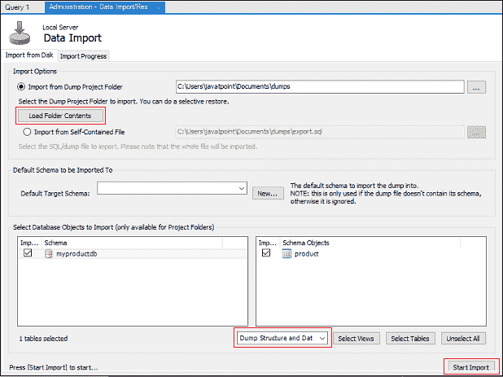

6.现在，转到 Schema->myproductdb->表，并刷新它以查看当前导入的数据库或表。

* * *