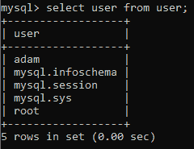
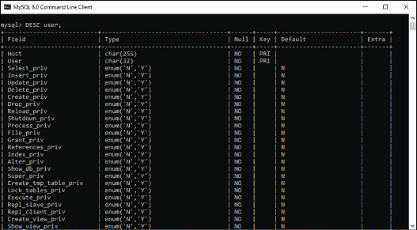
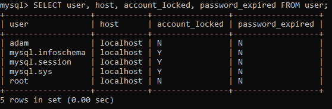
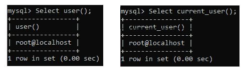
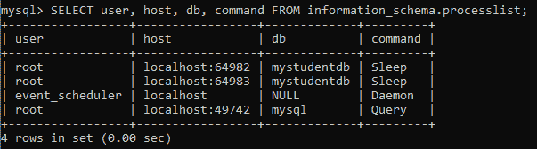

# 显示用户/列出所有用户

> 原文：<https://www.javatpoint.com/mysql-show-users>

有时候你想在 MySQL 中管理一个数据库。在这种情况下，我们需要查看数据库中所有用户帐户的列表。大多数情况下，我们假设有一个类似于 SHOW DATABASES、SHOW TABLES 等的 **SHOW USERS** 命令。用于显示数据库服务器中所有可用用户的列表。不幸的是，MySQL 数据库没有 SHOW USERS 命令来显示 MySQL Server 中所有用户的列表。我们可以使用以下查询来查看数据库服务器中所有用户的列表:

```

mysql> Select user from mysql.user;

```

成功执行上述语句后，我们将从 MySQL 数据库服务器的用户表中获取用户数据。

让我们看看如何使用这个查询。首先，我们要使用 **mysql 客户端工具**打开 [MySQL](https://www.javatpoint.com/mysql-tutorial) 服务器，以管理员身份登录服务器数据库。执行以下查询:

```

> mysql -u root -p
Enter password: *********
mysql> use mysql;
Database changed
mysql> SELECT user FROM user;

```

我们将获得以下输出，在这里我们可以看到本地数据库中的**五个**用户:



如果我们想查看用户表的更多信息，请执行以下命令:

```

mysql> DESC user;

```

它将给出以下输出，列出 **mysql.user** 数据库的所有可用列:



要获取所选信息，如主机名、密码过期状态和帐户锁定，请执行以下查询:

```

mysql> SELECT user, host, account_locked, password_expired FROM user;

```

成功执行后，它将给出以下输出:



## 显示当前用户

我们可以使用 **user()或 current_user()** 功能获取当前用户的信息，如下图所示:

```

mysql> Select user();
         or,
mysql> Select current_user();

```

执行上述命令后，我们将获得以下输出:



## 显示当前登录的用户

通过在 MySQL Server 中使用以下查询，我们可以在数据库服务器中看到当前登录的用户:

```

mysql> SELECT user, host, db, command FROM information_schema.processlist;

```

上面的命令给出了如下所示的输出:



在这个输出中，我们可以看到当前有**四个**用户登录数据库，其中一个用户正在执行**查询**，其他用户显示在**睡眠或守护程序**状态。

* * *