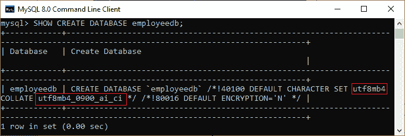
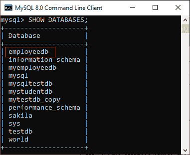
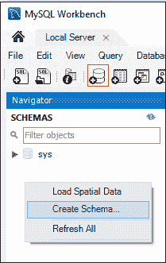
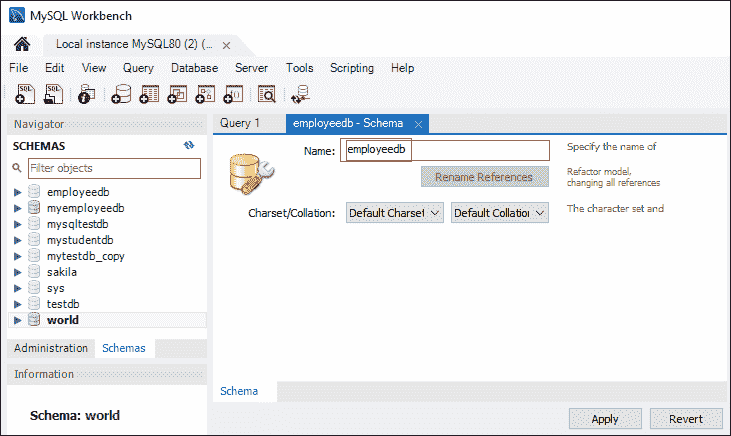
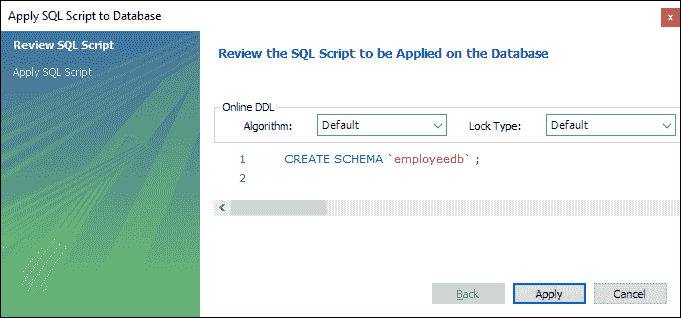
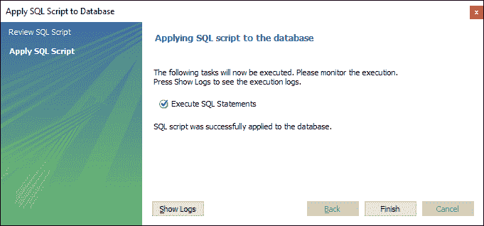
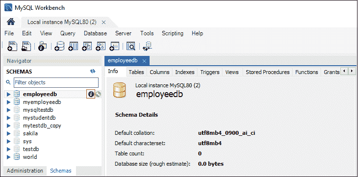

# 创建数据库

> 原文：<https://www.javatpoint.com/mysql-create-database>

数据库用于以有组织的形式存储记录集合。它允许我们将数据保存到表、行、列和索引中，以便频繁地查找相关信息。我们可以很容易地通过数据库访问和管理记录。

[MySQL](https://www.javatpoint.com/mysql-tutorial) 将数据库实现为目录，以表的形式存储所有文件。它允许我们主要以两种方式创建数据库**:**

 **1.  MySQL 命令行客户端
2.  MySQL 工作台

### MySQL 命令行客户端

我们可以使用以下语法的 **CREATE DATABASE** 语句在 MySQL 中创建新的数据库:

```
CREATE DATABASE [IF NOT EXISTS] database_name
[CHARACTER SET charset_name]
[COLLATE collation_name];

```

**参数说明**

上述语法的参数描述如下:

| 参数 | 描述 |
| 数据库名称 | 它是新数据库的名称，在 MySQL Server 实例中应该是唯一的。当我们创建一个已经存在的数据库时， **IF NOT EXIST** 子句避免了一个错误。 |
| 字符集名称 | 它是可选的。它是用来存储字符串中每个字符的字符集的名称。MySQL 数据库服务器支持很多字符集。如果我们不在语句中提供这一点，MySQL 将采用默认字符集。 |
| 排序规则名称 | 比较特定字符集的字符是可选的。 |

**例**

让我们借助一个例子来理解如何在 MySQL 中创建一个数据库。打开 MySQL 控制台，写下密码，如果我们在安装过程中设置过的话。现在我们准备创建一个数据库。这里，我们将使用以下语句创建一个数据库名称**“employeedb”**:

```
mysql> CREATE DATABASE employeesdb;

```

它看起来像下面的输出:


我们可以使用下面的查询来查看新创建的数据库，该查询返回数据库的名称、字符集和排序规则:

```
mysql> SHOW CREATE DATABASE employeedb; 

```



我们可以使用以下查询来检查创建的数据库:

```
mysql> SHOW DATABASES;  

```

执行上述查询后，我们可以在服务器中看到所有创建的数据库。



最后，我们可以使用下面的命令来访问数据库，该数据库使我们能够创建一个表和其他数据库对象。

```
mysql> USE emplyeedb; 

```

#### 注意:所有数据库名称、表名称和表字段名称都区分大小写。在给出任何 SQL 命令时，我们必须使用正确的名称。

### MySQL 工作台

它是一个可视化的数据库设计或图形用户界面工具，用于与数据库架构师、开发人员和数据库管理员一起工作。这个可视化工具支持 [SQL](https://www.javatpoint.com/sql-tutorial) 开发、数据建模、数据迁移，以及用于服务器配置、用户管理、备份等的综合管理工具。它允许我们创建新的物理数据模型、E-R 图和 SQL 开发(运行查询等)。).

要使用这个工具创建一个新的数据库，我们首先需要启动 [MySQL 工作台](https://www.javatpoint.com/mysql-workbench)，并使用您想要的用户名和密码登录。它将显示以下屏幕:


现在，为数据库创建执行以下步骤:

1.进入导航标签，点击**模式菜单**。在这里，我们可以看到所有以前创建的数据库。如果我们想创建一个新的数据库，右键单击模式菜单，选择创建模式，或者单击数据库**图标(红色矩形)**，如下图所示。



2.新模式窗口屏幕打开。输入新的数据库名称(例如 **employeedb** )并使用默认字符集和排序规则。现在，点击应用按钮，如下图所示:



3.将出现一个新的弹出窗口。点击**应用**按钮。



4.将出现一个新的弹出屏幕。点击**完成**按钮，完成数据库创建。



5.成功创建数据库后，我们可以在“模式”菜单中看到新的数据库。如果我们没有看到这个，点击**刷新图标**进入模式菜单。

6.我们可以通过选择数据库并点击**‘I’**图标来查看更多关于数据库的信息。信息窗口显示几个选项，如表、触发器、索引、用户等。



7.MySQL Workbench 不提供重命名数据库名称的选项，但是我们可以创建、更新和删除数据库中的表和数据行。

* * ***