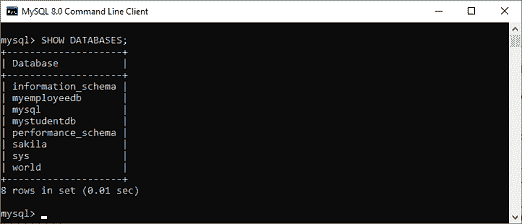
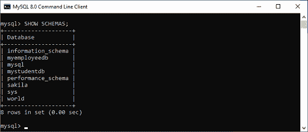
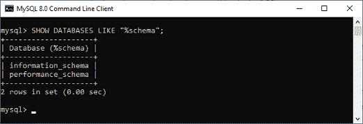
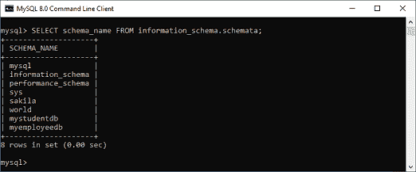
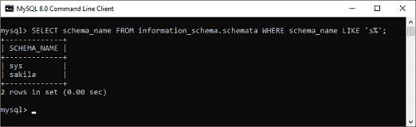

# 显示/列出数据库

> 原文：<https://www.javatpoint.com/mysql-show-list-databases>

当我们使用 MySQL 服务器时，一个常见的任务是显示或列出数据库，显示特定数据库的表，以及服务器上用户帐户及其权限的信息。在本文中，我们将重点讨论如何在 MySQL 服务器中列出数据库。

我们可以使用以下命令列出 MySQL 服务器主机上所有可用的数据库，如下所示:

```

mysql> SHOW DATABASES;

```

打开出现 **mysql >提示**的 MySQL 命令行客户端。接下来，**使用您在安装 MySQL 时创建的**密码**登录到 MySQL 数据库服务器。现在，您已经连接到了 MySQL 服务器主机，在这里您可以执行所有的 SQL 语句。最后，运行 SHOW Databases 命令来列出/显示数据库。**

我们可以看到以下输出，更清楚地解释了这一点:



MySQL 还允许我们使用另一个命令来列出数据库，这是一个 **SHOW SCHEMAS** 语句。这个命令是 SHOW DATABASES 的同义词，并给出相同的结果。我们可以通过以下输出来理解它:



### 使用模式匹配列出数据库

MySQL 中的 Show Databases 命令还提供了一个选项，允许我们使用与 **LIKE** 和 **WHERE** 子句不同的模式匹配来过滤返回的数据库。LIKE 子句列出了与指定模式匹配的数据库名称。WHERE 子句提供了更大的灵活性，可以列出与 SQL 语句中给定条件相匹配的数据库。

**语法**

以下是在“显示数据库”命令中使用模式匹配的语法:

```

mysql> SHOW DATABASES LIKE pattern;
OR,
mysql> SHOW DATABASES WHERE expression;

```

我们可以通过下面给出的例子来理解，其中**百分比(%)符号**假设零、一或多个字符:

```

mysql> SHOW DATABASES LIKE "%schema";

```

上面的语句将给出以下输出:



有时候 LIKE 子句是不够的；然后，我们可以进行更复杂的搜索，从信息模式中的 schemata 表查询数据库信息。MySQL 中的信息模式是一个信息数据库，因此我们可以使用它来使用 SHOW DATABASES 命令获得输出。

```

mysql> SELECT schema_name FROM information_schema.schemata;

```

该语句将给出与 SHOW DATABASES 命令相同的结果:



现在，我们将看到如何在 SHOW DATABASES 命令中使用 WHERE 子句。该语句返回模式名以**“s”:**开头的数据库

```

mysql>SELECT schema_name FROM information_schema.schemata WHERE schema_name LIKE 's%';

```

它将给出以下输出:



#### 注意:需要注意的是，如果 MySQL 服务器以“- skip-show-database”选项启动，我们就不能使用 SHOW DATABASES 命令，除非我们有 SHOW DATABASES 权限。

* * *