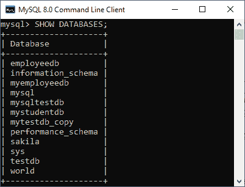
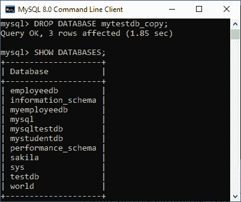
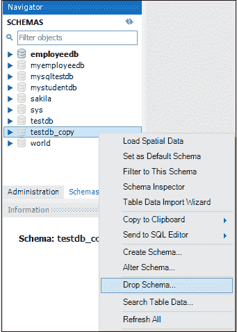
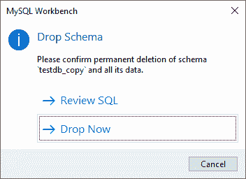
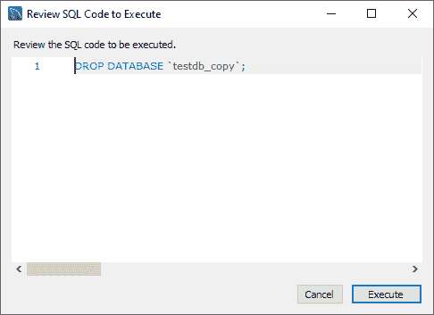
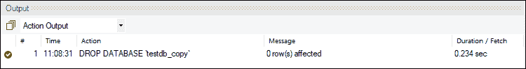

# MySQL DROP 数据库

> 原文：<https://www.javatpoint.com/mysql-drop-database>

我们可以使用 MySQL DROP DATABASE 命令快速删除/删除/移除 MySQL 数据库。它将永久删除数据库以及所有表、索引和约束。因此，在删除 MySQL 中的数据库时，我们必须非常小心，因为我们将丢失数据库中所有可用的数据。如果数据库在 MySQL Server 中不可用，DROP DATABASE 语句将引发一个错误。

[MySQL](https://www.javatpoint.com/mysql-tutorial) 允许我们主要通过**两种方式删除/删除/移除数据库:**

*   MySQL 命令行客户端
*   MySQL 工作台

### MySQL 命令行客户端

我们可以使用具有以下语法的 DROP DATABASE 语句来删除 MySQL 中的现有数据库:

```
DROP DATABASE [IF EXISTS] database_name;  

```

在 MySQL 中，我们也可以使用下面的语法删除数据库。因为**模式**是数据库的同义词，所以我们可以互换使用。

```
DROP SCHEMA [IF EXISTS] database_name;  

```

**参数说明**

上述语法的参数描述如下:

| 参数 | 描述 |
| 数据库名称 | 它是我们要从服务器中删除的现有数据库的名称。它在 MySQL Server 实例中应该是唯一的。 |
| 如果存在 | 它是可选的。它用于防止在删除不存在的数据库时出错。 |

**例**

借助一个例子，让我们了解如何在 MySQL 中删除一个数据库。打开 MySQL 控制台，写下密码，如果我们在安装过程中设置过的话。现在我们准备删除一个数据库。

接下来，使用 **SHOW DATABASES** 语句查看服务器中所有可用的数据库:



假设我们要删除名为**“my testdb _ copy”**的数据库。执行以下语句:

```
DROP DATABASE mytestdb_copy;

```

现在，我们可以通过执行以下查询来验证我们的数据库是否被删除。它看起来像这样:



从上面，我们可以看到数据库“mytestdb_copy”被成功删除。

#### 注意:所有数据库名称、表名称和表字段名称都区分大小写。在给出任何 SQL 命令时，我们必须使用正确的名称。

### 使用 MySQL 工作台删除数据库

要使用此工具删除数据库，我们首先需要启动 [MySQL 工作台](https://www.javatpoint.com/mysql-workbench)，并使用**用户名**和**密码**登录 MySQL Server。它将显示以下屏幕:


现在对数据库删除执行以下步骤:

1.进入导航标签，点击**模式菜单**。在这里，我们可以看到所有以前创建的数据库。如果要删除数据库，右键单击要删除的数据库，例如模式菜单下的 **testdb_copy** ，选择**删除模式**选项，如下图。



当我们单击删除模式选项时，MySQL 工作台会显示一个对话框来确认删除过程。如果我们选择**检查 SQL** ，它将生成将要执行的 [SQL](https://www.javatpoint.com/sql-tutorial) 语句。如果我们选择**立即删除**选项，数据库将被永久删除。



如果我们希望安全删除数据库，则需要选择“查看 SQL”选项。确定后，单击执行按钮执行该语句。下面的屏幕解释得更清楚:



一旦我们单击执行按钮，MySQL 将返回以下消息，指示数据库已成功删除。由于数据库 testdb_copy 是一个空数据库，因此受影响的行数为零。



如果我们验证 schemas 选项卡，我们将不再在列表中找到 testdb_copy 数据库。

* * *