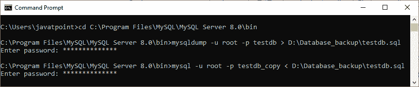
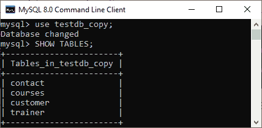

# MySQL 复制数据库

> 原文：<https://www.javatpoint.com/mysql-copy-database>

数据库是用于存储用户可以访问和管理的有组织的记录集合的应用程序。它将数据保存到表、行、列和索引中，以快速找到相关信息。

MySQL 复制或克隆数据库是允许我们创建一个现有数据库的**副本的功能，包括表结构、索引、约束、默认值等。当我们的数据库不小心**丢失或故障**时，将原始数据库复制到新数据库非常有用。制作数据库副本最常见的用途是进行数据备份。当计划对原始数据库的结构进行重大更改时，它也很有用。**

在 [MySQL](https://www.javatpoint.com/mysql-tutorial) 中，克隆原始数据库是一个**三步走的过程:**首先，原始数据库记录被转储(复制)到一个临时文件中，该文件保存了用于将数据重新插入新数据库的 SQL 命令。其次，需要创建一个新的数据库。最后，处理 [SQL](https://www.javatpoint.com/sql-tutorial) 文件，并将数据复制到新的数据库中。

我们需要按照以下步骤将一个数据库复制到另一个数据库:

1.  首先，使用 **CREATE DATABASE** 语句创建一个新的数据库。
2.  其次，将数据存储到 **SQL 文件**中。我们可以给这个文件起任何名字，但是它必须以**结尾。sql** 扩展。
3.  第三，使用 **mysqldump** 工具导出所有要复制的数据库对象及其数据，然后将该文件导入新数据库。

为了演示，我们将使用以下步骤将 **testdb** 数据库复制到 **testdb_copy** 数据库:

打开 MySQL 控制台，写下密码，如果我们在安装过程中设置过的话。现在，我们准备使用下面的命令创建 testdb 的重复数据库:

```

mysql> CREATE DATABASE testdb_copy;

```

接下来，使用 SHOW DATABASES 语句进行验证:

```

mysql> SHOW DATABASES;

```

该命令将返回服务器中所有可用的数据库，我们可以在红色矩形框中看到新创建的数据库:


现在，打开一个 DOS 或终端窗口，在命令行上访问 MySQL 服务器。例如，如果我们已经在 **C 文件夹**中安装了 MySQL，复制以下文件夹并粘贴到我们的 DOS 命令中。然后，按下**进入**键。

```

C:\Users\javatpoint> CD C:\Program Files\MySQL\MySQL Server 8.0\bin  

```

在下一步中，我们需要使用 mysqldump 工具将数据库对象和数据复制到 SQL 文件中。假设我们想要将 testdb 的数据库对象和数据转储(复制)到位于 **D:\Database_backup 文件夹的一个 SQL 文件中。**为此，执行以下语句:

```

mysqldump -u root -p testdb > D:\Database_backup\testdb.sql
Enter password: **********

```

上面的语句指示 mysqldump 工具使用用户名和密码登录 MySQL 数据库服务器，然后将 testdb 数据库的数据库对象和数据导出到**D:\ Database _ backup \ testdb . SQL .**需要注意的是，用于将数据库从一个位置导出到另一个位置的操作符(>)。

在下一步中，我们需要将 D:\Database_backup\testdb.sql 文件导入 testdb_copy 数据库。为此，请执行以下语句:

```

mysql -u root -p testdb_copy < D:\Database_backup\testdb.sql
Enter password: **********

```

需要注意的是，用于将数据库从一个位置导入到另一个位置的运算符(



最后，我们可以使用 MySQL 命令行工具中的 **SHOW TABLES** 命令来验证上述操作是否成功:

```

mysql> SHOW TABLES;

```



在这个输出中，我们可以看到从 testdb 数据库到 testdb_copy 数据库的所有对象和数据都已成功复制。

* * *