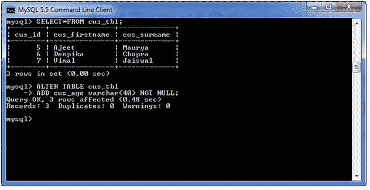
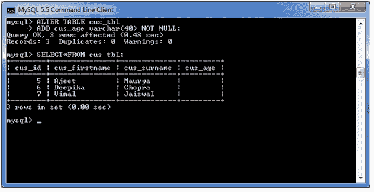
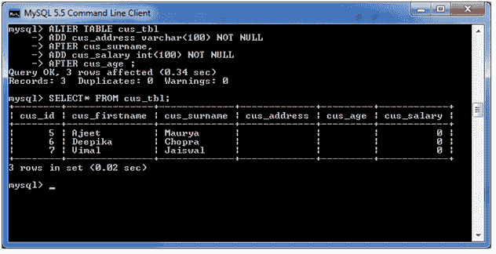
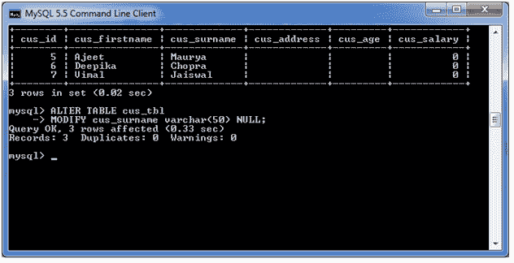
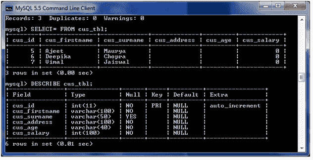
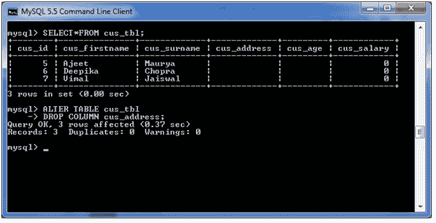
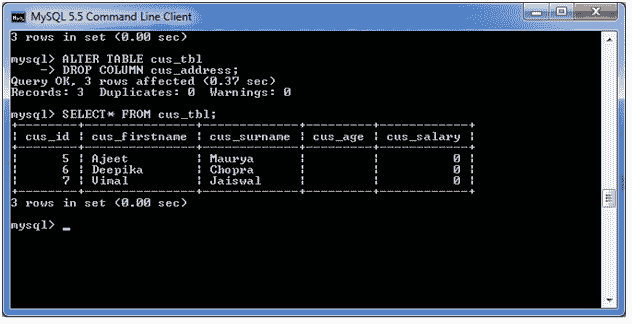
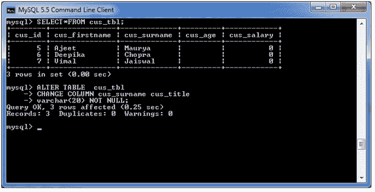
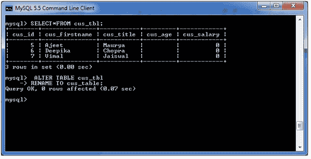
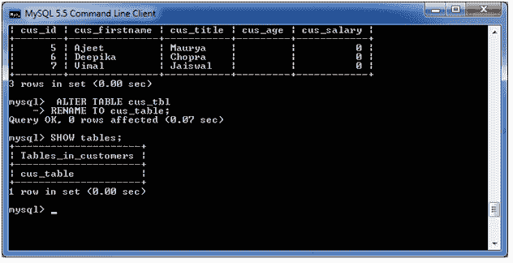

# MySQL ALTER Table

> 原文：<https://www.javatpoint.com/mysql-alter-table>

当您想要更改表或任何表字段的名称时，使用 MySQL ALTER 语句。它还用于添加或删除表中的现有列。

ALTER 语句总是根据情况与“添加”、“删除”和“修改”命令一起使用。

## 1)在表中添加一列

**语法:**

```sql
ALTER TABLE table_name
ADD new_column_name column_definition
[ FIRST | AFTER column_name ];

```

## 因素

**表名:**指定要修改的表的名称。

**new_column_name:** 指定要添加到表中的新列的名称。

**列 _ 定义:**指定列的数据类型和定义(NULL 或 NOT NULL 等)。

**FIRST | AFTER 列 _name:** 可选。它告诉 MySQL 在表中的什么位置创建列。如果未指定此参数，新列将被添加到表的末尾。

**示例:**

在本例中，我们在现有的表“cus_tbl”中添加了一个新列“cus_age”。

使用以下查询来完成此操作:

```sql
ALTER TABLE cus_tbl
ADD cus_age varchar(40) NOT NULL;

```

**输出:**



**见最近新增栏目:**

```sql
SELECT* FROM cus_tbl;

```

**输出:**



## 2)在表中添加多列

**语法:**

```sql
 ALTER TABLE table_name
 ADD new_column_name column_definition
 [ FIRST | AFTER column_name ],
ADD new_column_name column_definition
[ FIRST | AFTER column_name ],
  ...
;

```

**示例:**

在本例中，我们在现有的表“cus_tbl”中添加了两个新列“cus_address”和“cus_salary”。cus_address 添加在 cus _ 姓氏列之后，cus_salary 添加在 cus_age 列之后。

**使用以下查询来完成:**

```sql
ALTER TABLE cus_tbl
ADD cus_address varchar(100) NOT NULL
AFTER cus_surname,
ADD cus_salary int(100) NOT NULL
AFTER cus_age ;

```


**查看最近新增的栏目:**

```sql
SELECT* FROM cus_tbl;

```



## 3)表中的 MODIFY 列

MODIFY 命令用于更改表的列定义。

**语法:**

```sql
ALTER TABLE table_name
MODIFY column_name column_definition
[ FIRST | AFTER column_name ];

```

**示例:**

在本例中，我们将列 cus _ 姓氏修改为 varchar(50)的数据类型，并强制该列允许空值。

**使用以下查询来完成:**

```sql
ALTER TABLE cus_tbl
MODIFY cus_surname varchar(50) NULL;

```



**见表结构:**



## 4)表中的 DROP 列

**语法:**

```sql
ALTER TABLE table_name
DROP COLUMN column_name;

```

让我们举一个例子，从表“cus_tbl”中删除列名“cus_address”。

**使用以下查询来完成:**

```sql
ALTER TABLE cus_tbl
DROP COLUMN cus_address;

```

**输出:**



**见表结构:**



## 5)重命名表中的列

**语法:**

```sql
ALTER TABLE table_name
CHANGE COLUMN old_name new_name 
column_definition
[ FIRST | AFTER column_name ]

```

**示例:**

在本例中，我们将把列名“cus _ 姓氏”改为“cus_title”。

**使用以下查询来完成:**

```sql
 ALTER TABLE  cus_tbl
CHANGE COLUMN cus_surname cus_title
varchar(20) NOT NULL;

```

**输出:**



## 6) RENAME 表

**语法:**

```sql
ALTER TABLE table_name
RENAME TO new_table_name;

```

**示例:**

在本例中，表名 cus_tbl 被重命名为 cus_table。

```sql
ALTER TABLE cus_tbl
RENAME TO cus_table;

```

**输出:**



**见更名表:**



* * *