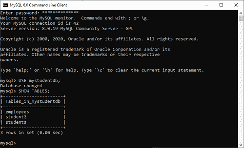
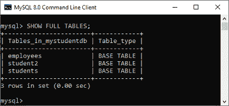
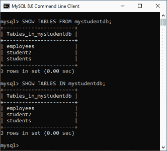
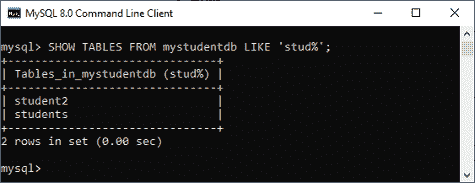
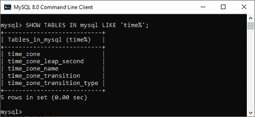
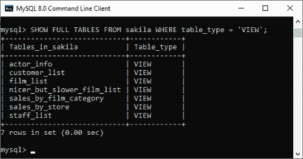
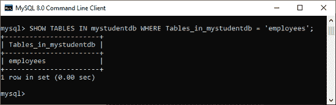

# MySQL 显示/列表表

> 原文：<https://www.javatpoint.com/mysql-show-list-tables>

当我们有许多包含各种表的数据库时，显示或列表表非常重要。有时许多数据库中的表名是相同的；在这种情况下，这个查询非常有用。我们可以使用以下语句获得数据库的表信息数量:

```sql

mysql> SHOW TABLES;

```

获取表列表需要以下步骤:

**第一步:**打开出现 **mysql >提示**的 MySQL 命令行客户端。接下来，**使用您在安装 MySQL 期间创建的**密码**登录到 MySQL 数据库服务器。现在，您已经连接到了 MySQL Server，在这里您可以执行所有的 SQL 语句。**

**步骤 2:** 接下来，使用下面的命令选择特定的数据库:

```sql

mysql> USE database_name;

```

**步骤 3:** 最后，执行 SHOW TABLES 命令。

让我们用下面给出的例子来理解它。假设我们有一个包含许多表的数据库名“ **mystudentdb** ”。然后执行下面的语句列出它包含的表:

```sql

mysql> USE mystudentdb;
mysql>SHOW TABLES;

```

以下输出更清楚地解释了这一点:



我们还可以将 **FULL 修饰符**与 SHOW TABLES 查询一起使用，以获取出现在第二个输出列中的表的类型(基本或视图)。

```sql

mysql> SHOW FULL TABLES;

```

该语句将给出以下输出:



如果我们想显示或列出不同数据库的表名，或者不切换就不连接的数据库的表名，MySQL 允许我们在数据库名后面使用 from 或 IN 子句。以下陈述更清楚地解释了这一点:

```sql

mysql> SHOW TABLES IN database_name;

```

上述声明也可以写成:

```sql

mysql> SHOW TABLES FROM database_name;

```

当我们执行下面的语句时，我们将得到相同的结果:

```sql

mysql> SHOW TABLES FROM mystudentdb;
OR,
mysql> SHOW TABLES IN mystudentdb;

```

**输出:**



### 使用模式匹配显示表格

MySQL 中的 Show Tables 命令还提供了一个选项，允许我们使用 LIKE 和 WHERE 子句的不同模式匹配来过滤**返回的表。**

 ****语法**

以下是在 show table 命令中使用模式匹配的语法:

```sql

mysql> SHOW TABLES LIKE pattern;
OR,
mysql> SHOW TABLES WHERE expression;

```

我们可以通过下面给出的例子来理解它，其中 percent (%)符号假设零个、一个或多个字符:

```sql

mysql> SHOW TABLES FROM mystudentdb LIKE "stud%";

```

上面的语句将给出以下输出:



让我们看看另一个返回以**“时间”**开头的表名的语句:

```sql

mysql> SHOW TABLES IN mysql LIKE "time%"; 

```

上面的查询将给出以下输出:



现在，我们将了解如何将 **WHERE** 子句与 SHOW TABLES 命令一起使用，以列出所选数据库中不同类型的表(基本或视图类型):

```sql

mysql> SHOW TABLES FROM sakila WHERE table_type= "VIEW";

```

该语句给出以下输出:



请注意，如果 MySQL 不提供访问基本表或视图的权限，那么我们就无法在 SHOW TABLES 命令的结果集中获得表。

在这里，我们还可以看到带有 WHERE 子句的 Show Tables 语句的另一个示例:

```sql

mysql> SHOW TABLES In mystudentdb WHERE Tables_in_mystudentdb= "employees";

```

它将给出以下输出:



* * ***