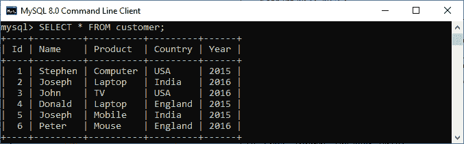
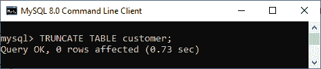
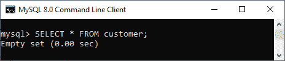

# MySQL 截断表

> 原文：<https://www.javatpoint.com/mysql-truncate-table>

MySQL 中的 TRUNCATE 语句删除了完整的数据，但没有删除其结构。它是 **DDL 或数据定义语言** **命令**的一部分。通常，当我们想从表中删除整个数据而不删除表结构时，我们使用这个命令。

TRUNCATE 命令的工作方式与 DELETE 命令相同，不使用从表中删除完整行的 [WHERE 子句](https://www.javatpoint.com/mysql-where)。然而，与 [DELETE](https://www.javatpoint.com/mysql-delete) 命令相比，TRUNCATE 命令效率更高，因为它删除并重新创建表，而不是一次删除一条记录。由于此命令在内部删除并重新创建表，因此受 truncate 语句影响的行数为零，而 delete 语句返回已删除的行数。

该命令在执行过程中不维护事务日志。它解除分配数据**页而不是行**，并为解除分配页而不是事务日志中的行创建一个条目。该命令还锁定页面而不是行；因此，它需要更少的锁和资源。

使用 TRUNCATE 命令时，必须考虑以下几点:

*   我们不能在这个命令中使用 **WHERE** 子句，这样就不可能过滤记录。
*   我们**在执行此命令后无法回滚删除的数据**，因为在执行此操作时没有维护日志。
*   当表被**外键**引用或者参与到**索引视图**中时，我们不能使用 truncate 语句。
*   TRUNCATE 命令不会触发 DELETE **触发器**，该触发器与正在被截断的表相关联，因为它不对单个行进行操作。

### 句法

以下语法解释了从表中删除数据的 TRUNCATE 命令:

```
TRUNCATE [TABLE] table_name;

```

在这个语法中，首先，我们将指定**表名**我们要删除哪些数据。语法中的 TABLE 关键字不是必需的。但是使用它来区分 **TRUNCATE** ()函数和 **TRUNCATE TABLE 语句**是一个很好的做法。

### MySQL 截断表示例

让我们通过一个例子来演示如何截断表。首先，我们将使用下面的语句创建一个名为“**客户**”的表:

```
CREATE TABLE customer (  
    Id int PRIMARY KEY NOT NULL,   
    Name varchar(45) NOT NULL,   
    Product varchar(45) DEFAULT NULL,   
    Country varchar(25) DEFAULT NULL,   
    Year int NOT NULL  
);  

```

接下来，我们将使用下面的语句向该表添加值:

```
INSERT INTO customer ( Id, Name, Product, Country, Year)   
VALUES (1, 'Stephen', 'Computer', 'USA', 2015),   
(2, 'Joseph', 'Laptop', 'India', 2016),   
(3, 'John', 'TV', 'USA', 2016),  
(4, 'Donald', 'Laptop', 'England', 2015),  
(5, 'Joseph', 'Mobile', 'India', 2015),  
(6, 'Peter', 'Mouse', 'England', 2016);

```

现在，通过执行 [**SELECT 语句**](https://www.javatpoint.com/mysql-select) 来验证该表是否插入了记录:

```
mysql> SELECT * FROM customer;  

```

我们将获得如下所示的输出:



现在，使用上面讨论的 TRUNCATE 语法执行以下截断表客户的语句:

```
mysql> TRUNCATE TABLE customer;

```

成功执行后，我们将获得以下输出:



我们可以看到，这个查询返回 **0 行受影响**即使所有的表记录都被删除。我们可以通过再次执行 SELECT 语句来验证数据的删除。此命令给出以下输出，显示表中不存在任何记录:



### 如何用外键截断表？

如果我们对使用外键约束的表执行 TRUNCATE 操作，我们将得到以下错误:

```
ERROR 1217 (23000): Cannot delete or update a parent row: a foreign key constraint fails

```

在这种情况下，我们需要登录 [MySQL](https://www.javatpoint.com/mysql-tutorial) 服务器，**禁用外键**检查，然后执行如下 TRUNCATE 语句:

```
SET FOREIGN_KEY_CHECKS=0;

```

现在，我们能够截断表格。执行后，**重新启用外键**检查如下:

```
SET FOREIGN_KEY_CHECKS=1;

```

### 如何截断 MySQL 中的所有表？

MySQL 中的 TRUNCATE 语句一次只删除一个表。如果我们想要删除多个表，我们需要执行单独的 TRUNCATE 语句。下面的例子展示了如何在 MySQL 中截断多个表:

```
TRUNCATE TABLE table_name1;
TRUNCATE TABLE table_name2;
TRUNCATE TABLE table_name3;

```

我们还可以使用下面的 SQL 查询，该查询使用数据库中的表名一次生成几个 TRUNCATE TABLE 命令:

```
SELECT Concat('TRUNCATE TABLE ', TABLE_NAME)
FROM INFORMATION_SCHEMA.TABLES
WHERE table_schema = 'database_name';

```

* * *