# MySQL DESCRIBE TABLE

> 原文：<https://www.javatpoint.com/mysql-describe-table>

description 是指详细显示信息。由于我们在 MySQL 中有表，所以我们将使用**description 命令来显示我们的表**的结构，例如列名、对列名的约束等。 **DESC** 命令是 description 命令的简称。DESCription 和 desc 命令都是等效的，并且区分大小写。

### 句法

以下是显示表结构的语法:

```sql

{DESCRIBE | DESC} table_name;

```

**我们可以使用以下步骤来显示表格的所有列**:

**第一步:**登录 MySQL 数据库服务器。

**步骤 2:** 切换到特定的数据库。

**步骤 3:** 执行 description 语句。

让我们借助一个示例来理解它，该示例解释了如何在所选数据库中显示表的列。

### 登录到我的数据库

第一步是使用**用户名**和**密码**登录数据库服务器。我们应该看到如下图所示的输出:

```sql

>mysql -u root -p
Enter password: **********
mysql>

```

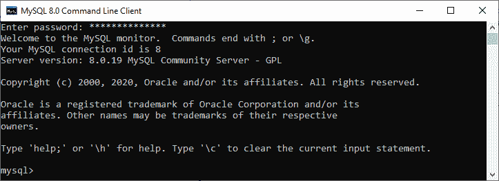

### 切换到特定的数据库

下一步是打开一个特定的数据库，使用下面的查询显示该数据库中的表信息。执行查询后，我们应该会看到下面的输出:

```sql

mysql> USE mysqltestdb;

```

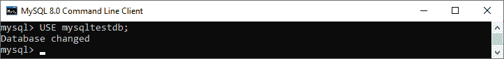

### 执行描述语句

这是显示表格信息的最后一步。在执行 description 语句之前，我们可以选择使用 [**SHOW TABLES** 语句](https://www.javatpoint.com/mysql-show-list-tables)显示存储在所选数据库中的所有表:

```sql

mysql> SHOW TABLES;

```

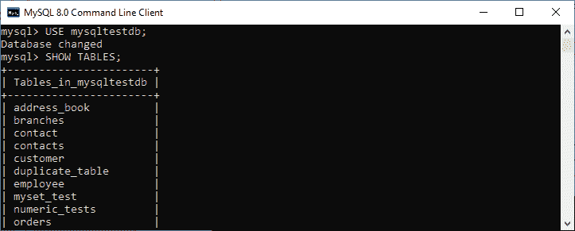

**例如**，如果我们想展示一个**客户表的结构**，执行下面的语句。成功执行后，它将给出如下图所示的输出:

```sql

mysql> DESCRIBE customer;

```

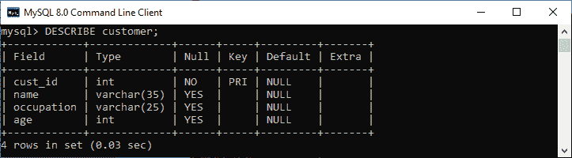

我们也可以使用 DESC 语句进行练习，这是 description 命令的简写。请参见以下输出:

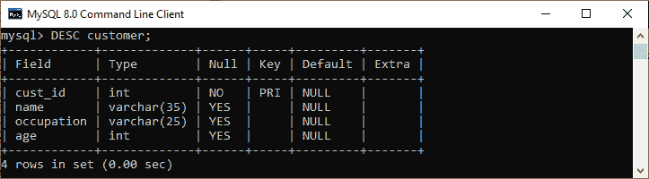

### 如何在 MySQL Workbench 中显示表信息？

要在 [MySQL Workbench](https://www.javatpoint.com/mysql-workbench) 中显示表的列信息，首先需要启动 Workbench 工具，用用户名和密码登录到 [MySQL](https://www.javatpoint.com/mysql-tutorial) 数据库服务器。我们将看到以下屏幕:

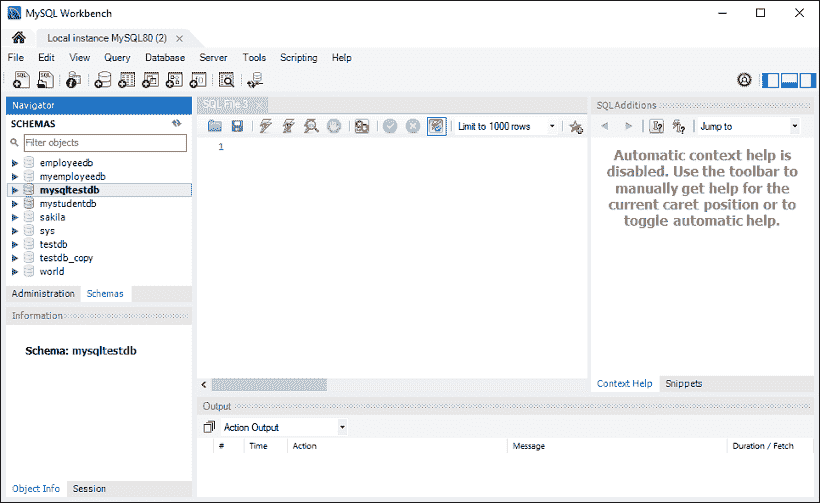

现在，请执行以下步骤来显示表格信息:

1.进入**导航标签**，点击**模式菜单**。在这里，我们可以看到所有以前创建的数据库。在模式菜单下选择任意数据库，例如 **mysqltestdb** 。它将弹出多个选项，如下图所示。

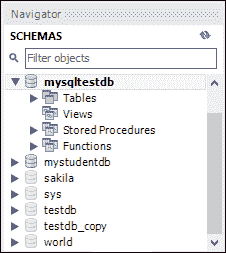

2.接下来，点击显示 mysqltestdb 数据库中存储的所有表的“**表**”。选择要显示其列信息的表。然后，鼠标在桌子上一小时，它会显示**三个图标**。请参见下图:

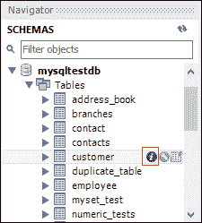

现在，点击红色矩形框中显示的**图标(i)** 。它将显示以下图像:

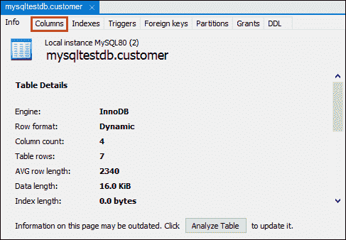

最后，点击**列**菜单，显示表格结构。

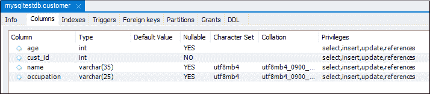

### MySQL 显示列命令

MySQL 还允许 SHOW COLUMNS 命令显示表结构。这是获取表的列信息的更灵活的方法。

**语法:**

以下是 SHOW COLUMNS 命令的语法:

```sql

mysql> SHOW COLUMNS FROM table_name;

```

**例如**，如果我们执行下面的查询，我们将获得特定数据库中一个表的所有列信息:

```sql

mysql> SHOW COLUMNS FROM customer;

```

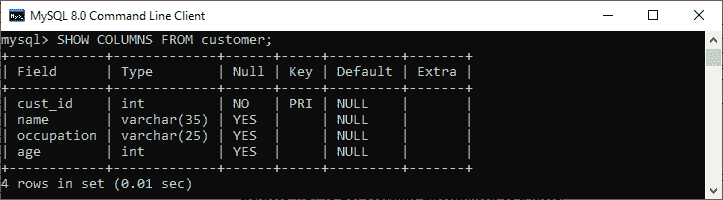

如果我们想显示另一个数据库中的一个表的**列信息或者在当前数据库中不可用，我们可以使用以下查询:**

```sql

mysql> SHOW COLUMNS FROM database_name.table_name;

OR

mysql> SHOW COLUMNS FROM table_name IN database_name;

```

在下图中，我们可以看到我们使用了 mysqltestdb 数据库。但是我们已经显示了另一个数据库中某个表的列信息，而没有切换到当前数据库。

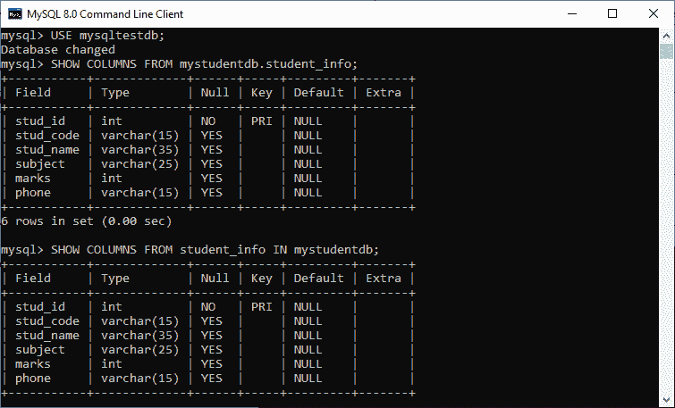

如果我们想显示更多的列信息，我们需要在 SHOW TABLES 语句中添加 **FULL** 关键字，如下所示:

```sql

mysql> SHOW FULL COLUMNS FROM table_name;

```

**例如**，下面的 SQL 查询列出了 **mystudentdb 数据库**中**学生信息表**的所有列:

```sql

mysql> SHOW FULL COLUMNS FROM student_info;

```

执行后，我们可以看到该命令将**排序规则、权限、默认**和**注释**列添加到结果集中。

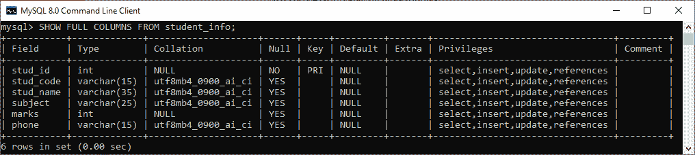

### MySQL DELAY

EXPLAIN 关键字是 description 语句的同义词，description 语句是**用来获取关于 MySQL 如何执行查询的信息**。可配合[插入](https://www.javatpoint.com/mysql-insert)、[选择](https://www.javatpoint.com/mysql-select)、[删除](https://www.javatpoint.com/mysql-delete)、[更新](https://www.javatpoint.com/mysql-update)、[替换查询](https://www.javatpoint.com/mysql-replace)使用。从**到 MySQL 8.0.19** 及更高版本，也可以使用 TABLE 语句。当我们在查询中使用这个关键字时，它将处理该语句，并提供有关表如何连接、表的顺序、估计的分区和行的信息。

**例**

如果我们想要显示一个 **SELECT 语句**的执行计划，我们可以使用如下查询:

```sql

mysql> EXPLAIN SELECT * FROM customer;

```

**输出:**

该查询产生以下信息:

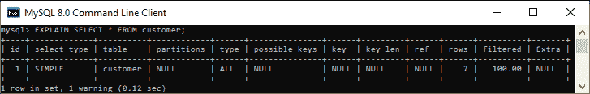

* * *