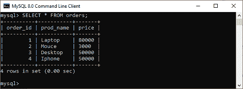
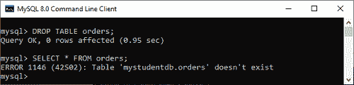
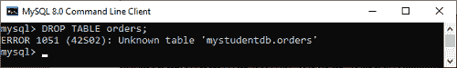
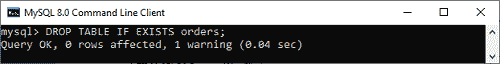
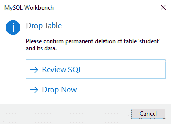

# MySQL 删除表

> 原文：<https://www.javatpoint.com/mysql-drop-table>

MYSQL 使用 Drop Table 语句来删除现有的表。此语句从数据库中永久删除表的完整数据以及整个结构或定义。因此，您在删除表时必须非常小心，因为我们无法在删除表后恢复丢失的数据。

### 句法

以下是在 MySQL 中删除该表的语法:

```sql
mysql> DROP TABLE  table_name;
OR,
mysql> DROP TABLE  schema_name.table_name;

```

MySQL 中 DROP TABLE 语句的完整语法是:

```sql
DROP [ TEMPORARY ] TABLE [ IF EXISTS ] table_name [ RESTRICT | CASCADE ];

```

上面的语法使用了许多参数。让我们详细讨论每一个:

| 参数名称 | 描述 |
| 暂时的 | 这是一个可选参数，指定仅删除临时表。 |
| 表名 | 它指定了我们要从数据库中删除的表的名称。 |
| 如果存在 | 它是可选的，仅当表存在于数据库中时，才与 DROP TABLE 语句一起用于删除表。 |
| RESTRICT 和 CASCADE | 这两个参数都是可选参数，对该语句没有任何影响。它们包含在 MySQL 未来版本的语法中。 |

#### 注意:需要注意的是，在 MySQL 中执行 DROP TABLE 语句必须有 DROP 特权。

### 例子

此示例指定了如何从数据库中删除现有表。假设我们的数据库包含一个“订单”表，如下图所示:



要删除上表，我们需要运行以下语句:

```sql
mysql> DROP TABLE  orders;  

```

它将永久删除该表。我们还可以检查该表是否存在，如下图所示:



如果我们试图删除数据库中不存在的表，我们将得到如下所示的错误消息:



如果我们在 DROP TABLE 语句中使用 IF EXISTS 子句，MySQL 会给出如下输出所示的警告消息:



### 如何在工作台中删除表格

1.要删除一个表，您需要选择该表，右键单击它，然后选择删除表选项。出现以下屏幕:



2.在弹出窗口中选择**立即删除**选项，立即从数据库中删除该表。

### MySQL 删除多个表

有时我们想从数据库中删除多个表。在这种情况下，我们必须使用表名，并使用逗号运算符来分隔它们。以下语句可用于删除多个表:

```sql
DROP TABLE IF EXISTS table_name1, table_name2, table, ......., table_nameN;

```

### MySQL 截断表与删除表

您也可以使用 DROP TABLE 命令删除完整的表，但是它将删除完整的表数据和结构。如果必须存储一些数据，您需要重新创建该表。但是在 TRUNCATE TABLE 的情况下，它只移除表数据，而不移除结构。您不需要再次重新创建表，因为表结构已经存在。

* * *