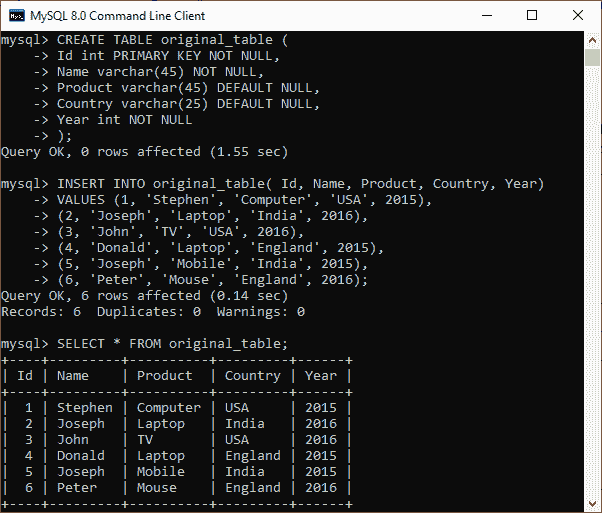
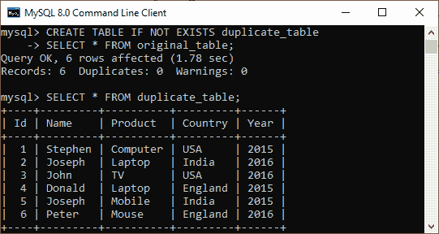
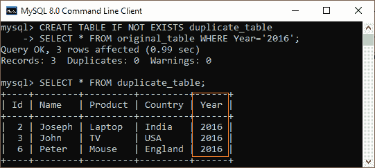
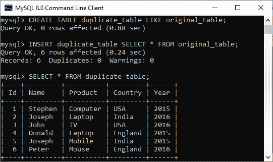
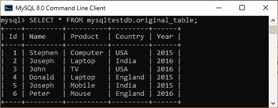
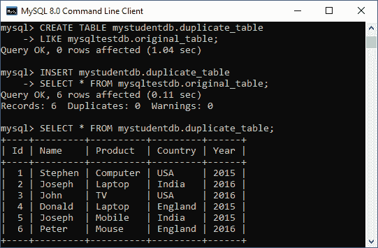

# MySQL 复制/克隆/复制表

> 原文：<https://www.javatpoint.com/mysql-copy-table>

MySQL 复制或克隆表是一个功能，允许我们创建一个 ***复制现有表*** 的表，包括表结构、索引、约束、默认值等。将现有表中的数据复制到新表中在表失败时备份数据这样的情况下非常有用。当我们需要在不影响原始表的情况下测试或执行一些事情时，例如，复制生产数据进行测试，这也是有利的。

我们可以使用**创建表格**和**选择**语句将现有表格复制到新表格，如下所示:

```sql

CREATE TABLE new_table_name
SELECT column1, column2, column3 
FROM existing_table_name;

```

从上面的内容来看，首先，它创建了一个新表，该表在 CREATE TABLE 语句中指示。其次， [SELECT 语句](https://www.javatpoint.com/mysql-select)的结果集定义了新表的结构。最后， [MySQL](https://www.javatpoint.com/mysql-tutorial) 将从 SELECT 语句获取的数据填充到新创建的表中。

如果只需要将现有表中的部分数据复制到新表中，使用 [WHERE 子句](https://www.javatpoint.com/mysql-where)和 SELECT 语句，如下所示:

```sql

CREATE TABLE new_table_name
SELECT column1, column2, column3 
FROM existing_table_name
WHERE condition;

```

我们必须确保我们要创建的表不应该已经存在于我们的数据库中。MySQL 中的 **IF NOT EXISTS** 子句允许我们在创建新表之前检查数据库中是否存在表。所以，下面的陈述解释得更清楚:

```sql

CREATE TABLE IF NOT EXISTS new_table_name
SELECT column1, column2, column3 
FROM existing_table_name
WHERE condition;

```

请注意，此语句仅复制表及其数据。它不会复制表的所有依赖对象，如索引、触发器、主键约束、外键约束等。因此将数据及其相关对象从现有表复制到新表的**命令可以写成以下语句:**

```sql

CREATE TABLE IF NOT EXISTS new_table_name LIKE existing_table_name;

INSERT new_table_name SELECT * FROM existing_table_name;

```

在上面，我们可以看到我们需要执行两条语句来复制数据以及结构和约束。第一个命令创建一个新表**新表名**，复制**现有表名**，第二个命令将现有表中的数据添加到新表名中。

### MySQL 复制/克隆表示例

让我们通过一个例子来演示如何创建一个重复的表。首先，我们将使用下面的语句创建一个名为“ **original_table** ”的表:

```sql

CREATE TABLE original_table (
	Id int PRIMARY KEY NOT NULL, 
	Name varchar(45) NOT NULL, 
	Product varchar(45) DEFAULT NULL, 
	Country varchar(25) DEFAULT NULL, 
	Year int NOT NULL
);

```

接下来，需要向该表添加值。执行以下语句:

```sql

INSERT INTO original_table( Id, Name, Product, Country, Year) 
VALUES (1, 'Stephen', 'Computer', 'USA', 2015), 
(2, 'Joseph', 'Laptop', 'India', 2016), 
(3, 'John', 'TV', 'USA', 2016),
(4, 'Donald', 'Laptop', 'England', 2015),
(5, 'Joseph', 'Mobile', 'India', 2015),
(6, 'Peter', 'Mouse', 'England', 2016);

```

接下来，执行 SELECT 语句以显示记录:

```sql

mysql> SELECT * FROM original_table;

```

我们将获得如下所示的输出:



现在，执行以下语句，将数据从现有表“original _ table”复制到选定数据库中名为“**replicate _ table**”的新表中。

```sql

CREATE TABLE IF NOT EXISTS duplicate_table 
SELECT * FROM original_table;

```

成功执行后，我们可以使用 SELECT 语句验证表数据。请参见以下输出:



有时只需要将现有表中的**部分数据**复制到新表中。在这种情况下，我们可以将 WHERE 子句与 SELECT 语句一起使用，如下所示:

```sql

CREATE TABLE IF NOT EXISTS duplicate_table 
SELECT * FROM original_table WHERE Year = '2016';

```

该语句创建了一个重复的表，其中仅包含 2016 年**的数据。我们可以使用 SELECT 语句验证该表，如下所示:**

**

假设需要复制一个现有的表以及与该表相关联的所有依赖对象，执行下面给出的两个语句:

```sql

mysql> CREATE TABLE duplicate_table LIKE original_table;
AND,
mysql> INSERT duplicate_table SELECT * FROM original_table;

```



**让我们通过一个例子来看看如何将一个表复制到不同的数据库。**

假设存在从不同数据库复制表的情况。在这种情况下，我们需要执行以下语句:

```sql

CREATE TABLE destination_db.new_table_name 
LIKE source_db.existing_table_name;

INSERT destination_db.new_table_name 
SELECT * FROM source_db.existing_table_name;

```

在上图中，第一个命令通过从源数据库克隆现有表，在选定的(目标)数据库中创建新表。第二个命令将数据从现有表复制到选定数据库中的新表。

**下面的演示解释得更清楚了。**

假设我们在 MySQL Server 上有两个名为“ **mysqltestdb** ”和“ **mystudentdb** ”的数据库。mytestdb 数据库包含一个名为“original_table”的表，该表包含以下数据:



现在，我们将使用以下语句将该表复制到另一个名为 mystudentdb 的数据库中:

```sql

CREATE TABLE mystudentdb.duplicate_table 
LIKE mysqltestdb.original_table;

INSERT mystudentdb.duplicate_table 
SELECT * FROM mysqltestdb.original_table;

```

成功执行后，我们可以使用以下命令验证 mystudentdb 数据库中的表:

```sql

mysql> SELECT * FROM mystudentdb.duplicate_table;

```

在下面的输出中，我们可以看到该表成功地从一个数据库复制到另一个数据库。



* * ***