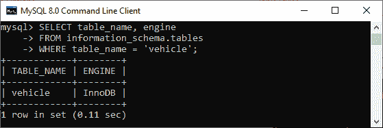
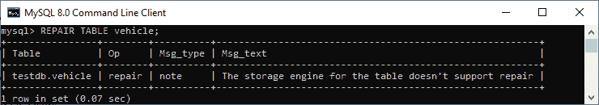
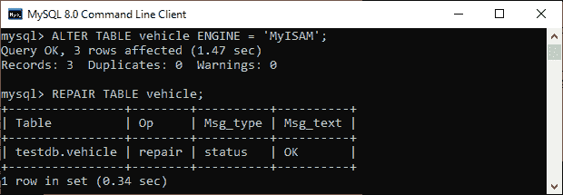
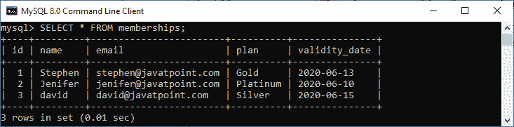
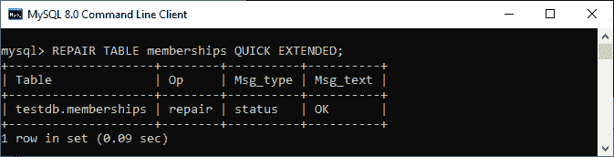
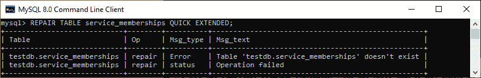

# MySQL REPAIR TABLE

> 原文：<https://www.javatpoint.com/mysql-repair-table>

## 如何修复 MySQL 中损坏的表？

MySQL 修复表允许我们修复或修复损坏的表。MySQL 中的修复表只对选定的存储引擎提供**支持，而不是对所有**提供支持。就是为了保证我们有几个特权像 **[选择](https://www.javatpoint.com/mysql-select)** 和 **[插入](https://www.javatpoint.com/mysql-insert)** 使用这个语句。通常情况下，我们永远不应该使用维修台，直到灾难性的事情发生。该语句很少从 **MyISAM** 表中获取所有数据。因此，我们需要找到我们的表被破坏的原因，以消除此语句的使用。

当我们执行 REPAIR TABLE 语句时，它首先检查我们要修复的表是否需要升级。如果需要，它将按照与检查表相同的规则执行升级...FOR UPGRADE 语句有效。在执行“表修复”选项之前保留表的备份总是好的，因为这可能会导致数据丢失。

### 句法

以下是修复 MySQL 中损坏的表的语法:

```

REPAIR [NO_WRITE_TO_BINLOG | LOCAL]
    TABLE tbl_name [, tbl_name] ...
    [QUICK] [EXTENDED] [USE_FRM]

```

让我们详细讨论每个选项的用法。

**NO_WRITE_TO_BINLOG 或 LOCAL:** 是服务器负责为复制从机编写 REPAIR TABLE 语句的地方。我们可以选择指定可选的 NO_WRITE_TO_BINLOG/LOCAL 关键字来抑制日志记录。

**QUICK:**QUICK 选项允许 REPAIR TABLE 语句只修复索引文件。它不允许修复数据文件。这种类型的修复给出了与 **myisamchk - recover -quick** 命令相同的结果。

**EXTENDED:** 该选项允许 [MySQL](https://www.javatpoint.com/mysql-tutorial) 通过排序一次创建一个索引，而不是逐行创建索引。这种类型的修复给出了与 **myisamchk - safe-recover** 命令相同的结果。

**使用 _FRM:** 该选项在**时使用。MYI** 索引文件未找到或其标题已损坏。USE-FRM 选项通知 MySQL 不要信任该文件头中的信息，并使用数据字典中提供的信息重新创建它。这种类型的维修不能使用 **myisamchk** 命令。

### 带有修复表的存储引擎和分区支持

我们之前提到过，修复表并不适用于所有存储引擎。它只支持 MyISAM、ARCHIVE 和 CSV 表。**修复表语句不支持视图**。

我们还可以对分区表使用修复表语句。但是，在这里，我们不能在这个语句中使用 USE_FRM 选项。如果我们想修复多个分区，我们可以使用[改变表](https://www.javatpoint.com/mysql-alter-table)...REPAIR PARTITION 语句。

### MySQL 修复表示例

让我们通过例子来理解 MySQL 中修复表语句的工作原理。首先，我们需要在选定的数据库中创建一个名为**车辆**的新表，如下所示:

```

CREATE TABLE vehicle (
    vehicle_no VARCHAR(18) PRIMARY KEY,
    model_name VARCHAR(45),
    cost_price DECIMAL(10,2 ),
    sell_price DECIMAL(10,2)
);

```

接下来，我们将使用下面的语句向该表中插入一些数据:

```

mysql> INSERT INTO vehicle (vehicle_no, model_name, cost_price, sell_price) 
VALUES('S2001', 'Scorpio', 950000, 1000000),
('M3000', 'Mercedes', 2500000, 3000000),
('R0001', 'Rolls Royas', 75000000, 85000000);

```

接下来，执行下面的语句来验证数据:

```

mysql> SELECT * FROM vehicle;

```

我们应该得到以下结果:


接下来，我们将执行以下语句来检查车辆表的存储引擎:

```

mysql> SELECT table_name, engine 
FROM information_schema.tables 
WHERE table_name = 'vehicle';

```

执行该语句后，我们应该会得到以下输出:



这里我们可以看到车辆表的存储引擎是 InnoDB。因此，如果我们使用下面的查询为此存储引擎创建修复表，MySQL 会发出一个错误:

```

mysql> REPAIR TABLE vehicle;

```

请参见以下输出:



为了消除这个错误，我们首先需要用下面的查询将表存储引擎改为 MyISAM，然后使用修复表语句。

```

mysql> ALTER TABLE vehicle ENGINE = 'MyISAM';
//Now, use the repair table query 
mysql> REPAIR TABLE vehicle;

```

我们将获得以下输出:



**在这个输出中，我们可以看到 REPAIR TABLE 语句在结果集中包含以下几列:**

| 塞内加尔 | 列名 | 描述 |
| 1. | 桌子 | 此列指示表的名称。 |
| 2. | 外科手术 | 无论存储引擎是否支持语句，此列始终包含修复词。 |
| 3. | 消息类型 | 该列可以是状态、错误、信息、注释或警告。 |
| 4. | 消息 _ 文本 | 此列由信息性消息组成。 |

让我们看另一个例子，使用带有任何 QUICK、EXTENDED 或 USE_FRM 选项的修复表语句。因此，我们将首先创建另一个名为**成员资格**的表，并将该表存储在“ **MyISAM** 存储引擎中，而不是默认的 InnoDB 中。

```

CREATE TABLE memberships (
	id INT AUTO_INCREMENT PRIMARY KEY,
	name VARCHAR(55) NOT NULL,
	email VARCHAR(55) NOT NULL,
	plan VARCHAR(45) NOT NULL,
	validity_date DATE NOT NULL
) ENGINE = MyISAM; 

```

我们将用下面的语句将一些数据插入该表:

```

mysql> INSERT INTO memberships (name, email, plan, validity_date)
VALUES('Stephen', 'stephen@javatpoint.com', 'Gold', '2020-06-13'),
      ('Jenifer', 'jenifer@javatpoint.com', 'Platinum', '2020-06-10'),
      ('david', 'david@javatpoint.com', 'Silver', '2020-06-15');

```

接下来，执行 SELECT 语句来验证数据。我们将得到以下结果:



由于我们已经创建了 MyISAM 存储引擎表，修复表语句不会发出任何错误。请参见以下声明:

```

mysql> REPAIR TABLE memberships QUICK EXTENDED;

```

我们应该得到如下输出:



如果我们对所选数据库中不存在的表使用 REPAIR TABLE 语句，MySQL 会给出一条错误消息。请参见以下声明:

```

mysql> REPAIR TABLE service_memberships QUICK EXTENDED;

```

执行后，我们将获得以下输出:



在本文中，我们学习了如何使用 Repair Table 语句修复 MySQL 中损坏的表。此语句仅适用于某些存储引擎。因此，在使用这个查询之前，我们首先检查表存储引擎是否支持它。如果不支持，我们需要将其更改为 MyISAM、ARCHIVE 或 CSV。在执行“表修复”查询之前保留表的备份总是好的，因为这可能会导致数据丢失。

* * *