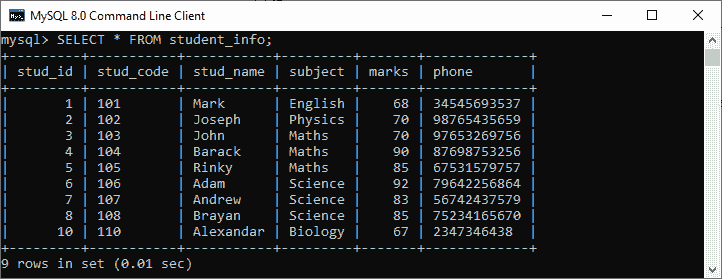
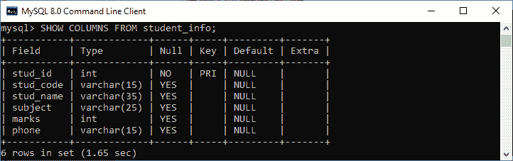
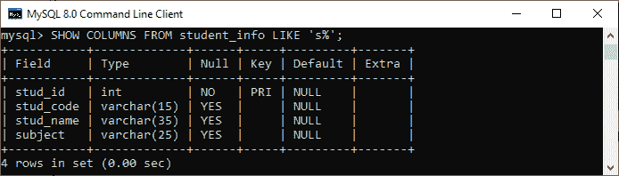
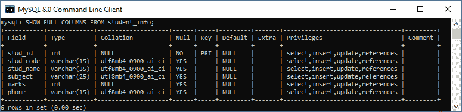
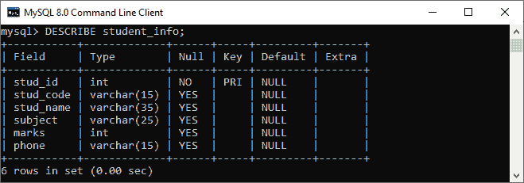
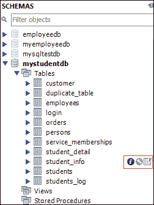
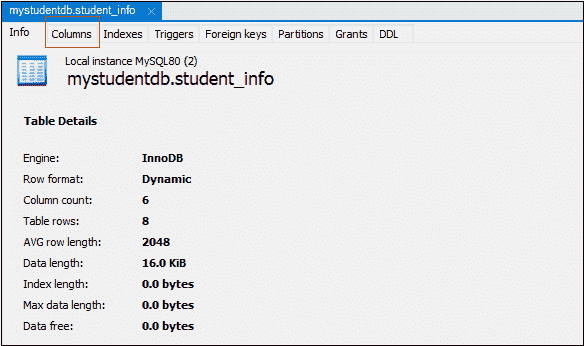
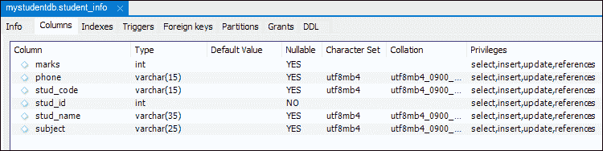

# MySQL 显示列

> 原文：<https://www.javatpoint.com/mysql-show-columns>

表格中的列是一系列可以存储文本、数字和图像的单元格。每列为表中的每一行存储一个值。当我们使用 MySQL 服务器时，通常会显示特定表中的列信息。在本节中，我们将讨论如何在现有表中显示或列出列。

**MySQL 提供了两种显示列信息的方式:**

1.  MySQL SHOW COLUMNS 语句
2.  MySQL description 语句

让我们详细讨论这两个问题。

## MySQL SHOW COLUMNS 语句

MySQL 中的 SHOW COLUMNS 语句是显示给定表中的列信息的一种更灵活的方法。它也可以支持视图。使用这个语句，我们将只获得我们拥有特权的列信息。

### 句法

以下是显示指定表中的列信息的语法:

```

SHOW [EXTENDED] [FULL] {COLUMNS | FIELDS}
    {FROM | IN} table_name
    [{FROM | IN} db_name]
    [LIKE 'pattern' | WHERE expr] 

```

让我们详细讨论语法参数。

**EXTENDED** 是显示信息的可选关键字，包括隐藏列。MySQL 在内部使用用户无法访问的隐藏列。

**FULL** 也是显示列信息的可选关键字，包括排序规则、注释和我们对每个列拥有的权限。

**表名**是我们要从中显示列信息的表的名称。

**db_name** 是包含一个表的数据库的名称，我们将从该表中显示列信息。

**LIKE** 或 **WHERE** 子句用于仅显示给定表中匹配的列信息。

**我们也可以使用 table_name FROM db_name 语法的替代项作为 db_name.tbl_name。因此，下面的说法是等价的:**

```

SHOW COLUMNS FROM mytable_name FROM mydb_name;
OR,
SHOW COLUMNS FROM mydb_name.mytable_name;

```

### 显示列语句示例

让我们通过各种例子来理解这个语句在 [MySQL](https://www.javatpoint.com/mysql-tutorial) 中是如何工作的。

假设我们在一个示例数据库中有一个名为 **student_info** 的表，其中包含如下数据:



接下来，如果我们想要获取该表的列信息，我们可以使用如下语句:

```

mysql> SHOW COLUMNS FROM student_info;

```

我们将看到以下输出:



如果我们想要过滤一个表的列，我们需要在语句中使用 LIKE 或者 [WHERE 子句](https://www.javatpoint.com/mysql-where)。请参见下面的查询:

```

mysql> SHOW COLUMNS FROM student_info LIKE 's%';

```

该查询仅显示以字母 S 开头的列信息。请参见以下输出:



如果我们想要显示隐藏的列信息，我们需要将 FULL 关键字添加到 SHOW COLUMNS 语句中，如下所示:

```

mysql> SHOW FULL COLUMNS FROM student_info; 

```

它返回下面的输出，显示示例数据库中 student_info 表的所有列信息。



**SHOW COLUMNS 语句为给定表中的每一列提供以下信息:**

**字段**:表示给定表中列的名称。

**类型**:表示每一列的数据类型。

**排序**:用于对特定字符集的顺序进行排序。这里，它表示非二进制值的字符串列，其他列为空。只有当我们使用 FULL 关键字时，我们才会看到这个列。

**Null** :表示一列的可空性。如果一列可以存储空值，则返回是。如果一个列不能存储空值，它就不包含任何值。

**键**:表示列的索引为 PRI、UNI、MUL。让我们详细了解这个领域。

*   如果我们没有指定任何键，这意味着该列没有索引。否则，将索引作为多列中的辅助列。
*   如果该列被指定为 PRI，则意味着该列是主键或多列主键中的字段之一。
*   如果该列被指定为 UNI，则意味着该列包含唯一索引。
*   如果该列被指定为 MUL，这意味着该列是非唯一索引的第一列，在该列中我们可以多次使用给定值。
*   如果该列由多个键值指定，则该字段显示优先级最高的键(键优先级按优先级、UNI 和 MUL 的顺序排列)。

**默认值**:表示该列的默认值。如果列不包含 DEFAULT 子句或具有显式空默认值，则它包含空值。

**Extra** :表示与给定栏目相关的附加信息。在以下情况下，此字段非空:

*   如果该列是用 AUTO_INCREMENT 属性指定的，则它的值用 auto_increment 填充。
*   如果用时间戳或日期时间指定该列，并且该列具有 ON UPDATE CURRENT_TIMESTAMP 属性，则其值将填充为 on update CURRENT_TIMESTAMP。
*   对于生成的列，其值用 VIRTUAL GENERATED 或 VIRTUAL STORED 填充。
*   如果该列包含表达式默认值，则其值用 DEFAULT_GENERATED 填充。

**特权**:表示我们对该列拥有的特权。只有当我们使用 FULL 关键字时，我们才会看到这个列。

**注释**:表示我们已经包含在列定义中的注释。只有当我们使用 FULL 关键字时，我们才会看到这个列。

## MySQL description 语句

MySQL 中的 description 语句也提供了类似于 SHOW COLUMNS 命令的信息。

### 句法

以下是在给定表中显示列信息的语法:

```

{DESCRIBE | DESC} table_name;  

```

在这个语法中，**description**和 **DESC** 子句返回相同的结果。

### 例子

如果要显示**学生 _ 信息表**的列信息，可以执行下面的语句。

```

mysql> DESCRIBE students_info;

```

成功执行后，它将给出如下图所示的输出:



### 如何在 MySQL Workbench 中显示列信息？

我们首先启动该工具，并使用用户名和密码登录，以在 MySQL Workbench 中显示给定表的列信息。现在，我们需要执行以下步骤来显示列信息:

1.转到**导航选项卡**并点击**模式菜单**，其中所有先前创建的数据库都可用。选择您想要的数据库(例如， **mstudentdb** )。它将弹出以下选项。


2.点击**表格**，该表格显示了 **mysqltestdb** 数据库中存储的所有表格。选择要显示其列信息的表。然后，鼠标在桌子上一小时，它会显示**三个图标**。请参见下图:



3.点击红色矩形框中显示的**图标(i)** 。我们应该得到如下屏幕:



4.最后，点击**列**菜单。我们可以看到如下输出的列信息。



* * *