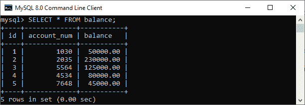
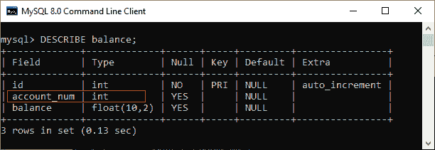
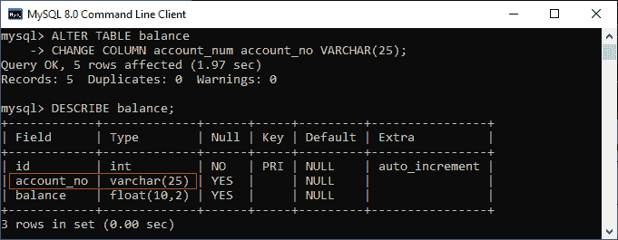
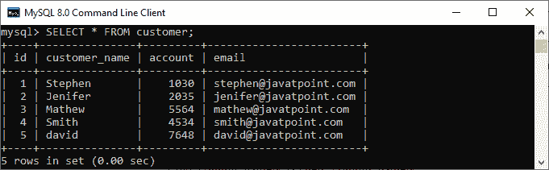
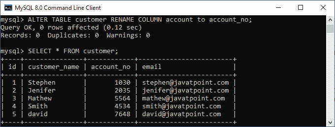
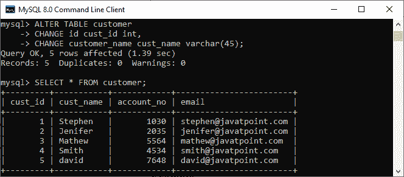
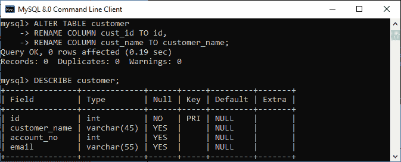

# MySQL 重命名列

> 原文：<https://www.javatpoint.com/mysql-rename-column>

有时我们的列名没有意义，所以需要重命名或更改列名。MySQL 提供了一种有用的语法，可以重命名表中的一列或多列。在重命名列之前，很少有特权是必需的，例如 ALTER 和 DROP 语句特权。

**MySQL 可以通过两种方式重命名列名:**

1.  使用变更语句
2.  使用 RENAME 语句

### 使用变更声明:

以下是说明使用 CHANGE 语句重命名列的语法:

```

ALTER TABLE table_name 
CHANGE COLUMN old_column_name new_column_name Data Type;

```

在这个语法中，我们可以看到我们可能需要重新指定所有的列属性。该语法还允许我们更改列的数据类型。但是，有时 CHANGE 语句可能有以下缺点:

*   列属性的所有信息可能无法用于应用程序重命名。
*   存在数据类型意外更改的风险，这可能会导致应用程序的数据丢失。

### 例子

让我们通过各种例子来理解在 [MySQL](https://www.javatpoint.com/mysql-tutorial) 中 CHANGE 语句是如何重命名一个列的。假设我们有一个名为**天平**的表格，其中包含如下数据:



由于某种原因，我们需要更改**列名 account_num 及其数据类型**。在这种情况下，我们首先使用如下**description**语句检查表格的结构:



在这张图片中，我们可以看到列名 **account_num** 的数据类型是 **int** 。我们想将此列名更改为**账号**，其数据类型为 **int，更改为 varchar** 。因此，我们可以执行下面的语句来做到这一点:

```

mysql> ALTER TABLE balance 
CHANGE COLUMN account_num account_no VARCHAR(25);

```

执行上述命令后，我们可以再次使用 DESCRIBE 语句来验证它。在下图中，列名 account_num 及其数据类型已成功更改。



### 使用重命名语句:

为了消除 CHANGE 语句的缺点，MySQL 提出了以下语法来说明如何使用 RENAME 语句更改列名:

```

ALTER TABLE table_name 
RENAME COLUMN old_column_name TO new_column_name;

```

### 例子

让我们通过不同的例子来理解 RENAME 语句如何在 MySQL 中改变列名。假设我们有一个名为**客户**的表，其中包含以下数据:



假设我们想用 **account_no** 改变列名账户，而不改变其数据类型。我们可以通过执行下面的语句来做到这一点:

```

mysql> ALTER TABLE customer RENAME COLUMN account to account_no;

```

执行上述命令后，我们可以再次使用 [**SELECT** 语句](https://www.javatpoint.com/mysql-select)进行验证。在下图中，列名帐户已成功更改。



### 重命名多列

MySQL 还允许我们在一条语句中更改多个列名。如果我们想要重命名多个列名，我们可以使用以下语法:

```

ALTER TABLE table_name 
CHANGE old_column_name1 new_column_name1 Data Type,
CHANGE old_column_name2 new_column_name2 Data Type,
...
...
CHANGE old_column_nameN new_column_nameN Data Type;

```

运筹学

```

ALTER TABLE table_name 
RENAME COLUMN old_column_name1 TO new_column_name1,
RENAME COLUMN old_column_name2 TO new_column_name2,
...
...
RENAME COLUMN old_column_nameN TO new_column_nameN;

```

### 例子

假设我们想从**客户表**中更改**列名 id 和客户名称**。要在单个语句中更改多个列名，我们可以使用如下语句:

```

mysql> ALTER TABLE customer 
CHANGE id cust_id int, 
CHANGE customer_name cust_name varchar(45);

```

执行上述命令后，我们可以再次使用 SELECT 语句进行验证。在下图中，列名 id 和 customer_name 已成功更改:



让我们通过 RENAME COLUMN 语句再次更改当前修改的列名，如下所示:

```

mysql> ALTER TABLE customer 
RENAME COLUMN cust_id TO id, 
RENAME COLUMN cust_name TO customer_name;

```

执行上述命令后，我们可以再次使用 DESCRIBE 语句来验证它。在下图中，**列名 cust_id 和 cust_name** 已成功更改:



在本文中，我们学习了 MySQL RENAME 列的介绍以及如何在指定的表中更改列名，同时还学习了一个查询示例，以便更好地理解。

* * *