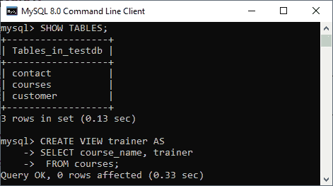
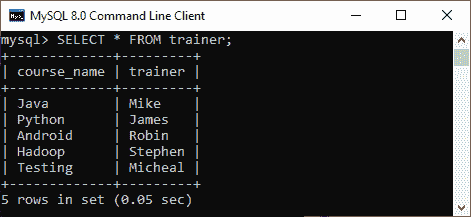
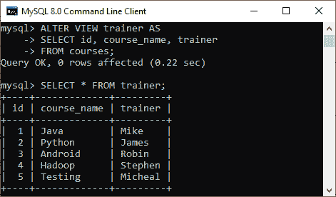
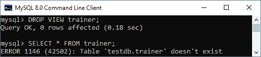
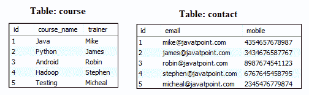
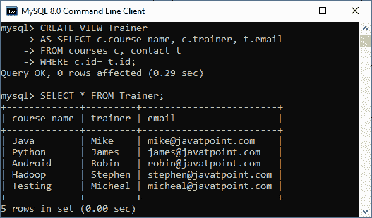
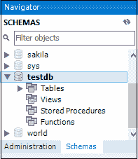
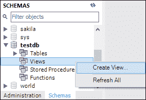
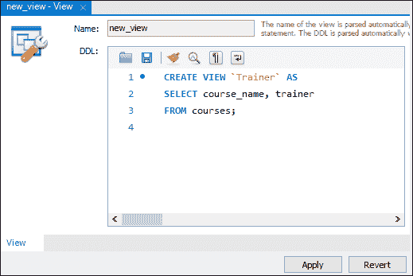
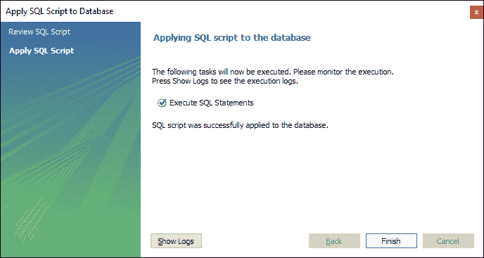

# MySQL 视图

> 原文：<https://www.javatpoint.com/mysql-view>

视图是没有值的数据库对象。它的内容基于基表。它包含类似于真实表的行和列。在 MySQL 中，视图是通过连接一个或多个表的查询创建的**虚拟表**。它的操作类似于基表，但不包含任何自己的数据。视图和表有一个主要区别，即视图是建立在其他表(或视图)之上的定义。如果基础表中发生任何更改，视图中也会反映相同的更改。

[MySQL](https://www.javatpoint.com/mysql-tutorial) 允许我们主要通过两种方式创建视图:

1.  MySQL 命令行客户端
2.  MySQL 工作台

让我们详细讨论这两个问题。

### MySQL 命令行客户端

我们可以使用**创建视图**和**选择**语句创建一个新视图。 [SELECT 语句](https://www.javatpoint.com/mysql-select)用于从源表中获取数据以进行查看。

### 句法

以下是在 MySQL 中创建视图的语法:

```
CREATE [OR REPLACE] VIEW view_name AS  
SELECT columns  
FROM tables  
[WHERE conditions];  

```

### 参数:

视图语法包含以下参数:

**或**替换:可选。当视图已经存在时使用。如果没有指定此子句，并且视图已经存在，CREATE VIEW 语句将返回一个错误。

**view_name** :指定你想在 MySQL 中创建的视图的名称。

**WHERE 条件**:也是可选的。它指定了要将记录包含在视图中必须满足的条件。

### 例子

让我们借助一个例子来理解它。假设我们的数据库有一个表**课程**，我们将基于这个表创建一个视图。因此，以下示例将创建一个名为“**教练**”的视图，该视图通过从表课程中获取数据来创建一个虚拟表。

```
CREATE VIEW trainer AS  
SELECT course_name, trainer   
 FROM courses;  

```

一旦 CREATE VIEW 语句的执行成功，MySQL 将创建一个视图并将其存储在数据库中。



**查看创建的视图**

我们可以使用以下语法查看创建的视图:

```
SELECT * FROM view_name;  

```

让我们看看创建的视图是什么样子的:

```
SELECT * FROM trainer;  

```



#### 注意:必须知道视图并不物理存储数据。当我们为视图执行 SELECT 语句时，MySQL 使用视图定义中指定的查询并生成输出。由于这个特性，它有时被称为虚拟表。

### MySQL 更新视图

在 MYSQL 中，ALTER VIEW 语句用于修改或更新已经创建的视图，而不删除它。

**语法:**

以下是用于更新 MySQL 中现有视图的语法:

```
ALTER VIEW view_name AS  
SELECT columns  
FROM table  
WHERE conditions;  

```

**示例:**

以下示例将通过添加一个新列来更改已经创建的视图名称“trainer”。

```
ALTER VIEW trainer AS  
SELECT id, course_name, trainer
FROM courses;  

```

一旦执行 **ALTER VIEW** 语句成功，MySQL 将更新一个视图并将其存储在数据库中。我们可以看到使用 SELECT 语句修改后的视图，如输出所示:



### MySQL Drop VIEW

我们可以使用 **DROP VIEW** 语句来删除现有视图。

**语法:**

以下是用于删除视图的语法:

```
DROP VIEW [IF EXISTS] view_name;  

```

**参数:**

**view_name** :指定我们要删除的视图的名称。

**如果存在**:可选。如果我们没有指定这个子句，并且视图不存在，那么 DROP VIEW 语句将返回一个错误。

**示例:**

假设我们想删除上面创建的视图“**训练器**”。执行以下语句:

```
DROP VIEW trainer;  

```

成功执行后，需要验证视图是否可用，如下所示:



### MySQL 创建带连接子句的视图

在这里，我们将看到视图创建的复杂示例，它涉及多个表并使用一个 **[连接](https://www.javatpoint.com/mysql-join)** 子句。

假设我们有两个示例表，如下所示:



现在执行下面的语句，该语句将创建一个视图训练器以及连接语句:

```
CREATE VIEW Trainer 	
AS SELECT c.course_name, c.trainer, t.email     
FROM courses c, contact t 
WHERE c.id = t.id;

```

我们可以使用下图所示的 SELECT 语句来验证视图:



### 使用 MySQL 工作台创建视图

要使用此工具在数据库中创建视图，我们首先需要启动 [MySQL 工作台](https://www.javatpoint.com/mysql-workbench)，并使用**用户名**和**密码**登录 MySQL 服务器。它将显示以下屏幕:


现在对数据库删除执行以下步骤:

1.进入导航标签，点击**模式菜单**。在这里，我们可以看到所有以前创建的数据库。在模式菜单下选择任何数据库，例如**测试数据库**。它将弹出选项，可以在下面的屏幕中显示。



2.接下来，我们需要右键单击视图选项，将出现一个新的弹出屏幕:



3.一旦我们选择了“**创建视图**”选项，它将给出下面的屏幕，我们可以在其中编写自己的视图。



4.完成脚本编写后，点击**应用**按钮，我们会看到如下画面:


5.在此屏幕中，我们将查看脚本并单击数据库上的**应用**按钮



6.最后，点击**完成**按钮，完成视图创建。现在，我们可以验证如下视图:


### 我们为什么使用视图？

MySQL 视图为用户提供了以下优势:

**简化复杂查询**

它允许用户简化复杂的查询。如果我们使用复杂查询，我们可以基于它创建一个视图来使用简单的 SELECT 语句，而不是再次键入复杂查询。

**增加可重用性**

我们知道视图简化了复杂的查询，并将它们转换成单行代码来使用视图。这种类型的代码更容易与我们的应用程序集成。这将消除在每个查询中重复编写相同公式的机会，使代码可重用，可读性更强。

**数据安全帮助**

它还允许我们只向用户显示授权信息，并隐藏个人和银行信息等重要数据。我们可以通过只创作必要的数据来限制用户可以访问的信息。

**启用向后兼容**

视图还可以实现遗留系统的向后兼容性。假设我们希望将一个大表拆分成许多小表，而不影响引用该表的当前应用程序。在这种情况下，我们将创建一个与真实表同名的视图，以便当前应用程序可以像引用表一样引用该视图。

* * *