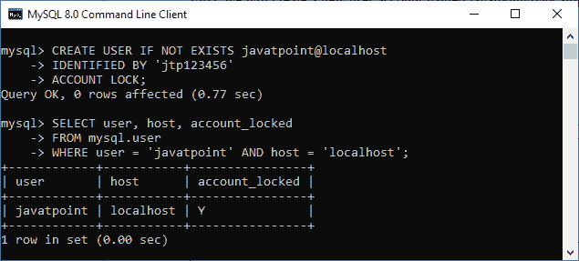
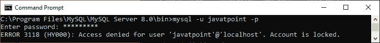
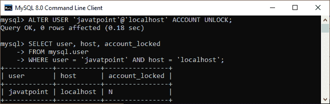

# MySQL 解锁账户

> 原文：<https://www.javatpoint.com/mysql-unlock-account>

解锁是一种机制，允许用户**释放所有锁**或与账户相关的任何特定锁。在本文中，我们将学习如何在 MySQL Server 中解锁用户帐户。

当 **CREATE USER… UNLOCK** 语句创建一个新的用户账户时，新用户被存储为锁定状态。

如果我们想从现有用户帐户中释放锁，我们需要使用 **ALTER USER… ACCOUNT UNLOCK** 语句，如下所示:

```

ALTER USER [IF EXISTS] user_account_name ACCOUNT UNLOCK;

```

在这个语法中，我们必须首先指定想要在 ALTER USER 关键字后释放锁的**用户帐户名**。接下来，我们需要在用户名旁边提供**账户解锁**子句。需要注意的是 **IF EXISTS** 选项只有在服务器中已经存在的情况下也可以用来解锁账户。

[MySQL](https://www.javatpoint.com/mysql-tutorial) 还允许我们**使用以下语句同时解锁多个用户账户**:

```

ALTER USER [IF EXISTS] 
    user_account_name1, user_account_name2, ...
ACCOUNT UNLOCK;

```

在这个语法中，我们需要提供一个逗号分隔的用户名列表，以便在一个查询中解锁多个帐户。如果我们不在语句中指定 ACCOUNT UNLOCK 子句，帐户解锁状态将保持不变。

MySQL 使用 mysql.user 系统表的**account _ lock 列存储账户锁定状态。我们可以使用 **SHOW CREATE USER** 语句来验证帐户是解锁还是锁定。如果该列值为 **Y** ，则表示账户被锁定。如果包含 **N** ，则表示账户解锁。**

如果我们试图在不解锁的情况下连接到该帐户，MySQL 会发出一个错误，将以下消息写入错误日志:

```

Access denied for user 'user_name'@'host_name'.
An account is locked. 

```

## MySQL 用户帐户解锁示例

让我们通过例子了解如何解锁用户账户。首先，我们将使用以下语句在锁定状态下创建一个名为 **[【电子邮件保护】](/cdn-cgi/l/email-protection)** 的新用户帐户:

```

mysql> CREATE USER IF NOT EXISTS javatpoint@localhost 
IDENTIFIED BY 'jtp123456'
ACCOUNT LOCK;  

```

接下来，我们将执行下面的语句来显示用户帐户及其状态:

```

mysql> SELECT user, host, account_locked
FROM mysql.user
WHERE user = 'javatpoint' AND host = 'localhost';

```

我们应该得到以下输出:



在这个输出中，我们可以看到 **mysql.user** 系统表中的 **account_locked** 列表示 y，表示用户名 javatpoint 在服务器上被锁定。

如果我们尝试使用此帐户连接，而没有在 MySQL Server 中解锁，它将返回以下错误:

```

mysql -u javatpoint -p
Enter password: *********

```

以下是错误消息:



因此，我们可以使用 **ALTER USER** 语句在访问帐户之前解锁帐户，如下所示:

```

mysql> ALTER USER 'javatpoint'@'localhost' ACCOUNT UNLOCK;

```

在下面的输出中，我们可以看到 account_locked 列状态为 n，这意味着用户帐户 javatpoint 没有任何锁定。



在本文中，我们学习了如何使用 ALTER TABLE ACCOUNT UNLOCK 语句从现有用户帐户中释放锁。

* * *