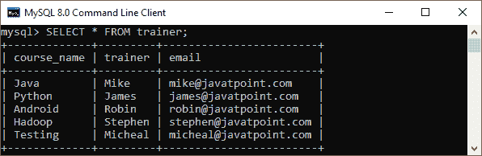
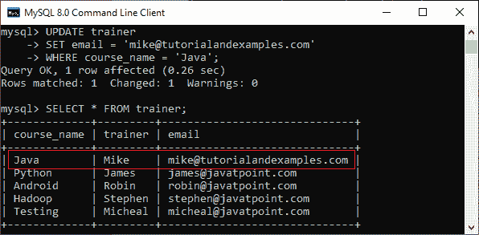
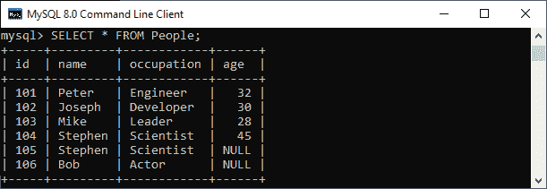
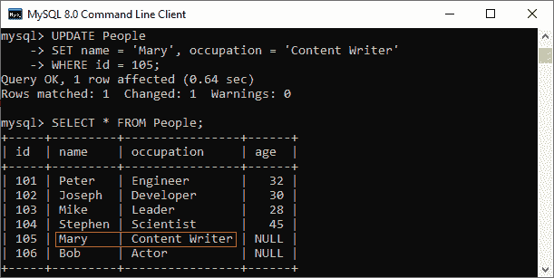
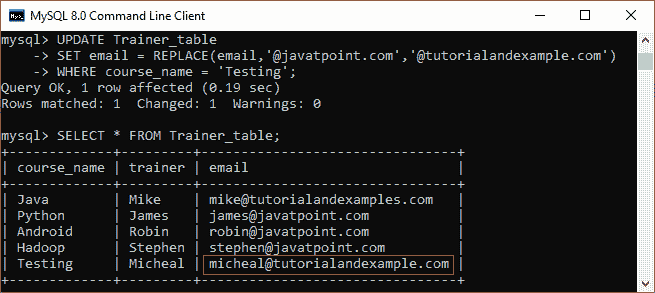

# MySQL 更新查询

> 原文：<https://www.javatpoint.com/mysql-update>

MySQL UPDATE 查询是一个 DML 语句，用于修改数据库中 MySQL 表的数据。在现实场景中，记录会在一段时间内发生变化。因此，我们还需要更改表的值。为此，需要使用 UPDATE 查询。

UPDATE 语句与 **SET** 和[T3【其中】子句](https://www.javatpoint.com/mysql-where)一起使用。SET 子句用于更改指定列的值。我们可以一次更新一列或多列。

### 句法

以下是将数据修改到 [MySQL](https://www.javatpoint.com/mysql-tutorial) 表中的 UPDATE 命令的通用语法:

```
UPDATE table_name   
SET column_name1 = new-value1, 
        column_name2=new-value2, ...  
[WHERE Clause]

```

### 参数说明

UPDATE 语句语法中使用的参数描述如下:

| 参数 | 描述 |
| 表名 | 它是我们要在其中执行更新的表的名称。 |
| 列名 | 这是一个列的名称，我们希望在其中使用 SET 子句用新值执行更新。如果需要更新多个列，请通过指定每个列中的值，用逗号运算符分隔这些列。 |
| WHERE 子句 | 它是可选的。它用于指定我们要在其中执行更新的行名。如果我们省略这个子句，MySQL 会更新所有的行。 |

**注:**

*   该语句可以一次更新一个表中的值。
*   我们可以用这个语句更新单个或多个列。
*   可以使用 WHERE 子句指定任何条件。
*   WHERE 子句非常重要，因为有时我们只想更新一行，如果我们省略该子句，它会意外地更新表的所有行。

UPDATE 命令支持 MySQL 中的这些修饰符:

**LOW_PRIORITY:** 这个修饰符指示语句延迟 UPDATE 命令的执行，直到没有其他客户端从表中读取。它仅对仅使用表级锁定的存储引擎有效。

**IGNORE:** 该修饰符允许语句即使出现错误也不中止执行。如果发现**重复键**冲突，则不更新行。

因此 [UPDATE 语句](https://www.javatpoint.com/mysql-update)的完整语法如下:

```
UPDATE [LOW_PRIORITY] [IGNORE] table_name
    SET column_assignment_list
    [WHERE condition]

```

### 示例:

让我们借助各种例子来理解 UPDATE 语句。假设我们在**“测试数据库”**数据库中有一个表**“教练”**。我们将更新“培训师”表中的数据。



**更新单列**

该查询将使用新 id 更新 Java 课程的**电子邮件 id，如下所示:**

```
UPDATE trainer  
SET email = 'mike@tutorialandexamples.com'  
WHERE course_name = 'Java';

```

成功执行后，我们将使用以下语句验证该表:

```
SELECT * FROM trainer;  

```

在输出中，我们可以看到我们的表根据我们的条件进行了更新。



**更新多列**

UPDATE 语句还可以通过指定逗号分隔的列列表来更新多个列。假设我们有一张如下所示的表:



本声明解释将更新**人物**表中 **id = 105** 的**姓名**和**职业**，如下:

```
UPDATE People
SET name = 'Mary', occupation = 'Content Writer'
WHERE id = 105;

```

我们可以验证以下输出:



**更新语句替换字符串**

我们还可以使用 MySQL 中的 UPDATE 语句来更改特定列中的字符串名称。以下示例更新了**安卓课程的电子邮件的域部分:**

```
UPDATE Trainer_table
SET email = REPLACE(email,'@javatpoint.com','@tutorialandexample.com')
WHERE course_name = 'Testing';

```

它将给出以下输出:



* * *