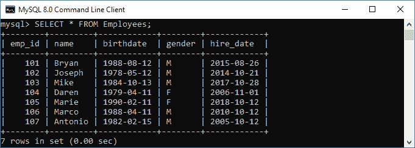
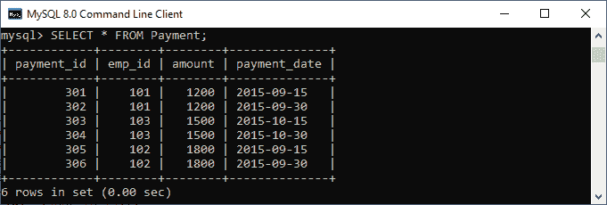
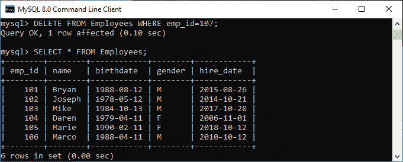
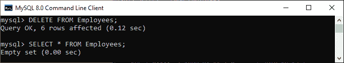
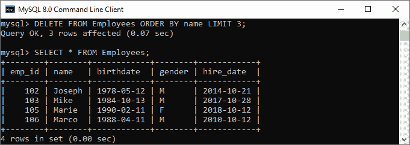
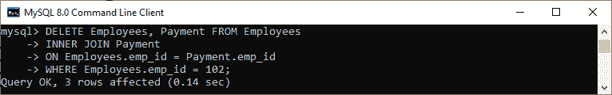

# MySQL DELETE 语句

> 原文：<https://www.javatpoint.com/mysql-delete>

MySQL DELETE 语句用于从 MySQL 表中删除数据库中不再需要的记录。**MySQL 中的这个查询从表中删除了一整行，并产生被删除的行数**。它还允许我们在单个查询中从表中删除多条记录，这在从表中删除大量记录时非常有用。通过使用 delete 语句，我们还可以根据条件删除数据。

**一旦我们使用这个查询删除了记录，我们就不能恢复它**。因此，在从表中删除任何记录之前，建议**为您的数据库**创建一个备份。数据库备份允许我们在将来需要时随时恢复数据。

**语法:**

以下是说明如何使用 DELETE 语句的语法:

```
DELETE FROM table_name WHERE condition;

```

在上面的语句中，我们必须首先指定要从中删除数据的表名。第二，我们必须在 [WHERE 子句](https://www.javatpoint.com/mysql-where)中指定删除记录的条件，这是可选的。如果我们在语句中省略 WHERE 子句，这个查询将从数据库表中删除整个记录。

如果我们想使用一个 delete 查询从多个表中删除记录，我们必须用 DELETE 语句添加 **[JOIN](https://www.javatpoint.com/mysql-join) 子句**。

如果我们想在不知道被删除的行数的情况下删除表中的所有记录，我们必须使用 [**TRUNCATE TABLE**](https://www.javatpoint.com/mysql-truncate-table) 语句，该语句具有更好的性能。

让我们通过各种例子来了解 DELETE 语句在 [MySQL](https://www.javatpoint.com/mysql-tutorial) 中是如何工作的。

### MySQL 删除语句示例

这里，我们将使用**【员工】****【付款】**表来演示 DELETE 语句。假设“员工”和“付款”表包含以下数据:




如果我们想删除一个 **emp_id 为 107** 的员工，我们应该在 WHERE 子句中使用 delete 语句。请参见下面的查询:

```
mysql> DELETE FROM Employees WHERE emp_id=107;

```

执行查询后，它将返回如下图所示的输出。一旦记录被删除，使用 [SELECT 语句](https://www.javatpoint.com/mysql-select)验证表格:



如果我们想删除表中的所有记录，就不需要在 delete 语句中使用 WHERE 子句。请参见下面的代码和输出:



在上面的输出中，我们可以看到删除所有行后，Employees 表将为空。这意味着所选表中没有可用的记录。

### MySQL 删除和限制子句

MySQL Limit 子句用于限制从结果集中返回的行数，而不是获取表中的所有记录。有时我们想限制要从表中删除的行数；在这种情况下，我们将使用 [LIMIT](https://www.javatpoint.com/mysql-limit) 子句，如下所示:

```
DELETE FROM table_name
WHERE condition 
ORDER BY colm1, colm2, ...
LIMIT row_count;

```

需要注意的是，MySQL 表中的行顺序是未指定的。因此，在使用 LIMIT 子句时，我们应该始终使用 **ORDER BY** 子句。

**例如**，以下查询首先按照姓名的字母顺序对员工进行排序，并从表中删除前三名员工:

```
mysql> DELETE FROM Employees ORDER BY name LIMIT 3;

```

它将给出以下输出:



### MySQL 删除和连接子句

JOIN 子句用于添加 MySQL 中的两个或多个表。每当我们想要在一个查询中从多个表中删除记录时，我们将使用 DELETE 语句添加 JOIN 子句。请参见下面的查询:

```
mysql> DELETE Employees, Payment FROM Employees 
INNER JOIN Payment    
ON Employees.emp_id = Payment.emp_id    
WHERE Employees.emp_id = 102;

```

**输出:**

执行后，我们将看到如下图所示的输出:



要阅读关于带有 JOIN 子句的 DELETE 语句的更多信息，请单击此处。

* * *