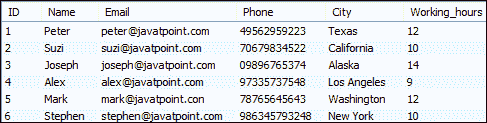
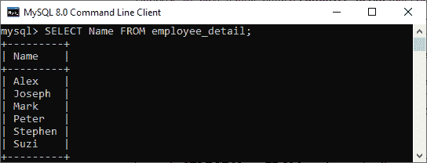
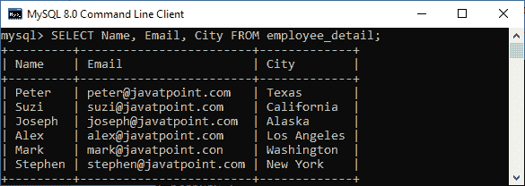
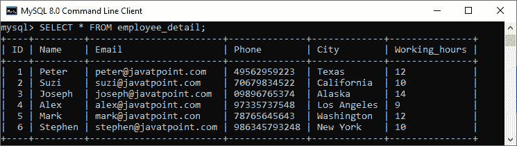
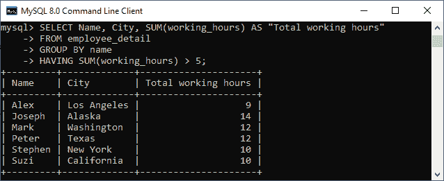
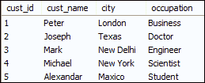
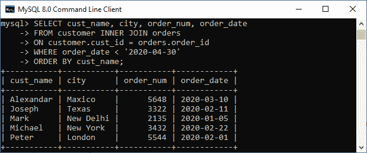

# MySQL 选择语句

> 原文：<https://www.javatpoint.com/mysql-select>

MySQL 中的 SELECT 语句用于**从一个或多个表**中获取数据。我们可以使用此语句检索所有字段或符合指定条件的指定字段的记录。它还可以与各种脚本语言一起工作，例如 [PHP](https://www.javatpoint.com/php-tutorial) 、 [Ruby](https://www.javatpoint.com/ruby-tutorial) 等等。

## 选择语句语法

是最常用的 [SQL](https://www.javatpoint.com/sql-tutorial) 查询。此语句从表中获取数据的一般语法如下:

```
SELECT field_name1, field_name 2,... field_nameN 
FROM table_name1, table_name2...
[WHERE condition]
[GROUP BY field_name(s)]
[HAVING condition] 
[ORDER BY field_name(s)]
[OFFSET M ][LIMIT N];

```

### 所有字段的语法:

```
SELECT * FROM tables [WHERE conditions]
[GROUP BY fieldName(s)]
[HAVING condition] 
[ORDER BY fieldName(s)]
[OFFSET M ][LIMIT N];

```

## 参数说明

SELECT 语句使用以下参数:

| 参数名称 | 描述 |
| 字段名称或* | 它用于指定要在结果集中返回的一列或多列。星号(*)返回表格的所有字段。 |
| 表名 | 它是我们要从中获取数据的表的名称。 |
| 在哪里 | 这是一个可选条款。它指定返回结果集中匹配记录的条件。 |
| 分组依据 | 它是可选的。它从多个记录中收集数据，并按一列或多列对它们进行分组。 |
| 拥有 | 它是可选的。它使用 GROUP BY 子句，只返回那些条件为真的行。 |
| 以...排序 | 它是可选的。它用于对结果集中的记录进行排序。 |
| 抵消 | 它是可选的。它指定首先返回哪一行。默认情况下，它从零开始。 |
| 限制 | 它是可选的。它用于限制结果集中返回记录的数量。 |

#### 注意:需要注意的是，MySQL 总是先计算 FROM 子句，然后再计算 SELECT 子句。

### MySQL 选择语句示例:

借助各种例子，让我们了解 SELECT 命令在 [MySQL](https://www.javatpoint.com/mysql-tutorial) 中是如何工作的。假设我们有一个名为 **employee_detail** 的表，其中包含以下数据:



**1。**如果我们想从表中检索一个**单列，我们需要执行下面的查询:**

```
mysql> SELECT Name FROM employee_detail;

```

我们将得到下面的输出，其中我们只能看到一列记录。



**2。**如果我们想从表中查询**多个列，我们需要执行以下查询:**

```
mysql> SELECT Name, Email, City FROM employee_detail;

```

我们将获得下面的输出，在那里我们可以看到员工的姓名、电子邮件和城市。



**3。**如果我们想从表的所有列**中获取数据，我们需要在 select 语句中使用所有列的名称。指定所有的列名对用户来说并不方便，所以 MySQL 使用一个**星号** (*)来检索所有的列数据，如下所示:**

```
mysql> SELECT * FROM employee_detail;

```

我们将得到下面的输出，在这里我们可以看到表的所有列。



**4。**这里，我们使用 **SUM 函数**和 SELECT 命令中的 [**HAVING** 子句](https://www.javatpoint.com/mysql-having)来获取员工姓名、城市和总工作时间。此外，它使用 [**GROUP BY** 子句](https://www.javatpoint.com/mysql-group-by)按名称列对它们进行分组。

```
SELECT Name, City, SUM(working_hours) AS "Total working hours"  
FROM employee_detail  
GROUP BY Name  
HAVING SUM(working_hours) > 5;

```

它将给出以下输出:



**5。** MySQL SELECT 语句也可以通过使用 **JOIN 语句**从多个表中检索记录。假设我们有一个名为**“客户”**和**“订单”**的表，其中包含以下数据:

**表:客户**



**表:订单**


使用 [**【内部连接】**查询](https://www.javatpoint.com/mysql-inner-join)执行以下返回两个表中匹配记录的 SQL 语句:

```
SELECT cust_name, city, order_num, order_date
FROM customer INNER JOIN orders 
ON customer.cust_id = orders.order_id
WHERE order_date < '2020-04-30'
ORDER BY cust_name;

```

成功执行查询后，我们将获得如下输出:



* * *