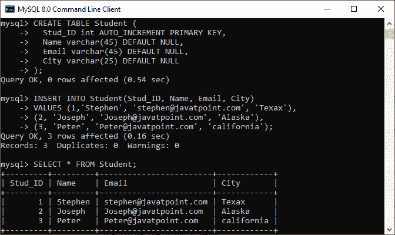
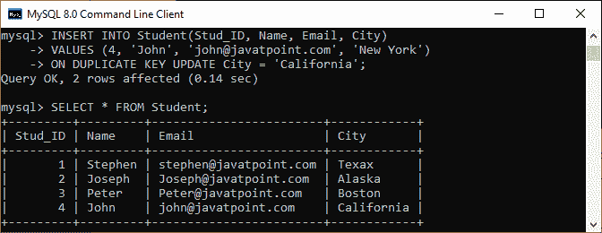

# 复制密钥更新时插入

> 原文：<https://www.javatpoint.com/mysql-insert-on-duplicate-key-update>

重复键更新时插入语句是 MySQL 中插入语句的扩展。当我们在一个 SQL 语句中指定 ON DUPLICATE KEY UPDATE 子句，并且一行将导致在 ***UNIQUE 或 PRIMARY KEY*** 索引列中出现重复的错误值时，就会发生现有行的更新。

换句话说，当我们向表中插入新值时，它会在 UNIQUE 或 PRIMARY KEY 列中导致重复行，我们将收到一条错误消息。但是，如果我们在 [SQL](https://www.javatpoint.com/sql-tutorial) 语句中使用 ON DUPLICATE KEY UPDATE 子句，它将使用新的行值更新旧行，无论它是具有唯一还是主键列。

**例如**，如果列 col1 被定义为 UNIQUE，并且在表 tab1 中包含值 10，那么我们在执行以下两个语句后会得到类似的效果:

```

mysql> INSERT INTO tab1 (col1, col2, col3) VALUES (10,20,30) ON DUPLICATE KEY UPDATE col3=col3+1;

mysql> UPDATE tab1 SET col3=col3+1 WHERE col1=1;

```

它确保如果插入的行与表中的多个唯一索引匹配，那么 ON DUPLICATE KEY 语句只更新第一个匹配的唯一索引**。因此，不建议在包含多个唯一索引的表上使用此语句。**

 **如果表包含 AUTO_INCREMENT 主键列，并且 ON DUPLICATE KEY 语句试图插入或更新一行，则 Last_Insert_ID()函数返回其 AUTO_INCREMENT 值。

以下是 [MySQL](https://www.javatpoint.com/mysql-tutorial) 中**重复密钥更新时插入**语句的语法:

```

INSERT INTO table (column_names)
VALUES (data)
ON DUPLICATE KEY UPDATE 
column1 = expression, column2 = expression…;

```

在这个语法中，我们可以看到 [INSERT 语句](https://www.javatpoint.com/mysql-insert)只在找到重复行时添加带有**列-值对**赋值的 ON DUPLICATE KEY UPDATE 子句。ON DUPLICATE KEY UPDATE 子句的工作首先尝试将新值插入到行中，如果出现错误，它将使用新的行值更新现有行。

**VALUES()** 函数仅在本条款中使用，在其他上下文中没有任何意义。它从 INSERT 部分返回列值，对于多行插入特别有用。

MySQL 根据给定的操作给出了**受影响行数**，并带有 ON DUPLICATE KEY UPDATE 语句:

*   如果我们将新行插入表中，它将返回一个受影响的行。
*   如果我们将现有行更新到表中，它将返回两个受影响的行。
*   如果我们使用表中的当前值更新现有行，它将返回受影响的行数 0。

### 复制键插入示例

让我们借助一个例子来理解 MySQL 中插入复制密钥更新子句的工作原理。

首先，使用下面的语句创建一个名为**“学生”**的表:

```

CREATE TABLE Student (
  Stud_ID int AUTO_INCREMENT PRIMARY KEY,
  Name varchar(45) DEFAULT NULL,
  Email varchar(45) DEFAULT NULL,
  City varchar(25) DEFAULT NULL
);

```

接下来，将数据插入表中。执行以下语句:

```

INSERT INTO Student(Stud_ID, Name, Email, City) 
VALUES (1,'Stephen', 'stephen@javatpoint.com', 'Texax'), 
(2, 'Joseph', 'Joseph@javatpoint.com', 'Alaska'), 
(3, 'Peter', 'Peter@javatpoint.com', 'california');

```

执行 **SELECT** 语句验证插入操作:

```

SELECT * FROM Student;

```

我们将获得如下输出，其中我们在表中有**三个**行:



同样，使用下面的查询向表中再添加一行:

```

INSERT INTO Student(Stud_ID, Name, Email, City) 
VALUES (4,'John', 'john@javatpoint.com', 'New York');

```

上面的语句将成功添加行，因为它没有任何重复值。


最后，我们将在 **Stud_ID** 列中添加一个具有重复值的行:

```

INSERT INTO Student(Stud_ID, Name, Email, City) 
VALUES (4, 'John', 'john@javatpoint.com', 'New York')
ON DUPLICATE KEY UPDATE City = 'California';

```

成功执行上述查询后，MySQL 会给出以下消息:

```

Query OK, 2 rows affected.

```

在下图中，我们可以看到**行 id=4** 已经存在。因此该查询只更新了纽约州 T2 市的 T3 和加利福尼亚州 T4 的 T5。



* * ***