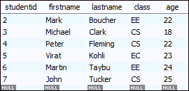
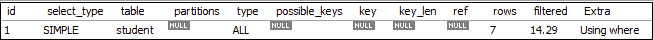
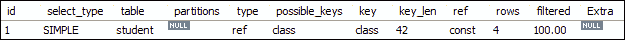

# 如何在 MySQL 中创建索引

> 原文：<https://www.javatpoint.com/how-to-create-index-in-mysql>

索引是一种允许我们在现有表中添加索引的数据结构。它使您能够更快地检索数据库表中的记录。它为索引列的每个值创建一个**条目**。我们使用它来快速查找记录，而无需在每次访问数据库表时都搜索该表中的每一行。我们可以通过使用表中的一个或多个**列**来创建索引，以便高效地访问记录。

当用主键或唯一键创建表时，它会自动创建一个名为 **PRIMARY** 的特殊索引。我们称这个索引为聚集索引。除了主索引之外的所有索引都称为非聚集索引或辅助索引。

## MySQL 中索引的需求

假设我们有一个包含用户姓名和手机号码的通讯录。在这本通讯录中，我们想找到马丁·威廉姆森的手机号码。如果通讯录是一个无序的格式，这意味着通讯录的名称没有按字母顺序排序，我们需要浏览所有页面并阅读每个名称，直到我们找不到我们正在寻找的所需名称。这种类型的搜索名称为顺序搜索。

为了从表**联系人簿**中找到用户的姓名和联系人，我们通常会执行以下查询:

```

mysql> SELECT mobile_number FROM contactbooks WHERE first_name = 'Martin' AND last_name = 'Taybu';

```

这个查询非常简单易行。虽然它可以快速找到用户的电话号码和姓名，但数据库会搜索表中的所有行，直到找不到所需的行。假设 contactbooks 表包含**百万**行，那么在没有索引的情况下，数据检索需要花费大量时间才能找到结果。在这种情况下，数据库索引在返回所需结果和提高查询的整体性能方面起着重要作用。

## MySQL CREATE INDEX 语句

通常，我们在数据库中创建表时创建一个索引。下面的语句创建了一个包含两列 col2 和 col3 的索引表。

```

mysql> CREATE TABLE t_index(
   col1 INT PRIMARY KEY,
   col2 INT NOT NULL,
   col3 INT NOT NULL,
   col4 VARCHAR(20),
   INDEX (col2,col3) 
);

```

如果我们想在表中添加索引，我们将使用如下的 CREATE INDEX 语句:

```

mysql> CREATE INDEX [index_name] ON [table_name] (column names)

```

在这个语句中， **index_name** 是索引的名称， **table_name** 是索引所属的表的名称，**column _ name**是列的列表。

让我们为列 col4 添加新的索引，我们使用以下语句:

```

mysql> CREATE INDEX ind_1 ON t_index(col4);

```

默认情况下， [MySQL](https://www.javatpoint.com/mysql-tutorial) 允许索引类型 **BTREE** 如果我们没有指定索引的类型。下表显示了基于表的存储引擎的不同类型的索引。

| 塞内加尔 | 存储引擎 | 变址类型 |
| 1. | InnoDB | 布崔 |
| 2. | 内存/堆 | HASH，BTREE |
| 3. | 我的天 | 布崔 |

### 例子

在本例中，我们将创建一个表**学生**，并对该表执行 CREATE INDEX 语句。

**表名:学生**



现在，执行以下语句返回**班**为 **CS 分校**的学生的成绩:

```

mysql> SELECT studentid, firstname, lastname FROM student WHERE class = 'CS';

```

该语句将给出以下输出:


在上表中，我们可以看到四行，表示班级是 CS 分支的学生。

如果您想了解 MySQL 如何在内部执行该查询，请执行以下语句:

```

mysql> EXPLAIN SELECT studentid, firstname, lastname FROM student WHERE class = 'CS';

```

您将获得下面的输出。在这里，MySQL 扫描包含七行的整个表，以找到其类是 CS 分支的学生。



现在，让我们使用以下语句为类列创建一个索引。

```

mysql> CREATE INDEX class ON student (class);

```

执行上述语句后，索引创建成功。现在，运行下面的语句，看看 MySQL 如何在内部执行这个查询。

```

mysql> EXPLAIN SELECT studentid, firstname, lastname FROM student WHERE class = 'CS';

```

上面的语句给出了输出，如下所示:



在这个输出中，MySQL 从类索引中找到四行，而不扫描整个表。因此，它提高了数据库表上记录的检索速度。

如果你想**显示**一个表的索引，执行下面的语句:

```

mysql> SHOW INDEXES FROM student;

```


它将给出以下输出。

* * *