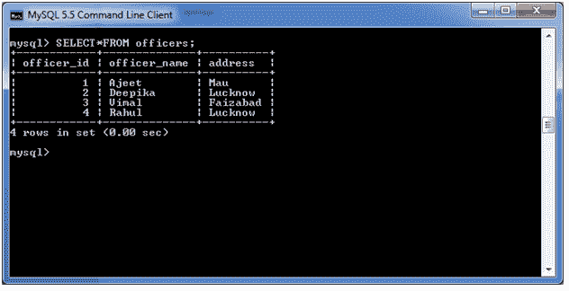
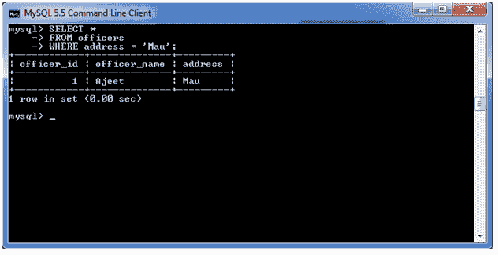
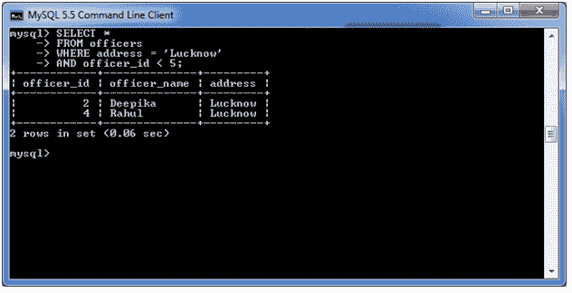
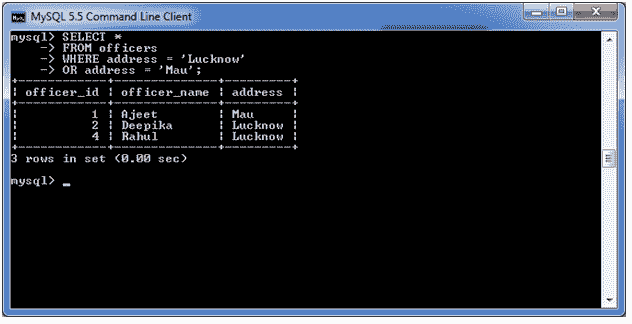
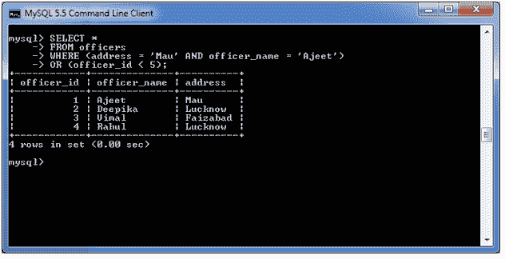

# MySQL WHERE 子句

> 原文：<https://www.javatpoint.com/mysql-where>

MySQL WHERE 子句与 SELECT、INSERT、UPDATE 和 DELETE 子句一起使用来过滤结果。它指定了您必须进行操作的特定位置。

## 语法:

```sql
WHERE conditions;

```

## 参数:

条件:它指定要选择的记录必须满足的条件。

## 带单个条件的 MySQL WHERE 子句

让我们举一个例子，从“官员”表中检索数据。

**表结构:**



**执行该查询:**

```sql
SELECT *
FROM officers
WHERE address = 'Mau';

```

**输出:**



## 带与条件的 MySQL WHERE 子句

在本例中，我们使用“与”条件从表“官员”中检索数据。

**执行以下查询:**

```sql
SELECT *
FROM officers
WHERE address = 'Lucknow'
AND officer_id < 5;

```

**输出:**



## 带或条件的 WHERE 子句

**执行以下查询:**

```sql
SELECT *
FROM officers
WHERE address = 'Lucknow'
OR address = 'Mau';

```

**输出:**



## 带有 AND & OR 条件组合的 MySQL WHERE 子句

您也可以将 AND & OR 条件与 WHERE 子句一起使用。

**见本例:**

**执行以下查询:**

```sql
SELECT *
FROM officers
WHERE (address = 'Mau' AND officer_name = 'Ajeet')
OR (officer_id < 5);

```

**输出:**



* * *