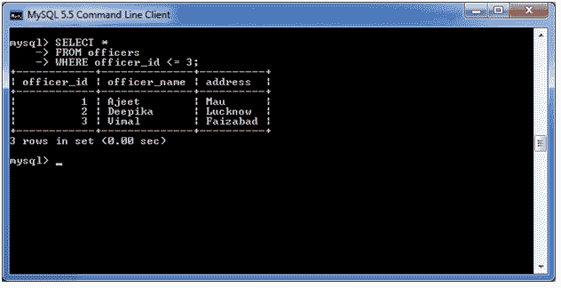
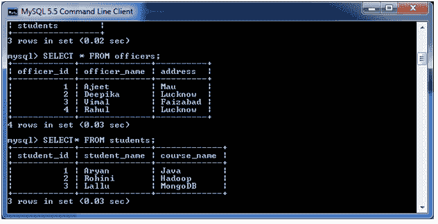
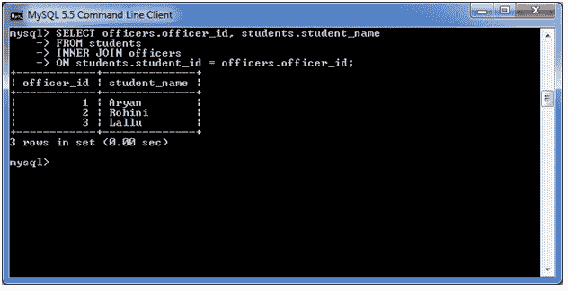
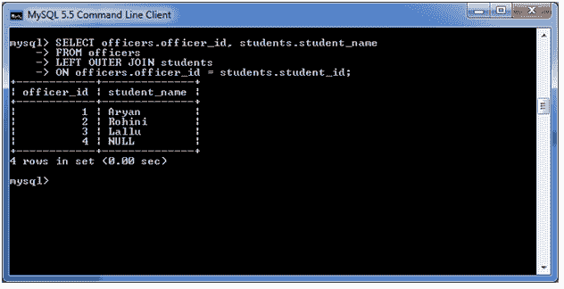

# MySQL FROM 子句

> 原文：<https://www.javatpoint.com/mysql-from>

MySQL FROM 子句用于从表中选择一些记录。它还可以用于使用 JOIN 条件从多个表中检索记录。

**语法:**

```sql
FROM table1
[ { INNER JOIN | LEFT [OUTER] JOIN| RIGHT [OUTER] JOIN } table2
ON table1.column1 = table2.column1 ]

```

## 因素

**表 1 和表 2:** 指定 MySQL 语句中使用的表。这两个表是基于 table1.column1 = table2.column1 连接的。

**注:**

*   如果在 MySQL 语句中使用 FROM 子句，则必须至少选择了一个表。
*   如果您在 MySQL FROM 子句中使用了两个或多个表，这些表通常使用 INNER 或 OUTER 联接进行联接。

## MySQL FROM 子句:从一个表中检索数据

以下查询指定如何从单个表中检索数据。

**使用以下查询:**

```sql
SELECT *
FROM officers
WHERE officer_id <= 3;

```



## MySQL FROM 子句:从两个具有内部连接的表中检索数据

让我们举一个例子，使用 INNER JOIN 从两个表中检索数据。

这里，我们有两张桌子“军官”和“学生”。



**执行以下查询:**

```sql
SELECT officers.officer_id, students.student_name
FROM students
INNER JOIN officers
ON students.student_id = officers.officer_id;

```



## MySQL FROM 子句:使用外部连接从两个表中检索数据

**执行以下查询:**

```sql
SELECT officers.officer_id, students.student_name
FROM officers
LEFT OUTER JOIN students
ON officers.officer_id = students.student_id;

```

