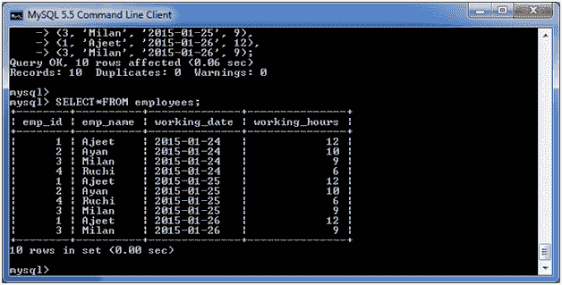
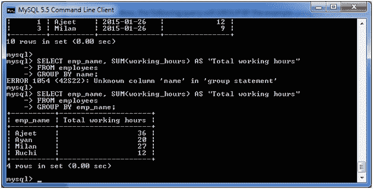
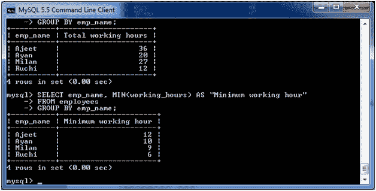
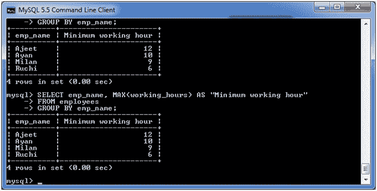
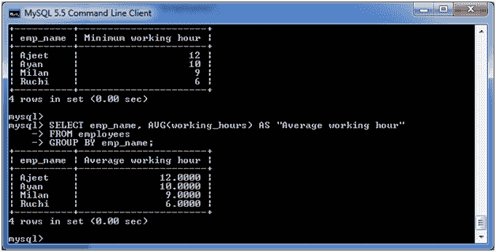

# MySQL 分组依据子句

> 原文：<https://www.javatpoint.com/mysql-group-by>

MYSQL GROUP BY 子句用于从多个记录中收集数据，并将结果按一列或多列分组。它通常用在 SELECT 语句中。

您还可以使用一些聚合函数，如计数、求和、最小、最大、AVG 等。在分组列上。

**语法:**

```
SELECT expression1, expression2, ... expression_n, 
aggregate_function (expression)
FROM tables
[WHERE conditions]
GROUP BY expression1, expression2, ... expression_n;

```

## 因素

**表达式 1，表达式 2，...expression_n:** 它指定未封装在聚合函数中且必须包含在 GROUP BY 子句中的表达式。

**aggregate_function:** 指定一个函数，如 SUM、COUNT、MIN、MAX 或 AVG 等。表:它指定要从中检索记录的表。FROM 子句中必须至少列出一个表。

**所在条件:**可选。它指定了要选择的记录必须满足的条件。

## (一)带计数功能的 MySQL 分组依据子句

考虑一个名为“军官”表的表，它有以下记录。


现在，让我们计算列地址中重复的城市数。

**执行以下查询:**

```
SELECT address, COUNT(*)
FROM   officers 
GROUP BY address; 

```

**输出:**


## (二)带求和功能的 MySQL 分组依据子句

我们来看一张“员工”表，有以下数据。



现在，下面的查询将使用 SUM 函数对示例进行分组，并返回每个员工的 emp_name 和总工作时间。

**执行以下查询:**

```
SELECT emp_name, SUM(working_hours) AS "Total working hours"
FROM employees
GROUP BY emp_name;

```

**输出:**



## (三)带有最小功能的 MySQL 分组依据子句

以下示例从“员工”表中指定了员工的最低工作时间。

**执行以下查询:**

```
SELECT emp_name, MIN(working_hours) AS "Minimum working hour"
FROM employees
GROUP BY emp_name;

```

**输出:**



## (四)具有最大功能的 MySQL 分组依据子句

以下示例从“员工”表中指定了员工的最长工作时间。

**执行以下查询:**

```
SELECT emp_name, MAX (working_hours) AS "Minimum working hour"
FROM employees
GROUP BY emp_name;

```

**输出:**



## (五)具有 AVG 功能的 MySQL 分组依据子句

<p.>The following example specifies the average working hours of the employees form the table "employees".

**执行以下查询:**

```
SELECT emp_name, AVG(working_hours) AS "Average working hour"
FROM employees
GROUP BY emp_name;

```

**输出:**

</p.>