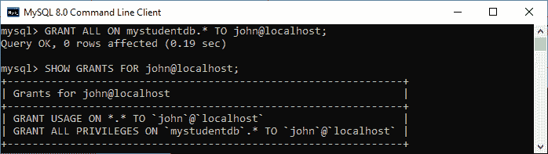
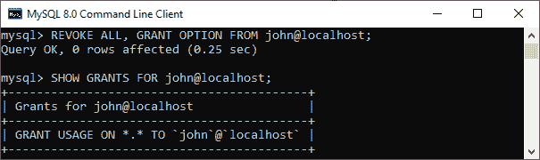
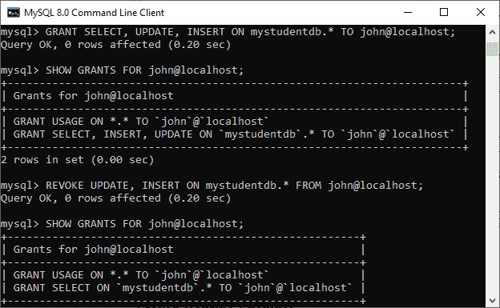
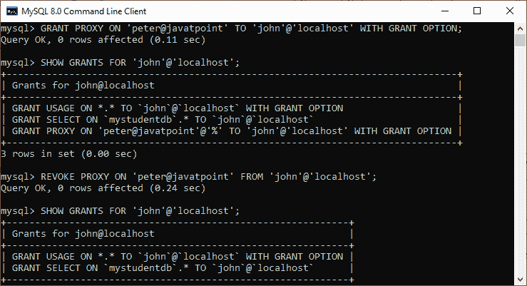

# MySQL 撤销特权

> 原文：<https://www.javatpoint.com/mysql-revoke-privilege>

我们已经学习了如何通过向用户帐户授予权限来授予访问权限。现在，我们将了解从用户帐户撤销权限。MySQL 提供了 REVOKE 语句来删除用户帐户的权限。

### 撤销声明

revoke 语句使系统管理员能够 ***撤销 MySQL 用户帐户的特权和角色*** ，这样他们就不能使用过去分配给数据库的权限。

### 句法

以下是使用 REVOKE 语句的基本语法:

```

REVOKE privilege_name(s) 
ON object 
FROM user_account_name;

```

### 参数说明

在上面的语法中，我们可以有以下参数:

| 参数名称 | 描述 |
| 特权名 | 它指定了我们要从用户帐户中撤销的访问权限或授予权限。 |
| 目标 | 它确定授予访问权限的权限级别。它意味着授予表特权；那么对象应该是表的名称。 |
| 用户 _ 帐户 _ 名称 | 它确定了我们要撤销其访问权限的用户的帐户名。 |

### 权限级别

[MySQL](https://www.javatpoint.com/mysql-tutorial) 支持以下权限级别:

| 特权级别 | 句法 | 描述 |
| 全球的 | 撤销所有，从[【电子邮件保护】](/cdn-cgi/l/email-protection)授予选择权； | 它适用于删除用户在 MySQL 服务器上的所有访问权限。 |
| 数据库ˌ资料库 | 撤销我的数据库上的所有内容。*
FROM [【邮件保护】](/cdn-cgi/l/email-protection)； | 它适用于撤销当前数据库中对象的所有权限。 |
| 桌子 | 从[【电子邮件保护】](/cdn-cgi/l/email-protection)撤销删除我的数据库员工
； | 它适用于撤销指定表中所有列的权限。 |
| 圆柱 | 撤销选择(第 1 列)，插入(第 1 列，第 2 列)，更新(第 2 列)从[【电子邮件保护】](/cdn-cgi/l/email-protection)打开 my db . my table
； | 它适用于撤销表中单个列的权限。 |
| 存储程序 | 从[【电子邮件保护】](/cdn-cgi/l/email-protection)撤销执行程序/功能 my db . my PROCEDURE
； | 它适用于撤销存储例程(过程和函数)的所有特权。 |
| 代理 | 从[【电子邮件保护】](/cdn-cgi/l/email-protection)撤销根用户代理； | 它使我们能够撤销代理用户。 |

### 撤销声明示例

让我们通过例子来理解 REVOKE 特权。首先，我们需要使用以下语句创建一个名为“ **[【电子邮件保护】](/cdn-cgi/l/email-protection)** 的新用户:

```

mysql> CREATE USER john@localhost IDENTIFIED BY 'jtp12345';  

```

接下来，使用以下语句将当前服务器中所有数据库的所有权限分配给[【电子邮件保护】](/cdn-cgi/l/email-protection):

```

mysql> GRANT ALL ON mystudentdb.* TO john@localhost;

```

接下来，执行 SHOW GRANT 语句来验证权限。在输出中，我们可以看到所有权限被分配给当前服务器中的所有数据库[【邮件保护】](/cdn-cgi/l/email-protection)



如果我们想要撤销分配给用户的所有权限，请执行以下语句:

```

mysql> REVOKE ALL, GRANT OPTION FROM john@localhost;

```

我们将获得下面的输出，在这里我们可以看到用户可以登录到数据库，而没有任何特权。



### 从用户帐户中撤销选定的权限

假设我们通过以下语句向用户提供了 mystudentdb 上的 SELECT、INSERT 和 UPDATE 命令的授予权限:

```

mysql> GRANT SELECT, UPDATE, INSERT ON mystudentdb.* TO john@localhost;

```

接下来，使用以下语句显示 GRANT 权限:

```

mysql> SHOW GRANTS FOR john@localhost;

```

最后，执行 REVOKE 语句，用下面的语句删除 UPDATE 和 [INSERT](https://www.javatpoint.com/mysql-insert) 权限:

```

mysql> REVOKE UPDATE, INSERT ON mystudentdb.* FROM john@localhost;

```

它将给出下面的输出，其中只剩下 SELECT 权限。



### 撤销代理用户示例

首先，我们需要使用以下语句将代理权限授予您想要的用户:

```

mysql> GRANT PROXY ON 'peter@javatpoint' TO 'john'@'localhost' WITH GRANT OPTION;

```

接下来，用给定的语句显示 GRANT 特权:

```

mysql> SHOW GRANTS FOR 'john'@'localhost';

```

最后，执行 REVOKE 语句，用下面的语句删除用户的代理权限:

```

mysql> REVOKE PROXY ON 'peter@javatpoint' FROM 'john'@'localhost';

```

它将给出以下输出，其中代理权限被成功撤销。



### 撤销存储例程的权限示例

这里，撤销权限应用于**过程和功能**，在这里我们可以撤销过去拥有执行权限的用户的权限。

让我们用例子来理解它。假设我们有一个函数**计算工资**并想授予用户约翰**执行**的权限，运行以下查询:

```

mysql> GRANT EXECUTE ON FUNCTION calculatesalary TO john@localhost;

```

如果需要撤销用户的 EXECUTE 权限，我们必须运行以下命令:

```

mysql> REVOKE EXECUTE ON FUNCTION calculatesalary TO john@localhost;

```

我们可以从下面可以应用权限的列表中撤销权限。

1.  **CREATE:** 它使用户帐户能够创建数据库和表。
2.  **DROP:** 它允许用户帐户删除数据库和表。
3.  **DELETE:** 使用户账户可以从特定的表中删除行。
4.  **INSERT:** 它允许用户帐户向特定的表中插入行。
5.  **SELECT:** 使用户账户可以读取数据库。
6.  **更新:**使用户账户能够更新表格行。

* * *