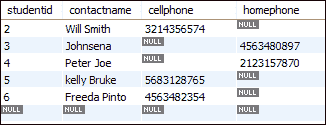

# MySQL IFNULL()

> 原文：<https://www.javatpoint.com/mysql-ifnull>

本节帮助您了解 MySQL IFNULL()函数。IFNULL 函数是 MySQL 控制流函数的一部分，用于处理空值。

IFNULL 函数接受两个表达式，如果第一个表达式是**而不是 null** ，则返回第一个参数。如果第一个表达式为 **null** ，则返回第二个参数。该函数返回字符串或数值，具体取决于使用它的上下文。

### 句法

我们可以使用以下语法的 IFNULL 函数:

```sql

IFNULL (Expression1, Expression2)

```

当 expression1 不为 null 时，它返回 expression1。否则，它将返回表达式 2。

### 因素

| 参数 | 要求 | 描述 |
| 表达式 1 | 需要 | 此表达式用于检查它是否为空。 |
| 表达式 2 | 需要 | 当表达式 1 为空时，它将返回。 |

### MySQL 版本支持

IFNULL 函数可以支持以下 MySQL 版本:

*   MySQL 8.0
*   MySQL 5.7
*   MySQL 5.6
*   MySQL 5.5
*   MySQL 5.1
*   MySQL 5.0
*   MySQL 4.1
*   MySQL 4.0

让我们通过下面的例子来理解 MySQL IFNULL()函数。我们可以直接在 **SELECT** 语句中使用 IFNULL 函数。

### 例 1

```sql

SELECT IFNULL(0,5);

```

在上面的函数中，MySQL 语句检查第一个表达式。如果第一个表达式不为空，它将返回第一个表达式，该表达式为零。

**输出:**

```sql
0

```

### 例 2

```sql

SELECT IFNULL("Hello", "javaTpoint");

```

上面的 MySQL 语句检查第一个表达式。如果第一个表达式不为空，将返回第一个表达式，即**‘Hello’**值。

**输出:**

```sql
Hello

```

### 例 3

```sql

SELECT IFNULL(NULL,5);

```

下面的 MySQL 语句检查第一个表达式。如果第一个表达式不为空，它将返回第一个表达式。否则，它将返回第二个表达式，即五(5)。

**输出:**

```sql
5

```

### 例 4

在这里，我们将创建一个表**‘student _ contacts’**，并执行 IFNULL()函数。

```sql

CREATE TABLE `student_contacts` (
  `studentid` int unsigned NOT NULL AUTO_INCREMENT,
  `contactname` varchar(45) NOT NULL,
  `cellphone` varchar(20) DEFAULT NULL,
  `homephone` varchar(20) DEFAULT NULL,
  );

```

现在，您需要向表中插入数据。将值插入表后，执行以下查询。

```sql

SELECT 
    contactname, cellphone, homephone
FROM
    student_contacts;

```

它将显示包含所有行和列的输出。在这里，我们可以看到一些联系人只有手机或家庭电话号码。



在上面的输出中，我们将获得所有联系人的姓名天气手机，以及家庭电话号码是否可用。所以，在这种情况下，IFNULL()函数起着重要的作用。

现在，运行下面的 MySQL 查询。如果手机为空，该语句返回**家庭电话**号码。

```sql

SELECT 
    contactname, IFNULL(cellphone, homephone) phone
FROM
    student_contact;

```

**输出:**

当上述 MySQL 语句成功运行时，它将给出以下输出。


#### 注意:应该避免在 WHERE 子句中使用 IFNULL()函数，因为该函数会降低查询的性能。

* * *