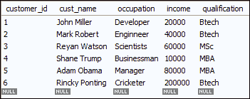

# MySQL NULLIF()

> 原文：<https://www.javatpoint.com/mysql-nullif>

本节帮助您了解 MySQL NULLIF()函数。NULLIF 函数是 MySQL 控制流函数的一部分，用于比较两个表达式中的**。它还有助于防止 SQL 语句中的零除错误。**

 **NULLIF 函数接受两个表达式，如果第一个表达式等于第二个表达式，则返回 **NULL** 。否则，它返回第一个表达式。

### 句法

我们可以使用具有以下语法的 NULLIF 函数:

```sql

NULLIF (Expression1, Expression2)

```

当表达式 1 等于表达式 2 时，它返回 Null。否则，它将返回表达式 1。

### 参数

| 参数 | 要求 | 描述 |
| 表达式 1 | 需要 | 它指定用于比较的第一个表达式。 |
| 表达式 2 | 需要 | 它指定用于比较的第二个表达式。 |

### MySQL 版本支持

NULLIF 功能可以支持以下 [MySQL 版本](https://www.javatpoint.com/mysql-versions):

*   MySQL 8.0
*   MySQL 5.7
*   MySQL 5.6
*   MySQL 5.5
*   MySQL 5.1
*   MySQL 5.0
*   MySQL 4.1
*   MySQL 4.0

让我们用下面的例子来理解 [MySQL](https://www.javatpoint.com/mysql-tutorial) NULLIF()函数。我们可以直接使用带有**选择**语句的 NULLIF 函数。

### 例 1

```sql

SELECT NULLIF("javaTpoint", "javaTpoint");

```

在上面的函数中，MySQL 语句检查第一个表达式是否等于第二个表达式。如果两个表达式相同，则返回空值。否则，它将返回第一个表达式。

**输出:**

```sql
NULL

```

### 例 2

```sql

SELECT NULLIF("Hello", "404");

```

下面的 MySQL 语句比较了这两种表达式。如果表达式 1 =表达式 2，则返回空值。否则，它将返回表达式 1。

**输出:**

```sql
Hello

```

### 例 3

```sql

SELECT NULLIF(9,5);

```

下面的 MySQL 语句比较了两个整数值。如果它们相等，则返回空值。否则，它返回第一个表达式。

**输出:**

```sql
9

```

### 例 4

在本例中，我们将了解 NULLIF()函数如何防止**除以零**的错误。如果我们运行查询“SELECT 1/0”，那么我们会得到一个错误输出。因此，在这种情况下，我们将使用如下语法的 NULLIF 函数。

```sql

SELECT 1/NULLIF(0,0);

```

**输出:**

```sql
NULL

```

### 例 5

让我们创建一个**客户**表来执行 NULLIF 功能。以下语句在数据库中创建一个客户表。

```sql

CREATE TABLE 'customer' (
  'customer_id' INT UNSIGNED NOT NULL AUTO_INCREMENT,
  'cust_name' VARCHAR(45) NOT NULL,
  'occupation' VARCHAR(45) NOT NULL,
  'income' VARCHAR(15) NOT NULL,
  'qualification' VARCHAR(45) NOT NULL
);

```

现在，您需要向表中插入数据。要将值插入表中，请运行以下命令。

```sql

 INSERT INTO 'myproductdb'.'customer' ('cust_name', 'occupation', 'income', 'qualification') VALUES ('John Miller', 'Developer', '20000', 'Btech');
INSERT INTO 'myproductdb'.'customer' ('cust_name', 'occupation', 'income', 'qualification') VALUES ('Mark Robert', 'Enginneer', '40000', 'Btech');
INSERT INTO 'myproductdb'.'customer' ('cust_name', 'occupation', 'income', 'qualification') VALUES ('Reyan Watson', 'Scientists', '60000', 'MSc');
INSERT INTO 'myproductdb'.'customer' ('cust_name', 'occupation', 'income', 'qualification') VALUES ('Shane Trump', 'Businessman', '10000', 'MBA');
INSERT INTO 'myproductdb'.'customer' ('cust_name', 'occupation', 'income', 'qualification') VALUES ('Adam Obama', 'Manager', '80000', 'MBA');
INSERT INTO 'myproductdb'.'customer' ('cust_name', 'occupation', 'income', 'qualification') VALUES ('Rincky Ponting', 'Cricketer', '200000', 'Btech');

```

将值插入表后，执行以下查询。

```sql

 SELECT * FROM customer;

```

它将给出下表:



现在，我们将使用 NULLIF 函数对照 **Btech** 检查**资格**列值。意思是如果客户职业是 Btech，则返回 NULL。否则，它返回列值。

```sql

 SELECT cust_name, occupation, qualification, 
NULLIF (qualification,"Btech") result 
FROM myproductdb.customer;

```

**输出:**

当上述命令成功执行时，它会返回以下输出。


* * ***